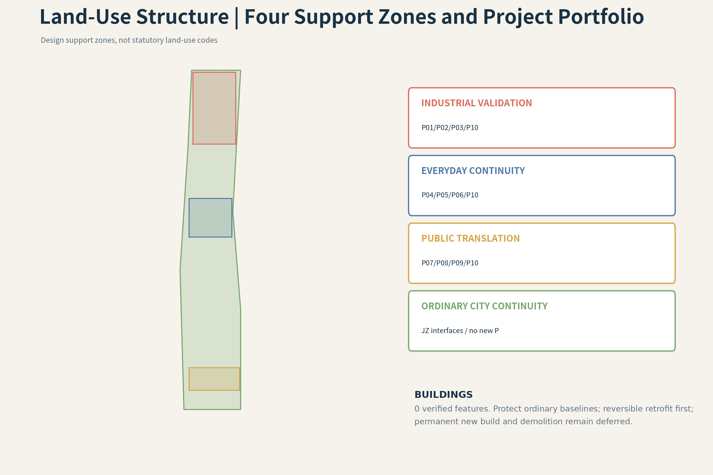
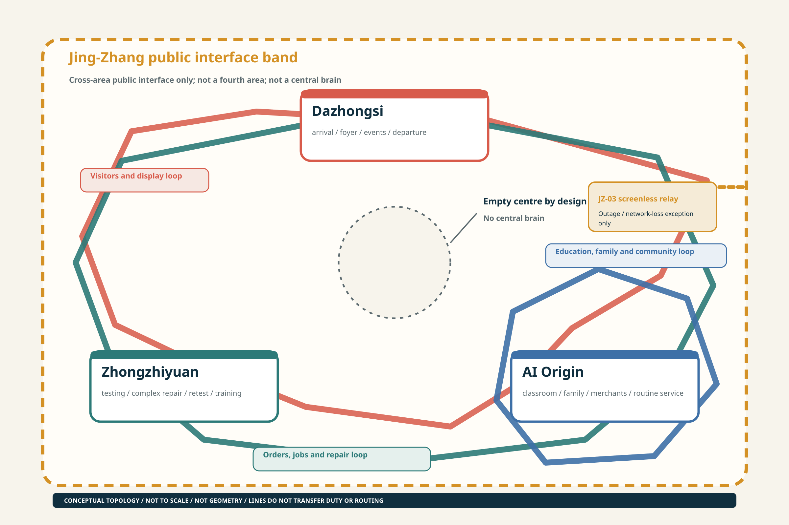
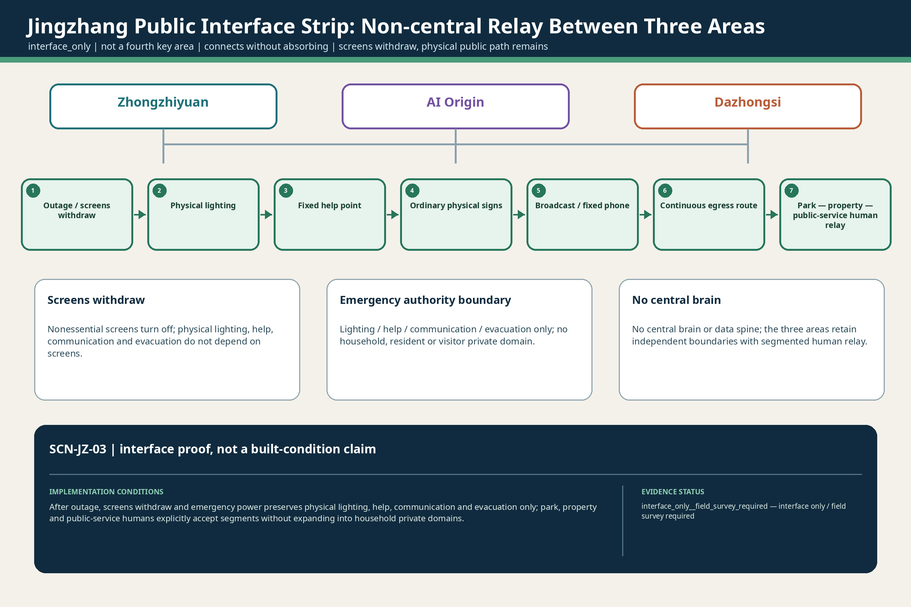
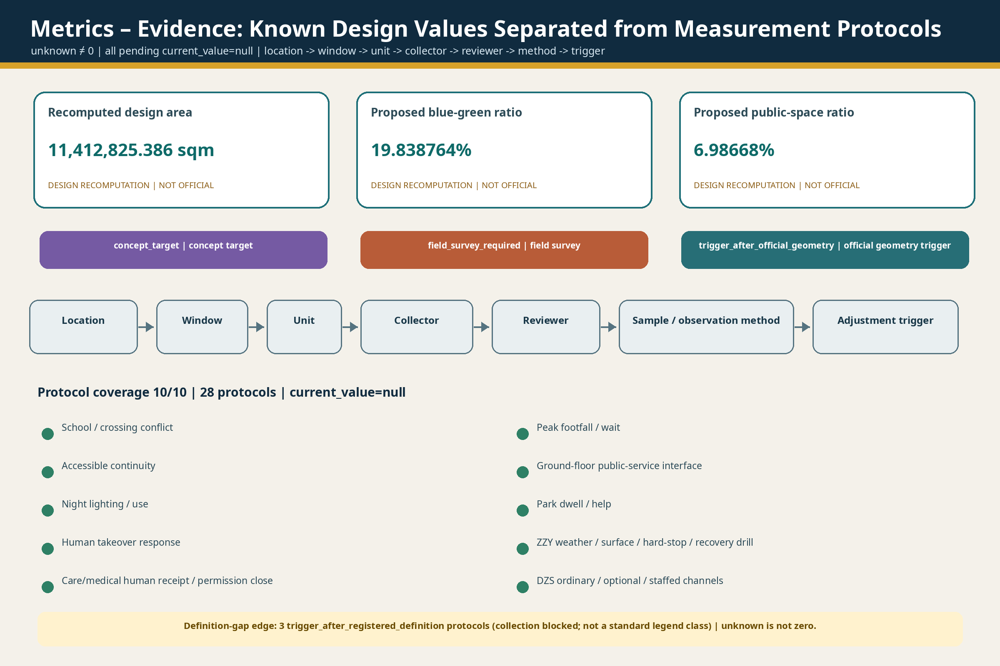

# A City with Doors

<!-- N7-1e R02 first-read-design-probes:start -->
## 15:30–21:40 | Two design probes in one ordinary household day

**15:30, after-school probe.** The family member expected to collect the child cannot arrive. The child stays at a safe, staffed school-side waiting point while the guardian opens one temporary handoff. The spatial problem is not whether a phone can send an alert. It is who remains responsible at the school gate, safe waiting point, crossing and community privacy threshold, and when responsibility may pass to another named human. `SCN-AIO-01`, through `P04 / P05 / P10`, keeps named school staff responsible. If identity is unclear, the child refuses, or the receiver does not respond, no handoff occurs; silence is not consent. Responsibility moves only after the named receiving adult explicitly accepts and completes the physical handoff. An Agent cannot authorize release, create a right of passage or make responsibility jump ahead on a screen. Paper lists, an ordinary telephone, safe waiting, physical wayfinding, a continuous walking surface and human escort must work without AI.

**21:40, outage probe.** The same household still needs a way home through public and shared space. `SCN-AIO-02`, through `P06 / P10`, makes screens recede. Ordinary and emergency lighting, a fixed telephone, paper contacts, mechanical doors, physical signs and named human help must be able to close the journey. Household, property and community actors keep their own duties; responsibility does not move when no one has explicitly received it. The home endpoint is not published, no continuous household trajectory is backfilled after the outage, and restored power or connectivity does not reactivate withdrawn temporary permission.

**Evidence we do not yet have.** `15:30` and `21:40` are registered design probes, not verified operating times. In particular, 15:30 is only a registered design probe, not a typical kindergarten dismissal time for Beijing or China as a whole; before construction-stage work begins, the target kindergarten's current timetable, staggered class-release arrangement, extended-hours service and pickup/late-stay responsibility table must be obtained. Real school and community entrances, crossing location and clear width, continuous accessible routes, ownership and road/property/municipal boundaries remain unverified. So do the actual availability of fixed telephones, lighting, mechanical bypass, duty rosters, institutional agreements and comparable drill records. The proposal therefore releases no existing width, response time, success rate, facility-availability or operating-readiness claim. Official geometry, FAR, building height, building density, statutory green ratio and setbacks remain `unknown`.

**The first work package.** Phase 1 is an evidence-building package for `P04 / P05 / P06 / P10`, not a construction or operating promise. It conducts joint walkthroughs of the school–crossing–community chain and the public/shared outage route; records ordinary access, conventional utilities, named responsibility, maintenance, clearance, egress and manual bypass segment by segment; runs non-AI blind drills with paper lists, ordinary telephones, mechanical doors and ordinary/emergency lighting; and begins reversible-interface design only after owners and responsible parties confirm the conditions. Unclosed dimensions remain `concept target` or `unknown` and cannot enter construction, approval or performance commitments.

**Only then does the wider city system begin.** Once ordinary infrastructure, named responsibility, existing and statutory inputs, maintenance, recovery and exit conditions are closed, these two daily episodes can open into the wider city system across the 43.6 km² coordination area, the 11.4 km² overall design area, the three key areas and five urban networks. The wider system still exchanges only the bounded task, result, receipt and necessary fault summary. `P10` remains a distributed staffed service-station network—not a central brain and not a receiver of a whole person or household.

<!-- N7-1e R02 first-read-design-probes:end -->

## Overall Proposition

The city accepts one bounded task, not a complete person. Continuity of human life is the sole upper-level objective: private-side capability may persist, but public permission, space, device access and responsibility reset in each real setting; distributed staffed nodes accept limited tasks while non-AI access, manual bypass, maintenance, recovery and full exit remain available. [source:AGENT-TASKBOOK] [standard:PROJECT-AGENT-OPEN-CALL-TASKBOOK]

## Design Basis and Source List

The proposal uses the official structured brief, public announcement, standards library, public sources and cleared internal design artifacts. Every claim is separated into official/public source, provisional source, design proposal or unknown. A registered source is not automatically a professionally verified claim. Exact official polygons are not available; the package therefore uses visibly labelled provisional geometry with a single replacement and recalculation path. [source:SITE-PACKAGE] [standard:PROJECT-OFFICIAL-ANNOUNCEMENT]

<!-- N7-1e R01 statutory-source-boundary:start -->
### R01 | Statutory background is a boundary, not geometry or an existing-condition substitute

| Evidence | Public contract | Source refs |
| --- | --- | --- |
| `STAT-N7-1E-01` | Official material confirms an approved street-level plan for nine districts and approximately 16.7 km²; this project does not derive competition boundaries or parcel controls from it. | [source:SRC-N7-1E-STAT-01] [source:SRC-N7-1E-STAT-02] |
| `STAT-N7-1E-02` | The government reprint supports directional Dazhongsi and public-service context, but not project sites, operators, budgets or service readiness. | [source:SRC-N7-1E-STAT-02] |
| `STAT-N7-1E-03` | Official records evidence the Phase II approval, tender procedure and reported progress of the described supporting works; they do not prove completion of all works or this competition proposal. | [source:SRC-N7-1E-STAT-03] [source:SRC-N7-1E-STAT-04] [source:SRC-N7-1E-STAT-05] |
<!-- N7-1e R01 statutory-source-boundary:end -->

## Three-Level Scope Framework

The 43.6 km² strategic area addresses industry, culture and future-city strategy; the 11.4 km² design area translates the proposition into spatial networks, projects and metrics; the 368.4 ha of three key areas tests differentiated local proofs at equal depth. The levels are not added together or substituted for one another. The 11.4 km² layer is the sole denominator for the three spatial metrics. [source:SITE-PACKAGE] [depth:three_level_scope_framework] [metric:site_area_sqm]

The upper-level propositions of life continuity, distributed human acceptance of responsibility and a non-central public interface must translate downward into the five networks, P01–P10 and twelve scenes. Conflicts, maintenance conditions and exit requirements found in the key areas must in turn correct the overall-design and strategic layers. All three current polygons are derived from announcement wording, stated area and provisional anchors: their areas must not be added, and a key-area boundary must not replace the 11.4 km² metric denominator. When official geometry arrives, all nine spatial datasets, figures and metrics must be recalculated together as one version. [data:geometry/key_areas.geojson#PROV-KEY-001] [depth:metrics_recalculation]

## Coordinated Research Area: Industry and Future City Research

A City with Doors makes continuity of human life the upper-level objective. Private-side capability may persist, but permission, space, device access and responsibility reset in each public setting. The public side accepts a bounded task, not the complete person, household or private agent. The innovation ecosystem links people, public institutions, knowledge institutions, industry, four spatial systems and responsibility gates; cross-area exchange is limited to tasks, results, receipts and necessary fault summaries. Six primary-source precedents are used only to compare mechanisms. [source:AGENT-TASKBOOK] [source:CASE-03] [standard:PROJECT-AGENT-OPEN-CALL-TASKBOOK]

### Six Global Precedents and Transferable Mechanisms

- **Modena Automotive Smart Area (MASA) (Modena, Italy)**: Instrumented public urban area with cameras, 4.5G communications, servers and sensors; a separate reserved dynamic area uses cloud-connected signals, digital signage, obstacle-recognition cameras, sensors and removable road markings. Limitation: Research and certification environment, not a mass public mobility service; data-centre/control-room centralisation and public-access safeguards require separate scrutiny. [source:CASE-01]
- **Accessibili-D Autonomous Shuttle (Detroit, USA)**: Predefined and on-demand accessible shuttle network linking residences, medical care, shopping and community destinations; booking available by app or phone; stops were placed near senior housing and apartment complexes. Limitation: Temporary pilot; continued service depends on procurement and funding. Eligibility, stop geography and safety-operator dependence limit transferability. [source:CASE-02]
- **SHOW — Shared Automation Operating Models for Worldwide Adoption (20 European cities / multi-country)**: Fixed-route public transport, demand-responsive transport, MaaS and logistics services were tested in dense urban, peri-urban, neighbourhood and controlled environments. Limitation: Low average speeds and context-dependent performance; accidents and conflicts occurred; pilot diversity complicates direct transfer to one district. [source:CASE-03]
- **Punggol Autonomous Shuttle Services (Singapore)**: Fixed-route first/last-mile shuttles connect housing estates to polyclinics, markets, MRT/bus nodes and neighbourhood amenities, with designated pickup/drop-off points and physical signage. Limitation: Safety operators remain onboard; service is route- and stop-constrained; resident feedback showed fixed-route limitations. [source:CASE-04]
- **Beijing High-Level Autonomous Driving Demonstration Area / E-Town (Beijing, China)**: Defined operational domains, designated test/service routes, instrumented roads and connections to transport hubs; permit stages move from staffed tests to remote-supervised unmanned service. Limitation: Official sources emphasise expansion and industry development; public audit, privacy, ordinary non-app access and local failure-recovery evidence require further investigation. [source:CASE-05]
- **Waymo Rider-Only Urban Service (Multiple US cities; San Francisco Bay Area as urban reference)**: Driverless ride-hailing operates in mixed traffic and depends on curb pickup/drop-off, fleet maintenance, remote assistance and bounded operational domains. Limitation: Operator-controlled service and data; not a public spatial governance model; equity, curb competition, deadheading and outage continuity are outside the cited evidence used here. [source:CASE-06]

## Overall Design Area: Urban Renewal and Regulatory-Plan-Level Urban Design

The 11.4 km² layer is not a diagram of lines between three districts. It is organised as five maintainable urban networks: ordinary movement and walking; blue-green and public space; staffed service and non-AI relay; testing/logistics/repair/safe return; and energy/communications/recovery. A cross-cutting permission contract specifies who initiates a task, what is accessed, when permission closes, who accepts responsibility and how the system returns to ordinary service. [data:geometry/roads.geojson#N2B-RD-001] [data:geometry/public_space.geojson#N2B-PS-001] [depth:overall_spatial_structure]

Urban renewal does not begin with a demolition or new-build count. It first protects continuous roads, accessibility, conventional utilities and staffed entry that require no app; it then reuses existing ground floors, public space and service space as reversible interfaces, and only after that considers permanent new structures. Land use, buildings, roads, green space, public space, constraints and phasing must share the same P, SCN, responsibility, maintenance, recovery and exit fields. Because statutory land use, ownership, building, station-access and utility-capacity data remain missing, current layers express only an auditable design structure and release no FAR, height, demolition or engineering commitment. [depth:retain_renovate_demolish] [depth:traffic_rail_slow_parking]

## Detailed Design of Key Areas

Zhongzhiyuan tests an isolatable, repairable and retestable industrial base; the AI Origin Community tests low-intervention continuity across education, healthcare, older-adult care, households and outages; Dazhongsi tests a staffed urban foyer that can be entered, refused, appealed and fully exited. Each area retains an ordinary public route, staffed service route, maintenance/recovery route and local degraded mode. The Jing-Zhang spine links them without becoming a fourth key area. [data:geometry/key_areas.geojson#PROV-KEY-001] [data:geometry/key_areas.geojson#PROV-KEY-002] [data:geometry/key_areas.geojson#PROV-KEY-003]

### P01-P10 across the Three Areas

- **P01 Blue-Green Open Validation Loop**: separates the public observation edge from the device-testing boundary — SCN-ZZY-01, SCN-ZZY-03
- **P02 Machine-Weather Field + Safe-Recovery Harbour**: uses a bounded operational domain and test window — SCN-ZZY-01
- **P03 Shared Repair–Energy–Edge-Compute Backstage**: provides device isolation and read-only diagnosis — SCN-ZZY-02, SCN-ZZY-03
- **P04 15:30 Three Slow-Gate Safety Corridor**: organises the school gate–crossing–community route as three slow gates with a named human responsibility relay — SCN-AIO-01
- **P05 Visible Help-Gate Network**: links schools, communities, health services, ordinary telephones and safe waiting points into visible entrances where a human can be found and AI can be refused — SCN-AIO-01, SCN-AIO-03
- **P06 21:40 Household–Community Continuity Nodes**: retains shared-side contact, ordinary/emergency lighting, mechanical bypass, paper procedures and human relay through outages and night-time exceptions without publishing home geometry — SCN-AIO-02, SCN-AIO-03
- **P07 Four-Quadrant Ground Stitching at Dazhongsi Station**: restores ordinary ground-level continuity — SCN-DZS-01, SCN-DZS-03
- **P08 Staffed Urban Front Desk + Visitor Agent Landing Hall**: supports multilingual enquiries, short visits, human appeal, work commissions and expiry-bound exit while keeping a credential-free public foyer — SCN-DZS-01, SCN-DZS-02
- **P09 Reversible Event Commons + Resident Quiet Spine**: gives the resident quiet route priority — SCN-DZS-02, SCN-DZS-03
- **P10 Youmen Human–Machine Public-Service Station Network**: uses distributed main, branch and low-permission nodes for staffed service, scheduling, training, referral, audit, human takeover and institutional agreements; it does not become a central command system — SCN-ZZY-02, SCN-AIO-01, SCN-AIO-02, SCN-AIO-03, SCN-DZS-01, SCN-DZS-03

<!-- N7-1e note: prior key-areas caption retired by R03 -->

## AI Innovation Ecosystem, Personas, and AI+ Scenarios

<!-- N7-1f three-life-loops:start -->
### Three Everyday Loops | Arrival, Livelihood, and Responsibility

This is a reading layer across the existing P01-P10 portfolio, twelve SCN records and five urban networks. It creates no new project, scene, statutory boundary, metric or central platform. Each loop begins with a person's active request, retains an ordinary non-digital route, changes hands only after explicit acceptance by a named human, and closes its task, permissions and temporary interfaces at the end. [source:AGENT-TASKBOOK]

**Complete service loop for an arriving visitor.** A visitor opens one temporary door only by registering for an event, accepting an invitation, opting in while booking, actively scanning, or asking for the service at a staffed arrival foyer. A pre-arrival task pack may then carry weather, arrival, connectivity, payment, lodging, luggage, venue, food, multilingual and accessibility information into the Dazhongsi staffed urban foyer and optional Visitor Agent. After luggage, lodging, transport and food are settled, the visit may continue through an optional event and city overview, the Jing-Zhang public-culture route, Zhongzhiyuan's public observation edge and the AI Origin Community's public-experience edge; it then returns to the place of stay at night, continues the next day or leaves through Dazhongsi, and finally closes the temporary task and permissions. A person who does not open digital service still has ordinary public transport, physical signs, paper maps, ordinary telephones, staffed enquiries and accessible routes. This is a task pack, not a lasting visitor profile. Visitors are not test sensors and do not yield to devices. Visiting a real city does not mean viewing real residents: children, older people, patients, households and homes are not exhibits. Service locations, opening information, operators, routes and receiving institutions remain subject to field and institutional verification.

**Local merchant, youth and older-adult economy loop.** One real need begins with an open service card maintained by the merchant. The public interface verifies only qualifications, safety, certification, complaint and operating facts; the user's private Agent may then make a temporary match for that order using distance, time, budget, language, accessibility needs and current capacity. The user remains free to telephone, walk in or trade with the merchant directly. Shops around the AI Origin Community may handle purchase and rental, installation, setup, interoperability, teaching, refurbishment and small repairs; complex faults may move to Zhongzhiyuan for diagnosis, retest, training and standards updates, after which equipment and capability return to the community and strengthen the next local service. Public AI is an exchange, not a toll gate: it does not sell “organic” ranking, mix advertising into matching, require exclusive listing, capture the customer relationship or charge the basic match as a share of transaction value, and it retains merchant correction, appeal and rotating exposure. This loop could support paid work for younger people in installation, repair, reception, after-school assistance, event operations and accessibility retrofit. It could also let retired engineers, teachers and trusted community members return, within qualification boundaries, as paid mentors, reviewers, after-school supporters and cultural guides. The older-adult economy is not only a market that sells services to older people. This is an economic-organisation proposal to test, not evidence that a platform, merchant register, orders, jobs, revenue or operating relationships already exist; qualifications, capacity, payment, insurance, employment status and public cost all require separate verification.

**Smart classroom—pickup—after-school—household chain.** Before class, AI may help a teacher organise materials, shared misconceptions, differentiated exercises and experiment simulations. The teacher remains the centre of the classroom; the system does not persistently watch faces, create personality-like attention scores or accumulate an unlimited child profile. After class, only assignments, completed items and questions that genuinely need explanation form a lightweight same-day learning task pack. A guardian or private Agent checks the named pickup-responsibility seats that are lawful, on duty and available that day; the guardian chooses one and creates a single-use authorization. Named school staff verify the person in the physical setting, the child may still refuse, and responsibility moves only through a human-to-human physical handoff. If the named receiver does not appear, the child remains within staffed school responsibility. A walking group or compliant vehicle reaches the community after-school station, where another named human explicitly accepts responsibility. Water, food, rest, movement, play and interests come before optional learning assistance; “enough for today” also counts as completed service. In the evening, the station ends its duty and closes the pickup task and temporary permissions only after a guardian or next named human explicitly receives the child. Household disagreement, delay, emotion and private life do not flow back into school by default. Actual school timetables, pickup and late-stay duties, eligibility, background checks, training, insurance, pricing and after-school operators remain to be verified.

**Policy and urban boundaries.** The discussion note's “about 30% public + about 70% household” split is recorded only as a **non-binding policy prototype** for co-paying pickup services. It is not a budget, price, subsidy commitment or implementation ratio. Any later use requires separate costing, tiering, disclosure and decision; this revision creates no numerical metric from it. The three loops feed one another across Zhongzhiyuan, the AI Origin Community and Dazhongsi, but each area retains its own responsibility, degraded mode and exit gates. Jing-Zhang remains a non-central public interface strip for ordinary walking and cycling, cultural orientation, low-permission help and human relay—not a fourth key area, central brain or private-data spine. JZ-03 is the exceptional screenless human-relay branch for an outage, not a replacement for the three everyday loops. Maintenance crosses visitor information, signs and telephones, classroom equipment, pickup training, household hardware, complex repair and capability return, but it does not become a fourth headline loop.

**Three-area loop figure.** The figure expresses logical relationships only: three key areas close around an empty centre, with Jing-Zhang on the outer edge as a non-central public interface band. The three coloured paths are reading overlays; they do not represent position, distance, routes, statutory boundaries or automatic transfer of responsibility.

<!-- N7-1f three-life-loops:end -->

<!-- N7-1e R03 three-area-scene-linkage:start -->
### R03 | Three-area flagships and the twelve-scene single source

`data/processed/scenes/scene_cards.normalized.v0.2.json`

All twelve remain design scenarios with evidence gates open, current value = null and formal_ready=false; v0.2 adds public-display fields only and does not change the v0.1 canonical fields.

#### Zhongzhiyuan

| Scene | Projects | Protocols | Public contract |
| --- | --- | --- | --- |
| **SCN-ZZY-01** Machine-Weather Admission and Safe Return | P01, P02 | MP-M-ZZY-01, MP-M-ZZY-02 | Admission is not permission for a machine alone; it is a closable chain linking a bounded test, the public edge, an independent hard stop and physical recovery. Enter a bounded test only when a named human, ordinary public movement, independent hard stop, maintenance and physical recovery are all available; stop if any gate fails. |
| **SCN-ZZY-02** Cross-Brand Fault Diagnosis—Repair—Retest | P03, P10 | MP-M-PSS-08, MP-M-ZZY-02 | The repair loop may be shown, while the missing M-PSS-08 definition continues to block collection without guessed methods or thresholds. Cross-brand diagnosis and retest retain human repair, paper records and independent review; no M-PSS-08 collection or result claim before its definition is registered. |
| **SCN-ZZY-03** Public Samples—Isolated Sandbox—Results-Level Delivery | P01, P03 | MP-M-PSS-05, MP-M-PSS-07 | Public sample—isolated sandbox—results-only delivery is a minimum-disclosure chain still awaiting field and institutional evidence. Public samples enter an isolated sandbox and leave only as results; raw-data export, cross-task inheritance and treating the public as training subjects are prohibited. |

#### AI Origin

| Scene | Projects | Protocols | Public contract |
| --- | --- | --- | --- |
| **SCN-AIO-01** 15:30 Human Handoff through Three Slow Gates | P04, P05, P10 | MP-M-AIO-01, MP-M-AIO-02, MP-M-PSS-02, MP-Q3-PEAK-FLOW-WAIT, MP-Q3-GROUND-FLOOR-INTERFACE | School-side human—slow gate—crossing—community-side human—privacy stop line form a closable 15:30 handoff. The 15:30 chain starts with a school-side human, confirms each of three slow gates and ends only with explicit community-side acceptance; stop on tracking or unaccepted responsibility. |
| **SCN-AIO-02** The Closable Homebound Chain after a 21:40 Outage | P06, P10 | MP-M-AIO-03A, MP-M-AIO-03B, MP-M-PSS-01, MP-Q3-NIGHT-LIGHTING-USE | Outage—screen withdrawal—physical baseline—human relay—household privacy stop line form a closable homebound chain. At a 21:40 outage, nonessential screens withdraw first; emergency resources preserve only lighting, help, communication and evacuation under segmented human relay, without household private data. |
| **SCN-AIO-03** Pre-authorization, Human Takeover and Closure in Older-Adult Care | P05, P06, P10 | MP-M-AIO-02, MP-M-PSS-07, MP-Q3-GROUND-FLOOR-INTERFACE | Nonspatial household privacy gate—community help—minimum-information handoff—qualified receiver—permission closure form the older-adult care loop. Pre-authorization covers minimum task data only; a community human takes over first, transfer occurs only after an eligible medical or care receiver explicitly accepts, and the permission then closes. |

#### Dazhongsi

| Scene | Projects | Protocols | Public contract |
| --- | --- | --- | --- |
| **SCN-DZS-01** Multilingual Urban Foyer for Arriving Visitors | P07, P08, P10 | MP-M-DZS-01A, MP-M-DZS-01B, MP-M-PSS-06A, MP-M-PSS-06B, MP-M-PSS-12, MP-Q3-PEAK-FLOW-WAIT, MP-Q3-GROUND-FLOOR-INTERFACE | The arrival foyer branches into ordinary credential-free, optional digital, staffed quiet and help-exit routes; no receiving institution is presumed committed. An ordinary credential-free route always stands; digital help is optional and revocable, with staffed, quiet and help exits retained; institutional responsibility begins only after explicit acceptance. |
| **SCN-DZS-02** Five-Rights Separation for a Work Commission | P08, P09 | MP-M-DZS-03, MP-M-PSS-05 | A work commission is governed by five-rights separation and complete exit, with the P08/P09-only mapping frozen. Commissioning, execution, acceptance, payment and dispute handling remain separated; the scene links only to P08/P09 and must not regain P10. |
| **SCN-DZS-03** Event Opening—Resident Quiet Line—Complete Exit | P07, P09, P10 | MP-M-DZS-02A, MP-M-DZS-02B, MP-Q3-NIGHT-LIGHTING-USE | Opening, the resident quiet line and complete exit stand together; all numerical values still await a field baseline. Events retain ordinary movement, a resident quiet line, human duty and complete exit; stop if noise, crowding or exit gates fail. |

#### Jing-Zhang public spine (interface layer)

| Scene | Projects | Protocols | Public contract |
| --- | --- | --- | --- |
| **SCN-JZ-01** Three-Evidence Rerouting for a Rainy Night Walk | P01, P04, P07 | MP-M-PSS-12, MP-Q3-NIGHT-LIGHTING-USE, MP-Q3-PARK-DWELL-HELP | Rainy-night movement uses three-evidence rerouting to test public continuity and remains interface_only. This is only a Jing-Zhang public-continuity interface pressure test, not a fourth key area; rainy-night rerouting depends on physical lighting, human patrol and an exitable route. |
| **SCN-JZ-02** Opening and Closure of the Public Spine in Ice, Snow and Heat | P01, P02, P09 | MP-M-ZZY-03A, MP-M-ZZY-03B, MP-Q3-PARK-DWELL-HELP | Public-spine opening remains interface_only, with two undefined metrics continuing to block collection. This remains a Jing-Zhang interface pressure test; no ice, snow or heat opening-performance collection or claim is allowed before M-ZZY-03A/B definitions are registered. |
| **SCN-JZ-03** Screenless Relay along the Public Spine during a Power Outage | P04, P06, P08, P09 | MP-M-AIO-03A, MP-M-AIO-03B, MP-M-PSS-01, MP-Q3-NIGHT-LIGHTING-USE, MP-Q3-PARK-DWELL-HELP | Physical lighting—help point—ordinary signs—broadcast/fixed phone—egress—segmented human relay form a screenless public spine. After outage, screens withdraw and emergency power preserves physical lighting, help, communication and evacuation only; park, property and public-service humans explicitly accept segments without expanding into household private domains. |
<!-- N7-1e R03 three-area-scene-linkage:end -->

## Land Use, Building Scale, and Retain-Renovate-Demolish Strategy

The land-use layer expresses four design support zones: industrial validation, everyday continuity, public translation and ordinary-city continuity. The buildings layer remains a valid zero-feature data gap; project carriers are not represented as buildings. The design sequence is ordinary-baseline protection, reuse of accessible ground floors and public space, reversible retrofit, and deferred permanent construction. Statutory land use, FAR, height, ownership, demolition and new-build decisions remain unknown. [data:geometry/land_use.geojson#N2B-LU-ZZY] [data:geometry/buildings.geojson] [standard:MOHURD-CONTROL-DETAILED-PLANNING]

The four support zones organise functions; they do not replace statutory land-use categories. Their boundaries only test whether P01–P10, scenes and urban networks have spatial carriers. The empty building layer is an intentional disclosure of a data gap: without cleared footprints, heights, structures, uses and ownership, illustrative boxes must not manufacture an appearance of design depth. Once professional source material is obtained, every building must receive a retain, repair, reversible-retrofit, new-build or pending status, and planning, architecture, fire, accessibility and property review must jointly release scale and renewal decisions. [depth:development_intensity_controls] [depth:height_massing_character]

## Transport, Rail, Municipal Infrastructure, and Public Services

Ordinary movement does not depend on an app, account or digital credential; public, device and maintenance routes are separated. P10 is a distributed staffed network with a primary station in the AI Origin Community, repair branch in Zhongzhiyuan, public-service branch in Dazhongsi and low-permission Jing-Zhang nodes. It does not create a complete private-domain database. Paper wayfinding, telephones, staffed counters, hard stops, mechanical recovery and traditional municipal bypasses remain available during outages and errors. [data:geometry/roads.geojson#N2B-RD-004] [standard:BARRIER-FREE-ENVIRONMENT-LAW] [depth:traffic_rail_slow_parking] Municipal and recovery responsibilities are reviewed separately. [depth:municipal_new_infrastructure]

<!-- N7-1e R04 jz03-outage-handoff:start -->
### R04 | SCN-JZ-03 screenless relay during an outage

Physical lighting—help point—ordinary signs—broadcast/fixed phone—egress—segmented human relay form a screenless public spine.

**Scene：** SCN-JZ-03

**Responsibility chain：** Outage / screens withdraw → Physical lighting (Emergency power prioritizes basic lighting); Physical lighting → Fixed help point (Lighting leads to a fixed help point); Fixed help point → Ordinary physical signs (Help and ordinary signs back each other up); Ordinary physical signs → Broadcast / fixed phone (No dependence on a personal phone or account); Broadcast / fixed phone → Continuous egress route (Communication serves help and evacuation only); Continuous egress route → Park—property—public-service human relay (Humans explicitly accept each segment; responsibility never transfers automatically)

**Protocols：** MP-M-AIO-03A, MP-M-AIO-03B, MP-M-PSS-01, MP-Q3-NIGHT-LIGHTING-USE, MP-Q3-PARK-DWELL-HELP

**Projects：** P04, P06, P08, P09
<!-- N7-1e R04 jz03-outage-handoff:end -->

## Blue-Green Network, Public Space, and Urban Character

The Jing-Zhang public spine combines ordinary walking/cycling, blue-green continuity, climate adaptation, railway and innovation-culture interpretation, low-permission help and screenless relay. Public-space proposals include a developer walk/open-source display interface, a correctable and removable contribution/recognition node, and a railway engineering-repair-AI public culture route. Temporary events and devices must fully exit, leaving resident quiet routes and ordinary public use intact. [data:geometry/green_space.geojson#N2B-GR-001] [data:geometry/public_space.geojson#N2B-PS-001] [standard:MOHURD-URBAN-DESIGN-MEASURES]

Blue-green and public-space values are recalculated from the submitted geometry, but they represent only the proposal model, not existing green quantity, ownership or a statutory green ratio. Character control follows four rules: continuous ordinary frontage, legible key nodes, technical equipment set back, and priority for night-time use and resident quiet routes. Equipment bases, plant rooms, advertising and temporary events may not interrupt drainage, fire access, accessibility or conventional maintenance. After trees, water, heritage, buildings and underground utilities are cleared, the relevant professionals must review continuity, shade, sponge capacity, sightlines and maintenance access segment by segment. [depth:blue_green_public_space] [depth:height_massing_character]

## Renewal Projects, Implementation Policy, and Phasing

P01-P10 follow four phases: baseline protection, reversible interfaces, controlled testing/resilience facilities, and long-term evaluation. P10 supports explanation, acceptance, complaints, audit and permission closure; it does not absorb P05 visible help space or the P08 staffed foyer. An annual operating concept cycles through Q1 rules/sources, Q2 public scenes and non-AI drills, Q3 testing/repair/retest, and Q4 contribution/correction/exit review. This is a development proposal, not a confirmed government calendar, budget or investment commitment. [data:geometry/phasing.geojson#N2B-PH-00] [depth:renewal_project_list] [depth:phasing_implementation]

### Four-Phase Implementation Sequence

1. Protect ordinary movement and municipal baselines
2. Reversible interfaces and reuse
3. Controlled tests, resilience facilities and staffed nodes
4. Long-term evaluation, correction and evidence-based expansion

<!-- N7-1e R06 responsibility-trigger-matrix:start -->
### R06 | P01-P10 responsibility, start and stop matrix

| Projects | Scene | phase / priority | Public contract |
| --- | --- | --- | --- |
| **P01** | SCN-ZZY-01, SCN-ZZY-03, SCN-JZ-01, SCN-JZ-02 | Phase 2-3 \| after preserving ordinary public/blue-green continuity, add reversible validation interfaces and only then bounded testing | P01 \| Verify the public line, blue-green continuity, test edge and recovery route first. Only then may public-space/landscape, test-safety and maintenance roles open a small reversible pilot; any uncontrolled crossing or ecological/access conflict stops it. |
| **P02** | SCN-ZZY-01, SCN-JZ-02 | Phase 3 \| hard stop, isolation, recovery and maintenance evidence precede any expansion of testing | P02 \| First drill hard stop, de-energisation, isolation and mechanical recovery for one bounded test. Open only with verified device, window, weather/surface, responsibility and permission; powered return is prohibited after a hard stop. |
| **P03** | SCN-ZZY-02, SCN-ZZY-03 | Phase 2-3 \| repair, isolation, energy and retest capacity precede scaled device operation | P03 \| Verify equipment, work orders, isolation, MEP/fire, read-only diagnosis, human retest and appeal closure before locating the backstage. Mismatch, excess authority, failed retest or absent receiver keeps the item isolated. |
| **P04** | SCN-AIO-01, SCN-JZ-01, SCN-JZ-03 | Phase 1-2 \| ordinary passage and named human handoff first; reversible safety micro-renewal before optional intelligent assistance | P04 \| Verify the real gate, timetable and three-segment human responsibility, then walk, observe four 15-minute windows and run a no-AI handoff drill. Refusal, unclear identity, unsafe route or absent receiver returns the child to staffed school-side waiting. |
| **P05** | SCN-AIO-01, SCN-AIO-03 | Phase 1-2 \| reuse existing public-service ground floors and staffed entrances before adding optional digital assistance | P05 \| First inventory real visible help gates, ordinary phones, staffed windows and accessibility/fire/maintenance conditions. Community help is not medical receipt; professional responsibility moves only after explicit acceptance by a qualified human. |
| **P06** | SCN-AIO-02, SCN-AIO-03, SCN-JZ-03 | Phase 1-2 \| protect ordinary/emergency lighting, mechanical bypass and staffed duty before reversible resilience interfaces | P06 \| Verify shared-side lighting, backup power, mechanical bypass, phones, paper contacts and human duty, then run a no-AI outage drill. Publish no residence location, and restored power does not reactivate closed permission. |
| **P07** | SCN-DZS-01, SCN-DZS-03, SCN-JZ-01 | Phase 1-2 \| preserve ordinary station-city movement, accessibility and egress before ground stitching | P07 \| Verify real exits, four-quadrant destinations, ordinary/accessible routes, crossings, egress and responsibility segments, then walk every route. Any access, accessibility, egress or maintenance obstruction stops the work. |
| **P08** | SCN-DZS-01, SCN-DZS-02, SCN-JZ-03 | Phase 1-2 \| establish a credential-free staffed foyer before optional bounded digital access | P08 \| Establish credential-free ordinary passage and staffed/quiet assistance before testing an optional digital line. Station, road, property, desk and receiving institution own separate segments; ordinary passage continues when digital service is refused, fails or is withdrawn. |
| **P09** | SCN-DZS-02, SCN-DZS-03, SCN-JZ-02, SCN-JZ-03 | Phase 3-4 \| reversible events only after resident quiet-route, egress, noise, operation and complete-exit evidence closes | P09 \| Verify the resident quiet route, ordinary passage, loading, egress, maintenance and complete exit before a small reversible event. Any blocked route, missing owner, expired window or incomplete exit closes and clears it. |
| **P10** | SCN-ZZY-02, SCN-AIO-01, SCN-AIO-02, SCN-AIO-03, SCN-DZS-01, SCN-DZS-03 | Cross-phase \| nodes form with their local spatial projects while always retaining domain separation, human service and offline capability | P10 \| Verify each physical interface, ordinary phone/paper/staffed window, roster, referral, complaint, audit, incident and closure locally. Accept only the bounded task—not a whole person or household—and never become central command. |
<!-- N7-1e R06 responsibility-trigger-matrix:end -->

## Metrics, Area Recalculation, and Compliance Matrix

Using one GeoJSON bundle in EPSG:4548, the package recomputes an overall design area of 11,412,825.386 m², a proposed blue-green ratio of 19.839%, and a proposed public-space ratio of 6.987%. All are provisional rather than statutory or existing-condition metrics and must be recomputed after any geometry change. All service, response, safety, satisfaction and economic metrics remain unknown. [metric:site_area_sqm] [metric:green_ratio] [metric:public_space_ratio]

<!-- N7-1e R05 metric-evidence-protocols:start -->
### R05 | Measurement protocols and backlinks for unknown metrics

| metric_id | value | status |
| --- | --- | --- |
| `site_area_sqm` | 11,412,825.386 m² | `known` |
| `green_ratio` | 0.19838764 ratio | `known` |
| `public_space_ratio` | 0.06986680 ratio | `known` |
| `key_area_count` | 3 count | `known` |

| Protocols | metric_ids | status_class | Public contract |
| --- | --- | --- | --- |
| `MP-M-AIO-01` | M-AIO-01 | `field_survey_required` | M-AIO-01 \| School-gate/crossing conflicts: four 15-minute observations tied to a verified timetable; current value null. One serious safety event triggers review; other thresholds await a baseline and professional review. |
| `MP-M-AIO-02` | M-AIO-02 | `field_survey_required` | M-AIO-02 \| Explicit human acceptance and timely permission closure: only named acceptance records and post-task closure audits count; current value null. |
| `MP-M-AIO-03A` | M-AIO-03A | `field_survey_required` | M-AIO-03A \| No-AI handoff closure rate during outages: measured by blind drills and segment-level human receipts, without recording a home endpoint; current value null. |
| `MP-M-AIO-03B` | M-AIO-03B | `field_survey_required` | M-AIO-03B \| P90 duration of complete no-AI handoff during outages: time only safely completed blind drills and list failures separately; current value null. |
| `MP-M-DZS-01A` | M-DZS-01A | `field_survey_required` | M-DZS-01A \| Accessible continuous-route coverage to major destinations in four quadrants: verify entrances, destinations and routes before walkthroughs; current value null. |
| `MP-M-DZS-01B` | M-DZS-01B | `field_survey_required` | M-DZS-01B \| Breaks on accessible continuous routes across four quadrants: deduplicate physical, information and communication breaks point by point; current value null. |
| `MP-M-DZS-02A` | M-DZS-02A | `field_survey_required` | M-DZS-02A \| Interruptions to the resident continuous route during visitor peaks: first verify the route and peak/event windows; current value null. |
| `MP-M-DZS-02B` | M-DZS-02B | `field_survey_required` | M-DZS-02B \| Cumulative duration of resident-route interruptions during visitor peaks: timestamp each start and clearance; current value null. |
| `MP-M-DZS-03` | M-DZS-03 | `field_survey_required` | M-DZS-03 \| Share of public digital-interface points with exit, human assistance and credential expiry: verify real points first; current value null. |
| `MP-M-PSS-01` | M-PSS-01 | `field_survey_required` | M-PSS-01 \| No-AI service closure rate: blind-test the service register and close by completion or a named human referral receipt; current value null. |
| `MP-M-PSS-02` | M-PSS-02 | `field_survey_required` | M-PSS-02 \| P90 human-takeover time: time request to explicit named-human acceptance; absence of an eligible receiver is a hard failure; current value null. |
| `MP-M-PSS-05` | M-PSS-05 | `field_survey_required` | M-PSS-05 \| On-time permission-closure rate: audit every task end, withdrawal and expiry; current value null. One unclosed permission triggers stop and review. |
| `MP-M-PSS-06A` | M-PSS-06A | `field_survey_required` | M-PSS-06A \| Maximum completion-rate gap across AI, human and offline channels: test the same task and sample in all three; current value null. |
| `MP-M-PSS-06B` | M-PSS-06B | `field_survey_required` | M-PSS-06B \| Maximum P90 waiting-time gap across AI, human and offline channels: time the same task and sample in all three; current value null. |
| `MP-M-PSS-07` | M-PSS-07 | `field_survey_required` | M-PSS-07 \| Qualified human-review coverage for high-risk cases: use the risk register, qualifications/formal authority and review records; current value null. |
| `MP-M-PSS-08` | M-PSS-08 | `trigger_after_registered_definition` | M-PSS-08 \| Registered, but its exact definition and unit are absent from the mounted sources. Recover and verify the canonical definition before collection; assign no value or threshold meanwhile. |
| `MP-M-PSS-12` | M-PSS-12 | `field_survey_required` | M-PSS-12 \| Accessibility service breaks: walk from a verified entrance to completed human service and deduplicate physical, information and communication breaks; current value null. |
| `MP-M-ZZY-01` | M-ZZY-01 | `field_survey_required` | M-ZZY-01 \| Uncontrolled crossings between public and restricted test/logistics routes: count after point-by-point classification of verified routes; current value null. One uncontrolled crossing blocks test release. |
| `MP-M-ZZY-02` | M-ZZY-02 | `field_survey_required` | M-ZZY-02 \| P90 from fault alert to isolation, safe return and human takeover: time graded drills; powered return is prohibited after a hard stop; current value null. |
| `MP-M-ZZY-03A` | M-ZZY-03A | `trigger_after_registered_definition` | M-ZZY-03A \| Registered as a blue-green/climate-related metric, but its exact definition and unit are absent from the mounted sources. Recover the canonical definition before collection; assign no value or threshold meanwhile. |
| `MP-M-ZZY-03B` | M-ZZY-03B | `trigger_after_registered_definition` | M-ZZY-03B \| Registered as a blue-green/climate-related metric, but its exact definition and unit are absent from the mounted sources. Recover the canonical definition before collection; assign no value or threshold meanwhile. |
| `MP-BUILDING-FOOTPRINT-AREA` | building_footprint_area_sqm | `trigger_after_official_geometry` | Building footprint area \| Recompute only after verified building outlines and the applicable boundary arrive; current value null, with no illustrative boxes used as data. |
| `MP-FLOOR-AREA-RATIO` | floor_area_ratio | `trigger_after_official_geometry` | FAR \| Await applicable regulatory controls, official scope and verified floor area; current value null and never inferred from proposal ratios or drawings. |
| `MP-Q3-PEAK-FLOW-WAIT` | — | `field_survey_required` | Peak flow and waiting \| Manual, scenario-specific counts tied to verified schedules, with no face or identity tracking; baseline pending. |
| `MP-Q3-GROUND-FLOOR-INTERFACE` | — | `field_survey_required` | Ground-floor public-service interfaces \| Verify access, human staffing, accessibility, fire/egress and maintenance point by point; sites and opening status pending. |
| `MP-Q3-NIGHT-LIGHTING-USE` | — | `field_survey_required` | Night lighting and actual use \| Point measurements and anonymous counts along verified public/shared routes, without home endpoints; baseline pending. |
| `MP-Q3-PARK-DWELL-HELP` | — | `field_survey_required` | Park-node dwell/help \| Use anonymous interval observation and named-human acceptance receipts only, without identity or trajectory linkage; baseline pending. |
| `MP-CONCEPT-TARGET-RELEASE` | — | `concept_target` | Concept target \| A design inference may be shown only with source, boundary, professional review and release conditions; it is not an existing or statutory value. |
<!-- N7-1e R05 metric-evidence-protocols:end -->

## Risk, Copyright, and Compliance

Key risks include provisional geometry being mistaken for official boundaries, P10 re-centralising, districts remaining conceptual rather than spatial, intelligent components obstructing ordinary municipal/emergency systems, unclear source or image rights, disclosure of private coordinates, and reuse of an old validation after version changes. The package uses self-generated figures and registered sources only; it distributes no font files and no private screenshots, home destinations or personal traces. [standard:GENERATIVE-AI-INTERIM-MEASURES] [source:PROJECT-STANDARDS-LIBRARY] [depth:risk_missing_data]

Risk control is not a disclaimer added at the end; it is a spatial and operational phase gate. Work involving children, health, homes or personal trajectories defaults to minimum disclosure. Testing, logistics, events and intelligent facilities require an ordinary public bypass, a named responsible human, a hard stop, and explicit maintenance, recovery and removal conditions. Relevant professionals and affected publics must review high-risk items. Copyright, sources, models, figures and conversion steps retain version records; any new official data, script or account-identity change triggers rerendering, hash refresh and a complete self-check. [data:geometry/constraints.geojson] [depth:risk_missing_data]

## References

Materials that materially shaped the proposal include the official announcement, structured design brief, agent taskbook, national urban-design and regulatory-planning measures, the land-use classification guide, accessibility law, and six limited-use primary-source precedents. The full machine index is in sources.json. Precedents support mechanism comparison only, not local site, institution or performance claims. [source:PROJECT-OFFICIAL-ANNOUNCEMENT] [source:PROJECT-STANDARDS-LIBRARY] [source:CASE-01]

Sources are registered separately by authority level and permitted use. The official announcement supports the task and written scope; organiser-issued structured files support the submission contract; provisional geometry supports only replaceable spatial generation and recalculation; precedents support mechanism comparison; and internal design artifacts prove only this proposal's own decisions. News screenshots, media retellings, OSM inference and AI guesses may not be promoted into boundary, existing-condition or implementation facts. Scene sources without original bytes remain pending and do not gain certainty through repeated citation. Reviewers can follow inline markers into sources, assumptions, geometry, metrics and matrices to trace the boundary between fact, design and unknown. [source:SOURCE-REGISTRY] [depth:existing_conditions_diagnosis]
