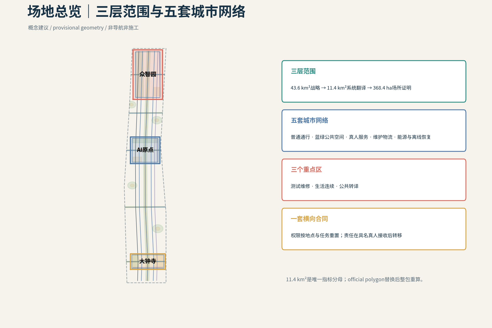
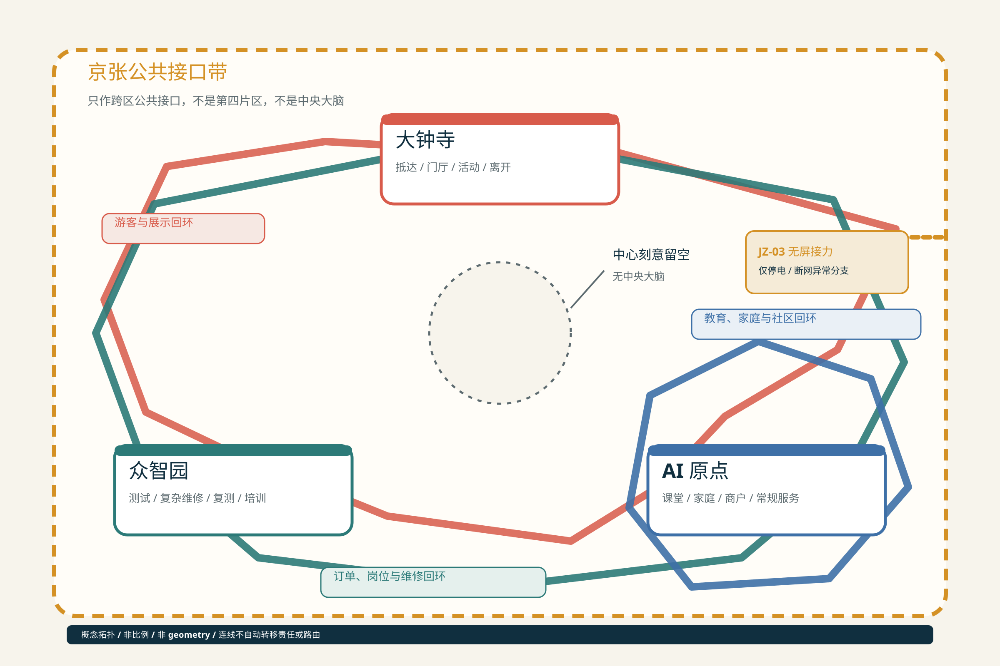

# 有门的城市｜A City with Doors

<!-- N7-1e R02 first-read-design-probes:start -->
## 15:30—21:40｜两个设计探针：先看一个普通家庭的一天

**15:30，放学探针。** 原定接孩子的家人临时赶不到，孩子先留在学校真人值守的安全等待处；监护人只发起一次临时接应。真正的空间问题不是手机能否弹出提醒，而是校门、安全等待、过街和社区隐私阈值之间，谁在每一段持责，何时完成具名真人交接。`SCN-AIO-01`以`P04 / P05 / P10`约束这条链：实体交接前由学校具名真人持责；身份不清、孩子拒绝或接应人无回应时不放行，无回应不等于同意；只有接应真人明确接收并完成实体交接后才转责。Agent不决定放行、不生成通行权，也不能让责任在屏幕上提前跳到下一站。纸面名单、普通电话、安全等待、实体导视、连续步行面和人工护送必须不依赖AI而成立。

**21:40，停电探针。** 同一个家庭仍要从公共和共享空间回家。`SCN-AIO-02`通过`P06 / P10`要求屏幕退场：普通／应急照明、固定电话、纸面联系人、机械门、实体导视和具名真人接力必须能独立闭合回家链。家庭、物业、社区各守原责；无人明确接收时，责任不得被推向下一节点。住宅终点不公开，断电期间不补采连续轨迹，恢复供电或网络也不自动恢复已经撤回的临时权限。

**当前不能假装已经取得的证据。** `15:30`和`21:40`都是已注册的设计探针，不是已核实的固定放学或故障时刻。其中，15:30仅是注册设计探针，不代表北京或全国幼儿园的典型放学时刻；进入施工前，必须取得目标园所当期作息、分班错峰、延时服务及接送／滞留责任表。当前尚无经核验的真实校门、社区入口、过街位置与净宽、连续无障碍路线、权属和道路／物业／市政责任边界，也没有固定电话、照明、机械旁通、值班机制、机构协议与同口径演练数据的完整现状清单。因此，本方案不释放现实宽度、响应时长、成功率、设施存在或运营就绪结论；官方geometry、FAR、建筑高度、建筑密度、法定绿地率和退界继续为`unknown`。

**首期可以启动的工作包。** 首期不是建设或运营承诺，而是`P04 / P05 / P06 / P10`的证据化启动包：共同踏勘校门—过街—社区与停电回家公共／共享段；逐段登记普通通行、传统市政、真人持责、维护、疏通、疏散和人工旁通；以纸面名单、普通电话、机械门和普通／应急照明进行无 AI 盲演；在权属与责任主体确认后，再开展可逆、可撤除的接口设计。未闭合尺度继续保持`concept target`或`unknown`，不得进入施工、审批或绩效承诺。

**再进入完整城市系统。** 只有普通底盘、具名责任、现状与法定输入、维护恢复和退出条件逐项闭合，方案才从这两段日常扩展至由43.6 km²统筹研究、11.4 km²总体设计、三重点区与五套城市网络构成的完整城市系统。完整系统仍只连接当次任务、结果、回执与必要故障摘要；`P10`是分布式真人服务站网络，不是中央大脑，也不接管一个完整的人或家庭。

<!-- N7-1e R02 first-read-design-probes:end -->

## 总体主张

城市只接一次任务，不接一个完整的人。人的生活连续性是唯一上位目标：私人侧能力可以持续，但公共权限、空间、设备和责任在每个现实场景重新申请；公共端由分域真人节点接收有限任务，并始终保留无AI、人工旁通、维护、恢复与完整退出。 [source:AGENT-TASKBOOK] [standard:PROJECT-AGENT-OPEN-CALL-TASKBOOK]

## 设计依据与资料清单

本方案以官方结构化任务书、公告、标准库、公开来源和已清权的内部设计工件为依据。所有结论分为 official/public source、provisional source、design proposal 与 unknown 四类；来源被登记并不等于主张已经通过专业核验。当前官方仅提供三层范围的文字和面积，未提供精确 polygon，因此本包使用醒目标记的 provisional geometry，并保留统一替换与复算机制。 [source:SITE-PACKAGE] [standard:PROJECT-OFFICIAL-ANNOUNCEMENT]

<!-- N7-1e R01 statutory-source-boundary:start -->
### R01｜法定背景只作边界，不作几何或现状替代

| 证据 | 公开合同 | 来源引用 |
| --- | --- | --- |
| `STAT-N7-1E-01` | 官方资料确认更大范围的街区层面控规已获批，涉及 9 个街区、约 16.7 km²；本项目不据此推导竞赛边界或地块控制。 | [source:SRC-N7-1E-STAT-01] [source:SRC-N7-1E-STAT-02] |
| `STAT-N7-1E-02` | 官方转载资料可支持大钟寺与公共服务的方向性背景，但不证明本方案点位、运营者、预算或服务已经落实。 | [source:SRC-N7-1E-STAT-02] |
| `STAT-N7-1E-03` | 官方记录可证明二期实施方案批复、招标程序旁证及所述配套项目的进度事实；它们不等于全部工程或本竞赛方案已落地。 | [source:SRC-N7-1E-STAT-03] [source:SRC-N7-1E-STAT-04] [source:SRC-N7-1E-STAT-05] |
<!-- N7-1e R01 statutory-source-boundary:end -->

## 三层范围工作框架

43.6 km²统筹研究范围回答产业生态、文化与未来城市战略；11.4 km²总体设计范围把主张翻译为空间网络、项目与指标；368.4 ha三处重点区域以同字段、同深度验证不同副目标。三个层级不相加、不互相替代。11.4 km²是本包三项空间指标的唯一分母。 [source:SITE-PACKAGE] [depth:three_level_scope_framework] [metric:site_area_sqm]

上位层提出的“生活连续性、分域真人接责、非中央公共接口”必须向下落实为五套网络、P01–P10与12张场景；重点区发现的冲突、维护条件和退出要求则反向校正总体层和战略层。当前三层polygon均以公告文字、面积与临时锚点推导，不能把三层面积相加，也不能用重点区边界替代11.4 km²指标分母；官方geometry到达后，九层空间数据、图件和指标必须作为同一版本整体复算。 [data:geometry/key_areas.geojson#PROV-KEY-001] [depth:metrics_recalculation]

## 统筹研究范围产业与未来城市研究

“有门的城市”把人的生活连续性设为上位目标：私人侧能力可以连续，进入公共场景时权限、空间、设备与责任重新申请；公共端只接当次任务，不接完整的人、家庭或私人Agent。创新生态由人、公共机构、知识机构、产业主体、四类空间与责任门共同组成，跨区只交换有限任务、结果、回执和必要故障摘要。六个一手来源案例用于比较受控测试、社区服务、分阶段许可、人工监督与运营组织，不直接移植其绩效数字。 [source:AGENT-TASKBOOK] [source:CASE-03] [standard:PROJECT-AGENT-OPEN-CALL-TASKBOOK]

### 6个全球案例与可转化机制

- **Modena Automotive Smart Area（意大利摩德纳）**：在开放城市道路之外设置可控动态试验区，利用联网信号、数字标识、障碍识别与可移除标线，把研究、认证、维护与公共通行分层组织；其价值在于“可控测试边界”，而非复制中央控制室。局限是它仍以研发与认证为主，尚不能证明大规模公共服务绩效。 [source:CASE-01]
- **Accessibili-D（美国底特律）**：以11平方英里服务区、电话与App并行预约、无障碍车辆、真人安全员和社区反馈调整站点，把自动驾驶限定为老人和残障人士的社区服务补丁。局限是试点依赖资金、地理范围与真人安全员。 [source:CASE-02]
- **SHOW（欧洲20个城市）**：在密集城区、郊区、邻里与受控场地中统一测试固定线路、需求响应、MaaS与物流服务，并用共同指标比较乘客、货运、安全与运营。局限是平均速度较低，事故与冲突仍发生，跨城市结果不能直接移植到单一街区。 [source:CASE-03]
- **Punggol自动驾驶接驳（新加坡）**：以固定路线、实体上下客点、公共交通换乘、真人安全员和居民反馈逐步开放，连接住宅、诊所、市场与轨道站。局限是路线与站点约束明显，尚处早期运营阶段。 [source:CASE-04]
- **北京亦庄高等级自动驾驶示范区**：通过限定运行域、分阶段许可、路侧设施与交通枢纽连接，把测试、商业服务和监管逐步衔接。局限是公开资料更强调扩张与产业发展，普通无App入口、隐私、地方故障恢复和独立审计仍需补证。 [source:CASE-05]
- **Waymo无人驾驶出行服务（美国多城）**：作为专项参照，说明混行服务仍依赖路缘上下客、车队维护、远程协助和限定运行域。它不是公共创新街区范本；公平、空驶、路缘竞争与停电连续性不由本轮证据证明。 [source:CASE-06]

## 总体设计范围城市更新与控规深度城市设计

11.4 km²不是三区之间的连线图，而是五套可维护的城市网络：普通通行与慢行、蓝绿与公共空间、真人服务与无AI接力、产业测试/物流/维修/安全归港、能源/通信/恢复。横向权限合同要求每个节点都说明谁发起、为何调用、何时关权、谁接责以及故障后怎样回到普通服务。 [data:geometry/roads.geojson#N2B-RD-001] [data:geometry/public_space.geojson#N2B-PS-001] [depth:overall_spatial_structure]

城市更新动作不从拆建数量出发，而从普通底盘是否连续开始：先保全无需App的道路、无障碍、传统市政与真人入口，再把既有首层、公共空间和后勤空间改造成可逆接口，最后才讨论新增构筑物。用地、建筑、道路、绿地、公共空间、约束和分期必须共享P、SCN、责任、维护、恢复与退出字段；现阶段缺少法定用地、权属、建筑、轨道出入口和市政容量数据，因此图层只表达可复核的设计结构，不释放FAR、高度、拆除或工程承诺。 [depth:retain_renovate_demolish] [depth:traffic_rail_slow_parking]

## 重点区域详细设计

众智园验证可隔离、可维修、可复测的产业底盘；AI原点社区验证教育、医疗、银龄、家庭与停电中的低介入生活连续；大钟寺验证可进入、可拒绝、可申诉、可完整退场的城市前厅。三区各自保留普通公众线、真人服务线、维护/恢复线和本地降级闭环；京张公共脊柱连接三区，但不是第四重点区。 [data:geometry/key_areas.geojson#PROV-KEY-001] [data:geometry/key_areas.geojson#PROV-KEY-002] [data:geometry/key_areas.geojson#PROV-KEY-003]

### P01–P10在三区的挂位

- **P01 蓝绿开放验证环**：串联受控实验、公众观察、蓝绿连续与安全回收的公开边界。 — SCN-ZZY-01, SCN-ZZY-03
- **P02 机器天气场＋安全回收港**：在限定设备、版本、路面和时窗内验证雨雪热、积水与表面条件，并在异常时物理归港。 — SCN-ZZY-01
- **P03 维修—补能—端侧算力共用后场**：承载备件、低权限诊断、隔离、维修、补能、复测准备、受限端侧算力和人工停机。 — SCN-ZZY-02, SCN-ZZY-03
- **P04 15:30 三道慢门安全廊**：把校门—过街—社区的儿童通学组织为三道慢门与真人责任接力。 — SCN-AIO-01
- **P05 可见求助门网络**：把学校、社区、卫生服务、普通电话与安全等待点组织成看得见、可找到真人、可拒绝AI的求助入口。 — SCN-AIO-01, SCN-AIO-03
- **P06 21:40 家庭—社区连续性节点**：在停电、断网和夜间异常中保留共享侧联络、照明、机械旁通、纸面流程和真人接力，不公开住宅geometry。 — SCN-AIO-02, SCN-AIO-03
- **P07 大钟寺站四象限地面缝合**：处理站城换向、普通通行、无障碍过街、非机动车秩序和四象限地面公共空间。 — SCN-DZS-01, SCN-DZS-03
- **P08 真人城市前台＋Visitor Agent Landing Hall**：承载多语问询、短期访问、人工申诉、工作委托和到期退场，并保持普通无凭证公共线。 — SCN-DZS-01, SCN-DZS-02
- **P09 可逆展演公地＋居民安静脊**：平日服务居民连续生活，活动时限定展开，结束后设施、凭证、临时权限与数据接口共同退场。 — SCN-DZS-02, SCN-DZS-03
- **P10 有门·人机公共服务站网络**：以主站、分站和低权限节点承载实体服务，并为P05/P08等空间门提供排班、培训、转办、审计、人工接管与机构协议；不成为中央总控。 — SCN-ZZY-02, SCN-AIO-01, SCN-AIO-02, SCN-AIO-03, SCN-DZS-01, SCN-DZS-03

<!-- N7-1e note: prior key-areas caption retired by R03 -->

## AI 创新生态、人才画像与 AI+ 场景

<!-- N7-1f three-life-loops:start -->
### 三条生活回环｜到达、谋生、接责

这是覆盖在既有 P01–P10、12 个 SCN 与五套城市网络上的阅读层，不新增项目、场景、法定边界、指标或中央平台。每条回环都从人的主动请求开始，以普通无数字线为底，在具名真人明确接责后转段，并以任务、权限和临时接口关闭收束。[source:AGENT-TASKBOOK]

**外来游客／访客完整服务回环。** 访客只在报名活动、接受邀请、预订行程、主动扫码或到达真人前厅时开启一次临时门：落地前的天气、到达、联网、支付、住宿、行李、会场、餐饮、多语与无障碍信息，随到达任务包进入大钟寺真人城市前厅和可选 Visitor Agent；完成行李、住宿、交通与餐饮安顿后，经可选择的展演与城市总览进入京张公共文化导览，再到众智园的公众观察边和 AI 原点的公共体验边缘，夜间回住处，次日继续或经大钟寺离城，最后关闭临时任务与权限。不开启数字服务的人仍使用普通公共交通、实体导视、纸面地图、普通电话、真人问询和无障碍路线。这是当次任务包，不是长期游客画像；游客不是测试传感器，也不为设备让路；参观真实城市不等于参观真实居民，儿童、老人、患者、家庭与住宅不成为展品。服务点位、营业信息、运营者、路线与接收机构均待现场和机构核验。

**本地商户／青年／银龄经济回环。** 一单真实需求先由商户维护开放服务卡，公共接口只核验资质、安全、认证、投诉与经营事实，用户的私人 Agent 再按这一单的距离、时间、预算、语言、无障碍需求和当前容量临时匹配；用户可直接电话、进店或与商户继续交易。AI 原点周边可承接购买与租赁、安装设置、互联、教学、翻新和小修；复杂故障可再进入众智园诊断、复测、培训与规范更新，把能力和设备送回社区，让下一次本地服务更强。公共 AI 是交换机，不是收费站：不出售“自然推荐”排序，不把广告混入匹配，不强制独家入驻或占有客户关系，基础匹配不以交易额抽成，并保留商户纠错、申诉与轮换曝光。这条回环可能支持青年承担安装、维修、接待、课后助教、活动运营与无障碍改造等有报酬岗位，也可能让退休工程师、教师和社区熟人在资格边界内成为有报酬的导师、复检、课后支持与文化导览能力；银龄经济不只是向老人售卖服务。这是待验证的经济组织提案，不证明平台、商户名录、订单、岗位、收益或运营关系已经存在；资质、容量、付费、保险、劳动关系与公共成本均须另核。

**智慧课堂—接送—课后—家庭链。** 上课前，AI 可帮教师整理教材、共性错题、分层练习和实验模拟；课堂中教师仍是教学中心，不长期盯脸、不生成注意力人格分或无限增长的儿童画像；下课后只把作业、已完成项和确需解释的问题收束成轻量当日学习任务包。家长或其 Agent 查询当天合法、值班且有容量的具名接送责任席位，由家长选择并创建一次性授权；学校具名真人现场核验，孩子仍可拒绝，只有真人对真人完成实体交接后才转责。具名接应人未到时，孩子继续留在学校真人责任范围；步行小组或合规车辆把孩子送至社区课后站后，由课后站具名真人明确接收。饮水、餐点、休息、运动、玩耍与兴趣活动先于可选学习辅助，“今天到这里就够了”也是服务完成。晚间由家长或下一位具名真人明确接收，课后站才结束责任并关闭当日接送任务与临时权限；家庭争执、拖延、情绪和私人生活默认不倒灌学校。真实园校作息、接送与滞留责任、服务准入、背景核验、培训、保险、定价与课后站运营者均待核验。

**政策与城市边界。** 讨论纪要中的“政府约 30% ＋家庭约 70%”只是接送服务共付机制的**非绑定政策原型**，不是预算、定价、补贴承诺或实施比例；若后续采用，必须另行测算、分档、公示与裁决，本版不由此生成任何数值指标。三条回环在众智园、AI 原点与大钟寺之间互相供血，但三区仍分别持有本地责任、降级和退出门；京张只是供普通步行、骑行、文化导览、低权限求助和真人接力使用的非中央公共接口带，不是第四重点区、中央大脑或私域数据脊柱。JZ-03 是断电时的无屏真人接力异常分支，不代替三条日常回环。维护责任穿过游客信息、导视与电话、课堂设备、接送培训、家庭硬件、复杂维修与能力回流，但不另立第四条生活主题。

**三区回环图。** 下图只表达逻辑关系：三处重点区围绕空心中心闭合，京张位于外缘作为非中央公共接口带；三条彩色线是阅读叠加层，不表达位置、距离、路线、法定边界或责任自动转移。

<!-- N7-1f three-life-loops:end -->

<!-- N7-1e R03 three-area-scene-linkage:start -->
### R03｜三区旗舰场景与十二场景同源表

`data/processed/scenes/scene_cards.normalized.v0.2.json`

12 张均保持设计场景、证据门开放、current value = null、formal_ready=false；v0.2 只增加公开显影字段，不改 v0.1 canonical fields。

#### 众智园

| 场景 | 项目 | 测量协议 | 公开合同 |
| --- | --- | --- | --- |
| **SCN-ZZY-01** 机器天气准入与安全归港 | P01, P02 | MP-M-ZZY-01, MP-M-ZZY-02 | 准入不是放行一台机器，而是把限定测试、公众边界、独立急停与物理归港连成可关闭的责任链。 仅在具名真人、普通公众通行、独立急停、维护与物理回收均可用时进入限定测试；任一门失效即停止。 |
| **SCN-ZZY-02** 跨厂牌故障诊断—维修—复测 | P03, P10 | MP-M-PSS-08, MP-M-ZZY-02 | 维修闭环可展示，缺失的 M-PSS-08 定义继续阻断采集，不用推测方法或阈值填空。 跨厂牌诊断与复测须保留人工维修、纸面记录和独立复核；M-PSS-08 定义注册前不得采集或声称结果。 |
| **SCN-ZZY-03** 公共样本—隔离沙盒—结果级交付 | P01, P03 | MP-M-PSS-05, MP-M-PSS-07 | 公共样本—隔离沙盒—结果级交付是一条最小披露链，当前仍待现场与制度证据。 公共样本只进入隔离沙盒并以结果级交付，禁止原始数据外发、跨任务继承或把公众作为训练对象。 |

#### AI 原点

| 场景 | 项目 | 测量协议 | 公开合同 |
| --- | --- | --- | --- |
| **SCN-AIO-01** 15:30 三道慢门真人交接 | P04, P05, P10 | MP-M-AIO-01, MP-M-AIO-02, MP-M-PSS-02, MP-Q3-PEAK-FLOW-WAIT, MP-Q3-GROUND-FLOOR-INTERFACE | 学校侧真人—慢门—过街—社区侧真人—隐私停止线构成 15:30 可关闭交接。 15:30 链必须由学校侧真人开启，三道慢门逐段确认，社区侧真人明确接收；追踪或责任未接收即停止。 |
| **SCN-AIO-02** 21:40 停电后的可关合回家链 | P06, P10 | MP-M-AIO-03A, MP-M-AIO-03B, MP-M-PSS-01, MP-Q3-NIGHT-LIGHTING-USE | 断电—屏幕退场—实体基线—真人接力—家庭隐私停止线构成可关合回家链。 21:40 断电时非必要屏幕先退场，应急资源只保照明、求助、通信与疏散，并由真人分段接力；不得读取家庭私域。 |
| **SCN-AIO-03** 银龄照护的预授权—接管—收束 | P05, P06, P10 | MP-M-AIO-02, MP-M-PSS-07, MP-Q3-GROUND-FLOOR-INTERFACE | 非空间化家庭隐私门—社区求助—最小信息交接—合格接收方—许可关闭构成银龄照护闭环。 预授权只覆盖最小任务数据，社区真人先接管，只有合格医疗或照护接收方明确接受后才转交，并以关闭许可收束。 |

#### 大钟寺

| 场景 | 项目 | 测量协议 | 公开合同 |
| --- | --- | --- | --- |
| **SCN-DZS-01** 到站访客的多语种城市前厅 | P07, P08, P10 | MP-M-DZS-01A, MP-M-DZS-01B, MP-M-PSS-06A, MP-M-PSS-06B, MP-M-PSS-12, MP-Q3-PEAK-FLOW-WAIT, MP-Q3-GROUND-FLOOR-INTERFACE | 到站入口分出普通无凭证、可选数字、有真人安静线与求助出口，任何接收机构都不能被默认承诺。 普通无凭证路线始终成立，数字协助可选且可撤回，同时保留有真人、安静与求助出口；机构责任只在明确接受后发生。 |
| **SCN-DZS-02** 一次工作委托的五权分离 | P08, P09 | MP-M-DZS-03, MP-M-PSS-05 | 一次工作委托以五权分离与完整退出为核心，P08/P09-only 映射冻结。 委托、执行、验收、付款与争议处理五权保持分离；只关联 P08/P09，不得回填 P10。 |
| **SCN-DZS-03** 展演开场—居民静线—完整退场 | P07, P09, P10 | MP-M-DZS-02A, MP-M-DZS-02B, MP-Q3-NIGHT-LIGHTING-USE | 开场、居民静线与完整退场并列成立，所有数值仍待现场基线。 展演需同时保留普通通行、居民静线、真人值守与完整退场；噪声、拥挤或退出门失效即停。 |

#### 京张公共脊柱（接口层）

| 场景 | 项目 | 测量协议 | 公开合同 |
| --- | --- | --- | --- |
| **SCN-JZ-01** 雨后夜行的三证改道 | P01, P04, P07 | MP-M-PSS-12, MP-Q3-NIGHT-LIGHTING-USE, MP-Q3-PARK-DWELL-HELP | 雨后夜行以三证改道验证公共连续性，保持 interface_only。 只作为京张公共连续性接口压力测试，不形成第四重点区；雨后夜行改道必须以实体照明、真人巡查和可退出路线成立。 |
| **SCN-JZ-02** 冰雪高温下的主脊开合 | P01, P02, P09 | MP-M-ZZY-03A, MP-M-ZZY-03B, MP-Q3-PARK-DWELL-HELP | 主脊开合保持 interface_only，两个未定义指标继续阻断采集。 只作为京张接口压力测试；M-ZZY-03A/B 定义注册前不得采集或声称冰雪高温开合性能。 |
| **SCN-JZ-03** 断电时公共脊柱的无屏接力 | P04, P06, P08, P09 | MP-M-AIO-03A, MP-M-AIO-03B, MP-M-PSS-01, MP-Q3-NIGHT-LIGHTING-USE, MP-Q3-PARK-DWELL-HELP | 实体照明—求助点—普通导视—广播／固定电话—疏散—真人分段接力构成无屏公共脊柱。 断电后屏幕退出，应急电只保实体照明、求助、通信与疏散；公园、物业与公共服务真人逐段明确接收，不得扩张到家庭私域。 |
<!-- N7-1e R03 three-area-scene-linkage:end -->

## 用地、建筑规模与拆改留方案

用地层只表达四类设计性用途支持区：产业验证、生活连续、公共转译和普通城市连续。建筑图层保持合法的0-feature data gap；项目载体不得冒充建筑。方案统一采用“普通底盘保全—既有首层与公共空间复用—可逆微更新—新建后置”的次序，具体法定用地、FAR、高度、权属、拆除和新建决定保持unknown。 [data:geometry/land_use.geojson#N2B-LU-ZZY] [data:geometry/buildings.geojson] [standard:MOHURD-CONTROL-DETAILED-PLANNING]

四类用途支持区是功能组织，不是法定地类替换；其边界只用于检查P01–P10、场景和城市网络是否有空间承载。建筑层的空值是有意披露的数据缺口：没有已清权的轮廓、高度、结构、用途和权属时，不用示意盒子制造“已深化”的假象。取得专业资料后，应逐栋补入保留、修缮、可逆改造、新建或待核五类状态，并由规划、建筑、消防、无障碍和产权审查共同释放规模与拆改留结论。 [depth:development_intensity_controls] [depth:height_massing_character]

## 交通、轨道、市政与公共服务设施

普通通行不依赖App、账号或数字凭证；公众线、设备线和运维线分开。P10以AI原点主站、众智园维修分站、大钟寺公共服务分站和京张低权限节点构成分域真人网络，不建立完整私域总库。断网、停电、误判和设备损坏时，纸质导视、普通电话、人工窗口、硬急停、机械拖回和传统市政旁通继续可用。 [data:geometry/roads.geojson#N2B-RD-004] [standard:BARRIER-FREE-ENVIRONMENT-LAW] [depth:traffic_rail_slow_parking] 市政与恢复责任另由独立深度项复核。 [depth:municipal_new_infrastructure]

<!-- N7-1e R04 jz03-outage-handoff:start -->
### R04｜SCN-JZ-03 断电时的无屏接力链

实体照明—求助点—普通导视—广播／固定电话—疏散—真人分段接力构成无屏公共脊柱。

**场景：** SCN-JZ-03

**责任链：** 断电／屏幕退场 → 实体照明 (应急电优先保基本照明); 实体照明 → 固定求助点 (照明可达固定求助点); 固定求助点 → 普通实体导视 (求助与普通导视互为备份); 普通实体导视 → 广播／固定电话 (不依赖个人手机或账号); 广播／固定电话 → 连续疏散路线 (通信只服务求助与疏散); 连续疏散路线 → 公园—物业—公共服务真人接力 (真人逐段明确接收，责任不自动转移)

**测量协议：** MP-M-AIO-03A, MP-M-AIO-03B, MP-M-PSS-01, MP-Q3-NIGHT-LIGHTING-USE, MP-Q3-PARK-DWELL-HELP

**项目：** P04, P06, P08, P09
<!-- N7-1e R04 jz03-outage-handoff:end -->

## 蓝绿空间、公共空间与城市风貌

京张公共脊柱承担普通步行骑行、蓝绿连续、气候适应、铁路与创新文化阅读、低权限求助和无屏接力。公共空间概念建议包括开发者步行与开源成果展示界面、可纠错可撤下的贡献/荣誉展示节点、铁路工程—维修—AI公共文化导览序列。临时活动和设备必须可完整退场，退场后居民静线与普通公共使用继续存在。 [data:geometry/green_space.geojson#N2B-GR-001] [data:geometry/public_space.geojson#N2B-PS-001] [standard:MOHURD-URBAN-DESIGN-MEASURES]

蓝绿与公共空间均从提交geometry复算，但仅代表方案模型，不代表现状绿量、权属或法定绿地率。风貌控制采用“普通界面连续、重点节点可读、技术设施退后、夜间与居民静线优先”的规则，不凭空指定建筑高度；设备基础、机房、广告和临时展演不得切断排水、消防、无障碍和传统维修。待树木、水系、文保、建筑与地下市政资料清权后，相关专业人员还须逐段复核连续性、遮阴、海绵容量、视线和维护通道。 [depth:blue_green_public_space] [depth:height_massing_character]

## 更新项目清单、实施政策与分期计划

P01–P10按“基线保全—可逆接口—受控测试与韧性设施—长期评估”分期。P10只承担跨区说明、接责、投诉、审计与关权支撑，不吞并P05可见求助空间或P08真人前厅。年度运营建议按Q1规则/来源更新、Q2公共场景与无AI演练、Q3测试维修复测、Q4贡献纠错退出复盘循环；这是一套深化建议，不构成政府日历、预算或招商承诺。 [data:geometry/phasing.geojson#N2B-PH-00] [depth:renewal_project_list] [depth:phasing_implementation]

### 四阶段实施次序

1. 普通通行与传统市政基线保全
2. 可逆接口与既有空间复用
3. 受控测试、韧性设施与真人节点
4. 长期评估、纠错与按证据扩展

<!-- N7-1e R06 responsibility-trigger-matrix:start -->
### R06｜P01–P10 责任—启动—停止矩阵

| 项目 | 场景 | phase / priority | 公开合同 |
| --- | --- | --- | --- |
| **P01** | SCN-ZZY-01, SCN-ZZY-03, SCN-JZ-01, SCN-JZ-02 | Phase 2-3 \| after preserving ordinary public/blue-green continuity, add reversible validation interfaces and only then bounded testing | P01｜先核公众线、蓝绿连续、测试边与回收路；公共空间／园林、测试安全和维护角色到位后，才做小尺度可逆验证。任一未受控交叉或生态／通行冲突即停。 |
| **P02** | SCN-ZZY-01, SCN-JZ-02 | Phase 3 \| hard stop, isolation, recovery and maintenance evidence precede any expansion of testing | P02｜先做一次受限测试的急停—断能—隔离—机械归港演练；设备、时窗、天气／路面、责任与许可齐备后才开。硬急停后不得动力返回。 |
| **P03** | SCN-ZZY-02, SCN-ZZY-03 | Phase 2-3 \| repair, isolation, energy and retest capacity precede scaled device operation | P03｜先核设备、工单、隔离、机电消防、只读诊断、真人复测和申诉结单，再定后场。错配、越权、复测失败或无人接收时继续隔离。 |
| **P04** | SCN-AIO-01, SCN-JZ-01, SCN-JZ-03 | Phase 1-2 \| ordinary passage and named human handoff first; reversible safety micro-renewal before optional intelligent assistance | P04｜先核真实校门、放学时刻和三段真人责任，做实走、4×15 分钟观察与无 AI 交接盲演；孩子拒绝、身份不清、路线不安全或无人接收即回到校侧真人安全等待。 |
| **P05** | SCN-AIO-01, SCN-AIO-03 | Phase 1-2 \| reuse existing public-service ground floors and staffed entrances before adding optional digital assistance | P05｜先盘点真实可见求助门、普通电话、真人窗口与无障碍／消防／维护条件；社区求助不等于医疗接收，专业责任只在合格真人明确接受后转移。 |
| **P06** | SCN-AIO-02, SCN-AIO-03, SCN-JZ-03 | Phase 1-2 \| protect ordinary/emergency lighting, mechanical bypass and staffed duty before reversible resilience interfaces | P06｜先核共享侧照明、备电、机械旁通、电话、纸面联系人和真人值班，再做无 AI 停电盲演；不公开住宅位置，恢复供电也不自动恢复已关权限。 |
| **P07** | SCN-DZS-01, SCN-DZS-03, SCN-JZ-01 | Phase 1-2 \| preserve ordinary station-city movement, accessibility and egress before ground stitching | P07｜先核真实站口、四象限目的地、普通／无障碍路线、过街、疏散和责任分段，逐线实走；任何通行、无障碍、疏散或检修阻断都先停。 |
| **P08** | SCN-DZS-01, SCN-DZS-02, SCN-JZ-03 | Phase 1-2 \| establish a credential-free staffed foyer before optional bounded digital access | P08｜先有无凭证普通公共线和真人／安静线，再试可选数字线；站区、道路、物业、前台与接收机构分段负责。数字拒绝、失效或撤回时普通线继续。 |
| **P09** | SCN-DZS-02, SCN-DZS-03, SCN-JZ-02, SCN-JZ-03 | Phase 3-4 \| reversible events only after resident quiet-route, egress, noise, operation and complete-exit evidence closes | P09｜先核居民静线、普通通行、装卸、疏散、检修和完整退场，再做小尺度可逆活动。任一路线受阻、责任缺位、时窗到期或退场不完整即关闭清场。 |
| **P10** | SCN-ZZY-02, SCN-AIO-01, SCN-AIO-02, SCN-AIO-03, SCN-DZS-01, SCN-DZS-03 | Cross-phase \| nodes form with their local spatial projects while always retaining domain separation, human service and offline capability | P10｜先逐节点核实体入口、普通电话／纸面／真人窗口、排班、转办、投诉、审计、事故与关权；只接当次任务，不接整个人或家庭，不成为中央总控。 |
<!-- N7-1e R06 responsibility-trigger-matrix:end -->

## 指标体系、面积复算与合规矩阵

本包从同一组GeoJSON在EPSG:4548下复算：总体设计范围11,412,825.386 m²，方案蓝绿比例19.839%，方案公共空间比例6.987%。三项均为provisional，不是法定或现状指标；official geometry或方案面变化后必须整包重算。全部服务、响应、安全、满意度和经济指标仍为unknown。 [metric:site_area_sqm] [metric:green_ratio] [metric:public_space_ratio]

<!-- N7-1e R05 metric-evidence-protocols:start -->
### R05｜unknown 指标的测量协议与回链

| metric_id | value | status |
| --- | --- | --- |
| `site_area_sqm` | 11,412,825.386 m² | `known` |
| `green_ratio` | 0.19838764 ratio | `known` |
| `public_space_ratio` | 0.06986680 ratio | `known` |
| `key_area_count` | 3 count | `known` |

| 测量协议 | metric_ids | status_class | 公开合同 |
| --- | --- | --- | --- |
| `MP-M-AIO-01` | M-AIO-01 | `field_survey_required` | M-AIO-01｜校门—过街冲突：按真实放学时刻做 4×15 分钟观察；当前值 null。一次严重安全事件即复核，其余阈值待基线与专业审查。 |
| `MP-M-AIO-02` | M-AIO-02 | `field_survey_required` | M-AIO-02｜真人接收与按时关权占比：只认具名接收记录和任务后关权审计；当前值 null。 |
| `MP-M-AIO-03A` | M-AIO-03A | `field_survey_required` | M-AIO-03A｜断网无 AI 交接闭环率：以盲演和逐段真人回执测量；不采住宅终点；当前值 null。 |
| `MP-M-AIO-03B` | M-AIO-03B | `field_survey_required` | M-AIO-03B｜断网无 AI 完整交接 P90 时长：只对安全完成的盲演计时，失败另列；当前值 null。 |
| `MP-M-DZS-01A` | M-DZS-01A | `field_survey_required` | M-DZS-01A｜四象限主要目的地无障碍连续路线覆盖率：先核站口、目的地与路线，再实走；当前值 null。 |
| `MP-M-DZS-01B` | M-DZS-01B | `field_survey_required` | M-DZS-01B｜四象限无障碍连续路线断点数：按实体、信息、沟通三类逐点去重；当前值 null。 |
| `MP-M-DZS-02A` | M-DZS-02A | `field_survey_required` | M-DZS-02A｜访客高峰居民连续通行线阻断次数：先核真实静线与高峰／活动时窗；当前值 null。 |
| `MP-M-DZS-02B` | M-DZS-02B | `field_survey_required` | M-DZS-02B｜访客高峰居民连续通行线阻断累计时长：逐次记录发生与清除时间；当前值 null。 |
| `MP-M-DZS-03` | M-DZS-03 | `field_survey_required` | M-DZS-03｜同时具备退出、真人协助和凭证到期的公共数字接口点位占比：先核真实点位；当前值 null。 |
| `MP-M-PSS-01` | M-PSS-01 | `field_survey_required` | M-PSS-01｜无 AI 服务闭环率：按服务清单盲测，并以完成或具名人工转办回执收束；当前值 null。 |
| `MP-M-PSS-02` | M-PSS-02 | `field_survey_required` | M-PSS-02｜人工接管 P90 时长：从请求到具名真人明确接收计时；无人合格接收另作硬失败；当前值 null。 |
| `MP-M-PSS-05` | M-PSS-05 | `field_survey_required` | M-PSS-05｜权限按时关闭率：按任务结束、撤回或到期逐笔核对；当前值 null。一次未关即停查。 |
| `MP-M-PSS-06A` | M-PSS-06A | `field_survey_required` | M-PSS-06A｜AI、人工、离线同类事项完成率最大差：同事项同样本三通道测量；当前值 null。 |
| `MP-M-PSS-06B` | M-PSS-06B | `field_survey_required` | M-PSS-06B｜AI、人工、离线同类事项 P90 等待时长最大差：同事项同样本三通道计时；当前值 null。 |
| `MP-M-PSS-07` | M-PSS-07 | `field_survey_required` | M-PSS-07｜高风险事项合格真人复核覆盖率：依据风险目录、资质／正式授权与复核记录；当前值 null。 |
| `MP-M-PSS-08` | M-PSS-08 | `trigger_after_registered_definition` | M-PSS-08｜已登记但当前挂载源缺少精确定义与单位；先找回并核验 canonical 定义，期间不采集、不赋值、不设阈值。 |
| `MP-M-PSS-12` | M-PSS-12 | `field_survey_required` | M-PSS-12｜无障碍服务断点数：从经核入口实走到真人完成服务，并按实体、信息、沟通去重；当前值 null。 |
| `MP-M-ZZY-01` | M-ZZY-01 | `field_survey_required` | M-ZZY-01｜公众线与受限测试／物流线未受控交叉点数：真实路线逐点分类后计数；当前值 null。一个未受控交叉即阻断测试释放。 |
| `MP-M-ZZY-02` | M-ZZY-02 | `field_survey_required` | M-ZZY-02｜报警至隔离、归港并真人接管 P90 时长：按分级故障演练计时；硬急停后不得动力返回；当前值 null。 |
| `MP-M-ZZY-03A` | M-ZZY-03A | `trigger_after_registered_definition` | M-ZZY-03A｜已登记为蓝绿／气候相关指标，但挂载源缺少精确定义与单位；先找回 canonical 定义，期间不采集、不赋值、不设阈值。 |
| `MP-M-ZZY-03B` | M-ZZY-03B | `trigger_after_registered_definition` | M-ZZY-03B｜已登记为蓝绿／气候相关指标，但挂载源缺少精确定义与单位；先找回 canonical 定义，期间不采集、不赋值、不设阈值。 |
| `MP-BUILDING-FOOTPRINT-AREA` | building_footprint_area_sqm | `trigger_after_official_geometry` | 建筑基底面积｜等待经核建筑轮廓与适用边界后复算；当前值 null，不用示意盒子填空。 |
| `MP-FLOOR-AREA-RATIO` | floor_area_ratio | `trigger_after_official_geometry` | FAR｜等待适用控规、正式范围与经核建筑面积；当前值 null，不由方案比例或图面反推。 |
| `MP-Q3-PEAK-FLOW-WAIT` | — | `field_survey_required` | 高峰人流与等待｜按真实时刻分场景人工计数，不做人脸／身份追踪；当前基线待测。 |
| `MP-Q3-GROUND-FLOOR-INTERFACE` | — | `field_survey_required` | 首层公共服务界面｜逐点核开放、真人值守、无障碍、消防与维护；当前点位和开放状态待测。 |
| `MP-Q3-NIGHT-LIGHTING-USE` | — | `field_survey_required` | 夜间照明与实际使用｜按经核公共／共享路线做点测与匿名计数，不记录住宅终点；当前基线待测。 |
| `MP-Q3-PARK-DWELL-HELP` | — | `field_survey_required` | 公园节点停留／求助｜只做匿名区间观察与具名真人接收回执，不拼接身份或轨迹；当前基线待测。 |
| `MP-CONCEPT-TARGET-RELEASE` | — | `concept_target` | concept target｜可表达设计推导，但必须列来源、边界、专业复核与释放条件；不冒充现状或法定值。 |
<!-- N7-1e R05 metric-evidence-protocols:end -->

## 风险、版权与合规说明

主要风险包括：provisional geometry被误读为官方边界、P10重新中央化、三区以概念替代空间证据、智能构件妨碍传统市政和应急、来源或图片权利不清、对外披露私域坐标、版本变化后沿用旧验收。包内只使用自生成图件和可登记来源；不分发字体，不上传私密截图、住宅终点或个人轨迹。 [standard:GENERATIVE-AI-INTERIM-MEASURES] [source:PROJECT-STANDARDS-LIBRARY] [depth:risk_missing_data]

风险控制不是在文末加一句免责声明，而是进入空间和运营阶段门：涉及儿童、医疗、住宅和个人轨迹时默认最少披露；测试、物流、活动和智能设施必须有普通公众旁路、真人责任人、硬停机、维护、恢复和撤除条件；高风险项须由相应专业人员与受影响公众复核。版权、来源、模型、图件和转换过程保留版本记录，任何新的官方数据、脚本或账号身份变化都会触发重新渲染、哈希刷新与完整自检。 [data:geometry/constraints.geojson] [depth:risk_missing_data]

## 参考资料

真正影响方案判断的材料包括：官方公告、结构化设计任务书、面向智能体任务书、住建部城市设计管理办法、控规编制审批办法、自然资源部用地用海分类指南、无障碍环境建设法，以及六个限用途一手来源案例。完整机器索引见sources.json；案例只支撑机制比较，不支撑本地场地、机构或绩效结论。 [source:PROJECT-OFFICIAL-ANNOUNCEMENT] [source:PROJECT-STANDARDS-LIBRARY] [source:CASE-01]

资料采用按权威等级和允许用途分开登记：官方公告支撑任务与文字范围，组织方结构化文件支撑提交契约，provisional geometry只支撑可替换的空间生成与复算，案例只支撑机制比较，内部设计工件只证明本方案自身的选择。新闻截图、媒体转述、OSM推断与AI猜测不得升级为红线、现状或实施事实；六个上游场景包已按精确字节挂载；其中4张原始来源仍只有中文卡，machine／EN原卡缺口继续开放，不以N3／N6派生桥替代。审阅者可从正文标记进入sources、assumptions、geometry、metrics和矩阵，逐项追踪事实、设计与未知的边界。 [source:SOURCE-REGISTRY] [depth:existing_conditions_diagnosis]
