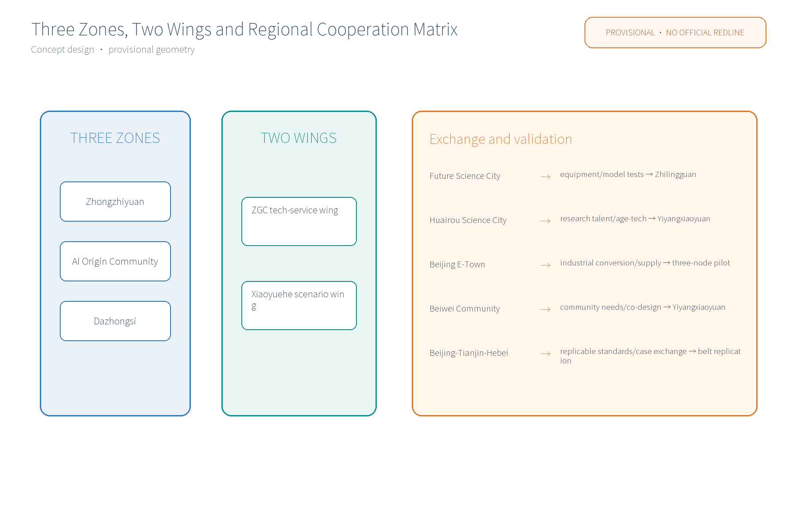
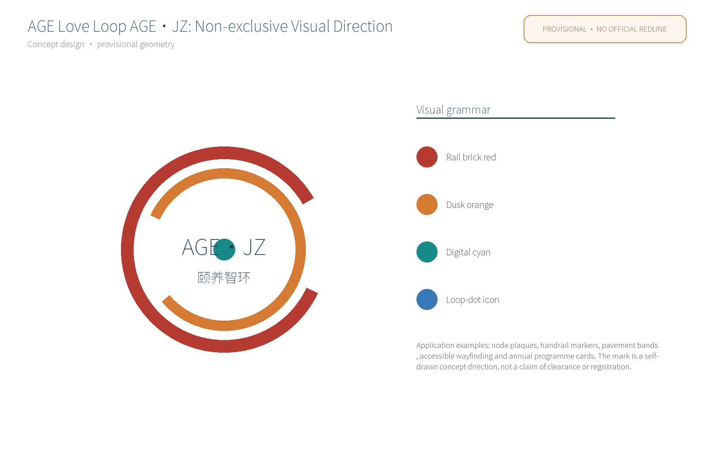
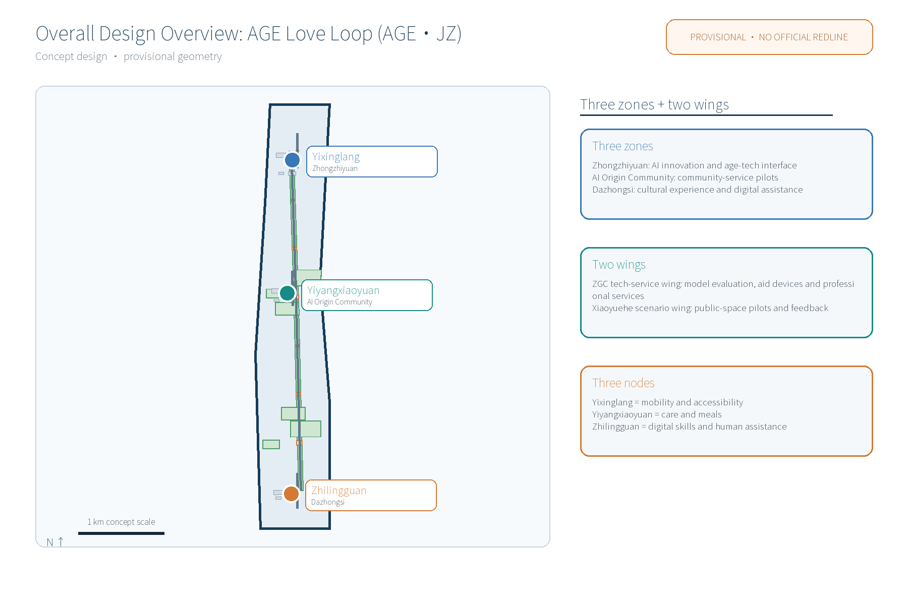
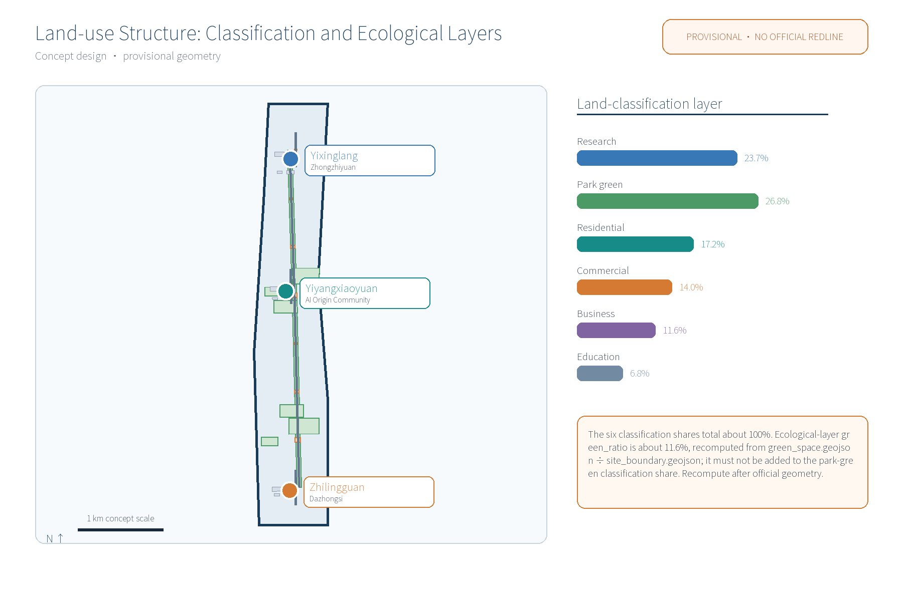
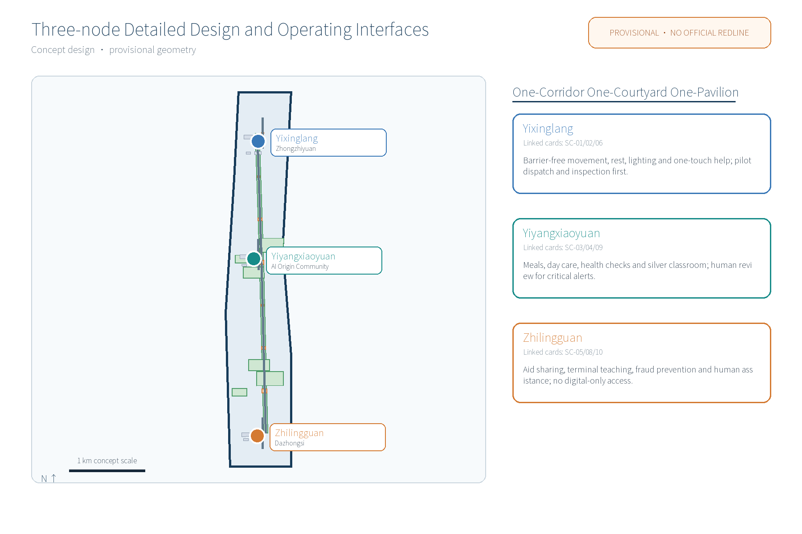
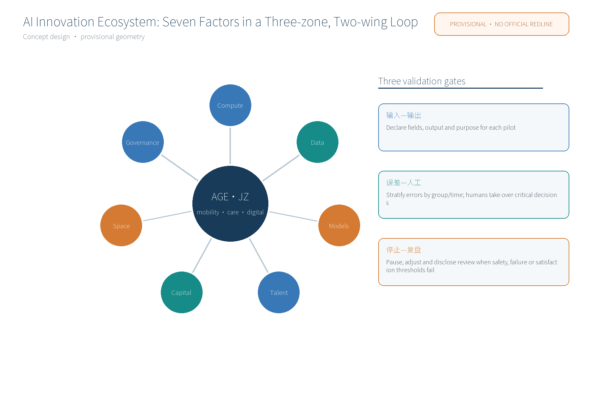
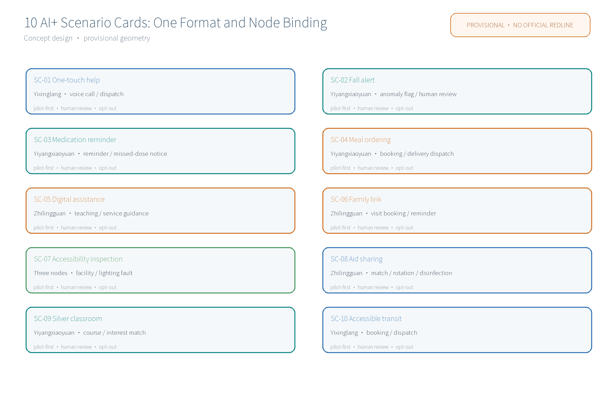
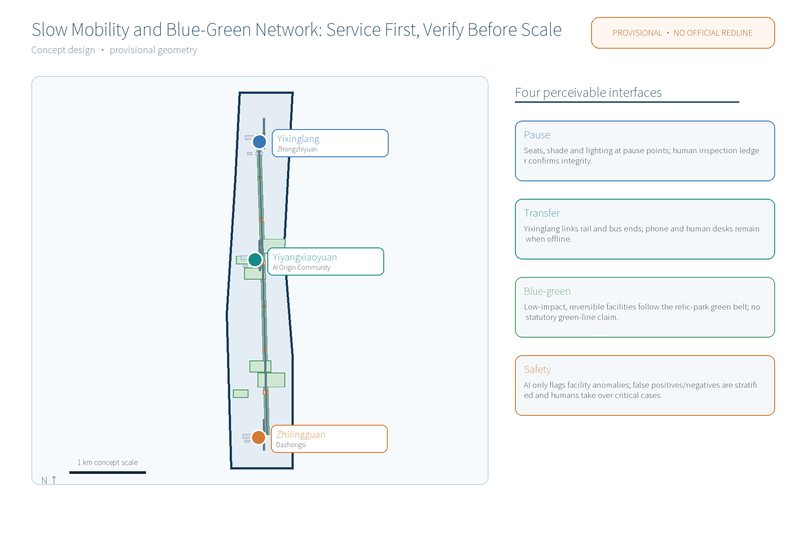
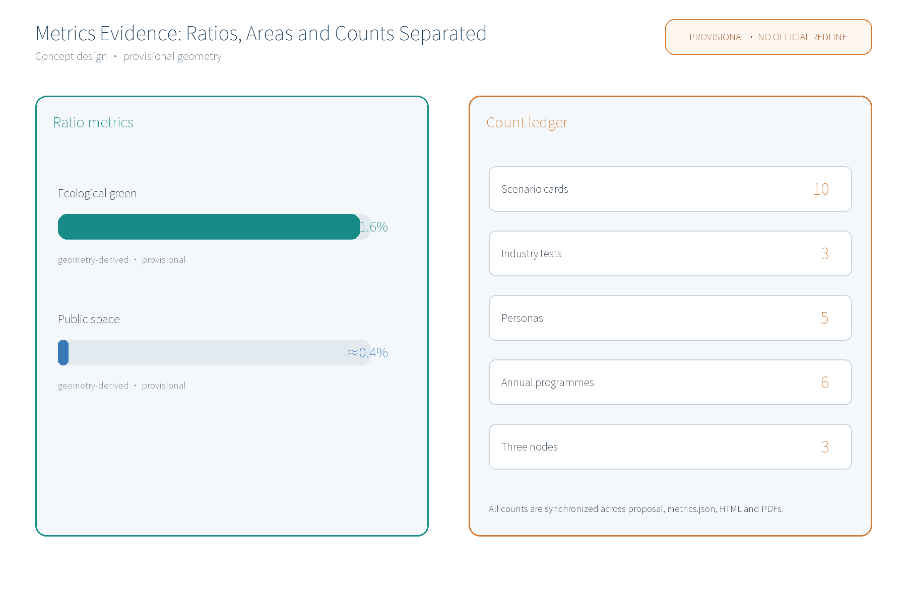

AGE Love Loop (AGE·JZ) is an aging-friendly renovation and community elder-care network concept proposed along the Centennial Jingzhang AI Innovation Belt in Haidian, responding to the taskbook's all-age-friendly living, public-service facilities and urban renewal dimensions as a livelihood application testbed of the AI-integrated innovation belt. It links three original nodes - Yixinglang (age-friendly slow corridor next to Zhongzhiyuan), Yiyangxiaoyuan (community elder-care courtyard next to the Beijing AI Origin Community) and Zhilingguan (digital elder-care pavilion next to Dazhongsi) - into a One-Corridor One-Courtyard One-Pavilion service network that chains mobility, care and digital capability into a perceivable care journey. This is a provisional concept: no planning approval, engineering feasibility or implementation commitment.

## Design Basis and Source List
The design basis includes the public call-for-proposals taskbook (agent.1-6), the official seven-dimension review rubric and the submission organization template, plus public policy directions and professional documents. Documented sources are listed in Design Basis; actual referenced data are registered in `sources.json`; unacquired items are marked in assumptions and missing-data notes. Evidence anchors in this narrative use short IDs (date suffix omitted); the full IDs with publisher, published and accessed dates and reuse boundaries are in `sources.json`, e.g. `[source:DATA-SRC-AGENT-TASKBOOK]` corresponds to the taskbook excerpt. [source:DATA-SRC-OFFICIAL-ANNOUNCEMENT], [source:DATA-SRC-AGENT-TASKBOOK], [source:DATA-SRC-MOHURD-URBAN-DESIGN-MEASURES], [source:DATA-SRC-MOHURD-CONTROL-DETAILED-PLANNING], [source:DATA-SRC-MNR-LAND-USE-CLASSIFICATION], [source:DATA-SRC-PROVISIONAL-BOUNDARIES]

 and [source:DATA-SRC-GENERATIVE-AI-INTERIM-MEASURES] are cited where claims rest on them.

## Three-Level Scope Framework
Per the official announcement's textual scope: coordinated research area ~43.6 km2 (belt industry and future-city research) - overall design area ~11.4 km2 (urban renewal and regulatory-plan-level urban design) - key areas ~368.4 ha (three key-area detailed designs). This package is a participant provisional model specializing in the three aging-friendly nodes within the overall design area; it replaces no official geometry of any level. The three formal core metrics `site_area_sqm`, `green_ratio` and `public_space_ratio` are recomputed from this package's geometry, not quoted. Until official data (elder population distribution, meal and care demand, existing accessibility asset surveys) are published, values are flagged as assumptions with stated use boundaries and recompute triggers. [source:DATA-SRC-AGENT-TASKBOOK]

## Coordinated Research Area: Industry and Future City Research
Industry and future-city research identifies the livelihood-side combination of aging-friendly renovation with the innovation belt: smart age-tech equipment, rehabilitation aids and health-data services extend the industrial chain, exploring blocks where youth innovation and elderly living coexist. It links the Three Zones Two Wings loop - Zhongzhiyuan AI Accelerator, Beijing AI Origin Community and Dazhongsi AI Industry Cluster as the "three zones"; Zhongguancun Technology-Service Wing and XiaoYue River Scenario-Enabling Wing as the "two wings" - and establishes concept-level coordination with Beiwu community, Future Science City, Huairou Science City, Beijing E-Town and the Beijing-Tianjin-Hebei cluster (to be verified after official data release). Six direction-only global aging-friendly cases are summarized: Beijing old-community adaptation, Shanghai one-touch elder-care call services, Japan's community-based integrated care, Singapore's age-friendly housing, MOHURD home-adaptation orientation and the WHO age-friendly cities framework; each is registered in `sources.json` with "to be verified" status and is not conclusive case evidence. [source:DATA-SRC-PROVISIONAL-BOUNDARIES]

| Case / direction | Region | Type | Lesson (direction only) | Source |
|---|---|---|---|---|
| Beijing old-community adaptation | Beijing | micro-renovation policy | government-led renovation, handrails, accessibility | [source:DATA-SRC-CASE-BEIJING] |
| Shanghai one-touch elder care | Shanghai | community call help | telephone help, human fallback | [source:DATA-SRC-CASE-SHANGHAI] |
| Japan community-based care | Japan | in-home community care | multi-actor local care network | [source:DATA-SRC-CASE-JAPAN] |
| Singapore age-friendly housing | Singapore | housing & community | accessible public housing and care facilities | [source:DATA-SRC-CASE-SINGAPORE] |
| MOHURD home adaptation | China | policy orientation | family care beds and home adaptation checklists | [source:DATA-SRC-CASE-MOHURD-HOME] |
| WHO age-friendly cities | International | framework | eight-domain framework and assessment tools | [source:DATA-SRC-CASE-WHO] |

## Overall Design Area: Urban Renewal and Regulatory-Plan-Level Urban Design
The overall design organizes an age-friendly public-space environment around the relic-park green belt: the Yixinglang slow axis, restful nodes and accessible facilities, reversible growth, streets that can time-share display and science-popularization needs. It advocates renewal-first, keep-renovate-improve, micro-update over large demolition. 

Brand & visual identity (agent.1): primary identity "AGE Love Loop AGE·JZ", logo direction "loop graph" derived from rail imagery; color system of railroad brick red, dusk warm orange and digital cyan; sans-serif Chinese black type with geometric sans Latin; loop-sign wayfinding symbols and hub-dot icon system for guide signs, railing markers, pavement and nodal plaques. The name is an internal working codename; it will not be registered or used externally before prior-rights clearance. FAR, building height and other statutory-control-dependent content remain unknown pending official data. [source:DATA-SRC-MOHURD-CONTROL-DETAILED-PLANNING]

## Detailed Design of Key Areas
All node locations are concept points to be re-positioned after site survey, verification and public comment. Yixinglang: continuous ramps, barrier-free corridor and softened crossings form the slow main chain with rest seats, night lighting, one-touch help posts and honor-display walls. Yiyangxiaoyuan: existing buildings micro-adapted into a day-care, meal, health-check and silver-classroom courtyard with graded care and the "Silver Volunteer Star" honor-display system. Zhilingguan: a digital elder-care pavilion offering aid-device sharing, smart-terminal teaching, fraud-prevention publicity and human-assisted service desks. Every node deploys a Reversible Public-Space Component Library (modular seating, movable awnings, temporary accessible ramps, swappable sign components) to avoid one-time fixed construction. [source:DATA-SRC-PROVISIONAL-BOUNDARIES]

## AI Innovation Ecosystem, Personas, and AI+ Scenarios

An AI innovation ecosystem atlas organizes AI across transport, industry, space, public services, culture and governance into perceivable scenario cards, with an industry-space mapping (age-tech equipment and rehab-aid industry, cultural content via experience pavilions and silver classrooms, governance guardrails via public services, mobility via the slow axis, spatial scenarios via the component library). Ten scenario cards are fixed (fall-alert, medication-reminder, meal-ordering, digital-assistance, family-linking, one-touch help, accessible-inspection, aid-sharing, silver-classroom and accessible-transit-dispatch AI). 

Five persona groups are structed (isolated elders, disabled/semi-disabled elders and their family caregivers, active young-old, dual-income caregiving families, community volunteers and carers), with service-journey barriers and non-digital fallback channels (human windows, hotline, children's agency, volunteer buddying). AI technical protocols cover model evaluation (benchmark testing on anonymous event samples), data quality (collection minimization, field completeness, lifecycle), error stratification (false-positive/negative rates by group, scenario, period) and runtime monitoring (weekly false-positive rate, response time, failure rate). Data are anonymized-aggregate only; key decisions are human-reviewed; no individual-identifying tracking or over-monitoring. [source:DATA-SRC-GENERATIVE-AI-INTERIM-MEASURES]

| Scenario card | Name | AI capability | Data & privacy boundary | Operator | Status |
|---|---|---|---|---|---|
| SC-01 | One-touch help AI | voice call, emergency dispatch, transit coordination | location & service record only, anonymized | government purchase + operator | pilot |
| SC-02 | Fall-alert AI | posture anomaly alerts | anonymous event, human review | community + professionals | pilot |
| SC-03 | Medication-reminder AI | reminder and missed-dose notice | daily record only, de-identified | community + volunteers | pilot |
| SC-04 | Meal-ordering AI | ordering, portioning, delivery dispatch | minimalized booking, opt-out | merchants + community | scale-up |
| SC-05 | Digital-assistance AI | phone teaching, service guidance | no imagery retained | universities + volunteers + human | scale-up |
| SC-06 | Family-linking AI | booking, visiting, reminders | minimalized contacts, opt-out | family + community | pilot |
| SC-07 | Accessibility-inspection AI | facility/lighting fault inspection | facility imagery only, no over-monitoring | operator + volunteers | pilot |
| SC-08 | Aid-sharing AI | match, booking, rotation, disinfection | de-identified item records, human review | industry alliance + merchants | pilot |
| SC-09 | Silver-classroom AI | course recommendation, interest match | anonymous interest tags, filing | universities + volunteers | scale-up |
| SC-10 | Accessible-transit AI | real-time ride booking and dispatch | trip location & booking only, anonymized | transport + community | pilot |

Three industry test-validation scenarios run in the pilot block first (call-emergency linkage, accessibility-inspection false-positive evaluation, aid-sharing match), with public comment channels and trial markings; they scale up only after validation. [source:DATA-SRC-GENERATIVE-AI-INTERIM-MEASURES]

### Three Zones–Two Wings Cooperation Matrix (Conceptual)

| Interface | Exchange resource | Spatial / operating carrier | Verifiable output |
|---|---|---|---|
| Zhongzhiyuan–ZGC tech-service wing | Age-tech equipment, model evaluation, aid-device supply and professional leads | Yixinglang pilot segment; Zhilingguan developer corner | Inspection false-positive rate and aid-match success; partners require later confirmation |
| AI Origin Community–Xiaoyuehe scenario wing | Community needs, co-design feedback and non-digital access | Yiyangxiaoyuan day-care and meal prototype | Journey completion and complaint closure; no existing partnership is assumed |
| Dazhongsi–cultural service interface | Jingzhang heritage narrative, silver-classroom content and digital assistance | Zhilingguan cultural interface and human desk | Class participation and human-assistance satisfaction; heritage conditions pending |
| Future Science City / Huairou Science City | Age-tech, research talent and evaluation methods | Three-node pilot protocols | Test reports, error stratification and stop conditions |
| Beijing E-Town / Beijing-Tianjin-Hebei | Industrial conversion, manufacturing supply and replicable standards | Along-the-belt replication toolkit | Precondition checklist; no signed status is claimed |

The matrix describes potential interfaces only. Government, enterprise and community commitments must be confirmed before pilots.

### Original mechanism–common practice–verification

| Original mechanism | Common practice | Added value here | Verification |
|---|---|---|---|
| Three-node human handoff | Single elder-care app or point facility | Mobility–care–digital capability transfer across nodes while retaining phone, human desk and paper fallback | Anonymized work orders: handoff completion, human takeover and opt-out |
| Reversible public-space library | One-time fixed construction | Seats, shade, temporary ramps and signs change through booking, maintenance and removal logs | Quarterly inventory, resident-council review and removal on failure |
| AI suggests; humans decide | Black-box automatic decisions | Unified input, output, error strata, human takeover and stop thresholds bound to nodes | Three industry test reports before scale-up |

### AI validation cards for three industry tests

| Test | Inputs | Outputs | Failure modes and boundary | Human takeover / stop threshold | Node |
|---|---|---|---|---|---|
| Call–emergency linkage | Voice call, time and approximate help point | Work order, human callback and transfer suggestion | False alarm, offline mode, inaccurate location; no diagnosis | Human takeover on no answer, location conflict or high-risk event; weekly review | Yixinglang |
| Accessibility-inspection error test | Facility image, lighting fault log and time period | Repair work order for human verification | Occlusion, low night light and group differences; no identity recognition | Pause if error exceeds pilot threshold for two weeks or cannot be reviewed | Three nodes |
| Aid-sharing match | De-identified item type, stock and booking window | Candidate match, disinfection and handoff task | Expired stock, missing disinfection proof, mismatch; no automatic release | Human signs handoff and disinfection; pause category after any safety event | Zhilingguan |

### Implementation prerequisites and responsibility

| Prerequisite | Current status | Verification method | Responsibility |
|---|---|---|---|
| Ownership, existing buildings and usable space | Unknown / pending | Site survey, ownership and structural records | Participant + authorities |
| Barrier-free continuity, slopes, crossings and lighting | Unknown / pending | Accessibility audit and user walk-through | Specialists + community |
| Care, meal, health-check and aid-device qualifications | Unknown / pending | Permit, filing, disinfection and service-contract review | Operator + specialists |
| Processing roles, PIA, retention and opt-out | Not complete | Business flow, privacy-impact assessment and legal review | Controller/processor + counsel |
| Pilot resources, maintenance and stop conditions | Concept suggestion | Budget categories, RACI, weekly log and quarterly review | Lead street office + operator |

### Three Zones–Two Wings Cooperation Matrix (Conceptual)

| Interface | Exchange resource | Spatial / operating carrier | Verifiable output |
|---|---|---|---|
| Zhongzhiyuan–ZGC tech-service wing | Age-tech equipment, model evaluation, aid-device supply and professional leads | Yixinglang pilot segment; Zhilingguan developer corner | Inspection false-positive rate and aid-match success; partners require later confirmation |
| AI Origin Community–Xiaoyuehe scenario wing | Community needs, co-design feedback and non-digital access | Yiyangxiaoyuan day-care and meal prototype | Journey completion and complaint closure; no existing partnership is assumed |
| Dazhongsi–cultural service interface | Jingzhang heritage narrative, silver-classroom content and digital assistance | Zhilingguan cultural interface and human desk | Class participation and human-assistance satisfaction; heritage conditions pending |
| Future Science City / Huairou Science City | Age-tech, research talent and evaluation methods | Three-node pilot protocols | Test reports, error stratification and stop conditions |
| Beijing E-Town / Beijing-Tianjin-Hebei | Industrial conversion, manufacturing supply and replicable standards | Along-the-belt replication toolkit | Precondition checklist; no signed status is claimed |

The matrix describes potential interfaces only. Government, enterprise and community commitments must be confirmed before pilots.

### Original mechanism–common practice–verification

| Original mechanism | Common practice | Added value here | Verification |
|---|---|---|---|
| Three-node human handoff | Single elder-care app or point facility | Mobility–care–digital capability transfer across nodes while retaining phone, human desk and paper fallback | Anonymized work orders: handoff completion, human takeover and opt-out |
| Reversible public-space library | One-time fixed construction | Seats, shade, temporary ramps and signs change through booking, maintenance and removal logs | Quarterly inventory, resident-council review and removal on failure |
| AI suggests; humans decide | Black-box automatic decisions | Unified input, output, error strata, human takeover and stop thresholds bound to nodes | Three industry test reports before scale-up |

### AI validation cards for three industry tests

| Test | Inputs | Outputs | Failure modes and boundary | Human takeover / stop threshold | Node |
|---|---|---|---|---|---|
| Call–emergency linkage | Voice call, time and approximate help point | Work order, human callback and transfer suggestion | False alarm, offline mode, inaccurate location; no diagnosis | Human takeover on no answer, location conflict or high-risk event; weekly review | Yixinglang |
| Accessibility-inspection error test | Facility image, lighting fault log and time period | Repair work order for human verification | Occlusion, low night light and group differences; no identity recognition | Pause if error exceeds pilot threshold for two weeks or cannot be reviewed | Three nodes |
| Aid-sharing match | De-identified item type, stock and booking window | Candidate match, disinfection and handoff task | Expired stock, missing disinfection proof, mismatch; no automatic release | Human signs handoff and disinfection; pause category after any safety event | Zhilingguan |

### Implementation prerequisites and responsibility

| Prerequisite | Current status | Verification method | Responsibility |
|---|---|---|---|
| Ownership, existing buildings and usable space | Unknown / pending | Site survey, ownership and structural records | Participant + authorities |
| Barrier-free continuity, slopes, crossings and lighting | Unknown / pending | Accessibility audit and user walk-through | Specialists + community |
| Care, meal, health-check and aid-device qualifications | Unknown / pending | Permit, filing, disinfection and service-contract review | Operator + specialists |
| Processing roles, PIA, retention and opt-out | Not complete | Business flow, privacy-impact assessment and legal review | Controller/processor + counsel |
| Pilot resources, maintenance and stop conditions | Concept suggestion | Budget categories, RACI, weekly log and quarterly review | Lead street office + operator |

### Three Zones–Two Wings Cooperation Matrix (Conceptual)

| Interface | Exchange resource | Spatial / operating carrier | Verifiable output |
|---|---|---|---|
| Zhongzhiyuan–ZGC tech-service wing | Age-tech equipment, model evaluation, aid-device supply and professional leads | Yixinglang pilot segment; Zhilingguan developer corner | Inspection false-positive rate and aid-match success; partners require later confirmation |
| AI Origin Community–Xiaoyuehe scenario wing | Community needs, co-design feedback and non-digital access | Yiyangxiaoyuan day-care and meal prototype | Journey completion and complaint closure; no existing partnership is assumed |
| Dazhongsi–cultural service interface | Jingzhang heritage narrative, silver-classroom content and digital assistance | Zhilingguan cultural interface and human desk | Class participation and human-assistance satisfaction; heritage conditions pending |
| Future Science City / Huairou Science City | Age-tech, research talent and evaluation methods | Three-node pilot protocols | Test reports, error stratification and stop conditions |
| Beijing E-Town / Beijing-Tianjin-Hebei | Industrial conversion, manufacturing supply and replicable standards | Along-the-belt replication toolkit | Precondition checklist; no signed status is claimed |

The matrix describes potential interfaces only. Government, enterprise and community commitments must be confirmed before pilots.

### Original mechanism–common practice–verification

| Original mechanism | Common practice | Added value here | Verification |
|---|---|---|---|
| Three-node human handoff | Single elder-care app or point facility | Mobility–care–digital capability transfer across nodes while retaining phone, human desk and paper fallback | Anonymized work orders: handoff completion, human takeover and opt-out |
| Reversible public-space library | One-time fixed construction | Seats, shade, temporary ramps and signs change through booking, maintenance and removal logs | Quarterly inventory, resident-council review and removal on failure |
| AI suggests; humans decide | Black-box automatic decisions | Unified input, output, error strata, human takeover and stop thresholds bound to nodes | Three industry test reports before scale-up |

### AI validation cards for three industry tests

| Test | Inputs | Outputs | Failure modes and boundary | Human takeover / stop threshold | Node |
|---|---|---|---|---|---|
| Call–emergency linkage | Voice call, time and approximate help point | Work order, human callback and transfer suggestion | False alarm, offline mode, inaccurate location; no diagnosis | Human takeover on no answer, location conflict or high-risk event; weekly review | Yixinglang |
| Accessibility-inspection error test | Facility image, lighting fault log and time period | Repair work order for human verification | Occlusion, low night light and group differences; no identity recognition | Pause if error exceeds pilot threshold for two weeks or cannot be reviewed | Three nodes |
| Aid-sharing match | De-identified item type, stock and booking window | Candidate match, disinfection and handoff task | Expired stock, missing disinfection proof, mismatch; no automatic release | Human signs handoff and disinfection; pause category after any safety event | Zhilingguan |

### Implementation prerequisites and responsibility

| Prerequisite | Current status | Verification method | Responsibility |
|---|---|---|---|
| Ownership, existing buildings and usable space | Unknown / pending | Site survey, ownership and structural records | Participant + authorities |
| Barrier-free continuity, slopes, crossings and lighting | Unknown / pending | Accessibility audit and user walk-through | Specialists + community |
| Care, meal, health-check and aid-device qualifications | Unknown / pending | Permit, filing, disinfection and service-contract review | Operator + specialists |
| Processing roles, PIA, retention and opt-out | Not complete | Business flow, privacy-impact assessment and legal review | Controller/processor + counsel |
| Pilot resources, maintenance and stop conditions | Concept suggestion | Budget categories, RACI, weekly log and quarterly review | Lead street office + operator |

### Three Zones–Two Wings Cooperation Matrix (Conceptual)

| Interface | Exchange resource | Spatial / operating carrier | Verifiable output |
|---|---|---|---|
| Zhongzhiyuan–ZGC tech-service wing | Age-tech equipment, model evaluation, aid-device supply and professional leads | Yixinglang pilot segment; Zhilingguan developer corner | Inspection false-positive rate and aid-match success; partners require later confirmation |
| AI Origin Community–Xiaoyuehe scenario wing | Community needs, co-design feedback and non-digital access | Yiyangxiaoyuan day-care and meal prototype | Journey completion and complaint closure; no existing partnership is assumed |
| Dazhongsi–cultural service interface | Jingzhang heritage narrative, silver-classroom content and digital assistance | Zhilingguan cultural interface and human desk | Class participation and human-assistance satisfaction; heritage conditions pending |
| Future Science City / Huairou Science City | Age-tech, research talent and evaluation methods | Three-node pilot protocols | Test reports, error stratification and stop conditions |
| Beijing E-Town / Beijing-Tianjin-Hebei | Industrial conversion, manufacturing supply and replicable standards | Along-the-belt replication toolkit | Precondition checklist; no signed status is claimed |

The matrix describes potential interfaces only. Government, enterprise and community commitments must be confirmed before pilots.

### Original mechanism–common practice–verification

| Original mechanism | Common practice | Added value here | Verification |
|---|---|---|---|
| Three-node human handoff | Single elder-care app or point facility | Mobility–care–digital capability transfer across nodes while retaining phone, human desk and paper fallback | Anonymized work orders: handoff completion, human takeover and opt-out |
| Reversible public-space library | One-time fixed construction | Seats, shade, temporary ramps and signs change through booking, maintenance and removal logs | Quarterly inventory, resident-council review and removal on failure |
| AI suggests; humans decide | Black-box automatic decisions | Unified input, output, error strata, human takeover and stop thresholds bound to nodes | Three industry test reports before scale-up |

### AI validation cards for three industry tests

| Test | Inputs | Outputs | Failure modes and boundary | Human takeover / stop threshold | Node |
|---|---|---|---|---|---|
| Call–emergency linkage | Voice call, time and approximate help point | Work order, human callback and transfer suggestion | False alarm, offline mode, inaccurate location; no diagnosis | Human takeover on no answer, location conflict or high-risk event; weekly review | Yixinglang |
| Accessibility-inspection error test | Facility image, lighting fault log and time period | Repair work order for human verification | Occlusion, low night light and group differences; no identity recognition | Pause if error exceeds pilot threshold for two weeks or cannot be reviewed | Three nodes |
| Aid-sharing match | De-identified item type, stock and booking window | Candidate match, disinfection and handoff task | Expired stock, missing disinfection proof, mismatch; no automatic release | Human signs handoff and disinfection; pause category after any safety event | Zhilingguan |

### Implementation prerequisites and responsibility

| Prerequisite | Current status | Verification method | Responsibility |
|---|---|---|---|
| Ownership, existing buildings and usable space | Unknown / pending | Site survey, ownership and structural records | Participant + authorities |
| Barrier-free continuity, slopes, crossings and lighting | Unknown / pending | Accessibility audit and user walk-through | Specialists + community |
| Care, meal, health-check and aid-device qualifications | Unknown / pending | Permit, filing, disinfection and service-contract review | Operator + specialists |
| Processing roles, PIA, retention and opt-out | Not complete | Business flow, privacy-impact assessment and legal review | Controller/processor + counsel |
| Pilot resources, maintenance and stop conditions | Concept suggestion | Budget categories, RACI, weekly log and quarterly review | Lead street office + operator |

### Three Zones–Two Wings Cooperation Matrix (Conceptual)

| Interface | Exchange resource | Spatial / operating carrier | Verifiable output |
|---|---|---|---|
| Zhongzhiyuan–ZGC tech-service wing | Age-tech equipment, model evaluation, aid-device supply and professional leads | Yixinglang pilot segment; Zhilingguan developer corner | Inspection false-positive rate and aid-match success; partners require later confirmation |
| AI Origin Community–Xiaoyuehe scenario wing | Community needs, co-design feedback and non-digital access | Yiyangxiaoyuan day-care and meal prototype | Journey completion and complaint closure; no existing partnership is assumed |
| Dazhongsi–cultural service interface | Jingzhang heritage narrative, silver-classroom content and digital assistance | Zhilingguan cultural interface and human desk | Class participation and human-assistance satisfaction; heritage conditions pending |
| Future Science City / Huairou Science City | Age-tech, research talent and evaluation methods | Three-node pilot protocols | Test reports, error stratification and stop conditions |
| Beijing E-Town / Beijing-Tianjin-Hebei | Industrial conversion, manufacturing supply and replicable standards | Along-the-belt replication toolkit | Precondition checklist; no signed status is claimed |

The matrix describes potential interfaces only. Government, enterprise and community commitments must be confirmed before pilots.

### Original mechanism–common practice–verification

| Original mechanism | Common practice | Added value here | Verification |
|---|---|---|---|
| Three-node human handoff | Single elder-care app or point facility | Mobility–care–digital capability transfer across nodes while retaining phone, human desk and paper fallback | Anonymized work orders: handoff completion, human takeover and opt-out |
| Reversible public-space library | One-time fixed construction | Seats, shade, temporary ramps and signs change through booking, maintenance and removal logs | Quarterly inventory, resident-council review and removal on failure |
| AI suggests; humans decide | Black-box automatic decisions | Unified input, output, error strata, human takeover and stop thresholds bound to nodes | Three industry test reports before scale-up |

### AI validation cards for three industry tests

| Test | Inputs | Outputs | Failure modes and boundary | Human takeover / stop threshold | Node |
|---|---|---|---|---|---|
| Call–emergency linkage | Voice call, time and approximate help point | Work order, human callback and transfer suggestion | False alarm, offline mode, inaccurate location; no diagnosis | Human takeover on no answer, location conflict or high-risk event; weekly review | Yixinglang |
| Accessibility-inspection error test | Facility image, lighting fault log and time period | Repair work order for human verification | Occlusion, low night light and group differences; no identity recognition | Pause if error exceeds pilot threshold for two weeks or cannot be reviewed | Three nodes |
| Aid-sharing match | De-identified item type, stock and booking window | Candidate match, disinfection and handoff task | Expired stock, missing disinfection proof, mismatch; no automatic release | Human signs handoff and disinfection; pause category after any safety event | Zhilingguan |

### Implementation prerequisites and responsibility

| Prerequisite | Current status | Verification method | Responsibility |
|---|---|---|---|
| Ownership, existing buildings and usable space | Unknown / pending | Site survey, ownership and structural records | Participant + authorities |
| Barrier-free continuity, slopes, crossings and lighting | Unknown / pending | Accessibility audit and user walk-through | Specialists + community |
| Care, meal, health-check and aid-device qualifications | Unknown / pending | Permit, filing, disinfection and service-contract review | Operator + specialists |
| Processing roles, PIA, retention and opt-out | Not complete | Business flow, privacy-impact assessment and legal review | Controller/processor + counsel |
| Pilot resources, maintenance and stop conditions | Concept suggestion | Budget categories, RACI, weekly log and quarterly review | Lead street office + operator |

### Three Zones–Two Wings Cooperation Matrix (Conceptual)

| Interface | Exchange resource | Spatial / operating carrier | Verifiable output |
|---|---|---|---|
| Zhongzhiyuan–ZGC tech-service wing | Age-tech equipment, model evaluation, aid-device supply and professional leads | Yixinglang pilot segment; Zhilingguan developer corner | Inspection false-positive rate and aid-match success; partners require later confirmation |
| AI Origin Community–Xiaoyuehe scenario wing | Community needs, co-design feedback and non-digital access | Yiyangxiaoyuan day-care and meal prototype | Journey completion and complaint closure; no existing partnership is assumed |
| Dazhongsi–cultural service interface | Jingzhang heritage narrative, silver-classroom content and digital assistance | Zhilingguan cultural interface and human desk | Class participation and human-assistance satisfaction; heritage conditions pending |
| Future Science City / Huairou Science City | Age-tech, research talent and evaluation methods | Three-node pilot protocols | Test reports, error stratification and stop conditions |
| Beijing E-Town / Beijing-Tianjin-Hebei | Industrial conversion, manufacturing supply and replicable standards | Along-the-belt replication toolkit | Precondition checklist; no signed status is claimed |

The matrix describes potential interfaces only. Government, enterprise and community commitments must be confirmed before pilots.

### Original mechanism–common practice–verification

| Original mechanism | Common practice | Added value here | Verification |
|---|---|---|---|
| Three-node human handoff | Single elder-care app or point facility | Mobility–care–digital capability transfer across nodes while retaining phone, human desk and paper fallback | Anonymized work orders: handoff completion, human takeover and opt-out |
| Reversible public-space library | One-time fixed construction | Seats, shade, temporary ramps and signs change through booking, maintenance and removal logs | Quarterly inventory, resident-council review and removal on failure |
| AI suggests; humans decide | Black-box automatic decisions | Unified input, output, error strata, human takeover and stop thresholds bound to nodes | Three industry test reports before scale-up |

### AI validation cards for three industry tests

| Test | Inputs | Outputs | Failure modes and boundary | Human takeover / stop threshold | Node |
|---|---|---|---|---|---|
| Call–emergency linkage | Voice call, time and approximate help point | Work order, human callback and transfer suggestion | False alarm, offline mode, inaccurate location; no diagnosis | Human takeover on no answer, location conflict or high-risk event; weekly review | Yixinglang |
| Accessibility-inspection error test | Facility image, lighting fault log and time period | Repair work order for human verification | Occlusion, low night light and group differences; no identity recognition | Pause if error exceeds pilot threshold for two weeks or cannot be reviewed | Three nodes |
| Aid-sharing match | De-identified item type, stock and booking window | Candidate match, disinfection and handoff task | Expired stock, missing disinfection proof, mismatch; no automatic release | Human signs handoff and disinfection; pause category after any safety event | Zhilingguan |

### Implementation prerequisites and responsibility

| Prerequisite | Current status | Verification method | Responsibility |
|---|---|---|---|
| Ownership, existing buildings and usable space | Unknown / pending | Site survey, ownership and structural records | Participant + authorities |
| Barrier-free continuity, slopes, crossings and lighting | Unknown / pending | Accessibility audit and user walk-through | Specialists + community |
| Care, meal, health-check and aid-device qualifications | Unknown / pending | Permit, filing, disinfection and service-contract review | Operator + specialists |
| Processing roles, PIA, retention and opt-out | Not complete | Business flow, privacy-impact assessment and legal review | Controller/processor + counsel |
| Pilot resources, maintenance and stop conditions | Concept suggestion | Budget categories, RACI, weekly log and quarterly review | Lead street office + operator |

### Three Zones–Two Wings Cooperation Matrix (Conceptual)

| Interface | Exchange resource | Spatial / operating carrier | Verifiable output |
|---|---|---|---|
| Zhongzhiyuan–ZGC tech-service wing | Age-tech equipment, model evaluation, aid-device supply and professional leads | Yixinglang pilot segment; Zhilingguan developer corner | Inspection false-positive rate and aid-match success; partners require later confirmation |
| AI Origin Community–Xiaoyuehe scenario wing | Community needs, co-design feedback and non-digital access | Yiyangxiaoyuan day-care and meal prototype | Journey completion and complaint closure; no existing partnership is assumed |
| Dazhongsi–cultural service interface | Jingzhang heritage narrative, silver-classroom content and digital assistance | Zhilingguan cultural interface and human desk | Class participation and human-assistance satisfaction; heritage conditions pending |
| Future Science City / Huairou Science City | Age-tech, research talent and evaluation methods | Three-node pilot protocols | Test reports, error stratification and stop conditions |
| Beijing E-Town / Beijing-Tianjin-Hebei | Industrial conversion, manufacturing supply and replicable standards | Along-the-belt replication toolkit | Precondition checklist; no signed status is claimed |

The matrix describes potential interfaces only. Government, enterprise and community commitments must be confirmed before pilots.

### Original mechanism–common practice–verification

| Original mechanism | Common practice | Added value here | Verification |
|---|---|---|---|
| Three-node human handoff | Single elder-care app or point facility | Mobility–care–digital capability transfer across nodes while retaining phone, human desk and paper fallback | Anonymized work orders: handoff completion, human takeover and opt-out |
| Reversible public-space library | One-time fixed construction | Seats, shade, temporary ramps and signs change through booking, maintenance and removal logs | Quarterly inventory, resident-council review and removal on failure |
| AI suggests; humans decide | Black-box automatic decisions | Unified input, output, error strata, human takeover and stop thresholds bound to nodes | Three industry test reports before scale-up |

### AI validation cards for three industry tests

| Test | Inputs | Outputs | Failure modes and boundary | Human takeover / stop threshold | Node |
|---|---|---|---|---|---|
| Call–emergency linkage | Voice call, time and approximate help point | Work order, human callback and transfer suggestion | False alarm, offline mode, inaccurate location; no diagnosis | Human takeover on no answer, location conflict or high-risk event; weekly review | Yixinglang |
| Accessibility-inspection error test | Facility image, lighting fault log and time period | Repair work order for human verification | Occlusion, low night light and group differences; no identity recognition | Pause if error exceeds pilot threshold for two weeks or cannot be reviewed | Three nodes |
| Aid-sharing match | De-identified item type, stock and booking window | Candidate match, disinfection and handoff task | Expired stock, missing disinfection proof, mismatch; no automatic release | Human signs handoff and disinfection; pause category after any safety event | Zhilingguan |

### Implementation prerequisites and responsibility

| Prerequisite | Current status | Verification method | Responsibility |
|---|---|---|---|
| Ownership, existing buildings and usable space | Unknown / pending | Site survey, ownership and structural records | Participant + authorities |
| Barrier-free continuity, slopes, crossings and lighting | Unknown / pending | Accessibility audit and user walk-through | Specialists + community |
| Care, meal, health-check and aid-device qualifications | Unknown / pending | Permit, filing, disinfection and service-contract review | Operator + specialists |
| Processing roles, PIA, retention and opt-out | Not complete | Business flow, privacy-impact assessment and legal review | Controller/processor + counsel |
| Pilot resources, maintenance and stop conditions | Concept suggestion | Budget categories, RACI, weekly log and quarterly review | Lead street office + operator |

## Land Use, Building Scale, and Retain-Renovate-Demolish Strategy## Transport, Rail, Municipal Infrastructure, and Public Services
The transport concept is slow-traffic-first: the Yixinglang axis runs through all three nodes and opens barrier-free connections to rail stations and bus ends; rest nodes are spaced at concept intervals; time-shared and booking mechanisms manage facilities and vehicles with rotation at peak periods. Rail alignments, municipal pipelines and engineering content are not judged. Municipal utilities are concept-shared (green-power direct supply, waste-heat recovery, chilled-source sharing) as interface hints only, without load, capacity or engineering conclusions, and a future data-and-compute coordination mechanism (concept) is reserved. Public services are configured at district-node-building three levels, compounding meal points, day care, health checks, aid recycling with existing facilities to avoid duplication, and are uniformly connected to resident feedback, annual disclosure and annual community activities. [source:DATA-SRC-MOHURD-URBAN-DESIGN-MEASURES], [metric:road_network_length_m]

## Blue-Green Network, Public Space, and Urban Character
A green-belt-as-axis, node-parks-as-pearls blue-green system runs along the relic-park belt; facilities integrate with parks in a low-intervention, light, transparent and reversible way without blocking historic remains or view corridors. The three nodes offer public science, experience and honor-display interfaces with human-service fallback. Urban character continues the Jingzhang railway industrial-memory vocabulary in a controlled dialogue with new accessible facilities; the Yixinglang corridor combines shade vegetation with rest seats and upgrades accessible signage, lighting and paving in a low-intervention way, shaping "human warmth + technology texture" rather than viral expression. [source:DATA-SRC-MOHURD-URBAN-DESIGN-MEASURES]

## Renewal Projects, Implementation Policy, and Phasing
The project list is organized in four categories (age-friendly slow-mobility completion, community-service mending, smart-scenario pilots, cultural-atmosphere building) with participants covering government, enterprises, universities, residents, communities, operators, volunteers, merchants and professionals, using a lead-collaborate (RACI) division: streets lead overall coordination, communities and professionals collaborate in implementation, resident councils join decisions and oversight, operators run daily operations; decisions, funding and statistics are disclosed through fixed channels. Implementation is phased and pilot-first: near term 1-3 years starts one pilot block and completes the Yixinglang demonstration section and Yiyangxiaoyuan prototype; mid term 3-5 years completes the three-node network and runs scenario tests; far term 5-10 years forms a replicable along-the-belt mechanism. Pilots define stop/exit conditions: start dismantling or adjustment when pilot KPIs are missed, a major service-quality or safety problem occurs, or a site survey shows an unsuitable location; dismantling follows the component list and booking records for return. An annual review system covers weekly theme days, monthly health days, quarterly results festivals and an annual community forum, with holiday elder-care weeks; all activities require filing. Complementary mechanisms include a developer community, scenario-open applications and evaluation, professional-service cooperation signing, international communication (bilingual copy for overseas universities and institutions), talent/company/developer conversion and an annual review-and-exit mechanism. [depth:phasing_implementation], [depth:renewal_project_list]

| Annual programme / event brand | Frequency | Mechanism words | Operator |
|---|---|---|---|
| Silver Classroom Season | quarterly | booking, rotation | universities + volunteers |
| Home Safety Week | yearly | disclosure, filing | community + professionals |
| Intergenerational Day | monthly | points, buddying | volunteers + resident council |
| Smart Elder-Care Festival | yearly | convention, volunteers | industry alliance + operators |
| Developer Co-Creation Camp | quarterly | developer community | enterprises + universities |
| Yixingloop Run Day | quarterly | booking, disclosure | operator + volunteers |

## Metrics, Area Recalculation, and Compliance Matrix
Suggested core indicators: accessible slow-corridor continuous length, accessibility-facility integrity rate, one-touch help average response time, daily meal-person count, aid-device turnover rate and public satisfaction; ratios and counts are shown separately and never share one axis (see the metrics-evidence figure). The three formal core metrics (`site_area_sqm`, `green_ratio`, `public_space_ratio`) are computed on the provisional boundary with stated source, formula, confidence level, use boundary and recompute trigger; recompute whenever official geometry is published. FAR and building height remain unknown with stated reasons; human-facing figures display only reduced-precision provisional values (e.g., green approx. 11.6%). The compliance matrix responds to agent.1-6: overall concept and brand/VI (agent.1), innovation-ecosystem atlas and factor mechanisms (agent.2), scenario cards and personas (agent.3), AI public space with honor display and component library (agent.4), Jingzhang-Zhongguancun-AI cultural narrative with bilingual international communication (agent.5), annual activity system, developer community and long-term operation (agent.6). [metric:green_ratio], [metric:public_space_ratio], [metric:site_area_sqm], [data:PACKAGE-GEOMETRY]

## Risk, Copyright, and Compliance
This concept is a research design, not an administrative approval basis, and reaches no FAR, height, capacity, load, retain-renovate-demolish or engineering-feasibility conclusion. Risks (boundary precision, demand forecasting, policy uncertainty, data and privacy boundary, prior-name rights, technical maturity, care qualification and public acceptance) are registered in `assumptions.json`, with response principles of anonymized aggregation, source marking, human review, feedback channels and statutory procedures. Privacy guardrails: every AI scenario keeps anonymized aggregation, human review of key decisions, and no over-monitoring (no individual-identifying tracking); personal-data scenarios require prior disclosure and filing, allow opt-out, and provide complaint and security-incident channels. Scenario-level data governance (emergency location, health checks, booking, family linking, service records) covers minimization, legal basis, permissions, retention, opt-out, human review, complaints and security-incident handling - anonymized aggregation does not replace compliant design of individual services. All cited public materials are marked in `sources.json`; six case entries now carry a primary page, date, fact fields, reuse boundary and comparability note. Graphics, names and text are original or public-domain material; coincidental resemblance to existing marks is possible. The brand name is an internal working codename: no official prior-rights search has been completed at concept stage, and it is restricted from external use and registration until clearance. Material is not distorted; portraits, trademarks, fonts, images, papers or artwork are not used without authorization; multi-department joint review and public assessment are required before formal implementation. [source:DATA-SRC-OFFICIAL-ANNOUNCEMENT], [source:DATA-SRC-GENERATIVE-AI-INTERIM-MEASURES]

| Data-governance scenario | Controller/necessary fields/proposed basis (pending) | Retention, deletion and non-digital alternative | Human review, complaint and incident |
|---|---|---|---|
| Emergency location | Service operator; approximate help point, time and callback number; emergency-service necessity is proposed and must be legally verified | Keep only until work-order closure and a verified limit; delete after; phone/human help remains after opt-out | Human callback and dispatch; complaint line, severity escalation and notice |
| Health checks | Care/health processor; minimum result and time period; business-specific basis pending, not generalized as public health | Isolate raw data briefly; retain de-identified result only to a verified limit; human service remains without screening | Human confirmation of alerts; error review, complaint and incident log |
| Booking | Booking platform/community; service, slot and contact; contract/consent are candidates pending legal review | Delete after service at the shortest necessary limit; phone/window booking and withdrawal | Human rescheduling and anomaly review; complaint channel and access alert |
| Family linking | Community service provider; authorized contact and visit slot; scope and basis pending | Keep only during authorization; stop linkage after withdrawal, retain personal phone/human route | Human authorization check; freeze erroneous links, escalate and notify |
| Service records | Actual service operator; service type, count and work-order state; retention basis pending | Retain only for settlement/quality period; delete or aggregate; paper receipt option | Human work-order review, traceable complaints and incident handling |

## References
References are archived by public/internal classification with acquisition dates and follow official versions: public Jingzhang railway history and relic-park materials (Zhan Tianyou and Jingzhang railway public-history caliber), Beijing master and district-planning public statements, urban-renewal special plans and implementation opinions and accompanying documents, taskbook agent.2 factor mechanisms and public collaboration norms, and aging-friendly domestic and international directions (Beijing old-community adaptation, Shanghai one-touch, Japan community-based care, Singapore age-friendly housing, MOHURD home-adaptation orientation), plus site-survey records and self-drawn analysis sketches (self-collected). `sources.json` includes only verifiable or explicitly "to be verified" entries; no fabricated official data, pages or links are used. [source:DATA-SRC-OFFICIAL-ANNOUNCEMENT]

1. Public call-for-proposals taskbook excerpt: agent_taskbook.json
2. Official seven-dimension review rubric: docs_review-rubric.md
3. Submission organization template: PR_TEMPLATE.md
4. Public Jingzhang cultural-belt historical materials and Haidian aging-friendly policy reports (sources and verification dates to be supplemented when used)

### Three-Node Implementation Cards (agent.4 deepening)

| Implementation card item | Yixinglang | Yiyangxiaoyuan | Zhilingguan |
|---|---|---|---|
| Site selection conditions | continuous belt segment, slope/crossing for slow-mobility; near rail & bus ends | in care service radius, clear property rights; near existing station/building | near Dazhongsi cultural space, accessible, regional digital-service window |
| Existing-condition verification | slope, crossing, lighting, accessibility asset ledger; to be surveyed | building condition, available space, license, capacity, cost categories; to be verified | stock building, digital-capability baseline, existing cultural-facility use; to be verified |
| Space components | ramps, softened crossings, rests, lighting, help posts, honor wall | day care, meal, health corner, silver classroom, family visiting, honor wall | teaching area, aid share, anti-fraud, help desk, developer corner |
| Human fallback | hotline dispatch, volunteer patrol, maintenance log | day-care staff, manual meal serving, health-check review | help-desk duty, volunteer buddying, manual guidance review |
| Licenses to verify | accessibility renovation design/construction, lighting & utility access | elder-care filing, meal sanitation, health-check compliance | aid-device business & disinfection, digital-service operation, data compliance |
| Operation responsibility | street lead + operator + volunteers | community + professionals + resident council | industry alliance + merchants + universities + volunteers |
| Pilot KPI | facility integrity, help response time, corridor length | daily meal count, day-care count, satisfaction | aid turnover, class attendance, help satisfaction |
| Stop/adjustment condition | slope/property unsuitability, KPI miss, site-safety issue | capacity deficit, license issue, KPI miss | demand change, supply-chain issue, KPI miss |

These implementation cards carry the site-selection, verification, component, human-fallback, license-to-verify, operation, pilot-KPI and stop/adjustment conditions requested by agent.4; all are concept suggestions. [depth:three_key_area_detailed_design], [standard:PROJECT-AGENT-OPEN-CALL-TASKBOOK], [depth:renewal_project_list]

Language note: this English narrative is a faithful summary of the binding Chinese `proposal.md`; statements, indicators, figures, evidence anchors and risk wording were manually cross-checked for substantive equivalence on the round-3 revision (see the pairwise equivalence declaration recorded in the changelog).
