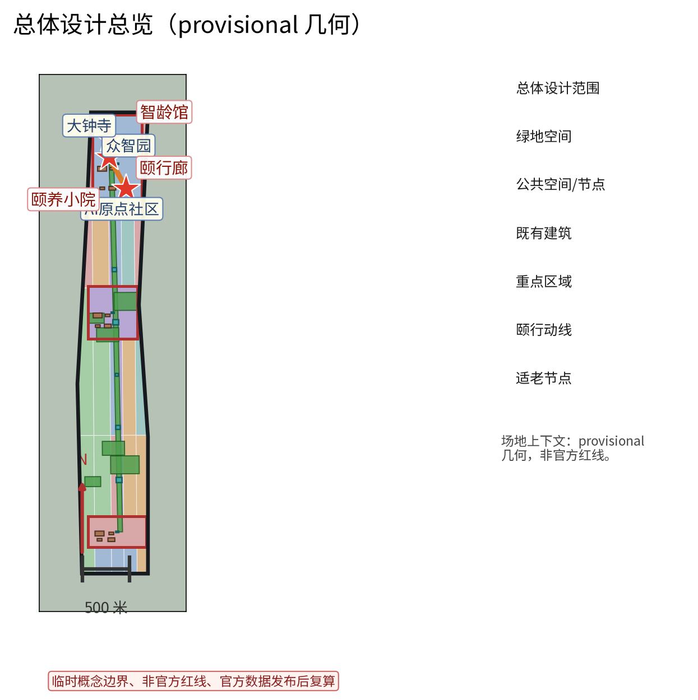
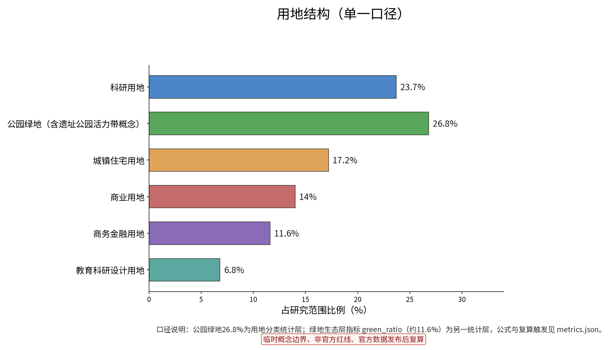
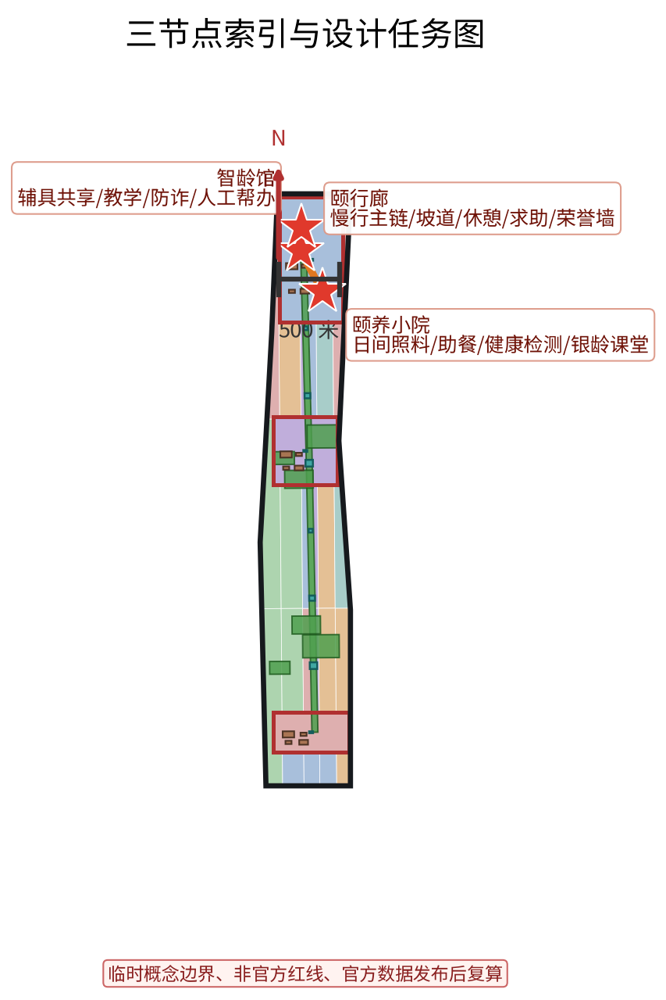
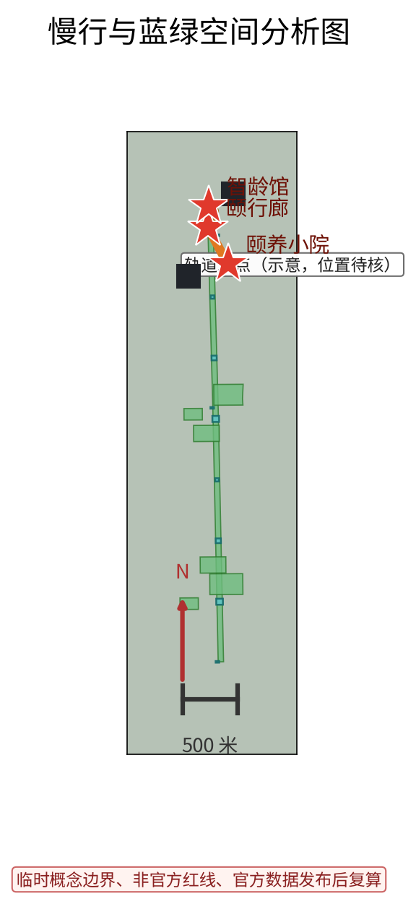
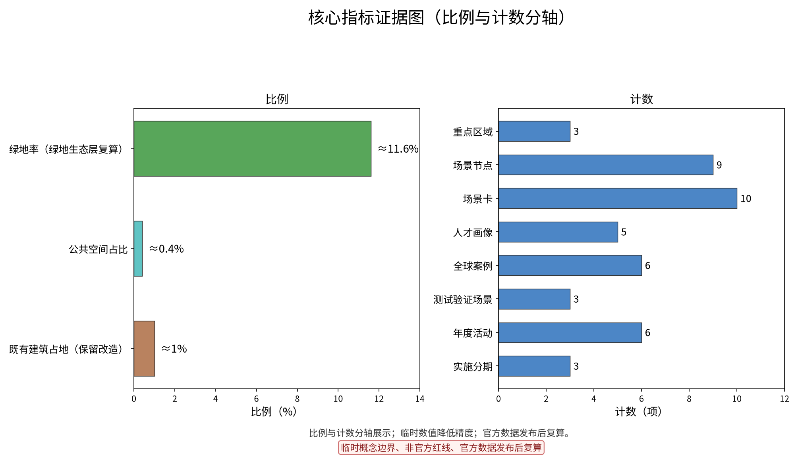

「颐养智环（AGE·JZ）」是面向沿京张AI创新带提出的适老化改造与社区养老助老专项概念方案，立足海淀，对应任务书全龄友好生活、公共服务设施与城市更新三个维度，作为AI融合创新带的民生应用试验场。方案以适老化慢行廊道为轴连接三个原创节点——颐行廊（众智园侧，适老化慢行与无障碍连廊）、颐养小院（AI原点社区侧，社区养老助老小院）、智龄馆（大钟寺侧，智慧助老服务馆）——构成「一廊一院一馆」服务网络，并把「出行—照护—数字」三段能力组织成可感知的适老服务链。本概念对应三大定位中的百年京张文化带、都市AI生活体验带与AI融合创新带，重点承接五大功能中的「智能化AI活力城市」与「AI+场景赋能新范式」。全篇为provisional概念建议，不构成规划审定、工程可行性或任何实施承诺。

## 设计依据与资料清单
设计依据包括公开征集任务书（agent.1–6）、官方七维评审量规与投稿组织模板，以及主管部门公开政策口径与专业性文件；资料清单所列公开史料、规划报道、通则规范均为概念工作依据清单，并非本包已获取的数据；本包实际引用数据全部登记于 sources.json，未获取项已在假设与缺失数据说明中如实标注。文内证据锚点采用短标识（省略日期后缀），完整标识与本条目来源、发布与访问日期见 sources.json，例如 [source:DATA-SRC-AGENT-TASKBOOK] 对应当日获取的任务书摘录；引用均以公开或清权来源为准，未虚构任何页面或官方数据。

> **证据锚点**：[source:DATA-SRC-OFFICIAL-ANNOUNCEMENT]、[source:DATA-SRC-AGENT-TASKBOOK]（组织方公告与任务书为文本口径依据）。

## 三层范围工作框架
按任务书官方文本口径建立三层范围：统筹研究范围约43.6平方公里（带域产业与未来城市研究）→总体设计范围约11.4平方公里（城市更新与控规深度城市设计）→重点区域约368.4公顷（三处重点区详细设计）；本概念方案为总体设计范围之内、围绕三个原创适老节点的专项深化，属参与者临时模型，不替代任何一层官方几何。三层逐级传导、逐级收敛：统筹研究以「颐养智环」服务网络结构、人口结构与案例对标为证据；总体设计以本包 geometry 层的用地、慢行、蓝绿与设施布局为证据；重点区域以三节点设计深度矩阵与指标复核为证据。site_area_sqm、green_ratio、public_space_ratio 三项正式核心指标均由本包几何复算而非引述；老年人口分布、助餐与照料需求、既有无障碍设施底账等官方数据未发布前一律标注假设与用途边界，官方数据到位后整体复算，本层不预设立场结论。

> **证据锚点**：[source:DATA-SRC-AGENT-TASKBOOK]（三层范围划分依据任务书官方文本口径）、[source:DATA-SRC-PROVISIONAL-BOUNDARIES]。

## 统筹研究范围产业与未来城市研究
产业与城市研究识别适老化改造与银发经济在创新带的结合点：智慧养老装备、康复辅具、健康数据服务与数字助老产品可延展为产业链的民生侧，探索「数智与人文并重」判断下青年创新与长者安居的街区共存模式，并衔接三区两翼协同回路——众智园AI自主创新加速区、北京AI原点社区、大钟寺AI产业聚集区为「三区」，中关村科技服务翼与小月河场景赋能翼为「两翼」，两翼分别承担科技服务输出与日常场景试验，与北纬社区、未来科学城、怀柔科学城、北京经开区及京津冀先进制造业集群建立概念性协同（区域协同在官方数据与规划发布后进一步核对）。未来城市研究仅作方向性预判，不构成对用地、容量与投资的承诺。

> **证据锚点**：[source:DATA-SRC-PROVISIONAL-BOUNDARIES]（边界为 provisional，研究范围仅作概念示意）、[source:DATA-SRC-OFFICIAL-ANNOUNCEMENT]。

| 全球化适老案例/方向 | 地区 | 类型 | 借鉴要点（仅按公开方向概述） | 来源（机构条目） | 状态 |
|---|---|---|---|---|---|
| 北京老旧小区适老化改造 | 北京 | 政策与微改造 | 政府主导微改造、加装扶手与无障碍设施 | [source:DATA-SRC-CASE-BEIJING] | 待核验 |
| 上海“一键通”综合为老服务 | 上海 | 社区呼叫救助 | 电话求助、人工兜底与社区响应 | [source:DATA-SRC-CASE-SHANGHAI] | 待核验 |
| 日本社区综合照护体系 | 日本 | 居家社区照护 | 多主体协作的在地照护服务网络 | [source:DATA-SRC-CASE-JAPAN] | 待核验 |
| 新加坡康养社区 | 新加坡 | 适老住区 | 公共组屋无障碍与社区康养设施 | [source:DATA-SRC-CASE-SINGAPORE] | 待核验 |
| 住建部家庭养老床位与居家适老化改造方向 | 全国 | 政策方向 | 家庭照护床位与居家改造清单 | [source:DATA-SRC-CASE-MOHURD-HOME] | 待核验 |
| 世界卫生组织老年友好城市框架 | 国际 | 政策框架 | 全龄友好八域框架与评估工具 | [source:DATA-SRC-CASE-WHO] | 待核验 |

案例为方向性概述（非正式案例证据），逐项来源、发布时间、适用范围、许可与可比性登记于 sources.json，尚未逐一清权，不作结论性引用。

## 总体设计范围城市更新与控规深度城市设计
总体设计强调「以绿带为骨架的适老公共空间环境」：依托京张铁路遗址公园绿带组织颐行动线、慢行系统与适老设施，设施可逆生长、街道可分时承载展示与科普需求；坚持留改提并举、微更新为主，不主张大拆大建。**品牌与视觉识别（agent.1）**：主识别「颐养智环 AGE·JZ」，以铁轨意象抽象为环状回廊图形，色彩系统采用「铁路砖红＋暮色暖橙＋数字青蓝」三色，字体以无衬线中文黑体为主、英文以几何无衬线为辅，形成「回字纹导视符号」与「环点图标系统」，应用于站点导视、扶手标识、地面铺装与节点牌；本名称为内部工作代号，在先权利检索完成前不用于外部注册与正式使用。控规深度城市设计仅给出概念性功能分区、街道断面与体量关系建议；容积率、建筑高度等依赖官方控制条件的内容保持 unknown，由专业团队依正式数据复核。

> **证据锚点**：[source:DATA-SRC-MOHURD-CONTROL-DETAILED-PLANNING]、[source:DATA-SRC-PROVISIONAL-BOUNDARIES]。

## 重点区域详细设计
三节点的设施选址均为概念点位，须经现场踏勘、资料核验与主管部门评估及公众意见后重新落位。「颐行廊」：连续坡道、无障碍连廊与缓坡化路口构成慢行主链，沿线布置休憩座椅、夜间照明、一键求助与荣誉展示墙，保障长者与弱势人群全天候通行。「颐养小院」：存量建筑微改造为日间照料、助餐、健康检测、银龄课堂复合小院，分级照护、助餐兼顾高龄独居老人，并设「银龄志愿服务星」荣誉展示体系。「智龄馆」：数字助老与智能适老体验馆，提供辅具共享、智能终端教学、防诈宣传与人工服务兜底，坚持「AI辅助、人始终在位」。三个节点均配置**可逆公共空间组件库**（模块化座椅、可移动遮阳棚、临时无障碍坡道、可更换标识组件），以低干预、可拆卸、可置换方式落地，避免一次性固化建设。

> **证据锚点**：[data:PACKAGE-GEOMETRY]（三节点示意多边形来自本包 geometry/key_areas.geojson）。

## AI 创新生态、人才画像与 AI+ 场景
本节构建AI创新生态图谱，将AI能力与交通、产业、空间、公共服务、文化、治理六个领域结合，形成可体验、可展示、可推广的场景体系与「产业—空间」映射：养老服务数字化带动智慧养老装备与康复辅具产业（产业）、适老体验馆与银龄课堂承载文化内容（文化）、AI治理护栏落实公共服务与治理（公共服务、治理）、颐行动线与人流组织服务交通（交通）、公共空间组件库承载空间场景（空间）。生态图谱沿「算力—数据—场景—服务」四级组织：算力依托沿线既有功能、数据坚持匿名聚合、场景以10张场景卡固化、服务由街道、社区、企业、高校、志愿者与专业团队共同供给。

| 场景卡编号 | 场景名称 | 空间载体 | AI能力 | 数据与隐私边界 | 运营主体 | 验证等级 |
|---|---|---|---|---|---|---|
| SC-01 | 助老一键求助AI | 颐行廊求助桩与照明杆 | 语音呼叫、应急调度与交通接驳协同 | 仅存呼救位置与服务记录，匿名聚合 | 政府购买服务＋运营企业 | 试点先行 |
| SC-02 | 跌倒预警AI | 颐养小院检测角与公共区 | 姿态分析异常提示 | 仅处理范围缩小的匿名事件，人工复核 | 社区＋专业团队 | 试点先行 |
| SC-03 | 用药提醒AI | 颐养小院与家庭端 | 取药提醒与漏服提示 | 仅当日取药记录，去标识化 | 社区＋志愿者 | 试点先行 |
| SC-04 | 助餐订餐AI | 助餐点与线上预约 | 订餐、分餐与配送调度 | 预约记录最小化，允许退出 | 商户＋社区 | 扩展 |
| SC-05 | 数字帮办AI | 智龄馆帮办台 | 智能手机教学与业务导办 | 业务办理过程不留存影像 | 高校＋志愿者＋人工兜底 | 扩展 |
| SC-06 | 家属联动AI | 智龄馆与家属端 | 服务预约、探视与提醒联动 | 家属联系方式最小化，允许退出 | 家庭＋社区 | 试点先行 |
| SC-07 | 适老巡检AI | 三节点公共空间与廊道 | 无障碍设施破损、照明故障巡检 | 仅处理设施影像，禁止过度监控 | 运营团队＋志愿者 | 试点先行 |
| SC-08 | 辅具共享匹配AI | 智龄馆辅具共享区 | 供需匹配、预约轮换、消毒调度 | 脱敏物品记录，人工复核交接 | 产业联盟＋商户 | 试点先行 |
| SC-09 | 银龄课堂推荐AI | 颐养小院与大钟寺文化空间 | 文化课程推荐与兴趣匹配 | 兴趣标签匿名聚合，用途明示并备案 | 高校＋志愿者 | 扩展 |
| SC-10 | 无障碍接驳调度AI | 颐行廊与轨道站点末梢 | 实时出行接驳预约与调度 | 仅行程位置与预约记录，匿名聚合 | 交通运营方＋社区 | 试点先行 |

对应5类人才画像（共5类人才画像：独居老人、失能半失能老人及其家庭照护者、低龄活力老人、双职工赡养家庭、社区志愿者与护工），画像覆盖长者、老人、青年、儿童、家庭、居民、游客、学生、通勤白领、外卖骑手、从业者、残疾人、弱势、亲子、银龄等群体，坚持全龄友好、无障碍、适老、儿童友好与包容原则，逐类列出服务旅程中的主要障碍并给出非智能兜底渠道（社区人工窗口、电话热线、子女代办、志愿者结对）。AI技术协议与数据治理以四项协议约束：模型评测（以真实事件样本与基准测试评估识别模型）、数据质量（以“采集最小化＋字段完备率＋生命周期”校验数据）、误差分群（按人群、场景、时段分群分析误报率与漏报率）、运行监测（误报率、响应时间、故障率按周运行监测）。场景卡与摘要、metrics.json 中的场景名称与数量一致（10张，含5类核心AI+场景）。

| AI质量保障清单 | 内容与机制词 | 指标与边界 |
|---|---|---|
| 模型评测 | 跌倒、巡检事件样本回测与基准测试 | 以匿名事件样本评估；人工复核关键决策 |
| 数据质量 | 采集最小化、字段完备率、生命周期与保存期限 | 数据按保存期限到期删除或脱敏 |
| 误差分群 | 按人群、场景、时段分群统计误报率与漏报率 | 分群结果仅用于改善模型，不用于个体画像 |
| 运行监测 | 误报率、响应时间、故障率按周监测与公示 | 周度运行监测、年度公示与复算触发 |

产业测试验证场景（试点街区先行，注明试验性并设公众意见通道）：三类场景按下列协议先行试点，验证通过后再扩展。

| 产业测试验证场景 | 协议要点 | 验证指标（试点KPI） | 试点与扩展 |
|---|---|---|---|
| 呼叫—应急联动测试 | 一键求助、调度接驳与人工复核联动协议 | 求助响应时间、人工接通率 | 颐行廊试点先行 |
| 适老巡检误报率测试 | 设施影像巡检与误报率评估协议 | 误报率、故障发现时效 | 三节点试点先行 |
| 辅具共享供需匹配测试 | 预约轮换、消毒调度与人库复核协议 | 辅具周转率、预约成功率 | 智龄馆试点先行 |

> **证据锚点**：[source:DATA-SRC-GENERATIVE-AI-INTERIM-MEASURES]（AI 治理表述参照）、[metric:industry_test_scenario_count]、[metric:scenario_node_count]。

## 用地、建筑规模与拆改留方案
拆改留坚持留改拆并举：以留为主保留遗址公园肌理与历史遗存，存量建筑功能置换并预留轻量可逆适老功能，拆除仅限经个案论证的局部零星建筑；不新增大体量建筑。本层采用单一用地口径：以国标用地分类为框架、以本包 land_use.geojson 几何一次复算，类别与占比（科研用地23.7%、公园绿地约26.8%、城镇住宅17.2%、商业14.0%、商务金融11.6%、教育科研设计6.8%，合计约100%，四舍五入）在 proposal、图件、HTML 与 PDF 中一致使用；口径说明：该占比为“用地分类统计层”，与绿地生态层另计的 green_ratio（约11.6%，按 green_space.geojson 几何复算）属不同统计层，二者公式与置信等级见 metrics.json，官方几何发布后整体复算。容积率、建筑高度、拆改留比例不作结论性表述。

| 用地类别（单一口径） | 占比 | 累计与说明 |
|---|---|---|
| 科研用地 | 23.7% | 沿线高校科研院所协同 |
| 公园绿地（含遗址公园活力带概念） | 26.8% | 与绿地生态层 green_ratio 属不同统计层（约11.6%另计） |
| 城镇住宅用地 | 17.2% | 老旧小区适老化改造重点 |
| 商业用地 | 14.0% | 社区商业与助餐复合 |
| 商务金融用地 | 11.6% | 产业社区配套 |
| 教育科研设计用地 | 6.8% | 教育科研与设计功能 |

> **证据锚点**：[source:DATA-SRC-MNR-LAND-USE-CLASSIFICATION]（用地分类名称参照现行国标口径）、[metric:green_ratio]。

## 交通、轨道、市政与公共服务设施
以交通慢行优先为核心组织交通概念：颐行动线贯通三个节点并向轨道站点与公交末梢开放无障碍接驳，设施与车辆管理采用分时与预约机制、重点时段实行轮换与分流，休憩节点按概念间距布置；轨道线位、市政管线等工程内容不作判断。市政以集约共享为概念特色：绿电直供、余热回收、冷源共享均为概念接口示意，不给出电力负荷、管网容量或工程量结论，优先利用现状设施条件，并预留「未来数据与算力统筹协调机制（概念）」接口。公共服务设施按「片区—节点—楼门」三级配置，助餐点、日间照料、健康检测、辅具回收与既有设施复合利用，避免重复建设，并统一接入居民意见通道、年度公示与年度社区活动。

> **证据锚点**：[source:DATA-SRC-MOHURD-URBAN-DESIGN-MEASURES]（市政与慢行设计表述的方法参照）、[metric:road_network_length_m]。

## 蓝绿空间、公共空间与城市风貌
构建「绿带为轴、节点公园为珠」的蓝绿公共空间体系：以遗址公园绿带为骨架串联沿线小微绿地与开敞空间，设施以低干预、宜轻宜透宜可逆方式与公园融合，不遮挡历史遗迹与绿带视线；「颐行廊」「颐养小院」「智龄馆」均设置面向公众的科普、体验与**荣誉展示**界面，人工服务兜底。风貌延续京张铁路工业记忆语汇并与适老新设施有序对话，整体导控克制统一；颐行廊两侧遮荫植被与休憩座椅结合，以低干预方式提升无障碍标识、照明与铺装品质，塑造「人文温度＋科技质感」，避免网红化表达。慢行与蓝绿空间组织见图纸，与现场踏勘校核后落位。

> **证据锚点**：[source:DATA-SRC-MOHURD-URBAN-DESIGN-MEASURES]（蓝绿空间组织的方法参照）。

## 更新项目清单、实施政策与分期计划
项目清单按「适老慢行完善、社区服务织补、智慧场景试点、文化氛围营造」四类组织，参与主体覆盖政府、企业、高校、居民、社区、运营团队、志愿者、商户与专业团队，并采用牵头—协作（RACI）分工：街道牵头总体统筹、社区与专业团队协作实施、居民议事会参与决策与监督、运营主体负责日常运营，避免单一主体包办；决策事项、资金使用与数据统计经固定渠道公示并接受查阅质询。实施采用「分期滚动、试点先行」：近期1—3年启动1处试点街区、完成颐行廊示范段与颐养小院原型；中期3—5年建成三节点网络并开展场景测试；远期5—10年形成沿带可复制推广机制。试点设置**停止/退出条件**：试点KPI未达预期、发生重大服务质量或安全问题、或现场踏勘显示选址不适时启动撤收或调整，撤收依照部件清单与预约记录完成退租与归还。逐年纳入年度复盘活动体系：每周主题日、每月健康日、每季度成果节与年度社区论坛，节日助老周纳入，活动均需备案；配套开发者社区共创、场景开放申请与评估、专业服务合作签约、国际传播（面向海外高校与研究机构的中英双语传播文案）、人才/企业/开发者转化与年度复盘退出机制，全部为概念建议。

| 年度活动/活动品牌 | 频次 | 运营机制词 | 运营主体 |
|---|---|---|---|
| 银龄课堂季 | 每季度 | 预约、轮换 | 高校＋志愿者 |
| 居家安全周 | 每年 | 公示、备案 | 社区＋专业团队 |
| 代际共融日 | 每月 | 积分、结对 | 志愿者＋居民议事 |
| 智慧助老节 | 每年 | 公约、志愿 | 产业联盟＋运营企业 |
| 开发者共创营 | 每季度 | 开发者社区、联名 | 企业＋高校 |
| 颐行环跑日 | 每季度 | 预约、公示 | 运营团队＋志愿者 |

> **证据锚点**：[depth:phasing_implementation]、[depth:renewal_project_list]、[source:DATA-SRC-AGENT-TASKBOOK]（分期与实施条目对应任务书要求）。

## 指标体系、面积复算与合规矩阵
核心指标建议：适老慢行廊道连续长度、无障碍设施完好率、一键求助平均响应时间、助餐日均服务人次、辅具共享周转率、公众满意度；指标均区分数值与计数、分开展示比例与计数，不再共用同一纵轴（详见 metrics-evidence 图）。三项正式视觉指标（site_area_sqm、green_ratio、public_space_ratio）以 provisional 边界假设计算并标注来源、公式、置信等级、用途限制与复算触发，官方几何发布后复算；容积率、建筑高度等保持 unknown 并注明原因；面向人的图件只显示降低精度的临时数值（如绿地约11.6%），不显示长位数临时值。合规矩阵回应 agent.1–6：总体概念、品牌与视觉识别（agent.1）、创新生态图谱与要素机制（agent.2）、场景卡与人才画像（agent.3）、AI公共空间、荣誉展示与公共空间组件库（agent.4）、京张—中关村—AI文化叙事与双语国际传播（agent.5）、年度活动体系、开发者社区与长期运营（agent.6）。

> **证据锚点**：[metric:green_ratio]、[metric:public_space_ratio]、[data:PACKAGE-GEOMETRY]（三项正式视觉指标均由本包几何复算）。

## 风险、版权与合规说明
本方案为概念研究性设计，不构成行政审批依据，也不构成容积率、建筑高度、容量、负荷、拆改留或工程可行性结论；风险已按边界精度、需求预测、政策不确定性、数据与隐私边界、名称在先权利、技术成熟度、照护资质与公众接受度如实登记于 assumptions.json（应对原则：匿名聚合、来源标注、人工复核、意见通道与法定程序）。隐私护栏：全部AI场景坚持匿名聚合、关键决策人工复核、禁止过度监控（不进行个体识别式追踪）三句底线，涉及个人数据的场景应先经公示与备案、允许退出、并设置投诉与安全事件处置渠道；场景级数据治理（求助位置、健康检测、预约、家属联动、服务记录）的最小化、合法性基础、权限、保存期限、退出、人工复核、投诉与安全事件处置见数据治理清单，不以「匿名聚合」代替个体服务的合规设计。引用公开资料均已标注来源（来源见 sources.json，案例条目为方向性概述且标注待核验），图形、名称与文字为原创或公共领域素材，若与既有标识雷同属巧合；品牌名称为内部工作代号，在先权利检索完成前不对外注册与正式使用；不歪曲事实，未经授权不使用肖像商标字体图片论文图像等版权材料；正式实施前须完成多部门联审与公开评估。数据治理清单：求助位置仅存呼救点与服务记录（时效内保存、到期删除）；健康检测仅保存匿名聚合结果（去标识化、人工复核）；预约记录仅存必要字段（最小化、允许退出）；家属联动仅存联系与探视预约（最小化、允许退出）；服务记录仅存服务类型与次数（脱敏、人工复核、可追溯投诉）。

| 数据治理场景 | 最小化与合法性基础 | 保存与退出 | 人工复核与投诉/安全事件 |
|---|---|---|---|
| 求助位置 | 仅存呼救点与服务记录；合法性基础为紧急救助 | 时效内保存、到期删除；允许退出 | 人工复核接处警；投诉与安全事件专线处置 |
| 健康检测 | 仅存匿名聚合结果；合法性基础为公共卫生服务 | 去标识化并以保存期限管理 | 关键预警人工复核；报告与事件记录留痕 |
| 预约 | 仅存必要字段；合法性基础为合同/同意 | 保存期限到期删除；允许退出 | 预约异常人工核查；投诉渠道公示 |
| 家属联动 | 仅存联系与探视预约；合法性基础为同意 | 最小化保存；随时允许退出 | 联动信息人工复核；安全事件逐级上报 |
| 服务记录 | 仅存服务类型与次数；合法性基础为服务记录 | 脱敏存档、按保存期限管理 | 工单人工复核；投诉与事件可追溯 |

> **证据锚点**：[source:DATA-SRC-OFFICIAL-ANNOUNCEMENT]（征集规则为权属与合规表述的依据）、[source:DATA-SRC-GENERATIVE-AI-INTERIM-MEASURES]。

## 参考资料
参考资料以政府正式发布版本为准，按公开/内部分类存档并标注获取时间：京张铁路历史与遗址公园公开材料（詹天佑与京张铁路公开史料口径）、北京城市总体规划及分区规划公开口径、城市更新专项规划与实施意见及配套文件、任务书 agent.2 要素机制与公开协作规范、适老化国内外公开方向（北京老旧小区适老化改造、上海“一键通”、日本社区综合照护、新加坡康养社区、住建部家庭养老床位与居家适老化改造等方向性信息），以及现场踏勘记录与自绘分析草图（本项目自行采集）；本包 sources.json 仅收录可查证或明确标注待核验的条目，未虚构任何官方数据、页面或链接。

1. 公开征集任务书摘录：agent_taskbook.json；
2. 官方七维评审量规：docs_review-rubric.md；
3. 投稿组织模板：PR_TEMPLATE.md；
4. 公开渠道可获取的京张文化带历史资料及海淀适老化相关政策报道（使用时补充出处与核验日期）。

> **证据锚点**：[source:DATA-SRC-OFFICIAL-ANNOUNCEMENT]（本清单首条即组织方公开资料包）。

### 三节点实施卡（agent.4 深化）

#### 实施卡一：颐行廊（众智园侧）
| 项目 | 内容 |
|---|---|
| 选址条件 | 绿带连续段、坡度与过街条件满足慢行贯通；近轨道站点与公交末梢 |
| 现状核查 | 现状建筑、坡度、过街、照明、无障碍连续通行底账待现场踏勘与主管单位核验 |
| 空间组件 | 连续坡道、缓坡化路口、休憩座椅、夜间照明、一键求助桩、荣誉展示墙（组件库可逆） |
| 人工兜底 | 热线人工接处警、志愿者值守、巡检维修台账 |
| 资质待核 | 无障碍改造设计与施工、照明与市政接入许可待核 |
| 运营责任 | 街道牵头＋运营团队＋志愿者协作 |
| 试点KPI | 无障碍设施完好率、求助响应时间、连廊连续长度 |
| 停止/调整条件 | 选址显示坡度或产权不适、KPI未达预期、现场安全问题启动调整或撤收 |

#### 实施卡二：颐养小院（AI原点社区侧）
| 项目 | 内容 |
|---|---|
| 选址条件 | 社区服务半径内、可达性与产权清晰；近既有养老驿站或存量建筑 |
| 现状核查 | 既有建筑条件、可使用空间、运营资质、服务容量、维护成本类别待踏勘核验 |
| 空间组件 | 日间照料、助餐分装、健康检测角、银龄课堂、家属探视区、银龄志愿服务星荣誉墙 |
| 人工兜底 | 日间照护人工值守、助餐人工分餐、健康检测人工复核 |
| 资质待核 | 养老服务备案、日间照护与助餐卫生许可、健康检测合规待核 |
| 运营责任 | 社区＋专业团队＋居民议事会监督 |
| 试点KPI | 助餐日均服务人次、日间照护人次、公众满意度 |
| 停止/调整条件 | 服务容量不足、运营资质问题、KPI未达预期启动调整或停办 |

#### 实施卡三：智龄馆（大钟寺侧）
| 项目 | 内容 |
|---|---|
| 选址条件 | 近大钟寺文化空间、可达性好、可作为老年友好数字服务窗口 |
| 现状核查 | 存量建筑条件、数字能力基线、现有文化设施利用底账待核验 |
| 空间组件 | 智能终端教学区、辅具共享区、防诈宣传区、人工帮办台、开发者共创角 |
| 人工兜底 | 人工帮办值班、志愿者结对、业务导办人工复核 |
| 资质待核 | 辅具经营与消毒、数字服务运营、个人信息处理合规待核 |
| 运营责任 | 产业联盟＋商户＋高校＋志愿者 |
| 试点KPI | 辅具共享周转率、课堂人次、帮办满意度 |
| 停止/调整条件 | 数字能力需求变化、辅具供应链问题、KPI未达预期启动调整或撤收 |

> **证据锚点**：[depth:three_key_area_detailed_design]、[standard:PROJECT-AGENT-OPEN-CALL-TASKBOOK]、[depth:renewal_project_list]。
