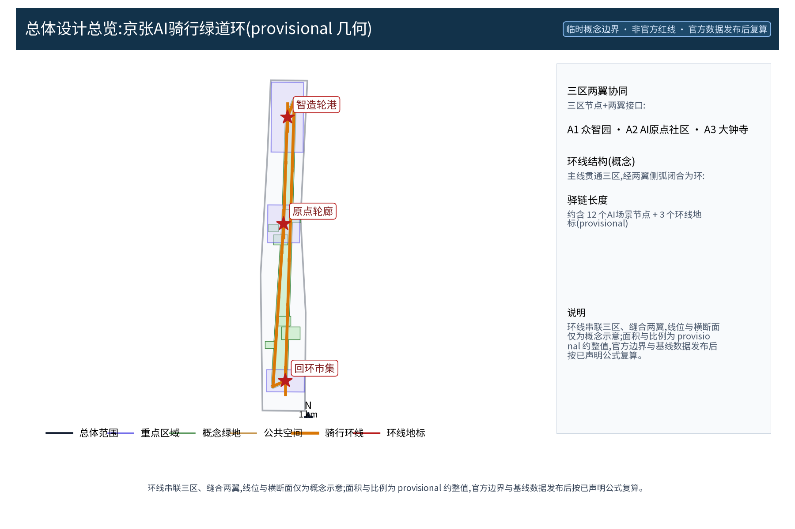
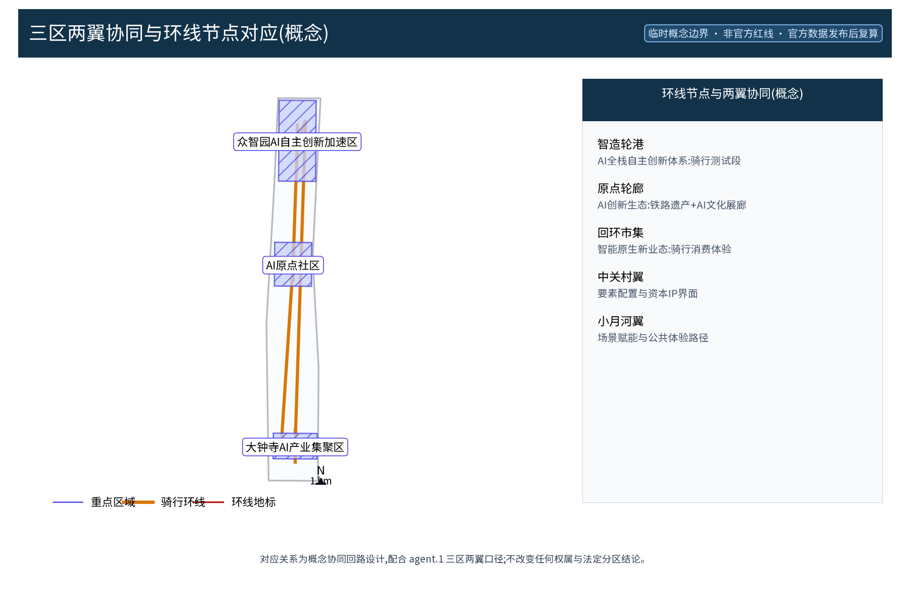
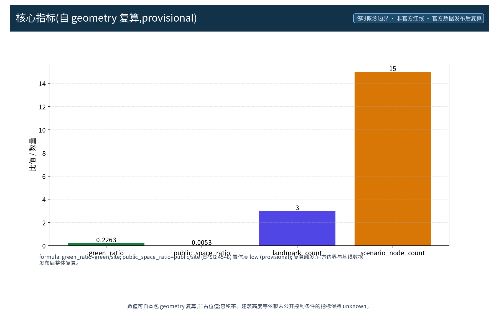

**方案主名称（中文）**：京张AI骑行绿道环（英文对照：RIDE·JZ LOOP / JINGZHANG AI CYCLING GREENWAY LOOP）。「京张AI骑行绿道环」为原创概念：以百年京张走廊为骨架，构建贯通众智园AI自主创新加速区、AI原点社区、大钟寺AI产业集聚区三区，并经中关村科技服务翼、小月河场景赋能翼两侧弧段闭合的环线慢行纽带，作为「百年京张AI创新带」海淀段的骑行与步行体验示范，沿线布置驿站与AI场景节点。本方案全部为概念建议、参考方案，供专业团队深化研究；所有空间落位均为概念口径，面积与指标基于 provisional 边界，待官方数据发布后整体复算，不预设容积率、建筑高度、道路红线、投资等法定结论。

| 概念要素 | 说明 | 级别 |
|---|---|---|
| 方案主名称 | 「京张AI骑行绿道环」RIDE·JZ LOOP | 原创概念命名 |
| 环线结构 | 一链三段两翼（主线贯通三区＋侧弧缝合两翼） | 概念建议 |
| 核心机制 | 「轮迹智章」「数智驿链」「环语」「骑享公约」「绿环积分」 | 原创机制 |
| 命名体系 | 中文主名、英文主名、环线子品牌与驿站系列的命名层级 | 品牌命名体系 |
| 边界声明 | 概念建议／参考方案，provisional，官方数据发布后复算 | 诚实红线 |

## 设计依据与资料清单

本方案的工作依据为公开、可查证的口径，未获取任何非公开资料。依据清单包括：组织方资格预审公告与任务书摘录（2026-05-09 公告、2026-05-18 任务书文本口径）、《城市设计管理办法》、控规法定内容边界说明、《用地用海分类指南》公开子集、provisional 边界几何、AI 生成内容服务管理暂行办法、无障碍环境建设法，以及公开的铁路遗产史料（京张铁路 1909 年通车、京张铁路遗址公园公开开园信息、詹天佑主持修建京张铁路的公开史料、中关村发展史料）。案例依据为国内外绿道与骑行体系公开案例（哥本哈根骑行高速路、阿姆斯特丹骑行网络、巴黎 RER V、伦敦 Cycleways、台湾环岛一号线、成都天府绿道、杭州绿道），用于机制比对与概念启发，不做本地数据的直接移植。清单为概念工作依据清单，实际使用的数据见 sources.json，未获取项已在假设与缺失数据说明中如实标注；本方案所有结论均为概念级，不构成对任何法定规划、投资或工程的承诺。

> **证据锚点**：[source:DATA-SRC-OFFICIAL-ANNOUNCEMENT-2026-05-09]、[source:DATA-SRC-AGENT-TASKBOOK-2026-05-18]（组织方公告与任务书为文本口径依据）。

## 三层范围工作框架

三层成果逐级传导，形成「统筹—总体—重点」的完整工作链条：统筹研究范围识别京张走廊沿线的产业、交通、蓝绿与人文资源，输出环线串联三区两翼的总体判断与区域协同方向；总体设计范围以环线为主干，组织骑行与步行慢行系统、驿站体系、公共空间与城市风貌，并形成「一链三段两翼」（主线＋侧弧＋节点）的空间结构；重点区域详细设计聚焦三个环线节点（智造轮港、原点轮廊、回环市集），深化为可供专业团队进一步研究的空间示意。每一层均保留与任务书对应章节的机器可读证据锚点，便于评审对照；三层成果在深度上逐级加深、在结论上保持一致的概念口径。所有范围划分均为概念口径，不预设法定规划结论，亦不对行政区划、土地权属或建设时序作任何承诺；节点与线位的最终确定须经现场踏勘、资料核验、主管部门评估与公众意见程序后方可生效。

> **证据锚点**：[source:DATA-SRC-AGENT-TASKBOOK-2026-05-18]（三层范围划分依据任务书官方文本口径）。

## 统筹研究范围产业与未来城市研究

统筹研究识别骑行与步行慢行纽带对三区两翼的缝合价值：将京张走廊的铁路遗产、蓝绿空间与 AI 产业要素组织为一条可感知、可体验的公共纽带，支撑 AI 全栈自主创新体系、世界级 AI 创新生态与智能化 AI 活力城市等五大功能的日常化表达。产业方面，环线以「骑行可达性」重新组织沿线高校、科研院所、产业园区、轨道站点与社区之间的通勤与交往空间，使创新要素沿走廊流动；未来城市研究仅作方向性预判，不构成对用地、容量与投资的承诺。区域协同层面，「三区两翼」与北纬社区、未来科学城、怀柔科学城、经开区及京津冀的绿道骑行网络预留接口（概念），使环线成为区域慢行体系中的可扩展单元。全球绿道与骑行生态案例为机制设计提供参照，均标注来源并仅用于概念比对：

| 案例名称 | 城市 | 机制要点 | 来源 |
|---|---|---|---|
| 哥本哈根Supercykelstier | 丹麦哥本哈根 | 跨市域骑行通勤廊道网络与骑行高速路机制 | 哥本哈根官方案例 |
| 阿姆斯特丹骑行网络 | 荷兰阿姆斯特丹 | 全龄骑行网络、绿环与安全街道一体化 | 阿姆斯特丹市官方案例 |
| 巴黎RER V | 法国巴黎 | 依托铁路廊道的快速骑行走廊与轨道换乘衔接 | 法兰西岛交通局案例 |
| 伦敦Cycleways | 英国伦敦 | 骑行网络＋导视与健康街道政策联动 | TfL官方案例 |
| 台湾环岛一号线 | 中国台湾 | 长距离环线驿站与数字骑行服务 | 台湾观光部门案例 |
| 成都天府绿道 | 中国成都 | 都市绿道环与社区日常公共运营 | 成都市政府门户 |
| 杭州绿道系统 | 中国杭州 | 城市绿道成网与滨水公共空间串联 | 杭州规划部门门户 |

> **证据锚点**：[source:DATA-SRC-PROVISIONAL-BOUNDARIES-2026-06-05]（边界为 provisional，研究范围仅作概念示意）。

## 总体设计范围城市更新与控规深度城市设计

总体设计强调「以环为脉、以站为珠」：环线主线贯通三区节点，两翼侧弧缝合中关村科技服务翼与小月河场景赋能翼，形成「一链三段两翼」的空间结构；沿线布置「数智驿链」驿站（维修、补水、充电、寄存，可逆模块化）、「环语」AI 导视与骑行友好断面概念。断面与线位仅为概念示意，不涉及道路红线与工程结论：概念断面建议采用骑行与步行分离、绿化缓冲与安全提示一体化组织，供专业团队深化研究。本设计强调更新而非新建，优先利用存量空间植入轻量、可逆的骑行服务设施，控规指标只做校核建议，不预设数值结论；拆改留遵循「以留为主、局部更新」，城市更新单元以驿站与节点空间为最小实施单元，可逆设计允许随时撤收与恢复。全设计秉持公共性与包容性：全龄、无障碍、儿童友好与适老设施纳入概念配置，保障不同人群安全便捷地使用环线。

> **证据锚点**：[source:DATA-SRC-MOHURD-CONTROL-DETAILED-PLANNING]、[source:DATA-SRC-PROVISIONAL-BOUNDARIES-2026-06-05]。

## 重点区域详细设计

三个环线节点均为概念点位，须经现场踏勘、资料核验、主管部门评估与公众意见后重新落位：「智造轮港」（众智园，AI 全栈自主创新体系：骑行测试段与智造体验）、「原点轮廊」（AI 原点社区，铁路遗产叙事与 AI 文化展廊）、「回环市集」（大钟寺，智能原生消费与骑行生活场景），沿环构成完整服务动线，详细平面与剖面以图册与 geometry 层表达。铁路文化叙事线贯穿重点区域设计：以 1909 年京张铁路通车、詹天佑主持修建的工业遗产为叙事起点，结合京张铁路遗址公园的公共开敞肌理，把「钢轨与路基」转换为「骑行轴线与活动场地」的符号语言；中关村创新文化与 AI 新文化在此叠加，形成「百年轮迹—当代创新」的文化叙事主线，通过导视、地面铺装、艺术装置与 AR 叙事点呈现。文化符号与导视系统统一纳入「环语」体系，设计强调国际传播叙事：让国内外访客通过骑行体验读懂京张走廊的百年变迁与海淀 AI 创新的当代语境。

> **证据锚点**：[data:PACKAGE-GEOMETRY]（三节点示意多边形来自本包 geometry/key_areas.geojson）。

## AI 创新生态、人才画像与 AI+ 场景

沿环线布置 12 张 AI 场景卡（场景—空间—运营映射），全面覆盖 AI 导视、借还调度、安全提示、骑行成就、驿站服务、轨道衔接、文化活动、消费体验、科普讲解、数据看板、应急联动与志愿者协同；配置 5类人才画像（通勤白领、高校学生、亲子银龄家庭、外地游客、产业从业者）。骑行创新生态图谱将高校、科研院所、产业园区、骑行服务商与开发者社区组织为共创网络，并绘入环线骑行创新生态地图供多方共建；AI 技术协议以模型评测、数据质量、误差分群、运行监测、误报率与基准测试为兜底线。场景卡覆盖 AI 与城市规划结合的交通、产业、空间、公共服务、文化、治理六域映射：交通域涵盖 AI 导视与借还调度，产业域连接开发者社区与骑行服务生态，空间域对应驿站与公共节点，公共服务域支持多语信息与科普，文化域承载铁路叙事与骑行活动，治理域落实人工复核与年度公示。全部场景仅处理匿名聚合数据、关键决策人工复核，不进行个体识别式追踪，禁止过度监控；AI 治理采用三句式边界：仅匿名聚合、关键决策人工复核、禁止过度监控。机制为概念性建议，不替代法定管理职责。沿线设骑行荣誉展示墙与「轮迹勋章」荣誉体系，配套开发者社区与 AI 场景开放运营机制，国际传播叙事围绕「百年轮迹」展开。

| 场景卡编号 | 场景卡名称 | 空间落位 | 运营主体 | 数据流 | 治理边界 |
|---|---|---|---|---|---|
| S01 | 环语AI导视 | 三区节点驿站 | 运营联盟＋志愿团 | 匿名聚合 | 人工复核 |
| S02 | 轮迹智章借还调度 | 各驿站借还点 | 运营联盟＋企业 | 匿名聚合 | 人工复核 |
| S03 | AI安全提示 | 环线平交与陡坡段 | 交管部门＋运营方 | 匿名聚合 | 人工复核 |
| S04 | 骑行成就打卡 | 环线里程点 | 运营方＋开发者社区 | 用户自选 | 可撤回 |
| S05 | 数智驿链服务台 | 三级驿站 | 商户＋志愿者 | 匿名聚合 | 服务公开 |
| S06 | 轨道换乘衔接导引 | 沿线轨道站点 | 轨道运营方 | 匿名聚合 | 数据公开 |
| S07 | 铁路文化AR叙事点 | 原点轮廊段 | 文化机构＋运营方 | 展示为主 | 人工复核 |
| S08 | 骑行消费体验屏 | 回环市集段 | 商户 | 匿名聚合 | 消费保护 |
| S09 | AI科普讲解岗 | 科普驿站 | 高校志愿者 | 匿名聚合 | 人工复核 |
| S10 | 客流数据看板 | 运营中心 | 运营方＋专业团队 | 仅匿名聚合 | 年度公示 |
| S11 | 平急两用应急联动 | 全环 | 应急部门＋社区 | 事件触发 | 人工复核兜底 |
| S12 | 骑友议事与志愿服务站 | 社区驿站 | 居民＋志愿者 | 议事记录 | 记录公开 |

**测试验证场景（3 个）**：环语导视误报率基准测试、借还调度压测、骑行流量匿名聚合看板数据质量核验。

| 测试验证场景 | 验证目标 | 验证协议 | 通过标准（概念） |
|---|---|---|---|
| 环语导视误报基准测试 | 误报率与响应时延 | 模型评测＋基准测试 | 误报率可观测、人工复核 |
| 借还调度压力测试 | 高峰借还调度稳定 | 数据质量、误差分群 | 达到服务等级后上线 |
| 骑行流量聚合看板核验 | 匿名聚合数据质量 | 运行监测＋年度公示 | 数据质量达标后公开 |

> **证据锚点**：[source:DATA-SRC-GENERATIVE-AI-INTERIM-MEASURES]（AI 生成内容治理表述的参照依据）。

## 用地、建筑规模与拆改留方案

拆改留坚持留改拆并举：以留为主保留遗址公园肌理与历史遗存，存量建筑功能置换并预留骑行服务设施改造方向，拆除仅限经个案论证的局部疏通慢行零星建筑；驿站与体验设施以轻介入、可逆、低占地为主，不新增大体量建筑。全部面积为概念口径（单一复算口径：环线绿带并入公园绿地），官方数据发布后复算，不给出容积率与建筑高度结论。用地布局以环线绿带为骨架，沿线用地兼容科研、商业、居住与公共服务配套（概念口径），各类用地的比例仅为概念配置，不作法定校核；建筑规模以存量更新为主，新增驿站采用标准化模块，可按季节、客流与活动需要轮换布置与撤收。拆改留清单、用地比例与建筑规模均属于概念建议，供专业团队深化研究，任何涉及土地权属、征收安置与建设指标的判断均须以官方公布数据与法定程序为准。

> **证据锚点**：[source:DATA-SRC-MNR-LAND-USE-CLASSIFICATION-202311]（用地分类名称参照现行国标口径）。

## 交通、轨道、市政与公共服务设施

以慢行优先组织交通概念机制：环线贯通三个节点并与轨道站点、公交站点衔接，活动日人流组织与慢行系统一体化。骑行友好支撑概念包括「环语」标识导视、「轮迹智章」统一借还、驿站服务与 AI 安全提示，均概念级；「轮迹智章」实现跨驿站统一借还与调度，「数智驿链」提供分级驿站保障（分级保障机制），AI 安全提示在平交口、陡坡与窄段提供接近感知与风险预警（概念）。市政以现状条件利用为前提，不给出电力负荷、管网容量或工程量结论；优先利用既有市政接口支撑驿站照明、充电与信息服务，新增需求以最小化原则纳入概念设计，并兼顾弱势群体、老年人与儿童的低干预保障设计。公共服务配置多语信息、骑行科普与研习空间，面向游客提供双语导览，面向居民提供社区活动空间；AI 决策均设人工复核，涉及交通、应急与执法的数据仅以匿名聚合形式使用。

> **证据锚点**：[source:DATA-SRC-MOHURD-URBAN-DESIGN-MEASURES]（市政与慢行设计表述的方法参照）。

## 蓝绿空间、公共空间与城市风貌

构建「环带为轴、节点为珠」的蓝绿公共空间体系：以环线绿带串联沿线小微绿地与开敞空间，驿站与体验设施与公园融合布置、宜轻宜透宜可逆，不遮挡铁路历史遗迹与绿带视线。公共空间组件库包括休息座椅、车架、饮水点、标识柱、遮荫棚、儿童友好骑行场地与全龄无障碍坡道等（概念组件），组件库以模块化、可置换的公共组件为主，可随季节与活动配置调整；骑行荣誉展示墙与「轮迹勋章」体系纳入组件库，承载「百年轮迹」的集体记忆与个人成就展示。风貌延续京张铁路工业记忆语汇（钢轨、枕木、信号灯的符号化转译），并与 AI 新设施有序对话，整体导控克制统一；标志性色彩采用钢轨蓝、轮迹橙与信号红，用于导视与标识系统，形成可识别的环线品牌底色。蓝绿比例与公共空间规模均为概念口径，官方数据发布后复算。

> **证据锚点**：[source:DATA-SRC-MOHURD-URBAN-DESIGN-MEASURES]（蓝绿空间组织的方法参照）。

## 更新项目清单、实施政策与分期计划

三类项目清单（环线段落／驿链机制／服务生态）为概念清单，规模与投资估算均为建议性表述。分期：近期（1-3 年）试点两段环线（原点轮廊段＋智造轮港段）与样板驿站，中期（3-5 年）全线贯通并建立「骑享公约」「轮值驿站」「绿环积分」机制，远期（5-10 年）服务生态与品牌资产沉淀；试点设停止条件与退出机制（驿站撤收与停用条件），任何试点均先以可逆方式运行并接受评估。实施政策强调政府引导、多方共建与长效运营：由政府与专业团队牵头制定标准与导则，企业与商户承担驿站与消费服务，高校与开发者社区提供算法与内容共创，居民、社区与志愿者参与共治与监督，形成可持续的长期运营价值。参与主体包括政府、企业、高校、居民、社区、运营方、志愿者、商户与专业团队，并明确牵头与协作角色（RACI 概念矩阵）。年度骑行活动体系如下：

| 年度活动 | 主题 | 主办（概念） | 机制 |
|---|---|---|---|
| 开春环线骑游季 | 全线开放日＋家庭骑行 | 运营联盟＋社区 | 预约＋志愿 |
| 数字骑行节 | AI 场景体验＋骑行科技展 | 运营方＋企业 | 备案＋公示 |
| 轮迹算法挑战赛 | 导视／调度算法竞赛 | 开发者社区＋高校 | 联盟＋积分 |
| 百年轮迹纪念骑 | 京张铁路通车纪念骑行 | 文化机构＋志愿团 | 轮换＋公益 |
| 环线年报发布 | 数据看板＋年度公示 | 运营方＋专业团队 | 公示＋议事 |

> **证据锚点**：[source:DATA-SRC-AGENT-TASKBOOK-2026-05-18]（分期与实施条目对应任务书要求）。

## 指标体系、面积复算与合规矩阵

概念指标进入 metrics.json：green_ratio、public_space_ratio、环线长度（road_network_length_m）、地标与场景节点数量、persona_count、global_case_count、annual_program_count 等；三项 formal 核心指标（site_area_sqm、green_ratio、public_space_ratio）以本包几何复算为准，面积复算以官方文本口径为底，官方数据到位后整体复算并标注复算版本。容积率、建筑高度等依赖未公开官方控制条件的指标保持 unknown 并说明原因：相关控制条件尚未公开，任何预设数值均不具依据，故以 unknown 表示，留待官方数据发布后复算；环线长度、蓝绿比例与公共空间比例同样为概念级，可测的量化口径以本包几何与矩阵为准。合规矩阵覆盖 23 项任务（公告 1.3—1.5 与 agent.1—6），逐条登记证据、来源与对应章节；合规口径在本方案中仅作自我核验与评审对照，不替代任何法定审查。

> **证据锚点**：[metric:green_ratio]、[metric:public_space_ratio]、[source:PACKAGE-GEOMETRY]。

## 风险、版权与合规说明

本方案为概念研究性设计，不构成行政审批依据，也不构成容积率、建筑高度、道路红线、拆改留或工程可行性结论。风险已按边界精度、骑行安全与交通组织、铁路遗产保护、数据与隐私边界、技术成熟度与政策不确定性六维度如实登记于 assumptions.json（应对原则：匿名聚合、来源标注、人工复核、意见通道与法定程序）。隐私与合规方面，本方案明确：仅匿名聚合、关键决策人工复核、禁止过度监控，不进行个体识别式追踪，不采集个体身份数据，不设大规模个体识别式监控。引用公开资料均已标注来源并注明获取时间，图形、名称与文字为原创或公共领域素材，若与既有标识雷同属巧合；表达不歪曲事实，未经授权不使用肖像、商标、字体、图片、论文图像等版权材料。Logo 与品牌名称使用前须完成商标与在先权利检索，正式实施前须完成多部门联审与公开评估。

> **证据锚点**：[source:DATA-SRC-OFFICIAL-ANNOUNCEMENT-2026-05-09]（征集规则为权属与合规表述的依据）。

## 参考资料

参考资料以政府正式发布版本为准，按公开分类存档并标注获取时间：京张铁路历史与遗址公园公开材料（含詹天佑与京张铁路公开史料口径）、北京城市总体规划及分区规划公开口径、北京城市更新专项规划公开信息、《城市设计管理办法》《用地用海分类指南》、AI 生成内容服务管理暂行办法、无障碍环境建设法、国内外绿道与骑行体系公开案例（哥本哈根、阿姆斯特丹、巴黎 RER V、伦敦、台湾环岛一号线、成都天府绿道、杭州绿道）与铁路遗产史料（中国铁道博物馆、海淀区政府门户、中关村管委会）；本包 sources.json 仅收录可查证条目，未虚构任何官方数据或链接。所有引用的公开资料仅用于概念叙述与机制比对，不构成对任何数据的官方背书；涉及历史年份（1909 年京张铁路通车、京张铁路遗址公园开园信息等）均按公开口径表述，具体规划数值以官方发布版本为准。

> **证据锚点**：[source:DATA-SRC-OFFICIAL-ANNOUNCEMENT-2026-05-09]（本清单首条即组织方公开资料包）。

## 品牌识别与视觉识别系统（VI 概念规范）

「京张AI骑行绿道环」品牌方向（命名体系）：中文主名称「京张AI骑行绿道环」、英文主名称 RIDE·JZ LOOP，环线子品牌（各段弧线昵称）与驿站系列「数智驿链」构成完整命名层级。主标识 RIDE·JZ 采用车轮与铁轨枕木双关图形，环形象征闭环慢行，强调「百年京张×未来骑行」的双重意象；中英双排锁版保证国内与国际传播的一致性。主色钢轨蓝、轮迹橙、信号红构成色彩识别系统：钢轨蓝对应铁路工业记忆，轮迹橙对应骑行活力，信号红用于安全提示与关键节点。视觉识别系统应用于驿站立面、地面导视、骑行卡、活动主视觉与数字看板，并建立 Logo 使用规范（安全区、最小尺寸、深色浅色底变体）；与一带整体 Logo 系统并存不混淆，使用前须完成商标与在先权利检索。Logo 方向图见图件 logo-ridejz.png（概念示意，非最终定稿）。
