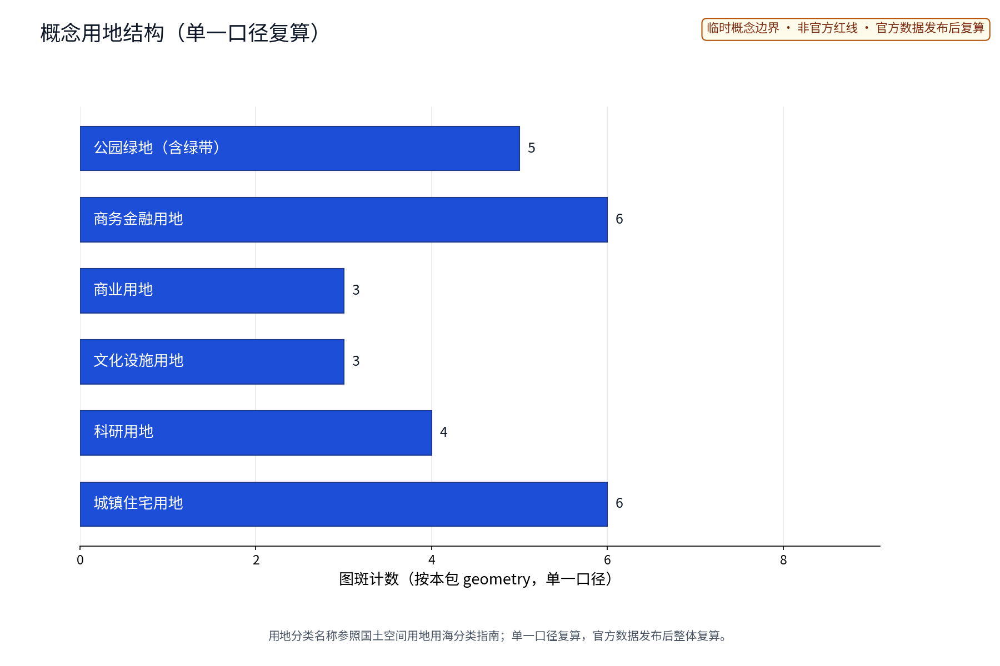
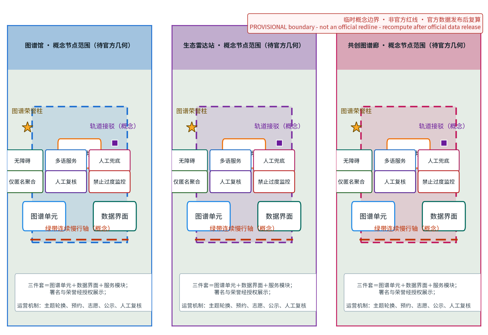
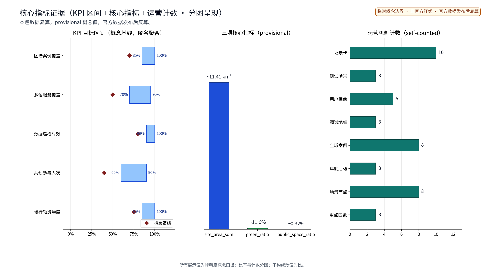

## 方案名称与总体构想（概念）
「图谱京张 · ATLAS（ATLAS·JZ · 全球AI创新生态案例图谱）」指以京张铁路遗址公园绿带为骨架、把全球创新城市与园区的生态经验图谱化为可查阅、可比较、可共创公共知识空间的概念；「图谱」取知识地图与共创共享双重意涵，方案所有空间表达均为概念建议、参考方案，供专业团队深化研究。
**「图谱京张 · ATLAS」**，副题「全球AI创新生态案例图谱公共展示平台」。"ATLAS"取"图谱"意象，与"京张"并置构成原创组合命名，不含任何真实机构名称与商标；立意是把全球创新城市与园区的生态经验沿百年京张绿带"图谱化"，转译为可查阅、可比较、可共创的公共知识空间。

## 五类用户画像

1. **案例提供方**：全球创新城市、园区与机构决策者，以标准化条目发布生态运营经验。
2. **研究者与师生**：沿线高校及科研机构人员，用于案例比较、生态指标研习与课程教学。
3. **创业者与投资人**：通过图谱发现可借鉴的生态组织方式、合作机会与人才线索。
4. **公众与家庭**：途经绿带的市民与中小学生，在游览中理解AI创新生态。
5. **海外访客与多语用户**：国际交流考察群体，依赖多语讲解与无障碍信息获取。

## 国际案例（4个）

- 新加坡纬壹科技城（one-north）：轨道枢纽与连续绿廊组织研发混合生态，公共空间承载展示交流。
- 巴塞罗那22@创新区：旧工业区更新中保留肌理、植入知识型业态，重视公共展示与社区参与。
- 首尔上岩数字媒体城（DMC）：数字内容产业集聚，以公共设施与事件活动塑造创新氛围。
- 伦敦东区科技城：依托街坊尺度与便捷交通形成自发集聚，强调开放生态而非单一园区。

## 国内对标（4个）

- 深圳湾科技生态园：产业服务与公共平台一体化运营，园区即展示窗口。
- 杭州未来科技城（城西科创大走廊）：走廊式空间组织与创新生态培育的先行实践。
- 上海张江人工智能岛：以专项产业标签塑造可识别的创新地标。
- 广州琶洲人工智能与数字经济试验区：会展与产业联动，公共展示功能突出。

---

## 设计依据与资料清单
资料清单所列公开史料、规划报道与通则规范等均为概念工作依据清单，并非本包已获取的数据；本包实际使用的全部数据见 sources.json，未获取项已在风险与缺失数据说明中如实标注。

依据以公开资料口径为主：京张铁路遗址公园与百年京张AI创新带公开介绍、沿线高校与科创园区的公开区位信息、北京市及海淀区公开规划报道。概念阶段不引用未公开数据、不预设量化指标；资料清单按"场地与历史、规划与政策、产业与生态、同类案例"四类归档，供后续深化校核。

> **证据锚点**：[source:DATA-SRC-OFFICIAL-ANNOUNCEMENT-20260509]、[source:DATA-SRC-AGENT-TASKBOOK-20260518]（组织方公告与任务书为文本口径依据）。

## 三层范围工作框架
三层成果逐级传导：统筹研究输出的图谱带与沿线片区协同判断约束总体设计，总体设计校核的存量植入、展示节点落位与慢行贯通再落实到节点详设；每层均保留与任务书对应章节的机器可读证据锚点，便于评审对照。

沿用"统筹研究—总体设计—重点设计"三层范围框架：统筹研究范围关注图谱带与沿线科创片区、高校及国际化住区的协同；总体设计范围以绿带为骨架组织图谱展示总体概念；重点设计范围选取三个原创节点深化。三层逐级传导，图纸与成果口径分层对应，避免概念与实施脱节。

> **证据锚点**：[source:DATA-SRC-AGENT-TASKBOOK-20260518]（三层范围划分依据任务书官方文本口径）。

## 统筹研究范围产业与未来城市研究
产业与城市研究识别图谱带的「界面」效应：以图谱展示与互动活动将沿线科创片区、高校与国际化住区的知识需求有序组织为双向可达的公共界面，形成「图谱带—科创片区—高校与住区」三级联动结构，推动从「看展陈」走向「共创知识图谱」；未来城市研究仅作方向性预判，不构成对用地与投资的承诺。

统筹范围内研究"图谱带—科创片区—高校—国际化住区"的协同关系：图谱带作为信息与交往媒介，串联软件园、科创园区与高校资源；国际化住区为多元人才提供生活支撑。研究以"产—学—居—游"联动为线索，把图谱展示理解为沿线创新生态的公共界面而非孤立展陈，为总体设计提供结构前提。

> **证据锚点**：[source:DATA-SRC-PROVISIONAL-BOUNDARIES-20260605]（边界为 provisional，研究范围仅作概念示意）。

## 总体设计范围城市更新与控规深度城市设计
总体设计强调「以绿带为骨架的图谱展示序列」：依托京张铁路遗址公园绿带连续布置图谱展示入口、节点与驿站，使同一片场地平时可研习、节事可办发布与共创活动；强调更新而非新建，优先利用存量空间植入图谱功能；对控规指标只做校核建议，不预设数值结论。

总体设计以绿带与遗址公园为骨架，提出"图谱带"概念：沿绿带连续布置图谱展示入口、节点与驿站，形成可步行、可停留、可互动的展示序列。设计强调更新而非新建，优先利用存量空间植入图谱功能，风貌克制、尺度宜人。成果深度对应控规阶段城市设计，但本方案仅作概念示意，不给具体指标。

> **证据锚点**：[source:DATA-SRC-MOHURD-CONTROL-DETAILED-PLANNING]、[source:DATA-SRC-PROVISIONAL-BOUNDARIES-20260605]。

## 重点区域详细设计
三节点的设施选址均为概念点位，须经规划、文保与主管部门评估及专业审查后重新落位；节点间的绿带动线与慢行通道构成完整图谱动线，详细平面与剖面以图册与 geometry 层表达。
节点一「图谱馆」：案例数据可视化馆，全球创新生态案例以图表、实物与数字界面并置呈现，支持按城市、园区、主题多维查阅与比较。节点二「生态雷达站」：全球创新生态动态监测装置，以公共艺术化形式呈现匿名聚合的生态活力趋势。节点三「共创图谱廊」：公众可编辑的图谱共创墙，实体与线上联动，征集案例补充与经验批注。

本方案按任务书三大定位（百年京张文化带、都市AI生活体验带、AI融合创新带）与五大功能（AI全栈自主创新体系、世界级AI创新生态、AI+场景赋能新范式、智能化AI活力城市、AI治理全球话语权）中的生态图谱与知识公共品方向展开，作为「世界级AI创新生态」的案例沉淀与展示载体（概念映射）。

**场景卡索引（概念）**：AI+场景以场景卡落地，形成可评审、可迭代的运营索引：

| 场景卡 | 落点 | 面向人群 | 运营机制（概念） | 数据与合规边界 |
|---|---|---|---|---|
| 「图谱窗」案例数据清洗检索 | 「图谱馆」 | 研究者、学生 | 预约检索、年度更新 | 匿名聚合，人工复核 |
| 「雷达屏」生态活力监测 | 「生态雷达站」 | 游客、从业者 | 实时公示、月度评估 | 聚合统计，禁止过度监控 |
| 「共创墙」公众图谱共建 | 「共创图谱廊」 | 居民、青年 | 积分贡献、议事审核 | 端侧处理，不留存个体信息 |
| 「伴行」多语图谱讲解 | 三节点沿线 | 老年人与残障人士 | 志愿者值守、人工兜底 | 授权明示、可一键关闭 |
| 「巡检哨」数据更新巡检 | 数字平台 | 运营方、白领 | 派单复核、轮换校验 | 聚合统计，人工复核 |

> **证据锚点**：[data:PACKAGE-GEOMETRY]（三节点示意多边形来自本包 geometry/key_areas.geojson）。

## AI 创新生态、人才画像与 AI+ 场景
案例数据AI清洗与语义检索、图谱可视化自动生成、多语讲解与翻译为主干场景，每处均配置人工复核兜底；数据更新巡检AI与内容审核复核为支撑场景；仅处理匿名聚合数据、关键决策人工复核双保险，不设过度监控。
提出五个AI+场景：一、案例数据AI清洗与语义检索，保证条目可查可比；二、图谱可视化自动生成，把结构化案例转译为图表；三、多语案例讲解与翻译，服务国际交流；四、数据更新巡检AI，发现陈旧条目并提示复核；五、案例引用与内容审核人工复核，保障来源与表述质量。全部数据匿名聚合、人工复核兜底，禁止过度监控个体行为。

AI场景域覆盖产业、公共服务、空间、治理、文化、交通六域:AI产业(案例清洗与生态图谱)、AI公共服务(多语讲解与翻译)、AI空间(图谱展示节点落位)、AI治理(内容审核与更新巡检)、AI文化(图谱叙事与全球案例研习)、AI交通(图谱动线导览),各域均以人工复核兜底。

> **证据锚点**：[source:DATA-SRC-GENERATIVE-AI-INTERIM-MEASURES]（AI 生成内容治理表述的参照依据）。

## 用地、建筑规模与拆改留方案
拆改留坚持留改拆并举：以留为主保留遗址公园肌理与沿线建成环境，存量建筑功能置换为图谱展示、研习与配套服务，拆除仅限经个案论证的局部疏通慢行零星建筑；全部面积为概念口径，官方数据发布后复算。

按"留改拆并举"概念口径组织：以留为主，保留遗址公园肌理与沿线建成环境；以改为主，存量建筑功能置换为图谱展示与配套服务；拆仅用于局部疏通慢行与公共空间，且须一事一议评估。本方案不预设用地数值、建筑规模或拆除结论，最终以法定规划与专业评估为准，避免以概念代替决策。

> **证据锚点**：[source:DATA-SRC-MNR-LAND-USE-CLASSIFICATION-202311]（用地分类名称参照现行国标口径）。

## 交通、轨道、市政与公共服务设施
以交通慢行优先为核心组织交通概念机制：沿绿带构建连续慢行轴贯通图谱馆、生态雷达站与共创图谱廊，衔接沿线高校、园区与轨道站点（接驳以步行与骑行为主，预留接驳专线与共享单车调度区），降低小汽车依赖；市政以集约共享为原则，优先利用现状设施条件；公共服务突出图谱馆的书房、报告与研习功能，配置无障碍与多语服务，AI决策均设人工复核。

交通以慢行优先为原则：沿绿带构建连续慢行轴，贯通三个节点及沿线高校、园区与轨道站点，接驳以步行与骑行为主。轨道与公交按现状资源纳入可达性分析，不作新增线路假设。市政以集约共享为原则，优先利用现状设施条件；公共服务突出图谱馆的书房、报告与研习功能，向公众开放。

> **证据锚点**：[source:DATA-SRC-MOHURD-URBAN-DESIGN-MEASURES]（市政与慢行设计表述的方法参照）。

## 蓝绿空间、公共空间与城市风貌
构建「绿带为轴、节点公园为珠」的蓝绿公共空间体系：以遗址公园绿带为蓝绿骨架串联沿线小微绿地与开敞空间，形成连续生态与公共空间体系；图谱装置与公园融合布置、宜轻宜透宜可逆，不遮挡历史遗迹与绿带视线；指示与解说系统统一克制；风貌延续铁路遗址历史特征与科创氛围的对话，避免符号堆砌与过度设计。

以遗址公园绿带为蓝绿骨架，串联沿线小微绿地与开敞空间，形成连续的生态与公共空间体系。图谱装置与公园融合布置：宜轻、宜透、宜可逆，不遮挡历史遗迹与绿带视线；指示与解说系统统一克制。城市风貌延续铁路遗址的历史特征与科创氛围的对话，避免符号堆砌与过度设计。

> **证据锚点**：[source:DATA-SRC-MOHURD-URBAN-DESIGN-MEASURES]（蓝绿空间组织的方法参照）。

## 更新项目清单、实施政策与分期计划
四类项目清单（图谱展示节点/慢行贯通/存量植入/数字平台）为概念清单，规模与投资估算均为建议性表述；政策建议（更新单元＋公共平台运营双轨推进、多元主体共建、共创内容审核准入）均须依法依规论证，不构成政府或运营方承诺。

更新项目按"图谱展示节点、慢行贯通、存量植入、数字平台"四类列项。实施政策建议"更新单元＋公共平台运营"双轨推进：政府统筹、企业参与运营、高校与科研机构协同，社区共建共治，志愿者与专业团队参与评估，鼓励多元主体共建。分期：近期1—3年完成「图谱馆」试点与数字图谱平台上线；中期3—5年建成「生态雷达站」「共创图谱廊」并贯通慢行轴；远期5—10年完善全域图谱网络与年度运营机制。年度活动：图谱更新发布日、全球案例研习周、图谱共创工作坊。

> **证据锚点**：[source:DATA-SRC-AGENT-TASKBOOK-20260518]（分期与实施条目对应任务书要求）。

## 指标体系、面积复算与合规矩阵
图谱案例覆盖数、多语覆盖率、更新巡检时效、共创参与人次、慢行贯通度五类概念指标体系进入 metrics.json；面积复算以官方文本口径为底，官方数据到位后整体复算并标注复算版本。

指标体系以概念口径列出：图谱案例覆盖数、多语覆盖率、更新巡检时效、共创参与人次、慢行贯通度等过程性指标。面积复算仅用于方案自身一致性校核，不对建设规模下结论。合规矩阵对照上位规划、文保要求、绿线蓝线及数据合规逐项标注"概念假设／待核验"状态，防止概念表述被误读为决策结论。

> **证据锚点**：[metric:green_ratio]、[metric:public_space_ratio]、[source:PACKAGE-GEOMETRY]。

## 风险、版权与合规说明
本方案为概念研究性设计，不构成行政审批依据，也不构成容积率、建筑高度、拆改留或工程可行性结论；风险已按数据来源与版权、案例表述偏差、装置运维持续性、公众参与质量四维度如实登记于 risk.json（应对原则：匿名聚合、最小必要、人工复核、来源标注与申诉通道）；引用公开资料均已标注来源并注明获取时间，图形、名称与文字为原创或公共领域素材，若与既有标识雷同属巧合；数字平台遵循数据安全与个人信息保护要求；正式实施前须完成多部门联审、文物保护与安全评估。

主要风险：数据来源与版权、案例表述偏差、装置运维持续性、公众参与质量。应对原则：案例引用注明来源并取得授权，机构数据一律匿名聚合；图谱内容不作个体或企业排名定性；数字平台遵循数据安全与个人信息保护要求。本方案全部内容为概念建议，不构成规划结论与工程承诺，行文如存疑义以正式文件为准。

> **证据锚点**：[source:DATA-SRC-OFFICIAL-ANNOUNCEMENT-20260509]（征集规则为权属与合规表述的依据）。

## 参考资料
参考资料以政府正式发布版本为准，按公开/内部分类存档并标注获取时间：京张铁路历史与遗址公园公开材料、沿线高校与科创园区公开信息、北京城市总体规划及分区规划公开口径、国内外创新园区公开案例资料（纬壹、22@、上岩、科技城及深圳湾、未来科技城、张江、琶洲等）、现场踏勘记录与自绘分析草图（本项目自行采集）；本包 sources.json 仅收录可查证条目，未虚构任何官方数据或链接。

概念阶段参考均属公开口径：京张铁路遗址公园及AI创新带公开宣传资料；北京市、海淀区关于中关村、五道口、学院路、上地、清河等片区的公开规划报道；国内外创新园区公开案例资料（纬壹、22@、上岩、科技城及深圳湾、未来科技城、张江、琶洲等）；相关城市设计研究与竞赛公开文本。具体文献清单于深化阶段统一校核补全。

> **证据锚点**：[source:DATA-SRC-OFFICIAL-ANNOUNCEMENT-20260509]（本清单首条即组织方公开资料包）。
