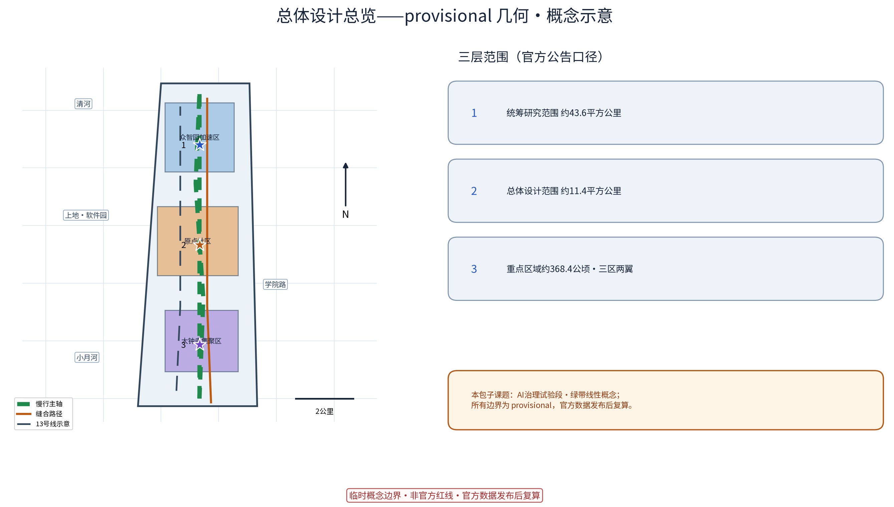
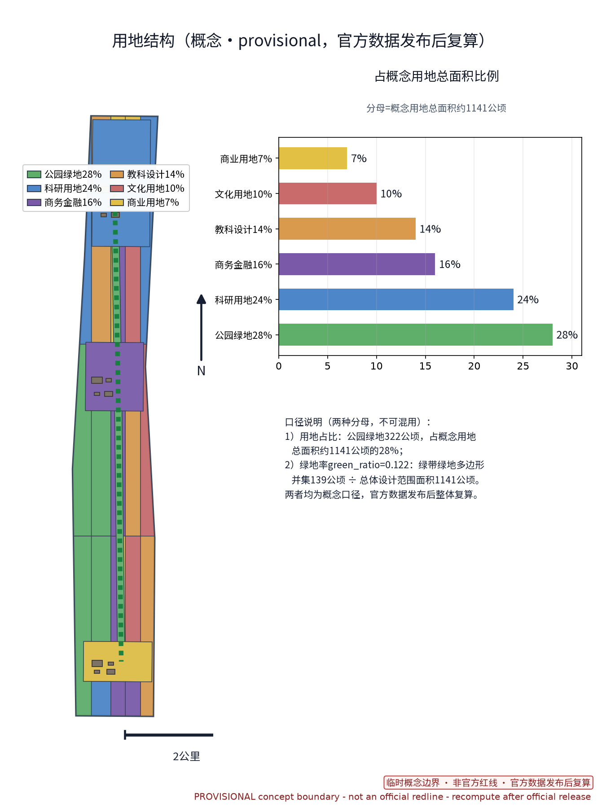
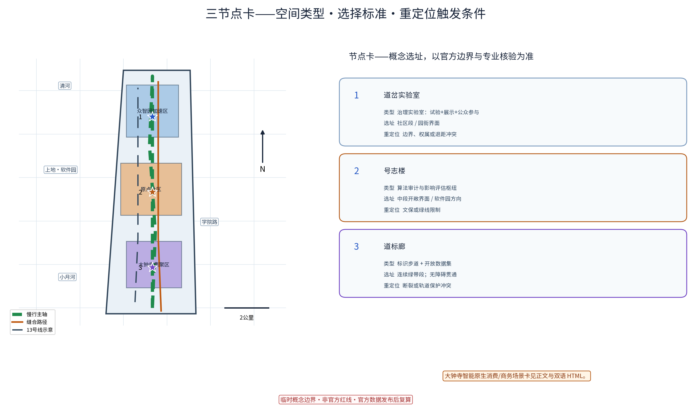
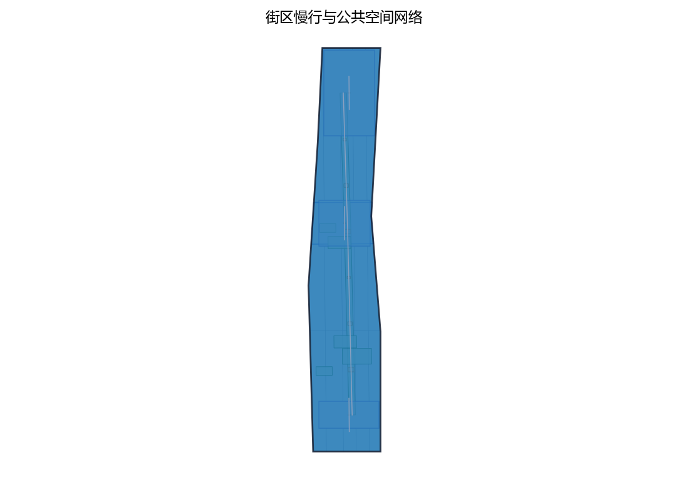
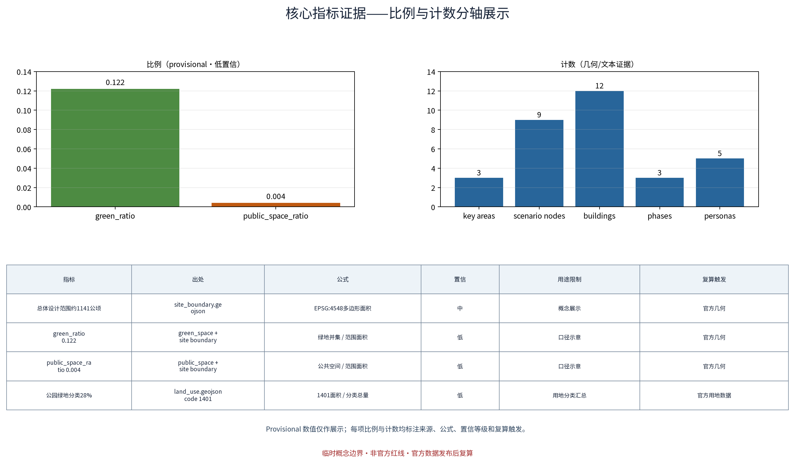

**方案名称与总体构想(概念)**

「数轨京张 · AI治理试验段」,英文名 JINGRAIL · AI Governance Pilot("JINGRAIL"系"京张 Jingzhang × 铁轨 Rail"的原创合成词,与任何现实机构、商标无涉),是本方案为百年京张AI创新带"AI治理全球话语权"功能提出的原创概念命题。其核心隐喻是:让城市中的AI像列车一样——有轨道(边界与规则)、有时刻(透明可查)、有信号(审计问责),可调度、可对话。试验段以京张铁路遗址公园绿带为载体,支撑百年京张文化带、都市AI生活体验带、AI融合创新带三大定位(官方文本),沿绿带设置「道岔实验室」「号志楼」「道标廊」三处原创概念节点(均标注为概念点位,选址待官方边界发布后由专业团队深化),配套「月台议事厅」「运行图观测段」「数轨开放数据集」等概念机制,把治理从"事后监管"转为"全程参与式共治"。全部落地表述均为概念建议、参考方案,不构成法定规划结论。

## 设计依据与资料清单

依据包括:主办方公开发布的征集公告与任务书(三大定位、五大功能、三层范围与"三区两翼"均出自官方文本);《北京城市总体规划(2016年—2035年)》《海淀分区规划(国土空间规划)(2017年—2035年)》等公开上位规划;京张铁路遗址公园建设运营的公开资料;沿带节点的公开信息(清河、上地/中关村软件园、知春路、中关村大街、学院路,及地铁13号线与公园绿带并行的公开描述);《生成式人工智能服务管理暂行办法》(2023)、《全球人工智能治理倡议》等AI治理公开文件。特别说明:主办方尚未发布官方边界多边形,本方案不推算、不声称任何精确坐标与面积数值,几何表达均为概念示意,以官方正式发布为准;资料清单以公开可得文本为限,其余由专业团队补充核实。

> **证据锚点**：[source:DATA-SRC-OFFICIAL-ANNOUNCEMENT-20260509]、[source:DATA-SRC-AGENT-TASKBOOK-20260518]（组织方公告与任务书为文本口径依据）。

## 三层范围工作框架

分层数据属官方文本口径:统筹研究范围43.6平方公里,总体设计范围11.4平方公里,重点区域合计368.4公顷,形成三个递进工作层级——统筹层研究"产业—城市—治理"的沿带关系,总体层研究绿带两侧城市更新与控规深度(概念层面)的空间设计,重点层聚焦"三区两翼":众智园AI自主创新加速区(约192公顷)、北京AI原点社区(约104公顷)、大钟寺AI产业集聚区(约72公顷),及中关村科技服务翼、小月河场景赋能翼。本期"AI治理试验段"定位为跨层级线性概念课题:以绿带为轴,在总体设计范围与重点区域内组织节点,既落实"AI治理全球话语权"定位,也为各功能区提供公共治理基础设施(概念建议);试验段同时是文化带、生活体验带与融合创新带的公共纽带,可供专业团队深化研究。

> **证据锚点**：[source:DATA-SRC-AGENT-TASKBOOK-20260518]（三层范围划分依据任务书官方文本口径）。

## 统筹研究范围产业与未来城市研究

统筹范围(43.6平方公里,官方文本口径)以清河、上地/中关村软件园、知春路、中关村大街、学院路为空间叙事骨架,可形成"北研发、中转化、南服务"的沿带产业梯度(概念研判)。未来城市研究聚焦三问:其一"算力与城市的接口",研究AI基础设施以低冲击方式嵌入城市;其二"数据要素的流动",研究公共、园区与市民数据的分级流通机制(概念建议);其三"治理与空间的互构",研究治理规则如何在空间中可见、可参与。统筹层把AI治理试验段视为全带的"软性基础设施",以绿带串联各功能区AI场景,支撑"产业创新—生活体验—治理试点"一体化概念框架;产业判断基于公开资料,属概念研判,不构成法定规划结论。

> **证据锚点**：[source:DATA-SRC-PROVISIONAL-BOUNDARIES-20260605]（边界为 provisional，研究范围仅作概念示意）。

## 总体设计范围城市更新与控规深度城市设计

总体设计范围11.4平方公里(官方文本口径)以京张铁路遗址公园绿带为脊柱,概念上提出"三重线"结构:遗址公园铁轨文化线、并行地铁13号线轨道线、两者之间的慢行与治理展示线。控规深度(概念层面)建议:绿带两侧"前低后高"适度退让,更新以存量功能置换为主,将"铁路—绿带—街区"重塑为连续公共断面。与遗址公园的关系(概念建议):沿绿带慢行贯通、绿带内交通慢行优先;试验设施低干预、可逆、依附既有构筑物,与铁轨步道、历史构筑物等文旅场景叠加治理科普,形成"游铁轨、读治理"的游览叙事,并衔接上地/软件园及学院路的园区创新场景;地面层保证视线通透,不新增面向个人的持续识别类设施。深度与边界以官方发布及专业团队成果为准。

> **证据锚点**：[source:DATA-SRC-MOHURD-CONTROL-DETAILED-PLANNING]、[source:DATA-SRC-PROVISIONAL-BOUNDARIES-20260605]。

## 重点区域详细设计

重点区域合计368.4公顷(官方文本口径),含"三区两翼"。三处概念点位(均标注为概念点位,选址为概念示意,以官方边界为准):①「道岔实验室」(Turnout Lab),拟选址于绿带与产业园区衔接段(概念选址),承载AI治理实验室;②「号志楼」(Signal Tower),拟选址于绿带视野开阔、近软件园方向段(概念选址),承载算法审计塔;③「道标廊」(Waymark Walk),为沿绿带展开的合成内容标识步道。节点与三区建立功能呼应(概念建议):北端众智园"出题"(自主创新)、中段北京AI原点社区"试验"(治理试点)、南端大钟寺集聚区"落地"(场景应用),中关村科技服务翼与小月河场景赋能翼提供支撑。点位体量与选址均为概念示意供深化,面积沿用官方文本口径。

**场景卡索引（概念）**：治理类AI+场景以场景卡落地，形成可评审、可迭代的运营索引：

| 场景卡 | 落点 | 面向人群 | 运营机制（概念） | 数据与合规边界 |
|---|---|---|---|---|
| 「入轨沙盒」治理场景沙盒 | 「道岔实验室」 | 治理者、企业 | 申请—评审—公示、入轨备案 | 最小采集、匿名聚合、人工复核 |
| 「号志评估区」算法影响评估 | 「号志楼」 | 研究者、从业者 | 年度评估日历、公开报名 | 去标识化样例，禁止过度监控 |
| 「道标廊」合成内容标识 | 绿带步道 | 游客、学生 | 志愿讲解、轮换展陈 | 端侧处理，不留存个体信息 |
| 「月台议事厅」公众参与沙盒 | 站前或社区段 | 居民、长者 | 议事征集、月度例会 | 仅聚合统计，人工复核 |
| 「运行图观测段」开放数据集 | 绿带沿线 | 开发者、青年 | 预约下载、积分激励 | 聚合统计与去标识化，可一键关闭 |

> **证据锚点**：[data:PACKAGE-GEOMETRY]（三节点示意多边形来自本包 geometry/key_areas.geojson）。

## AI 创新生态、人才画像与 AI+ 场景

五大功能(官方文本)落位为生态框架:AI全栈自主创新体系对应众智园,世界级AI创新生态依托软件园与高校带,AI+场景赋能新范式依托小月河场景赋能翼,智能化AI活力城市贯穿全带,AI治理全球话语权即本试验段。人才画像(概念):算法研究者与创业者、场景与数据工程人才、治理审计与合规人才,以及作为参与者的市民——试验段专为"治理者+市民"设计公共参与接口。AI+场景(概念,六类):治理场景沙盒「入轨沙盒」;算法影响评估先行区「号志评估区」;合成内容标识示范步道「道标廊」;公众参与决策沙盒「月台议事厅」;城市AI观测试验段「运行图观测段」;「数轨开放数据集」计划。所有场景统一遵循"最小采集、目的限定、匿名聚合、人工复核"四原则(概念机制):不采集可识别个人的生物特征与轨迹原始数据,仅发布聚合统计与去标识化样例;涉及公共影响的试验须先经人工复核并公示;坚决反对任何形式过度监控,全带不部署针对个人的持续性识别设施。

AI场景域覆盖治理、产业、空间、公共服务、交通、文化六域:AI治理(入轨沙盒与算法影响评估)、AI产业(治理工具箱与数据服务)、AI空间(绿带步道与节点改造)、AI公共服务(公众参与沙盒与标识科普)、AI交通(运行图观测与出行影响评估)、AI文化(标识艺术展与数据马拉松叙事),各域均以人工复核兜底。

> **证据锚点**：[source:DATA-SRC-GENERATIVE-AI-INTERIM-MEASURES]（AI 生成内容治理表述的参照依据）。

## 用地、建筑规模与拆改留方案
拆改留坚持留改拆并举：铁路与工业遗存概念元素登记建档、能留尽留，仅针对确无保留价值的临建与非正规存量建筑拆除；全部面积为概念口径，官方数据发布后复算。

概念建议:沿线以存量更新为主,按"留、改、拆"分级引导(概念分类,需专业团队核实)——"留":遗址公园本体、铁轨遗存与文保构筑物原状保留;"改":沿线老旧楼宇与低效园区功能置换、轻改造,承载治理实验室、共享办公与公共设施;"拆":仅限经核实的危房与违法建筑,极少量、个案处理,不扩大拆除范围。建筑规模控制(概念建议):绿带首排以低层通透公共功能为主,体量向街区内部递增,避免贴绿带高墙板式开发;新增建筑量以"不超过改造后总规模的适度比例"为概念底线,具体指标待专业团队结合官方边界与深度要求测算。全部内容为概念建议、参考方案,不构成法定规划结论。

> **证据锚点**：[source:DATA-SRC-MNR-LAND-USE-CLASSIFICATION-202311]（用地分类名称参照现行国标口径）。

## 交通、轨道、市政与公共服务设施

交通(概念建议):绿带内慢行连续优先,组织"步行+骑行"贯通体系,与地铁13号线站点接驳;绿带禁止机动车穿越,仅保留经核实的市政检修通道,过街组织人行优先。轨道:13号线与绿带并行段是天然公共交通走廊,试验段节点以车站步行可达范围为选址原则(概念建议)。市政(概念建议、需现状核实):依托既有管线设施改造,不新增大型市政场站,智慧化坚持"感知共享、一杆多用"概念原则,感知数据仅做匿名聚合统计。公共服务:设置治理开放大厅、共享实验室、社区议事空间与无障碍设施,向市民与园区共享开放。以上均为概念建议与参考方案,交通、市政的法定结论以专业团队及主管部门意见为准。

> **证据锚点**：[source:DATA-SRC-MOHURD-URBAN-DESIGN-MEASURES]（市政与慢行设计表述的方法参照）。

## 蓝绿空间、公共空间与城市风貌
京张铁路遗址公园绿带为骨架整合蓝绿空间，治理实验室—审计塔—标识步道连续开敞序列，海绵化雨水花园与林荫场所；风貌以「铁轨历史的沉淀与AI治理的透明」并置、轨枕道钉记忆元素、可读性优先的标识体系克制表达。

京张铁路遗址公园绿带是试验段的蓝绿骨架与公共空间主轴。概念建议:以绿带为主体,通过支路绿廊向两侧街区渗透,与清河滨水空间形成"一带一河"生态联系(概念构想);植物以乡土树种为主,保留铁轨遗存历史肌理。治理展示设施坚持低干预:优先利用既有构筑物、候车亭、路灯杆等载体,采用可逆、可拆卸轻质装置,不新增大体量构筑物。风貌提出"铁轨记忆+数字秩序"概念基调(概念建议):遗存叙事真实克制,数字元素以标识、光影、交互小品等低强度方式呈现;沿带建立风貌分区指引,防止同质化装饰。所有景观风貌策略均为概念建议供专业团队深化研究,文物与生态保护要求以主管部门规定为准。

> **证据锚点**：[source:DATA-SRC-MOHURD-URBAN-DESIGN-MEASURES]（蓝绿空间组织的方法参照）。

## 更新项目清单、实施政策与分期计划

更新项目库(概念建议,可供专业团队深化):①绿带治理基础设施改造;②道岔实验室(概念点位)改造运营;③号志楼(概念点位)改造;④道标廊(概念点位)步道化改造;⑤月台议事厅选址与建设(概念建议);⑥沿线楼宇功能置换与共享设施改造。实施政策(概念建议):政府统筹与主管部门联审、企业参与运营、高校与科研机构协同评测、社区共建共治,志愿者与专业团队参与评估,产业支持、公共数据授权试点、更新与功能提升联动等,均须在合法合规框架内由主管部门研究。分期为概念节奏:近期(1—2年)挂牌试验——实验室先行、标识步道首段、开放数据集一期;中期(3—5年)联网治理——三节点建成、影响评估先行区运行、参与沙盒常态化;远期(5—10年)规则输出——形成可复制的治理工具箱与标准草案。活动体系(概念):AI治理开放日、算法审计公开周、合成内容标识艺术展、月台议事会、基于开放数据集的城市数据马拉松等,形成全年节奏。

> **证据锚点**：[source:DATA-SRC-AGENT-TASKBOOK-20260518]（分期与实施条目对应任务书要求）。

## 指标体系、面积复算与合规矩阵

指标(概念):慢行贯通率、绿带开放率、治理场景入盒数、算法影响评估覆盖率、合成内容标识覆盖率、开放数据集规模与更新频次、公众参与人次等,均为过程性、可观测概念指标,不设惩罚性监管指标,体现"观测不监控"。面积口径:严格采用官方文本值——统筹研究范围43.6平方公里、总体设计范围11.4平方公里、重点区域合计368.4公顷,三区为约192公顷、约104公顷、约72公顷(均标注为官方文本口径);368.4公顷与三区之和的自洽关系属官方文本口径核算,本方案不作自行推算的测量复算,精确面积与坐标以主办方正式发布为准。合规矩阵(概念):文物遗址保护、生态绿线、数据安全与个人信息保护、无障碍慢行、公示与公众参与五大项,逐项对应措施与责任主体(概念建议),供专业团队深化。

> **证据锚点**：[metric:green_ratio]、[metric:public_space_ratio]、[source:PACKAGE-GEOMETRY]。

## 风险、版权与合规说明
本方案为概念研究性设计，不构成行政审批依据；正式实施前须完成多部门联审、数据合规评估与安全评估。

风险:官方边界多边形尚未发布,本方案全部几何为概念示意,选址与面积以官方发布为准;项目、政策与分期均为概念建议,存在调整可能。命名:"数轨京张/JINGRAIL"及三处节点名称均为本方案原创概念命名,如与现实机构或商标偶合,纯属巧合,不构成关联或主张。版权:本方案为原创概念文本,专供参赛应征用途;引用的公开资料已在"参考资料"列明,未复制他人未公开成果。合规:本方案不构成法定规划结论,不含任何针对个人的监控类设计,所有AI相关场景均受数据最小化与人工复核边界约束;正式实施须由专业团队依据官方任务书、上位规划及法律法规深化,并经主管部门批准。

> **证据锚点**：[source:DATA-SRC-OFFICIAL-ANNOUNCEMENT-20260509]（征集规则为权属与合规表述的依据）。

## 参考资料

以下均为公开渠道资料,以官方发布为准:

1. 《百年京张AI创新带城市设计国际方案征集》公告与任务书(主办方公开发布文本);
2. 《北京城市总体规划(2016年—2035年)》(公开文本);
3. 《海淀分区规划(国土空间规划)(2017年—2035年)》(公开文本);
4. 京张铁路遗址公园建设与开园相关公开报道(北京市海淀区人民政府门户及权威媒体);
5. 《生成式人工智能服务管理暂行办法》(国家互联网信息办公室等,2023年);
6. 《全球人工智能治理倡议》(2023年);
7. 欧盟《人工智能法案》(EU AI Act)公开文本(国际参考)。

注:上述资料仅作背景参考;未发布或不可公开获取的资料,本方案未作臆测引用。

> **证据锚点**：[source:DATA-SRC-OFFICIAL-ANNOUNCEMENT-20260509]（本清单首条即组织方公开资料包）。
