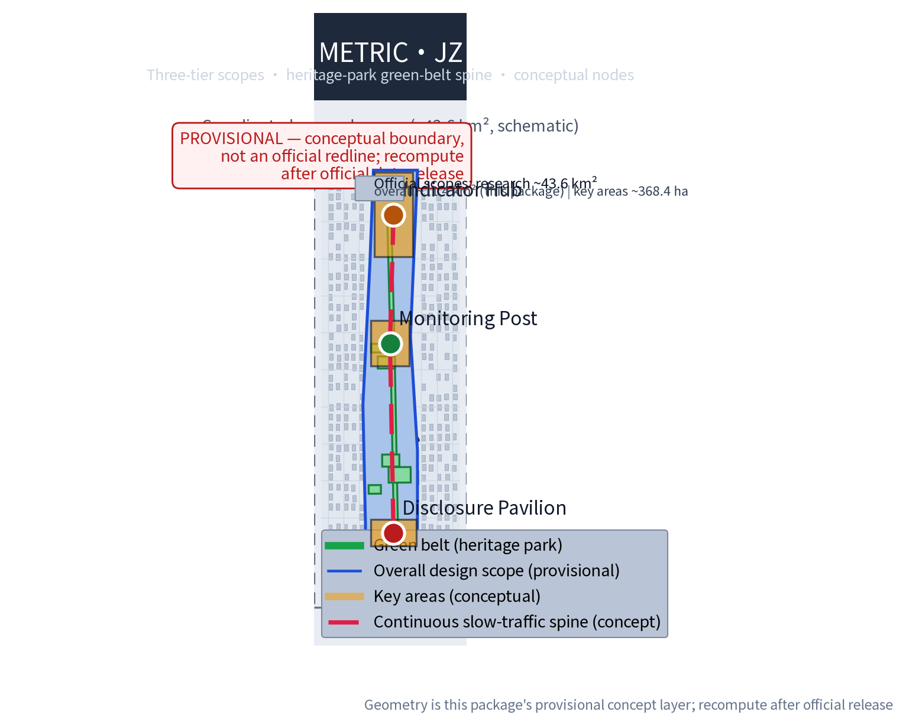
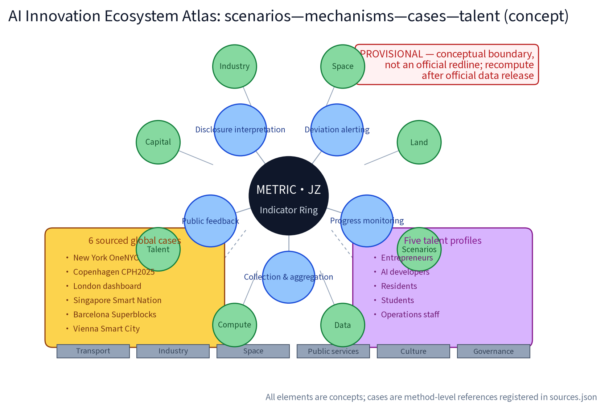
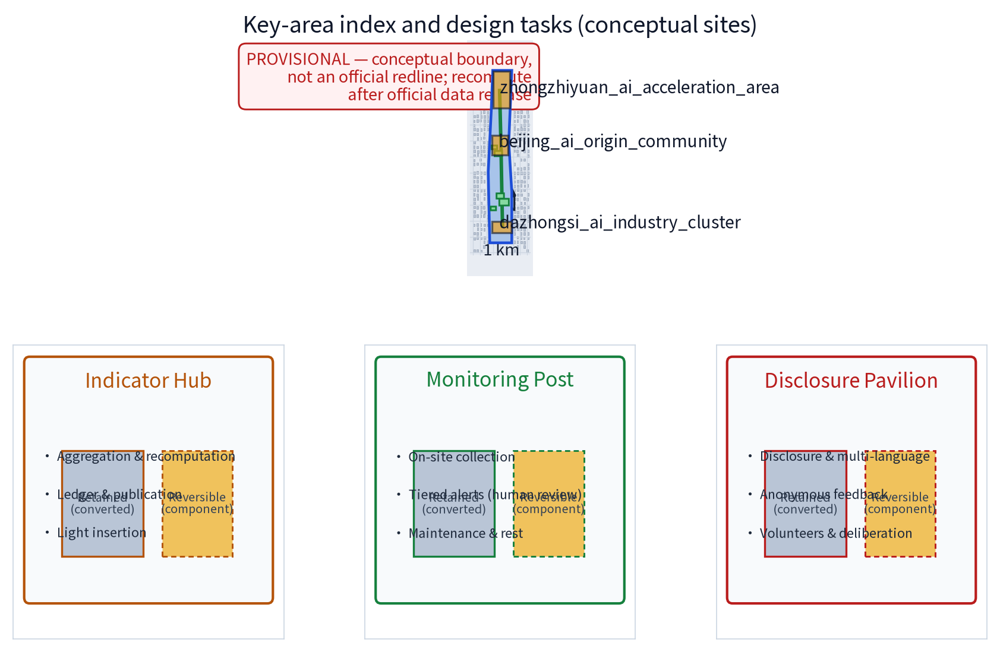
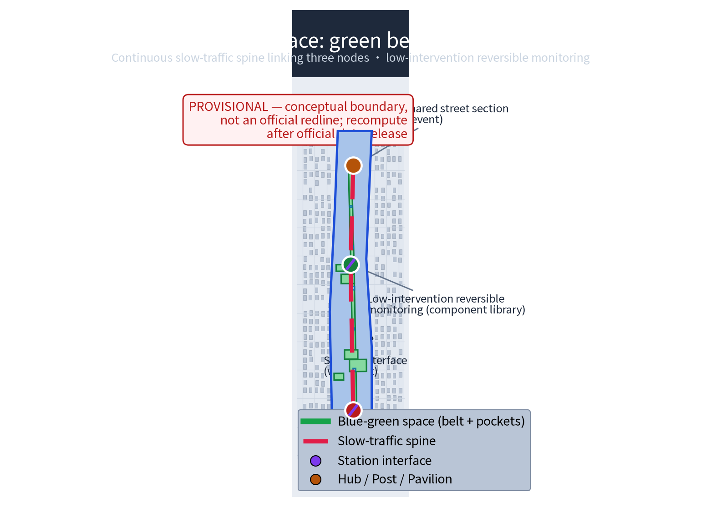
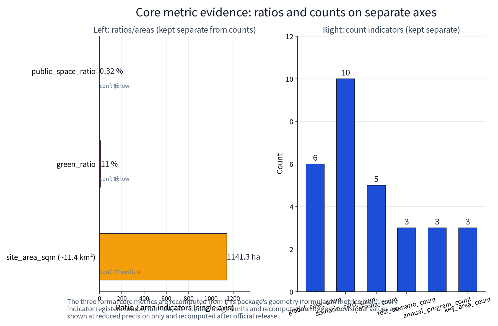
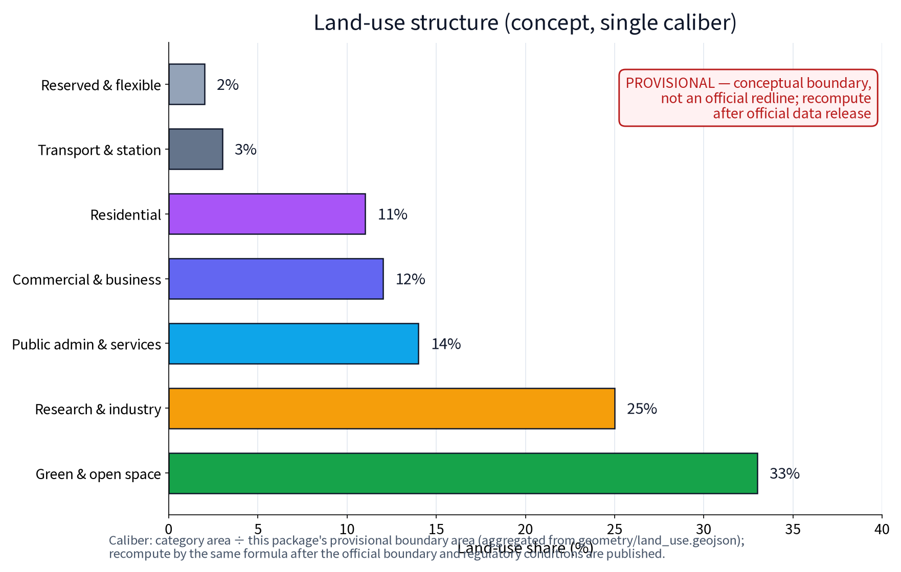

This proposal is a conceptual suggestion: it outlines the concept, structure and spatial organization of the METRIC·JZ indicator implementation and supervision system. It gives no FAR, building-height, demolition/retention or engineering-construction conclusions and fabricates no monitoring data.

## Design Basis and Source List
This list is a concept-stage working-basis list, not an acquired data package: the call-for-entries announcement and the public taskbook (which require a world-class AI innovation ecosystem, industrial priorities, an indicator system, an innovation network and spatial organization, and require the three formal core visual metrics site_area_sqm, green_ratio and public_space_ratio to be recomputable by the participant from geometry); public norms including the Urban Design Administration Measures, the Regulatory Detailed Plan Compilation and Approval Measures, the Land-Use Classification Guide, the Interim Measures for the Management of Generative AI Services and the Barrier-Free Environment Law; and public material on international indicator governance. The proposal is a concept suggestion only; it cites no official monitoring values and infers none. Items not obtained are honestly registered in the risk and missing-data statement.

> **Evidence anchor**: [source:DATA-SRC-OFFICIAL-ANNOUNCEMENT], [source:DATA-SRC-AGENT-TASKBOOK], [source:DATA-SRC-MOHURD-URBAN-DESIGN-MEASURES].

## Three-Tier Scope Working Framework
Per the official announcement text, the project defines three official tiers: the coordinated research scope of approx. 43.6 km², the overall design scope of approx. 11.4 km², and the key areas of approx. 368.4 ha. This package's sub-scope matches the overall design scope caliber (a conceptual subset); all boundaries are provisional geometry to be recomputed in full when the official polygons are published, and are not a final delimitation. The three tiers cascade: the coordinated research outputs (indicator-governance environment and corridor-wide coordination judgments) constrain the overall design, whose verified node layout, monitoring network and phasing growth are then carried into the key-area detailed design; each tier keeps machine-readable evidence anchors for review.

Tier division (conceptual): the coordinated research scope studies industry and future-city directions and frames the coupling of the indicator system with the AI innovation ecosystem; the overall design scope uses the Jing-Zhang Railway Heritage Park green belt as the spine, linking urban regeneration with regulatory-plan-depth urban design; the key areas carry the detailed design of the three nodes — the Indicator Hub, the Monitoring Post and the Disclosure Pavilion. Boundary precision and confidence levels are dynamically recalibrated with recomputation, liaison and feedback; no official redlines are presupposed.

> **Evidence anchor**: [source:DATA-SRC-OFFICIAL-ANNOUNCEMENT] (official three-tier scope text), [source:DATA-SRC-PROVISIONAL-BOUNDARIES] (provisional geometry), [metric:site_area_sqm].

## Coordinated Research Scope — Industry and Future-City Study
Explicit mapping to the taskbook's three positionings (Centennial Jing-Zhang Cultural Belt, Urban AI-Life Experience Belt, AI-Integrated Innovation Belt) and five functions (full-stack indigenous AI innovation system; world-class AI innovation ecosystem; new AI+ scenario-empowerment paradigm; intelligent AI-energized city; global discourse power in AI governance) — a conceptual judgment: METRIC·JZ carries the cultural belt through the Jing-Zhang railway historical narrative and heritage memory, supports the experience belt through perceivable indicator disclosure and experience scenarios, and provides the innovation belt with a governance foundation of indicator-system master control and a supervision closed loop; the indicator system and supervision loop directly support quantifiable delivery of AI governance discourse power and a world-class AI innovation ecosystem, and provide the other three functions with a collectable, monitorable, disclosable public-data and feedback base. This mapping is conceptual only and constitutes no functional commitment.

Regional coordination (conceptual): within the “three-areas/two-wings”  collaboration loop, this concept proposes coordination directions with Beiwai Community (people-centered sensing of the indicator system), Future Science City (compute and data-governance coordination), Huairou Science City (indicator methodology coordination), the Economic-Technological Development Area (industrial-indicator delivery coordination) and the Jing-Jin-Ji region (indicator-caliber alignment); corridor universities host indicator research and validation scenarios, innovation clusters contribute industry and project data density, rail stations act as observation and display windows, and neighborhoods focus on disclosure, awareness and feedback. All judgments presuppose no values and no specific parcels; they are relational judgments for later deepening.

> **Evidence anchor**: [source:DATA-SRC-AGENT-TASKBOOK] (three-areas/two-wings and positioning text), [source:DATA-SRC-PROVISIONAL-BOUNDARIES].

## Overall Design Scope — Urban Regeneration and Regulatory-Depth Urban Design
The overall design emphasizes an “indicator implementation and supervision environment with the green belt as its spine”: indicator nodes, the monitoring network and the slow-traffic skeleton are organized along the Jing-Zhang Railway Heritage Park green belt; monitoring facilities grow reversibly and streets time-share monitoring and festival needs. Regeneration is preferred over new construction, and existing stock is reused to host indicator functions. Regulatory-plan indicators (FAR, height, etc.) are verification suggestions only — they modify, replace or prejudge no statutory control conclusions. The core idea is “the green belt is the indicator corridor”: collection, transmission, display and feedback all happen in one continuous space.

### Brand and Visual Identity (Concept)
The “METRIC·JZ” visual system uses the indicator ring (a ring plus node symbols) as its base form: the Jing-Zhang rail imagery is abstracted into a ring of tick marks, with the three nodes (Hub, Post, Pavilion) mapped to three segments of the ring; the standard palette uses heritage grey, rail red and data blue; the component family covers the mark, wordmark, icons, display modules and signage system. Until prior-rights searches are completed, all original concept names and marks are treated as internal working codenames and are not used for external registration or publication (see Risk, Copyright and Compliance).

### Reversible Public-Space Component Library (Concept)
The “component library” is a set of reversible public-space building blocks: six component types — disclosure screen columns, modular monitoring boxes, collapsible seating, temporary display racks, ground scale paving and time-sharing barriers — all low-intervention, reversible and relocatable, combinable into disclosure corners, monitoring points, study terraces and festival grounds for phased trial and retrieval. They constitute no construction commitment.

> **Evidence anchor**: [source:DATA-SRC-MOHURD-CONTROL-DETAILED-PLANNING] (regulatory verification boundary), [data:geometry/site_boundary.geojson], [metric:green_ratio].

## Key-Area Detailed Design
The three node sites are conceptual locations to be relocated after planning, data, heritage and competent-authority assessment and professional review; the green-belt routes and slow-traffic links between nodes form the complete indicator itinerary, expressed in the booklet and the geometry layer. Node-to-“three-areas/two-wings” mapping (conceptual): the Indicator Hub corresponds to the innovation-belt governance center (data-governance coordination with Future Science City); Monitoring Posts are placed along the green belt (sensing coordination with Beiwai Community; industrial-indicator coordination with the Economic-Technological Development Area); the Disclosure Pavilion sits near neighborhoods and rail stations (methodology coordination with Huairou Science City and university study). The loop is dynamically verified through annual recomputation and liaison.

Node design tasks (conceptual): the Indicator Hub — implementation control center at a conceptual mid-belt location, hosting aggregation, recomputation, publication and dispatch, lightly inserted into existing buildings; the Monitoring Post — implementation monitoring stations in segments along the belt, hosting on-site collection, inspection and rest, and equipment maintenance; the Disclosure Pavilion — an indicator disclosure and public-supervision platform near neighborhoods and rail stations, displaying indicator dynamics and providing an anonymous feedback channel. A “landmark catalog” registers landmarks in three tiers — hub landmarks (Indicator Hub), corridor landmarks (green-belt tick axis) and node landmarks (Disclosure Pavilion) — with an honor-display area (a public wall for supervision outcomes and volunteer contributions) and component-library combinations. The three nodes are linked by the slow-traffic spine and support one another.

> **Evidence anchor**: [data:geometry/key_areas.geojson] (provisional node polygons), [source:DATA-SRC-AGENT-TASKBOOK] (landmark and honor-display items).

## AI Innovation Ecosystem, Talent Profiles and AI+ Scenarios
AI technical protocols (concept): every AI application configures four protocols — model evaluation (benchmark testing with false-alarm-rate registration), data quality (caliber verification, missing-value and outlier handling), error stratification (review by block, period and indicator category) and runtime monitoring (alert-trigger logging, human review and fault degradation). The three backbone scenarios are indicator collection-and-aggregation AI, implementation-progress monitoring AI and indicator-deviation alerting AI, each with human review as backstop; disclosure-interpretation AI and public-supervision feedback AI are supporting scenarios. Only anonymized aggregates are processed, key decisions are human-reviewed (double insurance), excessive monitoring is prohibited and no individual-identification tracking is performed. The system is a conceptual mechanism suggestion and does not replace statutory statistics or information-disclosure duties.

Five talent profiles: entrepreneurs follow delivery progress and policy realization; AI developers follow open data and interfaces; community residents follow environment and public-service indicators; students follow learning and participation scenarios; operations staff follow collection and maintenance efficiency. Domain coverage (conceptual): six domains — transport (slow-traffic-first and access-environment indicators), industry (innovation and scenario-opening progress), space (land structure and public space), public services (facility configuration and service coverage), culture (heritage protection and narrative transmission) and governance (disclosure, feedback and supervision-loop indicators); each domain list is refined after official-caliber confirmation. The data architecture has three layers — collection, aggregation and publication — with a minimum aggregation threshold and a data dictionary; the whole chain is anonymized, aggregated and human-reviewed.

### AI+ Scenario Cards (10; concept design; all data subject to anonymized aggregation, minimal necessity and human review)
| Scenario card | Spatial carrier | AI capability | Data and privacy boundary | Operator |
| --- | --- | --- | --- | --- |
| Indicator collection-and-aggregation AI | Hub and corridor collection points | Multi-source collection, caliber alignment, anonymized aggregation | Anonymized aggregates only, minimum data threshold, no individual-identification tracking | Hub operations team |
| Implementation-progress monitoring AI | Posts along the belt | Progress and indicator-status monitoring, public-caliber verification | Anonymized; key conclusions published after human review | Post operations team with professional testing bodies |
| Indicator-deviation alerting AI | Posts and rail-station interfaces | Deviation identification and tiered alerts | Block-level aggregates only; excessive monitoring prohibited | Operations team; alerts human-reviewed |
| Disclosure-interpretation AI | Pavilion near neighborhoods and stations | Multi-language interpretation and cultural outreach | Reprocesses public data only; sources and calibers traceable | Pavilion team with volunteer support |
| Public-supervision feedback AI | Pavilion and online feedback channel | Opinion aggregation, clustering, feedback tracking | Free text desensitized before processing; anonymous submission, human-review backstop | Operator, community council representatives and volunteers |
| Slow-traffic flow-trend AI | Posts along the slow-traffic spine | Block-level flow awareness and event steering | Block-level aggregate counts only; no individual trajectory identification | Post operations team |
| Green-space health AI | Park nodes along the belt | Vegetation and paving condition inspection support | Facility-level aggregates only; maintenance advice human-reviewed | Park management body (collaborating) |
| Multi-language guide AI | Pavilion and online platform | Multi-language guide generation for indicators and culture | Public material only; generated content human-reviewed | Pavilion team |
| Study-interaction AI | Station study terraces | Indicator Q&A and study-task generation | Account-free use; anonymous sessions; no individual data retained | University volunteers (collaborating) |
| Opinion-attribution AI | Online feedback platform | Topic clustering and improvement attribution | Desensitized text aggregated; human-reviewed before publication | Operator with professional teams |

### Industry Validation Test Scenarios (3; concept)
| Test protocol | Object | Verification focus | Pass criterion (concept) | Recomputation trigger |
| --- | --- | --- | --- | --- |
| Indicator-caliber consistency test | Collection-and-aggregation AI | Multi-source caliber alignment and aggregation correctness | Sample re-check consistency passes and is human-confirmed | Caliber or source change |
| Alert-accuracy test | Deviation-alerting AI | Tiered-alert accuracy and false-alarm rate | False-alarm rate below conceptual threshold, human review passed | Model or data-quality change |
| Disclosure readability test | Interpretation AI | Accuracy and readability of multi-language interpretation | Target-group comprehension rate passes | Disclosure structure change |

> **Evidence anchor**: [source:DATA-SRC-GENERATIVE-AI-INTERIM-MEASURES] (reference for generative-AI governance wording), [metric:industry_test_scenario_count], [metric:persona_count].

## Land Use, Building Scale and Retain/Renovate/Demolish
Land-use ratios (conceptual caliber, single caliber: denominator = this package's provisional overall-design-scope boundary; names aggregated per the national land-use classification; recomputed by the same formula after the official boundary is published; not used for any statutory purpose until official regulatory conditions and survey data arrive): green and open space approx. 33%, research and industry approx. 25%, public administration and public service approx. 14%, commercial and business approx. 12%, residential approx. 11%, transport and station approx. 3%, reserved and flexible approx. 2%. Each ratio aggregates classification areas from geometry/land_use.geojson; formulas and conceptual sources are in metrics.json and the compliance matrix; the aggregation caliber and recomputation triggers update when official data is published.

Retain/renovate/demolish: retention first — preserve the heritage-park texture and railway relics; existing buildings undergo functional conversion with reserved indicator-monitoring conversion directions (collection interfaces, disclosure screen positions); demolition is limited to scattered small buildings verified case-by-case to open slow-traffic routes. Monitoring and public-service facilities are inserted lightly, reversibly and modularly, preferably combined with functional conversion of existing buildings (station houses, management rooms, station auxiliary spaces, under-bridge spaces), avoiding new land occupation and large-scale rebuilding. No floor-area, building-height or retain/renovate/demolish conclusions are presupposed; any use of existing resources must be re-judged after survey, property-rights and official-data recomputation.

> **Evidence anchor**: [source:DATA-SRC-MNR-LAND-USE-CLASSIFICATION-202311] (land-use classification names), [metric:green_ratio], [metric:public_space_ratio].

## Transport, Rail, Municipal Works and Public Services
Transport concept with slow-traffic priority: a continuous slow-traffic spine links the Indicator Hub, Monitoring Posts and Disclosure Pavilion; street sections respond in time-shared mode to daily and festival states; connections to corridor universities, parks and rail stations are improved (access mainly by walking and cycling); monitoring and disclosure facilities are placed along slow-traffic spaces with low intervention. Rail stations and monitoring nodes connect smoothly, prioritizing walking links from entrances to the green belt. Municipal works follow intensive sharing, relying on existing pipelines and facilities to reduce repeated excavation. Public services configure multi-language service, indicator disclosure and study spaces; all AI decisions include human review. This section gives directional suggestions only and presupposes no engineering values or implementation conclusions.

Population coverage (conceptual): public services make inclusive arrangements for all ages, balancing age-friendliness and child-friendliness — seniors and the silver-haired receive barrier-free access, large-print disclosure interpretation and nearby rest; children and families receive safe slow traffic and science spaces; youth and commuters receive innovation participation and rest stops; students receive study opportunities; visitors receive multi-language guidance; practitioners receive supporting services; and barrier-free inclusive arrangements are reserved for persons with disabilities and other vulnerable groups. The barrier-free scope follows the service contexts enumerated in the Barrier-Free Environment Law and is not generalized to every public space; specific configuration is determined after needs surveys and professional assessment.

> **Evidence anchor**: [source:DATA-SRC-MOHURD-URBAN-DESIGN-MEASURES] (slow-traffic and municipal method reference), [source:DATA-SRC-BARRIER-FREE-ENVIRONMENT-LAW] (barrier-free boundary), [metric:road_network_length_m].

## Blue-Green Space, Public Space and City Character
A blue-green public-space system of “green belt as axis, node parks as pearls”: the heritage-park green belt forms the blue-green spine linking small green spaces and open spaces along the corridor; monitoring and disclosure facilities blend with parks — light, transparent, reversible — without blocking heritage views or green-belt sightlines; signage and interpretation systems are unified and restrained. The character continues the Jing-Zhang railway industrial-memory vocabulary in dialogue with an ordered data atmosphere, merging Zhongguancun innovation culture and an AI-new-culture narrative (the “century of sleepers · data ticks” storyline); the overall character control is restrained and unified, avoiding symbol pile-up and slogan packaging.

Culture, signage and international communication systems (concept): the cultural narrative unfolds in three layers — the Jing-Zhang railway history layer, the Zhongguancun innovation layer and the AI-new-culture layer; cultural-resource protection and narrative-transmission indicators enter the indicator system. The signage system unifies multi-language marking standards with tactile and voice guidance for barrier-free use. International communication relies on the annual Indicator Open Day, multi-language disclosure content and open data interfaces of the developer community, spreading the indicator methodology to global developers and researchers; brand recognition, scenario perceptibility and international communication capacity improve through annual programs and recomputation.

> **Evidence anchor**: [source:DATA-SRC-MOHURD-URBAN-DESIGN-MEASURES] (blue-green and character method reference), [metric:green_space_area_sqm].

## Renewal Project List, Implementation Policy and Phasing Plan
Pilot plan (concept, not an approved government arrangement): the first pilot area is an “Indicator Hub + Disclosure Pavilion” prototype segment (conceptual interval of approx. 1 km on the mid-belt), with responsibility types and collaborators, preconditions, data dictionary, resource bands, maintenance requirements, KPIs, decision gates, exit/rollback and annual recomputation flows as convertible elements (see table). Participants (conceptual division, not responsibility commitments) cover government (competent authority for coordination, caliber publication and supervision), enterprises (innovation and operations bodies for scenario co-building and open data interfaces), universities (indicator research and validation), residents and communities (feedback, deliberation and daily maintenance), operations teams (daily operation of monitoring and disclosure facilities), volunteers (Pavilion duty and event assistance), merchants (corridor business and joint governance) and professional teams (planning, data and legal review); a “joint indicator governance compact”  is suggested to define participation boundaries and responsibilities, effective only after formal procedures determine the authority allocation.

| Pilot element | Near term 1–3 yr | Mid term 3–5 yr | Long term 5–10 yr |
| --- | --- | --- | --- |
| Responsibility and collaborators | Operations lead; community council, universities, volunteers collaborate | Competent authority coordinates caliber; district platform collaborates | Multi-stakeholder co-building alliance operates routinely |
| Preconditions | Official boundary and regulatory conditions published; caliber confirmed | Pilot evaluation passed; data-interface standard set | Annual recomputation system mature |
| Data dictionary and maintenance | Definitions, statistical boundaries, update frequency registered | Dictionary versioned; maintenance responsibility assigned | Dictionary public; annual review |
| Resource band (qualitative) | Low–medium (small pilot) | Medium | Medium–high (per evaluation) |
| KPI and decision gates | Data quality and public participation reviewed after 1 yr of pilot operation | Monitoring coverage and alert accuracy reach conceptual thresholds | Routine supervision and annual recomputation execution rate |
| Exit/rollback and annual recomputation | Pilot below standard stops and is retrieved; facilities reversible | Node-by-node retrieval and replacement | Annual recomputation disclosed; below standard triggers review |

Phasing (concept): near term 1–3 years — establish the indicator baseline, pilot the Hub and Pavilion, and clarify data calibers and responsible bodies; mid term 3–5 years — expand the Post network, launch AI-based monitoring and alert scenarios, and complete public participation channels; long term 5–10 years — form routine supervision and an annual recomputation system. Policy directions: open data, anonymized compliance, participation incentives and periodic evaluation. A “lead + collaborate” responsibility matrix (conceptual RACI): indicator definitions led by the competent authority with professional-team collaboration; collection and monitoring led by the operations team with professional bodies; disclosure and feedback led by the operator with community deliberation and volunteers; annual recomputation led by the professional team with authority review. Scenario opening and attraction-conversion (concept): a developer-community alliance hosts Open Day and technical workshops, open data interfaces are filed and managed, forming an “scenario opening — developer participation — indicator feedback — outcome conversion” loop. The annual program system (concept) is in the table below; names, dates and hosts must be determined lawfully and separately.

| Annual program brand | Content idea | Participation mechanism |
| --- | --- | --- |
| Annual Indicator Open Day | Caliber release, deliverable ledger display, open data interfaces | Booking-based visits; hosted by developer-community alliance; filed management |
| Annual Implementation Progress Briefing | Progress and indicator-status briefing; public inquiry responses | Community council representatives attend; feedback channel publicly recorded |
| Monitoring Post Experience Week | Post visits, study interaction, volunteer duty experience | Booking and rotation; participation points and public acknowledgment |

> **Evidence anchor**: [source:DATA-SRC-AGENT-TASKBOOK] (phasing and operation items), [metric:annual_program_count], [metric:phase_count].

## Indicator System, Area Recomputation and Compliance Matrix
Five conceptual governance indicators: indicator collection coverage, implementation-progress monitoring rate, indicator disclosure timeliness, public-feedback processing rate and annual recomputation execution rate — all on an anonymized-aggregation caliber; each registers data source, formula, confidence level, usage limits and recomputation trigger (see metrics.json and the compliance matrix), serving as concept indicators only, not current monitoring results. The three formal core metrics (site_area_sqm, green_ratio, public_space_ratio) are recomputed from this package's geometry; area recomputation uses the official text caliber as the base and is re-run with version marking after official data arrives.

Area recomputation and compliance matrix: all areas and ratios are conceptual calibers displayed at reduced precision per the provisional-boundary confidence level (within two significant decimals); after the official boundary and regulatory conditions are published, the same formulas are recomputed. The compliance matrix lists check elements, data sources and responsibility links per item and updates with recomputation. The three-sentence AI governance rule applies consistently throughout: anonymized aggregation only (no individual-identification tracking; excessive monitoring prohibited); human review of key decisions (alert publication, disclosure conclusions and handling recommendations are all human-reviewed); and no excessive monitoring (no always-on recognition devices; no individual behavior profiles retained).

> **Evidence anchor**: [metric:green_ratio], [metric:public_space_ratio], [source:PACKAGE-GEOMETRY], [source:DATA-SRC-PROVISIONAL-BOUNDARIES].

## Risk, Copyright and Compliance
This proposal is conceptual research; it is not a basis for administrative approval and gives no FAR, height, retain/renovate/demolish or engineering-feasibility conclusions. Risks are honestly registered in risk.json across five dimensions — monitoring-data privacy boundary, indicator-caliber consistency, implementation complexity, disclosure and public acceptance, and technical dependence and system-fault resilience — with response principles: anonymized aggregation, minimal necessity, human review, source marking and feedback channels. Data governance and human fallback for the public-feedback AI (concept): free text desensitized before processing; minimal collection; aggregation thresholds (intervals only below threshold); access logs and permission tiers; retention periods and deletion flows; error correction and appeal channels; incident-response plan; and a public feedback closed loop (receive — handle — reply — disclose). All flows are determined by the operator lawfully and publicly and constitute no confirmed operating arrangement.

Trademark prior-rights and usage boundary: no official trademark search has been completed at the concept stage; original names and marks (“METRIC·JZ”, the visual system and related names) are treated as internal working codenames until searches are completed and are not used for external registration, formal publication or commercial use. Any resemblance to existing marks is coincidental; prior-rights search and clearance must precede formal implementation. Copyright and asset ledger: fonts (Noto Sans SC under OFL), images and charts (self-produced, AI-generated), maps and geometry (self-produced provisional geometry; no unauthorized basemaps), data (public-caliber citations only), code and libraries (self-produced scripts and open-source libraries), generated graphics (AI-generated), brand marks (original concept) and case materials (public sources, registered item by item in sources.json) are each listed with source, license scope and redistribution boundary. The license COMMUNITY-DISPLAY-ONLY covers browsing, demonstration and review citation within this call-for-entries display and review context only; it grants no modification or redistribution rights, and later professional deepening requires separate authorization and license confirmation. All cited public material is marked with sources and acquisition dates; multi-department joint review, data-security and public disclosure assessments are required before formal implementation.

> **Evidence anchor**: [source:DATA-SRC-OFFICIAL-ANNOUNCEMENT] (basis for ownership and compliance wording), [source:DATA-SRC-GENERATIVE-AI-INTERIM-MEASURES].

## References
References are limited to public calibers; this package has obtained and cited no non-public data. The international cases below are registered item by item in sources.json (publisher page URLs, published and accessed dates, reuse boundaries) as methodological references only — they support no conclusion on mechanism effectiveness or replicability. Domestic benchmarks (Beijing smart-city evaluation, Shanghai city-operation digital signatures, Shenzhen smart-city indicator system, Hangzhou City Brain indicator governance) currently have only public-report-level information without item-by-item source registration; they are treated as research hypotheses and do not enter formal evidence.

### International Cases (public caliber, each sourced)
| Case | Mechanism focus | Source |
| --- | --- | --- |
| New York OneNYC | Long-term plan + annual progress report + public indicator tracking; community participation and accountability | [source:CASE-NYC-ONENYC] |
| Copenhagen CPH2025 | Annual “target–monitor–disclose” climate loop with public methodology | [source:CASE-CPH-2025-CLIMATE] |
| London City Dashboard | Online dashboard of city indicators, lowering public understanding and supervision thresholds | [source:CASE-LONDON-DASHBOARD] |
| Singapore Smart Nation | Data- and AI-supported governance decisions with privacy protection and citizen feedback | [source:CASE-SG-SMART-NATION] |
| Barcelona Superblocks | Slow-traffic-first streets and public-space reclamation with block-level monitoring and participation | [source:CASE-BCN-SUPERBLOCKS] |
| Vienna Smart City | City-level indicator system with annual monitoring reports and multi-party governance | [source:CASE-VIE-SMART-CITY] |

> **Evidence anchor**: [source:DATA-SRC-OFFICIAL-ANNOUNCEMENT] (the first entry of this list is the organizer's public package), [metric:global_case_count].
