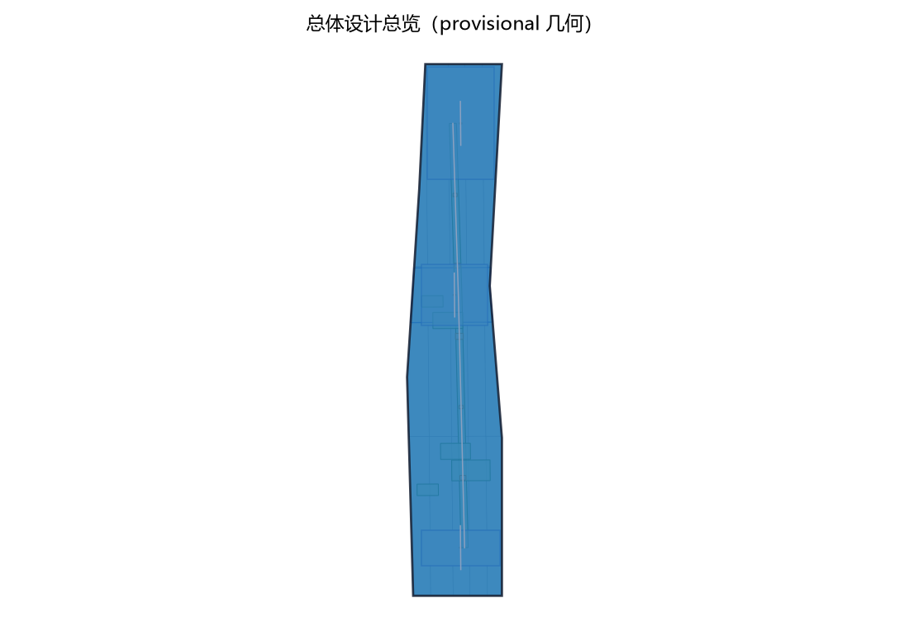
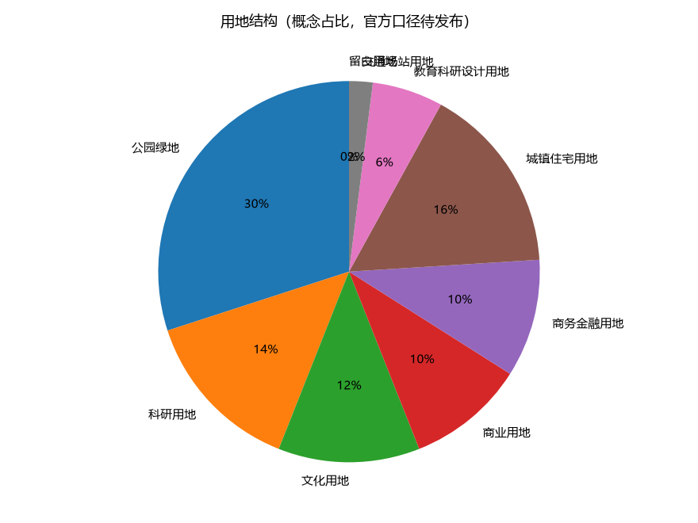
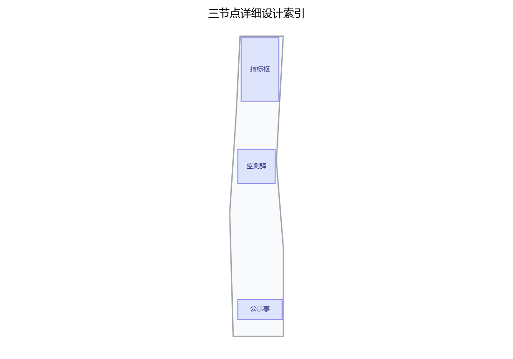
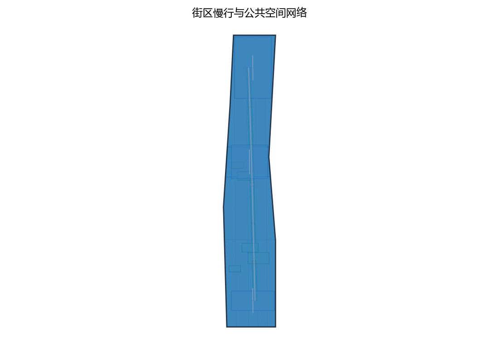
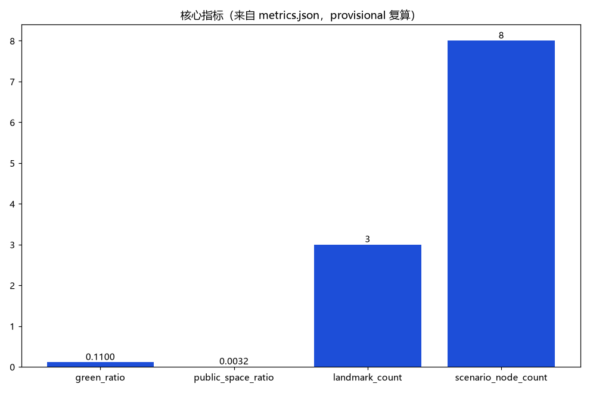

本方案为概念建议：围绕「指标智环」提出指标实施与监督体系的理念、结构与空间组织方式，不给出容积率、建筑高度、拆改留或工程实施结论，不编造任何指标监测数据。

## 设计依据与资料清单
资料清单所列公开史料、规划报道与通则规范等均为概念工作依据清单，并非本包已获取的数据；本包实际使用的全部数据见 sources.json，未获取项已在风险与缺失数据说明中如实标注。

本方案设计依据均为公开口径引用清单，非已获取数据：征集公告与公开任务书（明确要求构建世界级AI创新生态体系，提出产业重点、指标体系、创新网络和产业空间组织方式）；任务书三项formal核心视觉指标（site_area_sqm、green_ratio、public_space_ratio）须可由投稿者几何复算之说明；指标体系相关指导意见；国际国内城市指标治理公开资料。方案仅作概念建议，不引述、不推断任何官方监测数值。

> **证据锚点**：[source:DATA-SRC-OFFICIAL-ANNOUNCEMENT-20260509]、[source:DATA-SRC-AGENT-TASKBOOK-20260518]（组织方公告与任务书为文本口径依据）。

## 三层范围工作框架
三层成果逐级传导：统筹研究输出的指标治理环境与沿线协同判断约束总体设计，总体设计校核的指标节点布局、监测网络与时序生长落实到节点详设；每层均保留与任务书对应章节的机器可读证据锚点，便于评审对照。

工作框架分三层：统筹研究范围，研判产业与未来城市方向，界定指标实施与监督体系与AI创新生态的耦合关系；总体设计范围，以京张铁路遗址公园绿带为骨架，衔接城市更新与控规深度城市设计；重点区域范围，开展指标枢、监测驿、公示亭三节点详细设计。三层边界均为provisional，随复算、对接与意见反馈动态校核，不作为最终划定结论。

> **证据锚点**：[source:DATA-SRC-AGENT-TASKBOOK-20260518]（三层范围划分依据任务书官方文本口径）。

## 统筹研究范围产业与未来城市研究
产业与城市研究识别指标实施与监督的「适配」效应：以指标中枢与监测网络把沿线高校、科创片区、轨道站点与住区的发展目标有序组织为可采集、可监测、可公示的指标环境单元，形成「指标节点—科创片区—住区」三级联动结构；未来城市研究仅作方向性预判，不构成对用地与投资的承诺。
统筹研究聚焦协同关系判断（概念级）：沿线高校承担指标研究与验证场景，科创片区贡献产业与项目数据密度，轨道站点充当观测与展示窗口，住区侧重公示、知情与反馈。指标实施与监督体系宜嵌入既有创新网络而非另起炉灶，监测覆盖强度与功能优先级相协调。所有判断不预设数值、不指向具体地块，仅提供关系性研判供后续深化。

本主题与公开任务书口径三大定位、五大功能的对应关系（概念判断）：指标智环沿京张铁路遗址公园绿带与海淀科创腹地展开，同时服务百年京张文化带、都市 AI 生活体验带、AI 融合创新带三大定位——以京张铁路历史叙事与遗址记忆承接文化带内涵，以可感知的指标公示与体验场景支撑生活体验带，为创新带提供指标体系总控与监督闭环的治理底座支撑。五大功能（AI全栈自主创新体系、世界级AI创新生态、AI+场景赋能新范式、智能化AI活力城市、AI治理全球话语权）中，指标实施与监督体系直接支撑AI治理全球话语权与世界级AI创新生态的可量化落地，并可为其余三项功能提供可采集、可监测、可公示、可监督的公共数据与反馈底座。上述对应仅为概念级功能映射，定位与功能的承载分工以公开任务书及官方口径为准，不构成功能承诺。

> **证据锚点**：[source:DATA-SRC-PROVISIONAL-BOUNDARIES-20260605]（边界为 provisional，研究范围仅作概念示意）。

## 总体设计范围城市更新与控规深度城市设计
总体设计强调「以绿带为骨架的指标实施与监督环境」：依托京张铁路遗址公园绿带组织指标节点、监测网络与慢行骨架，监测设施可逆生长、街道可分时承载监测与节事需求；强调更新而非新建，优先利用存量空间植入指标功能；对控规指标只做校核建议，不预设数值结论。
总体设计概念：以京张铁路遗址公园绿带为骨架组织指标体系空间结构——指标中枢居中布局，监测网络沿绿带线性展开，公示与反馈空间与慢行节点结合。核心理念是「绿带即指标走廊」：采集、传输、展示、反馈在同一连续空间内完成。控规指标（容积率、高度等）仅作校核建议，不修改、不替代、不预判法定控制结论，涉及更新内容留待官方数据复算。

> **证据锚点**：[source:DATA-SRC-MOHURD-CONTROL-DETAILED-PLANNING]、[source:DATA-SRC-PROVISIONAL-BOUNDARIES-20260605]。

## 重点区域详细设计
三节点的设施选址均为概念点位，须经规划、数据、文保与主管部门评估及专业审查后重新落位；节点间的绿带动线与慢行通道构成完整指标动线，详细平面与剖面以图册与 geometry 层表达。

重点区域设三个原创节点，选址均为概念点位：指标枢——实施中枢，置绿带中段概念位置，承担指标汇聚、复算、发布与调度，轻量植入既有建筑群；监测驿——实施监测站，沿绿带分段设点，承担现场采集、巡检休憩与设备维护；公示亭——指标公示与公众监督平台，近住区与轨道站点，展示指标动态并提供匿名反馈入口。三节点以慢行轴串联，相互支撑。

> **证据锚点**：[data:PACKAGE-GEOMETRY]（三节点示意多边形来自本包 geometry/key_areas.geojson）。

## AI 创新生态、人才画像与 AI+ 场景
指标采集聚合AI、实施进度监测AI、指标偏离预警AI为主干场景，每处均配置人工复核兜底；公示解读AI、公众监督反馈AI为支撑场景；仅处理匿名聚合数据、关键决策人工复核双保险，不设过度监控；指标实施与监督为概念性机制建议，不替代法定统计与信息公开职责。
五类用户画像：创业者关注落地进度与政策兑现，AI开发者关注开放数据与接口，社区居民关注环境与公共服务类指标，学生关注学习与参与场景，运营管理人员关注采集与维护效率。五个AI+场景：指标采集聚合AI、实施进度监测AI、指标偏离预警AI、公示解读AI、公众监督反馈AI。全部数据匿名聚合、人工复核，设置最低数据量门槛，禁止过度监控与个体行为识别。

覆盖领域（概念口径）：指标实施与监督体系以交通、产业、空间、公共服务、文化与治理六个领域为监测与反馈主域——交通领域跟踪慢行优先、接驳与出行环境指标，产业领域跟踪科创与场景开放进度指标，空间领域跟踪用地结构与公共空间指标，公共服务领域跟踪设施配置与服务覆盖指标，文化领域跟踪文化资源保护与叙事传承指标，治理领域跟踪公示、反馈与监督闭环指标；六个领域均以匿名聚合口径统计，各领域指标清单以官方口径确认后细化。

五类AI+场景索引如下表（场景卡均为概念设计，全部数据一致适用匿名聚合、最小必要与人工复核原则）：

| 场景名称 | 空间载体 | AI能力 | 数据与隐私边界 | 运营主体 |
| --- | --- | --- | --- | --- |
| 指标采集聚合AI | 指标枢（绿带中段概念点位）及沿线采集点 | 产业、空间、公共服务类指标的多源采集、口径对齐与匿名聚合 | 仅处理匿名聚合数据，设置最低数据量门槛，不进行个体识别式追踪 | 指标枢运营团队（与主管部门数据协作） |
| 实施进度监测AI | 监测驿（沿绿带分段设点） | 实施进度与指标状态监测、公开口径校核 | 匿名化处理，关键结论经人工复核后发布 | 监测驿运营团队与专业检测机构 |
| 指标偏离预警AI | 监测驿与轨道站点接驳节点 | 指标偏离识别与分级预警 | 各领域指标（含交通）仅作街区级聚合统计，禁止过度监控 | 运营团队（预警发布经人工复核） |
| 公示解读AI | 公示亭（近住区与轨道站点） | 指标公示内容的多语解读与文化科普表达 | 仅基于公开数据二次加工，来源与口径可追溯 | 公示亭运营团队，志愿者辅助值守 |
| 公众监督反馈AI | 公示亭与线上公共服务反馈通道 | 公众意见归集、聚类与反馈跟踪，支撑治理闭环 | 匿名提交、人工复核兜底，不进行个体识别式追踪 | 运营方、社区议事代表与志愿团队协同 |

各场景均设置意见反馈通道，受理范围、答复时限与处理流程由运营方依法依规公开确定，不构成已确定的运营安排。

> **证据锚点**：[source:DATA-SRC-GENERATIVE-AI-INTERIM-MEASURES]（AI 生成内容治理表述的参照依据）。

## 用地、建筑规模与拆改留方案
拆改留坚持留改拆并举：以留为主保留遗址公园肌理与铁路历史遗存，存量建筑功能置换并预留指标监测化改造方向（采集接口、公示屏位），拆除仅限经个案论证的局部疏通慢行零星建筑；全部面积为概念口径，官方数据发布后复算。

指标监测设施与公共服务设施采用轻量、可逆、模块化植入方式，优先与既有建筑功能置换结合：如结合驿站、管理用房、站点附属与桥下等空间设置监测与公示功能，避免增量占地与大规模改造。不预设建筑面积、建筑高度或拆改留结论；涉及现状资源的局部利用，须以实测、产权与官方数据复算后另行判断，本方案不先行表态。

> **证据锚点**：[source:DATA-SRC-MNR-LAND-USE-CLASSIFICATION-202311]（用地分类名称参照现行国标口径）。

## 交通、轨道、市政与公共服务设施
以交通慢行优先为核心组织交通概念机制：连续慢行轴贯通指标枢、监测驿与公示亭，街道断面按日常与节事状态分时响应，衔接沿线高校、园区与轨道站点（接驳以步行与骑行为主），监测采集与公示设施沿慢行空间低干预布置；市政以集约共享为原则，监测设施与建筑一体化概念、优先利用现状设施条件；公共服务配置多语服务、指标公开与研习空间，AI决策均设人工复核。

交通以慢行优先为原则：连续慢行轴贯通指标枢、监测驿、公示亭，保障绿带步行与骑行连贯性；轨道站点与监测节点接驳顺畅，优先改善出入口与绿带的步行衔接。市政设施以集约共享为原则，优先依托既有管线与设施，减少重复开挖。公共服务设施结合监测节点复合设置。本环节仅给出方向性建议，不预设任何工程数值与实施结论。

人群覆盖（概念口径）：公共服务与活动面向全龄多元人群做包容性安排，兼顾适老与儿童友好——长者与银龄人群获得无障碍通行、大字版公示解读与就近休憩，儿童与亲子家庭获得安全慢行与科普活动空间，青年与通勤人群获得创新参与与休息驿站，学生获得研学机会，游客获得多语导览，从业者获得配套服务，并为残疾人等弱势群体预留包容性无障碍安排。具体配置以需求调查与专业评估后确定，不预设服务承诺。

> **证据锚点**：[source:DATA-SRC-MOHURD-URBAN-DESIGN-MEASURES]（市政与慢行设计表述的方法参照）。

## 蓝绿空间、公共空间与城市风貌
构建「绿带为轴、节点公园为珠」的蓝绿公共空间体系：以遗址公园绿带为蓝绿骨架串联沿线小微绿地与开敞空间，监测与公示设施与公园融合布置、宜轻宜透宜可逆，不遮挡历史遗迹与绿带视线；指示与解说系统统一克制；风貌延续京张铁路工业记忆语汇并与数据有序的新氛围对话，整体风貌导控克制统一，避免符号堆砌与口号化包装。

蓝绿公共空间体系保持连续：监测设施与公园绿地融合布置，采用低干预、可逆、可迁移形式，不破坏既有植被与遗址风貌；构筑物风貌克制统一，材质、色彩与尺度呼应铁路遗址公园特征；不遮挡历史遗迹观景视线，照明与标识系统克制，避免视觉与景观干扰；公共空间兼顾日常使用与指标展示双重属性，保持开放可达。

> **证据锚点**：[source:DATA-SRC-MOHURD-URBAN-DESIGN-MEASURES]（蓝绿空间组织的方法参照）。

## 更新项目清单、实施政策与分期计划
四类项目清单（指标基线建立/监测网络扩展/公示机制完善/年度复算上线）为概念清单，规模与投资估算均为建议性表述；政策建议（指标实施导则、多元主体共建、意见复核机制）均须依法依规论证，不构成政府或运营方承诺。

分期推进：近期1—3年，建立指标基线，试点指标枢与公示亭运行，明确数据口径与责任主体；中期3—5年，扩展监测驿网络，上线AI化监测与预警场景，完善公众参与渠道；远期5—10年，形成常态化监督与年度复算制度。实施政策方向：开放数据、匿名合规、参与激励与定期评估。具体项目清单与政策以征集方及官方口径为准，本方案仅作概念排序。

参与主体（概念分工，非责任承诺）：更新项目清单的实施建议覆盖多元参与主体——政府（主管部门统筹、口径发布与监督）、企业（科创与运营主体参与场景共建与数据接口开放）、高校（指标研究与验证支持）、居民与社区（反馈、议事与日常维护）、运营团队（监测与公示设施日常运行）、志愿者（公示亭值守与活动协助）、商户（沿带场景经营与联合共治）、专业团队（规划、数据与法务复核）等；建议以共建公约明确各方参与边界与责任，权责安排经正式程序确定后生效。

关于指标治理机制的深化方向，本方案仅作建议：决策层面可考虑以「谁采集、谁负责、谁公示」为原则，由主管部门牵头、运营团队执行、公众与专业团队参与议事，逐项明确指标的责任主体与更新频次；公开层面可考虑统一公开渠道，按月、季、年度分级披露指标口径、复算版本与数据来源，公示文字与图表须可追溯、可核验；监督层面可考虑以公示亭意见通道与人工复核为兜底，由专业团队定期开展独立校核，对公众质疑公开回应并记录在案。以上均为机制建议，不构成已确定的政府决策或实施安排。

年度活动体系（概念设想）：沿带可考虑组建年度活动品牌体系，设年度指标开放日、年度实施进度通报会与监测驿体验周三项品牌活动，辅以月度常规开放、季度复盘与四季节事；监测驿参观体验可实行预约制，开发者社区联盟可承办开放日与技术工作坊，活动与数据接口实行备案管理，公众参与以参与积分、公示致谢与志愿值守轮换等轻量机制回馈。活动名称、时间与主办方均须依法依规另行确定，本方案仅作活动机制建议，不构成已确定安排。

> **证据锚点**：[source:DATA-SRC-AGENT-TASKBOOK-20260518]（分期与实施条目对应任务书要求）。

## 指标体系、面积复算与合规矩阵
指标采集覆盖率、实施进度监测率、指标公示及时率、公众反馈处理率、年度复算执行率五类概念指标体系进入 metrics.json；三项formal核心指标（site_area_sqm、green_ratio、public_space_ratio）以本包几何复算为准，面积复算以官方文本口径为底，官方数据到位后整体复算并标注复算版本。

概念指标体系五项：指标采集覆盖率、实施进度监测率、指标公示及时率、公众反馈处理率、年度复算执行率，均以匿名聚合口径统计。三项formal核心指标（site_area_sqm、green_ratio、public_space_ratio）以本包几何复算为准；面积类复算以官方文本口径为底，官方数据到位后完成复算校核。合规矩阵逐项列明校验要素、数据来源与责任环节，随复算结果更新。

> **证据锚点**：[metric:green_ratio]、[metric:public_space_ratio]、[source:PACKAGE-GEOMETRY]。

## 风险、版权与合规说明
本方案为概念研究性设计，不构成行政审批依据，也不构成容积率、建筑高度、拆改留或工程可行性结论；风险已按监测数据隐私边界、指标口径统一、实施复杂度、公示与公众接受度四维度如实登记于 risk.json（应对原则：匿名聚合、最小必要、人工复核、来源标注与意见通道）；引用公开资料均已标注来源并注明获取时间，图形、名称与文字为原创或公共领域素材，若与既有标识雷同属巧合；指标表达不歪曲事实，未经授权不使用肖像商标论文图像等版权材料；正式实施前须完成多部门联审、数据安全与公开评估。

如实登记以下风险：数据口径差异与统计边界，监测隐私与匿名化边界，实施复杂度与跨部门协调，公众接受度与参与可持续性，技术依赖与系统故障韧性。本方案为概念建议，不构成工程、拆改留或数据承诺；原创节点命名与概念表述归投稿方，引用公开资料按征集要求标注，不涉及未公开数据与第三方未授权内容。

> **证据锚点**：[source:DATA-SRC-OFFICIAL-ANNOUNCEMENT-20260509]（征集规则为权属与合规表述的依据）。

## 参考资料

参考资料以公开口径为限：征集公告、公开任务书及其指标要求说明、指标体系相关指导意见、国际城市指标治理公开材料（纽约OneNYC、哥本哈根CPH 2025、伦敦城市指标dashboard、新加坡智慧国Smart Nation）、国内城市运行体征与指标平台公开资料（北京、上海、深圳、杭州）。以上均为引用清单，本方案未获取、未引用任何未公开数据。

### 国际案例（公开口径参考）

- **纽约OneNYC指标体系实施**：以长期规划为纲，配套年度进展报告与公开指标追踪，强调社区参与和问责机制，为指标公示与反馈提供组织范式。
- **哥本哈根CPH 2025气候计划监测**：以年度监测报告披露碳排放与目标对照，公开核算方法，体现「目标—监测—披露」闭环。
- **伦敦城市指标dashboard**：以在线面板公开城市运行指标，定期更新，降低公众理解与监督门槛。
- **新加坡智慧国（Smart Nation）指标治理**：以数据与AI支撑治理决策，注重隐私保护与公民反馈渠道，提示数据治理边界。

### 国内对标（公开口径参考）

- **北京智慧城市指标监测**：依托智慧城市评价与运行监测体系开展指标动态评估。
- **上海城市运行数字体征**：以「一网统管」数字体征系统实时监测城市运行状态，支撑处置闭环。
- **深圳新型智慧城市指标体系**：构建分级分类指标体系，支撑建设评估与决策。
- **杭州城市大脑指标治理**：以数据中枢汇聚指标、驱动场景治理闭环，强调指标与业务联动。

> **证据锚点**：[source:DATA-SRC-OFFICIAL-ANNOUNCEMENT-20260509]（本清单首条即组织方公开资料包）。
