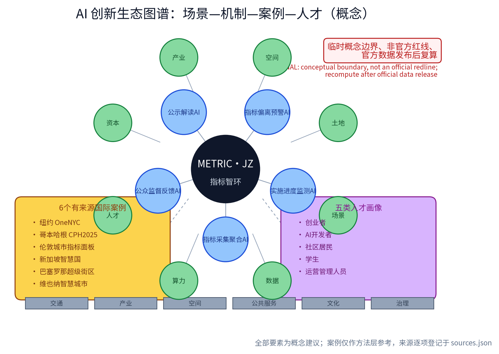

本方案为概念建议：围绕「指标智环」提出指标实施与监督体系的理念、结构与空间组织方式，不给出容积率、建筑高度、拆改留或工程实施结论，不编造任何指标监测数据。

## 设计依据与资料清单
本清单为概念工作依据清单，非已获取数据包：征集公告与公开任务书（明确要求构建世界级AI创新生态体系、提出产业重点、指标体系、创新网络和产业空间组织方式，并规定三项formal核心视觉指标 site_area_sqm、green_ratio、public_space_ratio 须可由投稿者几何复算）；城市设计管理办法、控规编制审批办法、用地用海分类指南、生成式人工智能服务管理暂行办法、无障碍环境建设法等公开规范；国际国内指标治理公开资料。方案仅作概念建议，不引述、不推断任何官方监测数值；未获取项已在风险与缺失数据说明中如实登记。

> **证据锚点**：[source:DATA-SRC-OFFICIAL-ANNOUNCEMENT]、[source:DATA-SRC-AGENT-TASKBOOK]、[source:DATA-SRC-MOHURD-URBAN-DESIGN-MEASURES]。

## 三层范围工作框架
按官方公告文本口径，本工程设三层官方范围：统筹研究范围约 43.6 平方公里，总体设计范围约 11.4 平方公里，重点区域约 368.4 公顷；本包子范围与总体设计范围口径一致（概念子集），全部边界为 provisional 临时几何，官方正式多边形发布后整体复算，不作最终划定结论。三层成果逐级传导：统筹研究输出的指标治理环境与区域协同判断约束总体设计，总体设计校核的指标节点布局、监测网络与时序生长落实到节点详设；每层均保留机器可读证据锚点，便于评审对照。

三层分工（概念级）：统筹研究范围研判产业与未来城市方向，界定指标实施与监督体系与AI创新生态的耦合关系；总体设计范围以京张铁路遗址公园绿带为骨架，衔接城市更新与控规深度城市设计；重点区域开展指标枢、监测驿、公示亭三节点详细设计。边界精度与置信等级随复算、对接与意见反馈动态校核，不预设官方红线。

> **证据锚点**：[source:DATA-SRC-OFFICIAL-ANNOUNCEMENT]（三层官方范围文本口径）、[source:DATA-SRC-PROVISIONAL-BOUNDARIES]（本包 provisional 几何）、[metric:site_area_sqm]。

## 统筹研究范围产业与未来城市研究
任务书三大定位（百年京张文化带、都市AI生活体验带、AI融合创新带）与五大功能（AI全栈自主创新体系、世界级AI创新生态、AI+场景赋能新范式、智能化AI活力城市、AI治理全球话语权）的显式映射（概念判断）：指标智环以京张铁路历史叙事与遗址记忆承接文化带内涵，以可感知的指标公示与体验场景支撑生活体验带，为创新带提供指标体系总控与监督闭环的治理底座；指标体系与监督闭环直接支撑AI治理全球话语权与世界级AI创新生态的可量化落地，并为其余三项功能提供可采集、可监测、可公示的公共数据与反馈底座。上述对应仅为概念级功能映射，不构成功能承诺。

区域协同（概念级）：「三区两翼」协作环中，本概念与北纬社区（指标体系民生感知协同）、未来科学城（算力与数据治理协同）、怀柔科学城（指标研究方法协同）、经开区（产业指标落地协同）及京津冀区域（指标口径衔接）建立建议性协同方向；沿线高校承担指标研究与验证场景，科创片区贡献产业与项目数据密度，轨道站点充当观测与展示窗口，住区侧重公示、知情与反馈。所有判断不预设数值、不指向具体地块，仅提供关系性研判供后续深化。

> **证据锚点**：[source:DATA-SRC-AGENT-TASKBOOK]（三区两翼与功能定位文本口径）、[source:DATA-SRC-PROVISIONAL-BOUNDARIES]。

## 总体设计范围城市更新与控规深度城市设计
总体设计强调「以绿带为骨架的指标实施与监督环境」：依托京张铁路遗址公园绿带组织指标节点、监测网络与慢行骨架，监测设施可逆生长、街道可分时承载监测与节事需求；强调更新而非新建，优先利用存量空间植入指标功能；控规指标（容积率、高度等）仅作校核建议，不修改、不替代、不预判法定控制结论。核心理念是「绿带即指标走廊」：采集、传输、展示、反馈在同一连续空间内完成。

### 品牌与视觉识别（概念）
「METRIC·JZ」视觉系统以指标环（圆环+节点符号）为基础形制：标志以京张铁轨意象抽象为环形刻度，三节点（指标枢、监测驿、公示亭）对应环形三段刻度；标准色取遗址灰、轨道红与数据蓝三色；组件族包括标识、字标、图标、展陈模块与导视系统。原创概念名称与标识在品牌在先权利检索完成前均按内部工作代号处理，不用于外部注册与正式发布（详见风险、版权与合规说明）。

### 可逆公共空间组件库（概念）
「组件库」为可逆公共空间构件集：公示屏柱、模块化监测箱、可收放座椅、临时展架、地面刻度铺装与分时围挡六类构件，均以低干预、可逆、可迁移为原则，可组合出公示角、监测点、研学台与节事场，便于分期试错与撤收，不构成建设承诺。

> **证据锚点**：[source:DATA-SRC-MOHURD-CONTROL-DETAILED-PLANNING]（控规校核边界表述）、[data:geometry/site_boundary.geojson]、[metric:green_ratio]。

## 重点区域详细设计
三节点选址均为概念点位，须经规划、数据、文保与主管部门评估及专业审查后重新落位；节点间的绿带动线与慢行通道构成完整指标动线，详细平面与剖面以图册与 geometry 层表达。节点与「三区两翼」的映射（概念级）：指标枢对应创新带治理中枢（与未来科学城数据治理协同），监测驿沿绿带分段设点（与北纬社区感知协同、经开区产业指标协同），公示亭近住区与轨道站点（与高校研学、怀柔科学城方法协同），节点—三区两翼协作环经年度复算与对接动态校核。

三节点设计任务（概念）：指标枢——实施中枢，置绿带中段概念位置，承担指标汇聚、复算、发布与调度，轻量植入既有建筑群；监测驿——实施监测站，沿绿带分段设点，承担现场采集、巡检休憩与设备维护；公示亭——指标公示与公众监督平台，近住区与轨道站点，展示指标动态并提供匿名反馈入口。「地标目录」按枢纽型地标（指标枢）、廊道型地标（绿带刻度轴）、节点型地标（公示亭）三级登记，附荣誉展示区（公众监督成果与志愿贡献公示墙）与组件库组合方案。三节点以慢行轴串联，相互支撑。

> **证据锚点**：[data:geometry/key_areas.geojson]（三节点示意多边形）、[source:DATA-SRC-AGENT-TASKBOOK]（地标与荣誉展示条目）。

## AI 创新生态、人才画像与 AI+ 场景
AI技术协议（概念）：每类AI应用均配置模型评测（基准测试与误报率登记）、数据质量（口径校验、缺失值与异常值处理）、误差分群（按街区、时段与指标类别分群复盘）与运行监测（预警触发记录、人工复核与故障降级）四类协议；指标采集聚合AI、实施进度监测AI、指标偏离预警AI为主干场景，每处均配置人工复核兜底；公示解读AI、公众监督反馈AI为支撑场景；仅处理匿名聚合数据、关键决策人工复核双保险，禁止过度监控，不进行个体识别式追踪；指标实施与监督为概念性机制建议，不替代法定统计与信息公开职责。

五类人才画像：创业者关注落地进度与政策兑现，AI开发者关注开放数据与接口，社区居民关注环境与公共服务类指标，学生关注学习与参与场景，运营管理人员关注采集与维护效率。覆盖领域（概念口径）：交通、产业、空间、公共服务、文化与治理六域——交通跟踪慢行优先与接驳环境指标，产业跟踪科创与场景开放进度指标，空间跟踪用地结构与公共空间指标，公共服务跟踪设施配置与服务覆盖指标，文化跟踪文化资源保护与叙事传承指标，治理跟踪公示、反馈与监督闭环指标；各领域指标清单以官方口径确认后细化。数据架构分采集层、聚合层、发布层三层，设置最低聚合阈值与数据字典，全链路匿名聚合、人工复核。

### AI+ 场景卡（10张，均为概念设计，全部数据适用匿名聚合、最小必要与人工复核）
| 场景卡 | 空间载体 | AI能力 | 数据与隐私边界 | 运营主体 |
| --- | --- | --- | --- | --- |
| 指标采集聚合AI | 指标枢及沿线采集点 | 多源采集、口径对齐与匿名聚合 | 仅匿名聚合数据，设最低数据量门槛，不进行个体识别式追踪 | 指标枢运营团队 |
| 实施进度监测AI | 监测驿（沿绿带分段） | 实施进度与指标状态监测、公开口径校核 | 匿名化处理，关键结论经人工复核后发布 | 监测驿运营团队与专业检测机构 |
| 指标偏离预警AI | 监测驿与轨道站点接驳节点 | 指标偏离识别与分级预警 | 仅街区级聚合统计，禁止过度监控 | 运营团队，预警经人工复核 |
| 公示解读AI | 公示亭（近住区与轨道站点） | 指标公示内容多语解读与文化科普表达 | 仅基于公开数据二次加工，来源与口径可追溯 | 公示亭运营团队，志愿者辅助 |
| 公众监督反馈AI | 公示亭与线上反馈通道 | 公众意见归集、聚类与反馈跟踪 | 自由文本先脱敏后处理，匿名提交、人工复核兜底 | 运营方、社区议事代表与志愿团队 |
| 慢行流量态势AI | 慢行轴沿线监测驿 | 慢行流量街区级态势感知与节事疏导 | 仅街区级聚合计数，不识别个体轨迹 | 监测驿运营团队 |
| 绿地健康度AI | 绿带公园节点 | 植被与铺装状态巡检辅助 | 仅设施级聚合数据，人工复核维修建议 | 公园管养单位协作 |
| 多语导览AI | 公示亭与线上平台 | 指标与文化的多语种导览生成 | 仅公开资料加工，生成内容人工复核 | 公示亭运营团队 |
| 研学互动AI | 站点研学台 | 指标科普问答与研习任务生成 | 无账号即可用，匿名会话，不留存个体信息 | 高校志愿者协作 |
| 舆情归因AI | 线上反馈平台 | 反馈主题聚类与改进归因 | 脱敏文本聚合分析，人工复核后公开 | 运营方与专业团队 |

### 产业验证测试场景（3个，概念）
| 测试协议 | 测试对象 | 验证要点 | 通过判据（概念） | 复算触发 |
| --- | --- | --- | --- | --- |
| 指标口径一致性测试 | 指标采集聚合AI | 多源口径对齐与匿名聚合正确性 | 抽样复核一致率达标并经人工确认 | 口径或来源变更 |
| 预警准确率测试 | 指标偏离预警AI | 分级预警的准确率与误报率 | 误报率低于概念阈值且人工复核通过 | 模型或数据质量变更 |
| 公示可读性测试 | 公示解读AI | 多语解读的准确性与可读性 | 目标人群抽样可懂率达标 | 公示内容结构变更 |

> **证据锚点**：[source:DATA-SRC-GENERATIVE-AI-INTERIM-MEASURES]（AI生成内容治理表述参照）、[metric:industry_test_scenario_count]、[metric:persona_count]。

## 用地、建筑规模与拆改留方案
用地比例（概念口径，单一口径：以本包 provisional 总体设计范围边界为分母，按用地分类国标名称聚合计算；官方正式边界发布后按同一公式复算，官方控规条件与实测数据到位前不用于任何法定用途）：绿地与开敞空间约占 33%，科研与产业用地约占 25%，公共管理与公共服务用地约占 14%，商业与商务用地约占 12%，居住用地约占 11%，交通场站用地约占 3%，留白与机动用地约占 2%；各项比例以 geometry/land_use.geojson 分类面积聚合得出，公式与概念来源见 metrics.json 与合规矩阵，聚合口径与复算触发随官方数据发布更新。

拆改留坚持留改拆并举：以留为主保留遗址公园肌理与铁路历史遗存，存量建筑功能置换并预留指标监测化改造方向（采集接口、公示屏位），拆除仅限经个案论证的局部疏通慢行零星建筑。指标监测设施与公共服务设施采用轻量、可逆、模块化植入方式，优先与既有建筑功能置换结合（驿站、管理用房、站点附属与桥下空间等），避免增量占地与大规模改造；不预设建筑面积、建筑高度或拆改留结论，涉及现状资源的局部利用须以实测、产权与官方数据复算后另行判断。

> **证据锚点**：[source:DATA-SRC-MNR-LAND-USE-CLASSIFICATION-202311]（用地分类名称参照）、[metric:green_ratio]、[metric:public_space_ratio]。

## 交通、轨道、市政与公共服务设施
以交通慢行优先为核心组织交通概念机制：连续慢行轴贯通指标枢、监测驿与公示亭，街道断面按日常与节事状态分时响应，衔接沿线高校、园区与轨道站点（接驳以步行与骑行为主），监测采集与公示设施沿慢行空间低干预布置；轨道站点与监测节点接驳顺畅，优先改善出入口与绿带的步行衔接；市政以集约共享为原则，优先依托既有管线与设施，减少重复开挖；公共服务配置多语服务、指标公开与研习空间，AI决策均设人工复核。本环节仅给出方向性建议，不预设任何工程数值与实施结论。

人群覆盖（概念口径）：公共服务面向全龄多元人群做包容性安排，兼顾适老与儿童友好——长者与银龄人群获得无障碍通行、大字版公示解读与就近休憩，儿童与亲子家庭获得安全慢行与科普活动空间，青年与通勤人群获得创新参与与休息驿站，学生获得研学机会，游客获得多语导览，从业者获得配套服务，并为残疾人等弱势群体预留包容性无障碍安排；无障碍设施范围与无障碍环境建设法限定的服务场景边界一致，不泛化到全部公共空间，具体配置以需求调查与专业评估后确定。

> **证据锚点**：[source:DATA-SRC-MOHURD-URBAN-DESIGN-MEASURES]（慢行与市政方法参照）、[source:DATA-SRC-BARRIER-FREE-ENVIRONMENT-LAW]（无障碍边界）、[metric:road_network_length_m]。

## 蓝绿空间、公共空间与城市风貌
构建「绿带为轴、节点公园为珠」的蓝绿公共空间体系：以遗址公园绿带为蓝绿骨架串联沿线小微绿地与开敞空间，监测与公示设施与公园融合布置、宜轻宜透宜可逆，不遮挡历史遗迹与绿带视线；指示与解说系统统一克制；风貌延续京张铁路工业记忆语汇并与数据有序的新氛围对话，融合中关村创新文化与AI新文化叙事（「百年轨枕·数据刻度」叙事线），整体风貌导控克制统一，避免符号堆砌与口号化包装。

文化、导视与国际传播系统（概念）：文化叙事按京张铁路历史层、中关村创新层、AI新文化层三层展开，文化资源保护与叙事传承指标进入指标体系统计；导视系统统一多语种标识规范，含无障碍触觉与语音导视；国际传播依托年度指标开放日、多语公示内容与开发者社区开放数据接口，向全球开发者与研究者传播指标体系方法论，品牌识别度、场景可感知度与国际传播力随年度活动与复算结果滚动提升。

> **证据锚点**：[source:DATA-SRC-MOHURD-URBAN-DESIGN-MEASURES]（蓝绿与风貌方法参照）、[metric:green_space_area_sqm]。

## 更新项目清单、实施政策与分期计划
试点计划（概念，非已批准的政府安排）：以「指标枢+公示亭」样板段为首期试点区域（沿绿带中段约 1 公里概念区间），责任类型与协作方、前置条件、数据字典、资源区间、维护要求、KPI、决策门、退出/回滚与年度复算流程均列为可转化要素，见下表；参与主体（概念分工，非责任承诺）覆盖政府（主管部门统筹、口径发布与监督）、企业（科创与运营主体参与场景共建与数据接口开放）、高校（指标研究与验证支持）、居民与社区（反馈、议事与日常维护）、运营团队（监测与公示设施日常运行）、志愿者（公示亭值守与活动协助）、商户（沿带场景经营与联合共治）、专业团队（规划、数据与法务复核）等，建议以「指标共治公约」明确各方参与边界与责任，权责安排经正式程序确定后生效。

| 试点要素 | 近期1—3年 | 中期3—5年 | 远期5—10年 |
| --- | --- | --- | --- |
| 责任类型与协作方 | 运营牵头，社区议事会、高校、志愿团队协作 | 主管部门统筹口径，区级平台协作 | 多主体共建联盟常态化运行 |
| 前置条件 | 官方边界与控规条件发布、口径确认 | 试点评估通过、数据接口标准确定 | 年度复算制度成熟 |
| 数据字典与维护要求 | 指标定义、统计边界、更新频次入册 | 字典版本化，维护责任到岗 | 字典公开可查，年度评审 |
| 资源区间（定性） | 低—中（试点小额） | 中 | 中—高（视评估结果） |
| KPI与决策门 | 试点运行满1年复核数据质量与公众参与 | 监测覆盖率与预警准确率达概念阈值 | 常态化监督与年度复算执行率 |
| 退出/回滚与年度复算 | 试点未达标即停项撤收，设施可逆回收 | 分节点撤收与置换 | 年度复算公示，未达标触发复盘 |

分期推进（概念）：近期1—3年，建立指标基线，试点指标枢与公示亭运行，明确数据口径与责任主体；中期3—5年，扩展监测驿网络，上线AI化监测与预警场景，完善公众参与渠道；远期5—10年，形成常态化监督与年度复算制度。实施政策方向：开放数据、匿名合规、参与激励与定期评估；「牵头+协作」责任矩阵（RACI概念版）：指标定义由主管部门牵头、专业团队协作，采集与监测由运营团队牵头、专业机构协作，公示与反馈由运营方牵头、社区议事与志愿者协作，年度复算由专业团队牵头、主管部门复核。场景开放与招引转化（概念）：开发者社区联盟承办开放日与技术工作坊，开放数据接口备案管理，形成「场景开放—开发者参与—指标反馈—成果转化」的招引转化机制；年度活动体系（概念）见下表，活动名称、时间与主办方均须依法依规另行确定。

| 年度活动品牌 | 内容设想 | 参与机制 |
| --- | --- | --- |
| 年度指标开放日 | 指标口径发布、成果台账展示、数据接口开放 | 预约制参观，开发者社区联盟承办，备案管理 |
| 年度实施进度通报会 | 进度与指标状态通报、公众质询回应 | 社区议事代表参与，意见通道公开记录 |
| 监测驿体验周 | 监测驿参观、研学互动、志愿值守体验 | 预约轮换制，参与积分与公示致谢回馈 |

> **证据锚点**：[source:DATA-SRC-AGENT-TASKBOOK]（分期与运营条目）、[metric:annual_program_count]、[metric:phase_count]。

## 指标体系、面积复算与合规矩阵
概念指标体系五项：指标采集覆盖率、实施进度监测率、指标公示及时率、公众反馈处理率、年度复算执行率，均以匿名聚合口径统计，每项指标均登记数据来源、计算公式、置信等级、用途限制与复算触发（见 metrics.json 与合规矩阵），仅作概念指标，不作为现状监测结果；三项formal核心指标（site_area_sqm、green_ratio、public_space_ratio）以本包几何复算为准，面积复算以官方文本口径为底，官方数据到位后整体复算并标注复算版本。

面积复算与合规矩阵：全部面积与比例为概念口径，精度按 provisional 边界置信等级限制展示（保留两位有效小数以内），官方正式边界与控规条件发布后按同一公式复算；合规矩阵逐项列明校验要素、数据来源与责任环节，随复算结果更新。AI治理三句式在本方案全文一致适用：仅匿名聚合（不进行个体识别式追踪、禁止过度监控）；关键决策人工复核（预警发布、公示结论与处置建议均经人工复核）；禁止过度监控（不设常开式识别设备、不留存个体行为画像）。

> **证据锚点**：[metric:green_ratio]、[metric:public_space_ratio] 见 metrics.json 复算口径；几何与边界口径见 [source:PACKAGE-GEOMETRY] 与 [source:DATA-SRC-PROVISIONAL-BOUNDARIES]，官方数据发布后整体复算。

## 风险、版权与合规说明
本方案为概念研究性设计，不构成行政审批依据，也不构成容积率、建筑高度、拆改留或工程可行性结论；风险按监测数据隐私边界、指标口径统一与实施复杂度、运营维护与资源投入、公示与公众接受度、政策与数据发布不确定性、技术依赖与系统故障韧性六维度如实登记于 risk.json（应对原则：匿名聚合、最小必要、人工复核、来源标注与意见通道、可逆撤收与复算触发）。公众反馈AI的数据治理与人工兜底（概念）：自由文本先脱敏后处理、最小收集原则、聚合阈值（低于阈值仅展示区间）、访问日志与权限分级、保存期限与删除流程、错误更正与申诉通道、事件响应预案与公开反馈闭环（受理—处理—回复—公示），全部流程由运营方依法依规公开确定，不构成已确定的运营安排。

品牌在先权利与使用边界：本包未完成官方商标检索，原创名称与标识（「指标智环」「METRIC·JZ」及视觉系统）在检索完成前一律按内部工作代号处理，不用于外部注册、正式发布或商业使用；若与既有标识雷同属巧合，正式实施前须完成在先权利检索与权利清理。版权与资产台账：字体（OFL授权的Noto Sans SC）、图像与图表（本包自产，AI生成）、地图与几何（自产 provisional 几何，未使用未授权底图）、数据（仅公开口径引用）、代码与库（本包自产脚本与开源库）、生成图形（AI生成）、品牌标识（原创概念）与案例材料（公开渠道来源，逐项登记于 sources.json）均在台账中逐项列明来源、许可范围与再分发边界；license 为 COMMUNITY-DISPLAY-ONLY，即仅限本征集展示与评审场景下浏览、演示与评审引用，不授予修改再分发权，后续专业深化须另行取得权利授权与许可确认。引用公开资料均已标注来源并注明获取时间；正式实施前须完成多部门联审、数据安全与公开评估。

> **证据锚点**：[source:DATA-SRC-OFFICIAL-ANNOUNCEMENT]（征集规则为权属与合规表述依据）、[source:DATA-SRC-GENERATIVE-AI-INTERIM-MEASURES]。

## 参考资料
参考资料以公开口径为限，本方案未获取、未引用任何未公开数据；以下国际案例均逐项登记于 sources.json（含机构页面URL、发布与获取时间、复用边界），为指标治理方法参考，不构成机制成效或可复制性判断依据；国内对标（北京智慧城市评价、上海城市运行数字体征、深圳新型智慧城市指标、杭州城市大脑指标治理）目前仅有公开报道级信息，未完成逐项来源登记，按待研究假设处理，不进入正式证据。

### 国际案例（公开口径，逐项有来源）
| 案例 | 机制要点 | 来源 |
| --- | --- | --- |
| 纽约 OneNYC | 长期规划+年度进展报告+公开指标追踪，强调社区参与与问责 | [source:CASE-NYC-ONENYC] |
| 哥本哈根 CPH2025 | 气候目标「目标—监测—披露」年度闭环，公开核算方法 | [source:CASE-CPH-2025-CLIMATE] |
| 伦敦城市指标面板 | 在线面板公开城市运行指标，降低公众理解与监督门槛 | [source:CASE-LONDON-DASHBOARD] |
| 新加坡智慧国 | 数据与AI支撑治理决策，注重隐私保护与公民反馈渠道 | [source:CASE-SG-SMART-NATION] |
| 巴塞罗那超级街区 | 慢行优先+公共空间归还街道，街区级监测与公众参与 | [source:CASE-BCN-SUPERBLOCKS] |
| 维也纳智慧城市 | 城市级指标体系与年度监测报告制度，多方共治 | [source:CASE-VIE-SMART-CITY] |

> **证据锚点**：[source:DATA-SRC-OFFICIAL-ANNOUNCEMENT]（本清单首条即组织方公开资料包）、[metric:global_case_count]。
