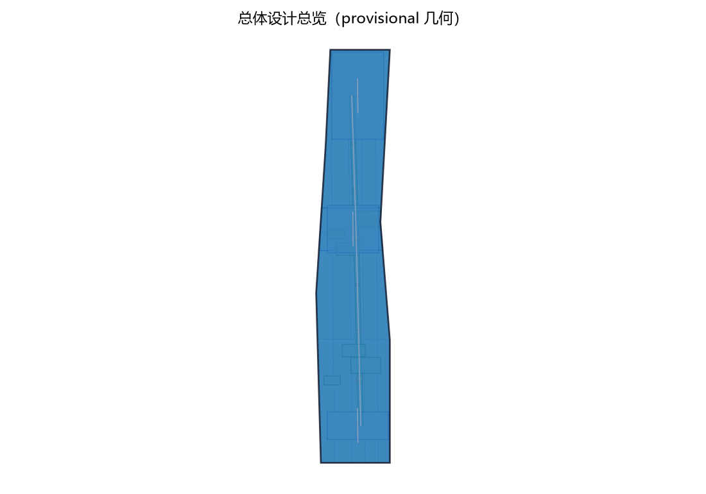
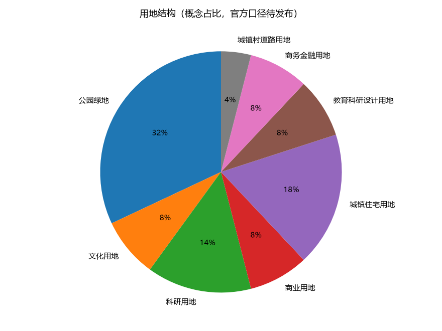
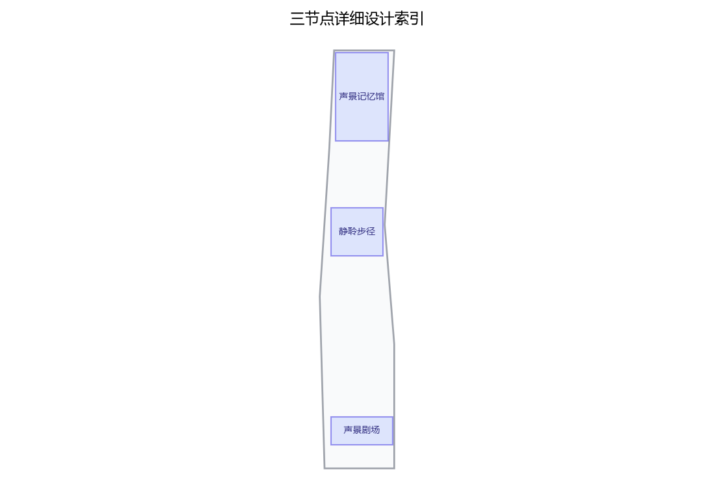
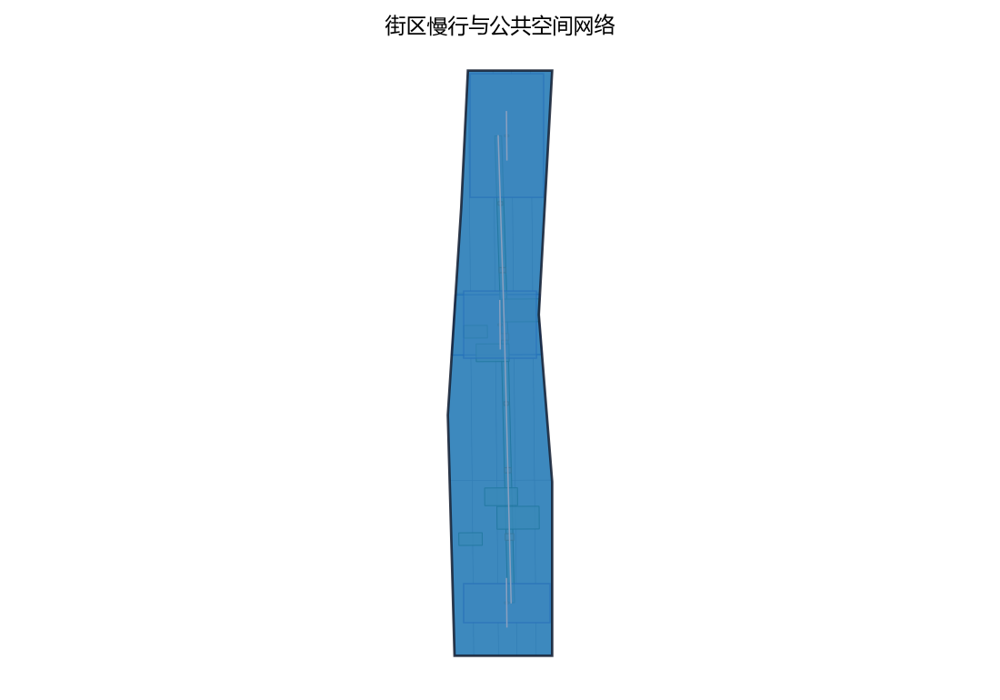
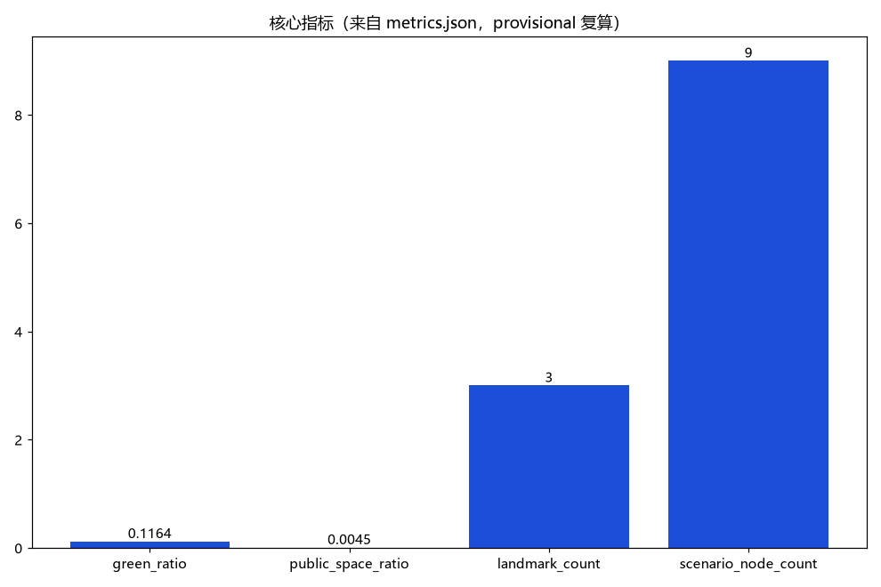

本方案以"声景"为主线，将百年京张的声音记忆与AI时代的声环境治理组织为"一馆一径一带"：声景记忆馆（众智园侧）、静聆步径（AI原点社区侧）、声景剧场（大钟寺侧），并以五类AI+场景（噪声监测AI、声景导览AI、声景档案AI、活动声控AI、静音保障AI）与五项要素机制（噪声防治分区、声景版权与来源登记、分时声景许可、居民声景议事、年度声环境公示）构成治理闭环。命名含义：SND取Sound之声，JZ为京张缩写；"智环"既指沿一带组织的空间环带，也指"采集—登记—治理—公示—议事"的声音信息闭环。全部成果均为概念建议、参考方案，不替代正式规划，不构成政府审定结论；所有涉及面积与指标的表述均保留provisional标记并说明正式数据发布后的复算触发条件。

## 设计依据与资料清单

主控依据为公开（或清权）渠道可得的三类材料。一是百年京张AI创新带城市设计开源征集任务书摘录，确定三大定位、五大功能、三区两翼布局、六项智能体任务（agent.1—agent.6）与边界条款；二是投稿技能文件，确定提案结构、"概念建议/参考方案/可供专业团队深化研究"的措辞要求与诚实表述规范；三是两个公开方向依据——声景生态学公开学术方向（把声景作为景观与生态资源加以记录和研究）与噪声污染防治公开法规方向（《中华人民共和国噪声污染防治法》2022年6月5日起施行所确立的分区化、精细化管理取向）。场地信息以仓库公开场地包、来源登记与公开地图语境为准，不使用非公开数据。

本包总体范围暂以provisional临时几何表达，标记为低置信度约束，仅用于概念组织、视觉说明与后续替换复算，不代表法定红线、权属或规划许可。声音档案素材在本方案中只表达"公开征集/自采＋来源登记＋权利注明"的机制意向，不预先指认任何未授权素材；历史声音叙事仅以公开史料为依据。待官方边界、官方声环境监测数据与控规条件发布后，本包相关面积与指标触发复算。保留意见、线索与资料缺口将按要求登记于来源台账。

> **证据锚点**：[source:DATA-SRC-OFFICIAL-ANNOUNCEMENT-20260509]、[source:DATA-SRC-AGENT-TASKBOOK-20260518]（组织方公告与任务书为文本口径依据）。

## 三层范围工作框架

三层范围以"问题—空间—运营—证据—退出"责任链贯通，避免宏观战略、总图结构与节点设计各说各话。统筹研究范围回答"声景如何成为一带的记忆资产与产业资源"，将声景生态学学术方向与噪声污染防治法规方向转译为战略、产业与治理机制；总体设计范围回答"声环境如何在带上分区与组织"，把"一馆一径一带"与噪声防治分区落实到总图结构、静聆动线与城市设计导则方向；重点区域范围回答"三节点如何差异化落地"，把任务落实到功能、空间与公共体验界面三个可校验的原型。

| 层级 | 核心问题 | 声景智环的回答 | 主要成果 |
| --- | --- | --- | --- |
| 统筹研究范围 | 声景如何成为记忆与产业资源 | 双方向转译、声音产业生态、区域声景协作 | 战略研究、对标案例、治理机制概念 |
| 总体设计范围 | 声环境如何分区与组织 | 一馆一径一带、噪声防治分区、静聆动线 | 总图结构、导则方向、指标体系 |
| 重点区域范围 | 三节点如何落地 | 记忆馆／步径／剧场三个原型 | 节点概念设计与场景-空间映射 |

三层成果互为输入：统筹层提供方向与案例证据，总体层提供结构与指标框架，重点层提供可校验的落地原型。三层中出现的所有面积与指标均从本包提交的provisional几何按EPSG:4548复算，属于低置信度设计模型值，官方数据发布后按同一公式复算替换。

> **证据锚点**：[source:DATA-SRC-AGENT-TASKBOOK-20260518]（三层范围划分依据任务书官方文本口径）。

## 统筹研究范围产业与未来城市研究

在本方案中，三大定位转译为可"听"的文化带、可"感"的生活带、可"用"的创新带：声音记忆使百年京张文化带能以声音被感知；静聆体验使都市AI生活体验带的公共空间品质可被听觉检验；声学AI与声音产业则构成AI融合创新带的产业线索。五大功能中，"AI+场景赋能新范式"对应五类声景AI场景，"智能化AI活力城市"对应噪声防治分区与静音城市概念，"AI治理全球话语权"对应年度声环境公示与居民声景议事等治理机制概念。三区两翼中，众智园承载声景档案与全栈验证，AI原点社区承载静聆与导览试点，大钟寺承载演出声控；中关村科技服务翼对接声音科技产业要素，小月河场景赋能翼承担声景场景测试与公共体验路径。

对标案例仅按公开渠道概述，不编造细节：世界声景计划（20世纪70年代西蒙弗雷泽大学舒尔茨（R. Murray Schafer）等倡导的"声景"概念与声景漫步方法）；声景生态学学术方向（2011年前后以Pijanowski等在BioScience发表的综述为标志，将声景作为生态研究对象）；日本音风景百选（日本环境省发起的声音遗产遴选项目，将地域特色声音列入公开名录）；巴黎与伦敦的城市声景公开实践（巴黎大区设有噪声观察机构Bruitparif，伦敦公布环境噪声策略与噪声地图，均以声环境信息公开与治理为方向）；世界声景计划公开档案方向（以全球征集方式汇集环境声音）。本方案只借鉴其"公开征集＋来源登记＋声景漫步＋环境信息公开"机制，不照搬规模。

产业与未来城市方向为概念线索：AI音频处理、声学材料与听觉健康、声音设计与声景咨询可作为可深化的产业方向，不列企业、不编造投资；未来城市以"可倾听的安静"为气质的听觉友好城市概念。区域协同方面，与北纬社区、未来科学城、怀柔科学城、经开区及京津冀，可交换声景档案方法、监测数据口径与治理机制模板，均为概念建议。视觉识别方向：以原创声波图形＋铁轨刻度组合的标识方向，与一带整体Logo系统区分定位，不使用未授权字体、商标与图形。

> **证据锚点**：[source:DATA-SRC-PROVISIONAL-BOUNDARIES-20260605]（边界为 provisional，研究范围仅作概念示意）。

## 总体设计范围城市更新与控规深度城市设计

总体结构为"一馆一径一带"：声景记忆馆（众智园侧）、静聆步径（AI原点社区侧）、声景剧场（大钟寺侧），以南北贯通的静聆动线串联，并以东西向缝合的绿道与京张铁路遗址公园绿带衔接（概念建议）。噪声防治分区为"静音区—均衡区—活力区"三类概念分区：静音区保障安静聆听（步径与居住侧绿地），均衡区组织日常声环境，活力区承载演出与人气活动（剧场周边）。分区仅为概念方向，不给出噪声数值或分贝值，不替代法定声环境功能区划。

控规深度以"问题—空间对象—指标—资料缺口—复算路径"表达，不输出容积率、建筑高度、道路红线或工程结论。本方案提出城市设计导则的方向性建议：声景设计导则（建筑界面、铺装与绿化对声环境的贡献方向）、声音装置设置与分时管控原则、低眩光与低噪设施导向。更新方法为存量优先、可逆轻改造：优先利用可保留建筑与既有绿带，待现状、权属、文保与结构调查后逐项核定保留、适配、移位或删除，不预设具体拆改留结论。所有空间落地建议均表述为概念建议与参考方案，可供专业团队按官方边界与控规条件深化研究。

> **证据锚点**：[source:DATA-SRC-MOHURD-CONTROL-DETAILED-PLANNING]、[source:DATA-SRC-PROVISIONAL-BOUNDARIES-20260605]。

## 重点区域详细设计

三个节点同时作为人文类纪念性地标的候选：记忆馆是"声音记忆地标"，步径是"安静聆听地标"，剧场是"公共对话地标"，均避免过度娱乐化与网红化表达。三个节点分别描述其功能、空间与公共体验界面如下。

### 声景记忆馆（众智园侧）

功能：京张铁路声音记忆的收藏与展演节点，收藏与展示意向包括汽笛、编组、报站等历史声音档案，叙事仅以公开史料为依据（如京张铁路1909年建成通车、詹天佑主持修建、青龙桥"人"字形展线等公开史实），声音素材须为公开渠道档案或自采录音，逐条登记来源与权利，不使用侵权素材。空间：概念包络含试听间、口述录音间、小型展演厅与档案阅览角，优先存量改造与可逆轻改造，不给定建筑规模数值。公共体验界面：人工讲解、亲自试听、口述征集与志愿者"听导"服务；展演与征集活动均表述为策划意向，以公开日程运营，不把设想活动写成已确定安排。

### 静聆步径（AI原点社区侧）

功能：沿绿带的安静声景步道，设静音区、自然声景节点与声景解说节点，以"听见风、听见树、听见季节变化"为体验目标（概念表述）。空间：净宽连续、有遮阴与座椅的慢行绿道，静音驿站、声音长椅、传声筒与解说牌均为可移动可迭代的公共部件；噪声监测与静音保障AI在此试点。公共体验界面：静聆动线标记、静音时段倡议、解说信息纸面与电子双轨提供；与AI原点社区慢行与学习空间衔接，保留不依赖网络与AI的完整路径。

### 声景剧场（大钟寺侧）

功能：户外声音艺术与对话演出场，承载声音装置、对话演出与居民议事；"分时管控"（演出时段—测试时段—安静时段）为运营机制概念。空间：阶梯式观赏界面、半围合声场装置、预留后台与可收纳座椅，采用轻量可拆卸结构为主。公共体验界面：演出须申请分时声景许可、提前公示并预约，散场后恢复安静声景；居民声景议事会对演出计划具有协商权（机制概念）；深夜时段默认为安静，不设无休止演出安排。

> **证据锚点**：[data:PACKAGE-GEOMETRY]（三节点示意多边形来自本包 geometry/key_areas.geojson）。

## AI 创新生态、人才画像与 AI+ 场景

AI原生是本方案的组织方式而非标签：五类场景均要求"普通非AI路径先行、输出人工可复核、失败即停用"。创新生态由真实问题拉动——众智园承载声景档案AI与全栈验证，AI原点社区承载导览与静音保障试点，大钟寺承载活动声控；两翼作为协作网络：中关村科技服务翼提供产业要素，小月河场景赋能翼提供测试场景与公共体验路径，不新增空间边界主张。

五类以上用户画像：遗产爱好者（追踪声音记忆，参与口述征集与档案校对）；噪声敏感居民（需要安静声景与可复核信息公开，是静音保障首要受益者）；声音艺术家（申请分时声景许可，作品须来源清权）；通勤者（需要低噪通行动线与短时聆听体验）；学生聆听者（以声景为学习与创作素材，参与声景漫步与档案标注，标注结果经人工审核）；老年与听障居民（以纸面、现场服务与非音频方式获得同等信息，不做个体识别）。

| 场景卡 | AI功能边界 | 人工复核 | 停用条件 |
| --- | --- | --- | --- |
| 噪声监测AI | 对公开站点声环境数据匿名聚合、趋势呈现 | 异常事件人工复核后处置 | 出现个体识别或无法复核 |
| 声景导览AI | 基于已登记档案生成路线与解说候选 | 策展人审校后发布 | 无来源登记或史实冲突 |
| 声景档案AI | 对公开征集与自采声音分类、转写、登记草稿 | 权利与史实人工审核 | 权利不清或侵权素材 |
| 活动声控AI | 提供时段安排与音量预算提示（不给数值结论） | 现场负责人批准与执行 | 代替人工控制或散场失效 |
| 静音保障AI | 识别静音区干扰事件候选、推送工单候选 | 管理部门处置并回访 | 推送越权或误报率失控 |

场景-空间-运营映射：噪声监测AI→静音区与全域→年度声环境公示与工单闭环；声景导览AI→静聆步径与记忆馆→解说内容审校发布；声景档案AI→声景记忆馆→公开征集、来源登记与口述采集；活动声控AI→声景剧场→分时声景许可与演出日历；静音保障AI→静音区与居住侧绿地→居民议事与处置公示。隐私边界：噪声监测仅匿名聚合＋人工复核，不采集个体声音、不进行个体识别式追踪；全部场景保留人工巡查、纸面与现场服务等非AI等价路径。

> **证据锚点**：[source:DATA-SRC-GENERATIVE-AI-INTERIM-MEASURES]（AI 生成内容治理表述的参照依据）。

## 用地、建筑规模与拆改留方案

用地表达采用任务包允许的分类代码并完整覆盖临时范围（概念方式），三节点功能以"功能包络"而非供地建议表达，不改变法定用地性质；官方控规到位后按同一算法重新切分与复算。建筑规模仅表达概念包络：声景记忆馆以存量改造与可逆轻改造为主，剧场以轻量声场装置与临时性结构为主；不给出容积率、建筑高度或总规模数值。

拆改留执行四步法：先核实现状与权利；满足安全、文保与功能要求则保留；需要无障碍、节能或声学界面改善时轻改；不满足安全或与官方条件冲突时移位或删除概念部件。未取得现状与权属调查前，本方案不提出任何拆除面积；容积率、建筑高度、拆改量均保持待确认（unknown）状态，并说明其依赖官方控规与测绘数据。建筑风貌以朴素工业尺度、低眩光、耐久易换部件与清晰公共入口为导向，不以"AI造型"为炫耀性目标；正式高度、退线与密度由后续专业设计确定。

> **证据锚点**：[source:DATA-SRC-MNR-LAND-USE-CLASSIFICATION-202311]（用地分类名称参照现行国标口径）。

## 交通、轨道、市政与公共服务设施

静聆动线与慢行系统复合：以"静聆步径＋通行动线＋剧场动线"三条概念动线组织，与既有慢行系统、绿带及轨道站点接驳方向复合；动线为概念结构而非道路红线，线位待官方边界与道路条件核定后调整。轨道声源与静音区隔离为概念方向：在轨道与静音区之间以缓冲绿带、地形与声屏障方向组织隔离缓冲，不给出噪声数值、声级或工程量结论，具体降噪措施须由专业声学与工程团队依据实测、法规与审批条件深化。

市政与公共服务采用组件化、可离线使用的方式：声景解说牌、数字与纸面双轨信息、安全照明、无障碍设施与声音导视（为视觉障碍者提供替代信息通道）；设备电源与预留接口仅为概念预留，不构成管线工程结论。所有公共组件要求资产编号、维护责任、巡检频率与停用条件，避免单一供应商依赖；噪声监测点位设置与数据发布均按"匿名聚合＋人工复核"边界执行，不进行个体识别式追踪。

> **证据锚点**：[source:DATA-SRC-MOHURD-URBAN-DESIGN-MEASURES]（市政与慢行设计表述的方法参照）。

## 蓝绿空间、公共空间与城市风貌

蓝绿空间以京张铁路遗址公园绿带与小月河方向为概念纽带：绿带既承担生态与休闲功能，也承担"声音缓冲"功能，是静聆步径的载体；概念建议静音区优先布置于绿化纵深，让绿化与安静互为条件。公共空间组件库（概念）：静音亭、声音长椅、传声筒、声景解说牌、可移动声场装置与低噪照明；所有组件要求耐久、可修、可移位、来源可追溯，不依赖网络与AI即可正常使用。

城市风貌以"安静美学"为气质：低眩光照明、朴素工业尺度、清晰导视系统；导视系统采用原创声音符号（声波图形与铁轨刻度组合方向），与一带整体标识系统区分定位。文化叙事以京张铁路声音记忆为主线——汽笛、编组、报站的声音展示以公开史料为据；中关村创新文化与AI新文化转译为"实验室的安静与创造的声响"，不歪曲历史事实，不把文化当作科技装饰或口号。公共体验强调"走—听—坐—读—议"的完整节奏，三节点构成一条可讲述、可聆听、可参与的城市声景叙事线。

> **证据锚点**：[source:DATA-SRC-MOHURD-URBAN-DESIGN-MEASURES]（蓝绿空间组织的方法参照）。

## 更新项目清单、实施政策与分期计划

三类更新项目清单（概念）：档案展演类——公开征集与自采声音档案、来源与权利登记、口述历史采集、声景记忆馆展演与试听运营；静聆网络类——静聆步径贯通、静音驿站与静音区标识、声景解说节点与组件安装、与慢行系统的接口修补；声环境治理类——噪声监测试点（匿名聚合）、噪声防治分区标识、分时声景许可制度试点、居民声景议事与年度声环境公示。

| 分期（概念节奏） | 重点内容 | 说明 |
| --- | --- | --- |
| 近期1—3年 | 档案征集与登记、步径试点、监测试点、声景漫步日 | 优先可逆轻投入，验证机制 |
| 中期3—5年 | 声景记忆馆与剧场建设运营、分区治理、许可制度完善 | 依试点结果推进 |
| 远期5—10年 | 全域静聆网络、声音产业生态、常态治理长效机制 | 形成年度公示与议事惯例 |

实施政策方向均为机制建议、供专业团队深化：噪声防治分区管理办法、分时声景许可、居民声景议事规则、年度声环境公示制度，均不写成已确定的政府决策或实施安排。年度活动体系为策划意向：声景漫步日、口述征集周、声音艺术节（试点）、年度声环境公示会，每项均须产生档案条目、处置闭环或公示记录，不以热闹程度代替运营结果。本包不提供投资测算、采购与审批判断。

> **证据锚点**：[source:DATA-SRC-AGENT-TASKBOOK-20260518]（分期与实施条目对应任务书要求）。

## 指标体系、面积复算与合规矩阵

概念指标体系（口径为概念建议，非审定指标）：声景节点数、静音区数量、声音档案条目数、年度声环境公示次数、居民声景议事事次、静聆动线概念长度等，全部标注"概念口径＋待正式数据"。每项指标记录定义、来源、公式与假设，正式数据发布后复算。

三项formal核心视觉指标——site_area_sqm、green_ratio、public_space_ratio——在本包中由provisional临时几何低置信度复算：site_area_sqm为临时范围边界多边形在EPSG:4548投影下的面积；green_ratio为green_space几何面积与临时范围面积之比；public_space_ratio为public_space几何面积与临时范围面积之比。三项指标均保留provisional标记、来源文件、计算公式与置信度说明，不以unknown或脱离几何的占位值代替；官方边界、官方绿地与公共空间数据发布后，按同一公式替换几何触发复算，复算结果须与visual/index.html的data-value一致。容积率、建筑高度等依赖官方控规条件未公开的指标保持unknown、value null并说明原因，不替代三项核心指标。合规矩阵逐条连接任务书六项任务（agent.1—agent.6）、三大定位、五大功能、三区两翼与禁止性表述清单，并记录provisional边界与复算触发条件。

> **证据锚点**：[metric:green_ratio]、[metric:public_space_ratio]、[source:PACKAGE-GEOMETRY]。

## 风险、版权与合规说明

主要风险与对策：provisional临时边界被误读为法定红线——全文保留provisional标记与"概念建议、参考方案、可供专业团队深化研究"表述；声音档案权利不清导致侵权——素材一律公开渠道或自采并注明权利，建立来源与权利登记台账，展演前完成著作权、邻接权与口述者同意等审查；噪声监测滑向过度监控——仅匿名聚合＋人工复核，不采集个体声音、不进行个体识别式追踪，保留人工巡查等非AI等价路径；历史叙事被歪曲——仅依据公开史料；概念活动被写成确定安排——全部表述为设想与策划意向。

本方案文字、表格与结构由提交者与AI协作原创；对标案例仅按公开渠道概述，不复制受版权保护的图片、音频与版面。合规方向参考《中华人民共和国噪声污染防治法》的声环境管理取向、《个人信息保护法》对匿名化的要求与生成式AI服务治理边界（方向性参考，不构成法律意见）。本包不构成政府背书、法定规划、实施批准、投资承诺或安全认证；正式实施前须由专业团队完成官方边界、声环境监测、权属、文保、噪声与环境影响等审查。

> **证据锚点**：[source:DATA-SRC-OFFICIAL-ANNOUNCEMENT-20260509]（征集规则为权属与合规表述的依据）。

## 参考资料

以下为来源类别索引；具体网址、发布者、获取日期、许可与权利状态在正式提交时登记于来源台账（sources.json），本包不复制任何受版权保护的素材。

| 类别 | 来源与用途 |
| --- | --- |
| 任务书 | 面向智能体任务书摘录：三大定位、五大功能、三区两翼、六项任务与边界条款 |
| 投稿技能 | 提案结构与合规要求、诚实表述规范 |
| 场地包 | 公开场地资料、来源登记与公开地图语境 |
| 学术方向 | 声景生态学公开文献方向（Schafer声景概念；Pijanowski等BioScience综述） |
| 国际项目 | 世界声景计划公开档案方向（西蒙弗雷泽大学相关公开资料） |
| 国际项目 | 日本音风景百选（日本环境省公开项目信息） |
| 国际实践 | 巴黎大区噪声观察机构Bruitparif公开信息 |
| 国际实践 | 伦敦环境噪声策略与噪声地图公开信息 |
| 中国法规 | 《中华人民共和国噪声污染防治法》（2022年6月5日起施行）公开方向 |
| 中国法规 | 个人信息保护法、著作权法（用于匿名化与权利审查方向） |
| 历史资料 | 京张铁路公开史料（1909年建成通车、詹天佑主持修建、青龙桥"人"字形展线等） |
| 地方项目 | 京张铁路遗址公园一期公开介绍（遗产保护、绿色开放与缝合两侧方向） |
| 边界 | provisional临时几何来源、精度限制与复算条件 |
| 地图语境 | 公开地图仅作定向语境，不推导法定边界、权属或工程结论 |

完整机器索引与复算记录（指标、来源、符合性矩阵、假设、几何与自检状态）在正式提交时随包提供。正式深化前必须补官方边界、权属、声环境现状监测、控规、文保与工程条件调查。

> **证据锚点**：[source:DATA-SRC-OFFICIAL-ANNOUNCEMENT-20260509]（本清单首条即组织方公开资料包）。
