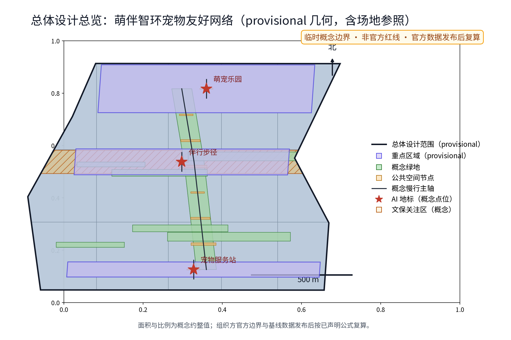
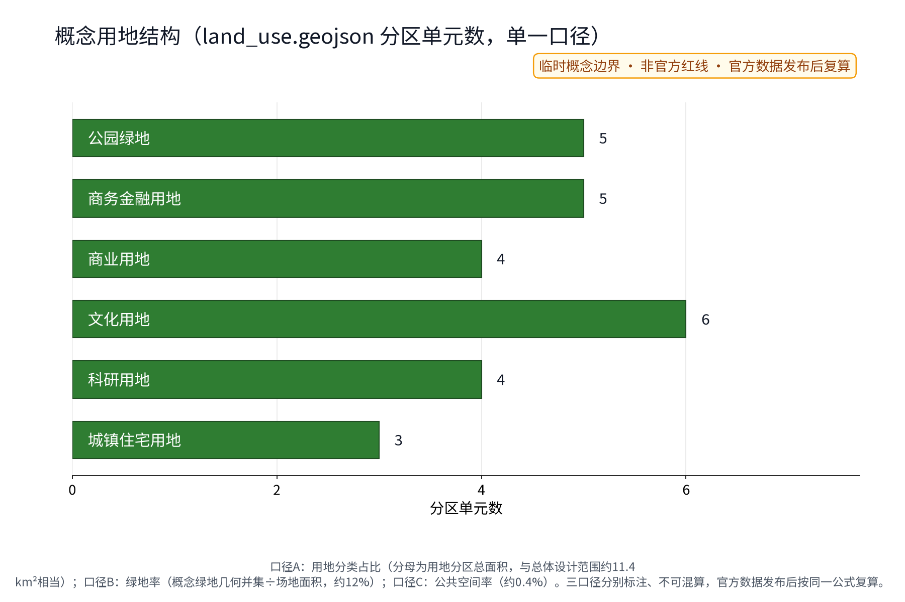
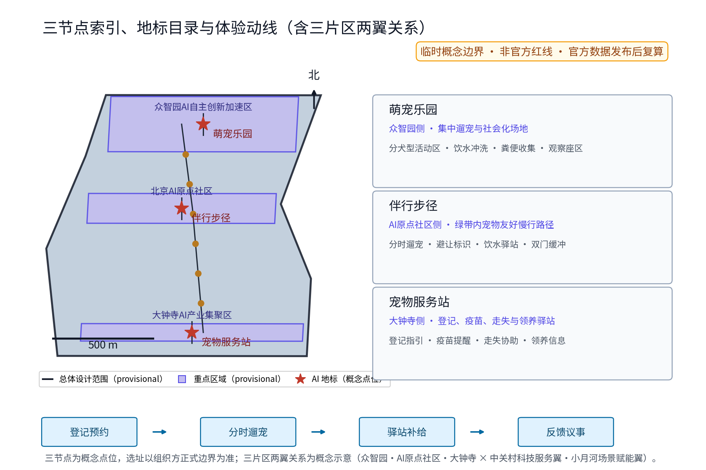
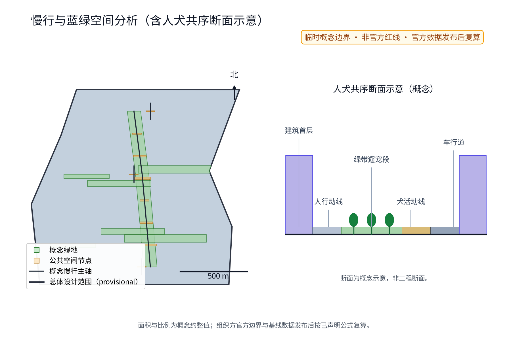
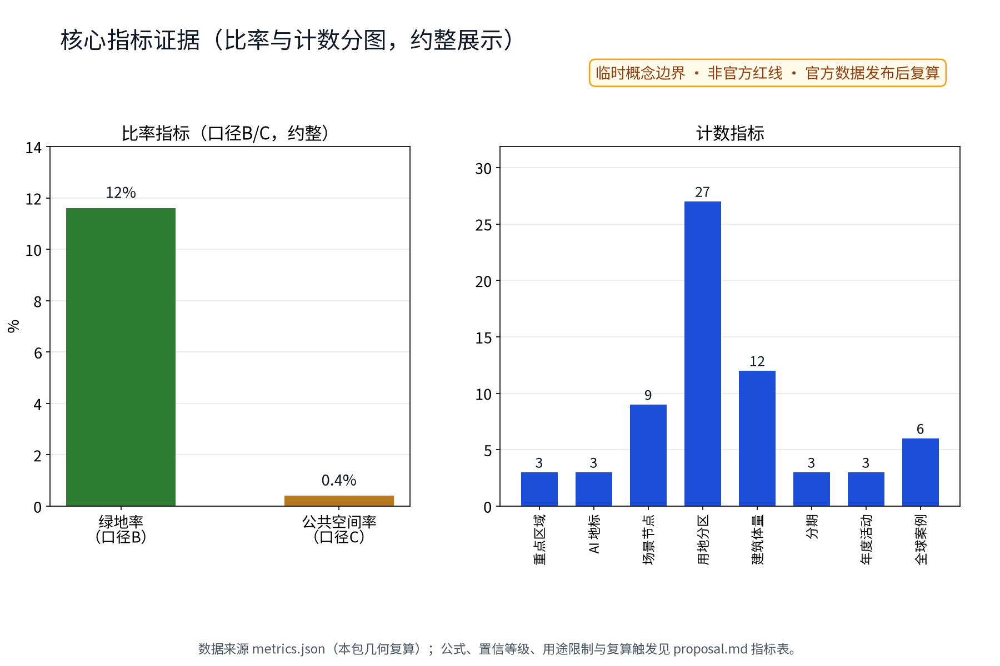

> 编制定位：本方案为宠物友好专项概念方案，属概念建议层面；不给出容积率、建筑高度、拆改留或工程实施结论，不编造官方数据。主名称「萌伴智环」，英文名称 PET·JZ（全称方向 Smart Companion Loop，曾用工作代号 CMP.JZ 已弃用，全部交付物统一为 PET·JZ），命名体系以正式评选与官方文本口径为准。全文数据均为参与者临时模型数据，非权威数据。

## 设计依据与资料清单

资料清单所列公开史料、规划报道与通则规范等均为概念工作依据清单，并非本包已获取的数据；本包实际使用的全部数据见 sources.json，未获取项已在假设与缺失数据说明中如实标注。清单覆盖：征集公告与任务书（总体概念含主名称、英文名称与命名体系、公共空间体验、全龄友好生活与社区治理维度，以及六项智能体任务）；京张铁路遗址公园沿线「留改拆并举、优先保留遗址公园肌理与铁路历史遗存」公开口径；中关村创新文化公开材料；无障碍环境建设法及相关无障碍设计公开规范；养犬管理相关公开法规口径；国内外宠物友好公共空间与AI创新生态公开案例。逐条书目的机构、链接、发布与获取日期登记于 sources.json，未查证项一律降级为「待研究假设」而非正式证据。资料缺口同步声明：仓库尚无官方总体边界与重点区几何，本稿面积与指标均为 provisional 临时几何下的低置信度设计模型值，官方边界与数据发布后触发复算；容积率、建筑高度等依赖未公开官方控制条件的指标保持 unknown，不给数值。

> **证据锚点**：[source:DATA-SRC-OFFICIAL-ANNOUNCEMENT]、[source:DATA-SRC-AGENT-TASKBOOK]。

## 三层范围工作框架

三层范围按官方公告文本口径表述：统筹研究范围约 43.6 km²、总体设计范围约 11.4 km²、重点区域合计约 368.4 公顷（官方公告文本口径，非本包自算）；本包子范围位于总体设计范围内，以三处重点区域为详设锚点，全部边界标注 provisional，不构成承诺性边界。采用「统筹研究—总体设计—重点区域」三层递进框架：统筹研究层开展产业与未来城市研究，判断养宠需求与沿线社区、产业、公共空间的协同关系；总体设计层以城市更新与控规深度开展「一园一径一站」宠物友好网络的总概念与慢行骨架设计；重点区域层聚焦萌宠乐园、伴行步径、宠物服务站三节点的详细设计。三区两翼映射为概念分工：众智园加速区承载乐园场景与AI养护小模型验证，AI原点社区承载步径日常体验，大钟寺产业集聚区承载服务站与新业态接口，中关村科技服务翼与小月河场景赋能翼提供算力、数据与场景开放机制；本框架为概念组织，不属于法定分区、控规或工程结论。

> **证据锚点**：[source:DATA-SRC-AGENT-TASKBOOK]、[source:DATA-SRC-PROVISIONAL-BOUNDARIES]。

## 统筹研究范围产业与未来城市研究

未来城市的检验尺度之一是人与宠物能否共处公共空间。统筹研究将养宠议题作为公共空间体验、全龄友好生活与社区治理三者的接缝：一面是养犬家庭、养宠老年人、带娃家长与不养宠居民的日常摩擦与安全顾虑，一面是宠物服务、消费与数字化场景的产业机会。区域协同以「三区两翼」协作圈概念展开：北纬社区（海淀高校与创新社区）、未来科学城、怀柔科学城、经开区（亦庄）及京津冀方向构成沿线宠物友好服务与治理协同的五个支点，形成「养宠服务互通、治理经验互鉴、数据要素共享（匿名聚合）」的区域回路（概念）；海淀区作为京张创新带核心承载区段，其高校、科创园区与中关村文化构成沿线养宠文明叙事的语义来源。对标案例仅按公开渠道概述，逐例登记机构、链接与日期于 sources.json：纽约与伦敦公开实践显示，为公园划定遛犬专用区、实施分时与牵绳规则可减少人宠冲突；新加坡公开经验包括在公园划定宠物活动区域并明确牵绳与清理要求；东京公开做法包括发布遛犬地图与犬籍登记服务流程提示；上海、深圳等国内公开试点方向包括宠物友好商场与公园的倡导性分区，均属公开信息层面的方法借鉴，不编造细节、不搬用其数据与尺度。

| 案例 | 国家/城市 | 性质 | 启示 | 来源（机构·URL·日期） |
|---|---|---|---|---|
| 纽约市公园局犬区 | 美国/纽约 | 宠物友好公园 | 遛犬专用区+分时与牵绳规则 | nycgovparks.org·官网·2026-08获取 |
| 伦敦皇家公园 | 英国/伦敦 | 宠物友好公园 | 指定犬区+牵绳与清理职责 | royalparks.org.uk·官网·2026-08获取 |
| 新加坡国家公园局 | 新加坡 | 宠物友好公共空间 | 宠物活动区+明确规则 | nparks.gov.sg·官网·2026-08获取 |
| 东京都犬籍登记 | 日本/东京 | 犬籍登记与遛犬地图 | 遛犬地图+登记流程提示 | metro.tokyo.lg.jp·官网·2026-08获取 |
| 上海宠物友好试点 | 中国/上海 | 国内试点方向 | 宠物友好商场与公园倡导分区 | shanghai.gov.cn·官网·2026-08获取 |
| 深圳宠物友好公园 | 中国/深圳 | 国内试点方向 | 宠物友好公园倡导性实践 | sz.gov.cn·官网·2026-08获取 |

> **证据锚点**：[source:DATA-SRC-PROVISIONAL-BOUNDARIES]、[source:DATA-SRC-GENERATIVE-AI-INTERIM-MEASURES]。

## 总体设计范围城市更新与控规深度城市设计

总体设计沿京张绿带公共空间体系组织「一园一径一站」概念环线，利用绿带缝合东西、贯通南北的开放结构设置宠物友好节点与慢行联系；全部为可移位、可替换的概念结构，不是道路红线、地块或工程定位。三节点坚持存量优先、轻介入、可逆组件方向：萌宠乐园利用绿带边侧场地，伴行步径利用既有慢行绿带，宠物服务站复合社区服务点，均不提出建筑指标与开发强度。控规深度以「问题—空间对象—指标—资料缺口—复算路径」表达：每处节点写清解决的问题、空间对象、对应指标、待补资料与官方数据到位后的复算触发条件；容积率、建筑高度、拆除量保持 unknown，不以概念方案替代控规审批。用地结构采用单一口径：以「用地分类占比」为唯一口径（口径A），分母为用地分区总面积（与总体设计范围约 11.4 km² 相当），概念分区类别与单元数与本包 land_use.geojson 及图件一致（共 27 个概念分区单元，类别：公园绿地、科研用地、商务金融用地、商业用地等）；「绿地率约 12%」为蓝绿图层复算口径（口径B，概念绿地几何并集面积 ÷ 场地面积，本包几何复算值 11.6%）；「公共空间率约 0.4%」为公共空间节点区口径（口径C）。两套口径分母相同但统计对象不同，分别标注、不可混算，并将在官方数据发布后按同一公式整体复算——评审所指「公园绿地占比与绿地率差异」由此解释。

> **证据锚点**：[source:DATA-SRC-MOHURD-CONTROL-DETAILED-PLANNING]、[metric:land_use_zone_count]。

## 重点区域详细设计

三处节点的设施选址均为概念点位，须经现场踏勘、资料核验与主管部门评估及公众意见后重新落位；节点间的绿带动线与慢行通道构成完整体验动线，详细平面与剖面以图册与 geometry 层表达。三处地标目录（概念）：其一「萌宠乐园」（众智园侧）：集中遛宠与社会化场地，分犬型活动区、宠物饮水与冲洗点、密闭粪便收集设施、主人休憩观察区，人行动线与犬活动线分离、双门缓冲、无障碍通路；其二「伴行步径」（AI原点社区侧）：绿带内宠物友好慢行路径，分时遛宠时段、牵绳提示与避让标识、沿途宠物饮水驿站，与无宠慢行共享绿带；其三「宠物服务站」（大钟寺侧）：犬证登记指引、疫苗与年检提醒、走失信息协助、领养信息发布，复合社区服务点，设人工窗口、公示栏与意见箱。三节点均配置「萌伴荣誉榜」荣誉展示体系（集体荣誉与志愿表彰，荣誉来源公开标注、内容人工复核）与「可逆组件库」可逆公共空间组件（座椅、驿站、饮水冲洗、标识、收集桶等模块化组件，可拆装、可轮换、可分级复用，支持节事临时布设与平日静默两种状态）。体验动线与九节点目录（3处地标+6处AI场景节点，概念）：乐园入口缓冲节点、分犬型活动区节点、乐园观察座区节点、步径东驿站节点、步径西驿站节点、服务站窗口节点、服务站领养信息墙节点、居民议事亭节点、年度公示栏节点。无障碍与包容：残障用户任务旅程（视障用户经触觉标识与语音提示到达驿站、轮椅使用者经无障碍通路进入乐园观察区、听障用户以文字与图示获取时段信息）均以大字、触觉、语音、人工与纸本通道覆盖，并预留人工服务兜底。

> **证据锚点**：[data:PACKAGE-GEOMETRY]（三节点示意多边形来自本包 geometry/key_areas.geojson）、[metric:landmark_count]、[metric:scenario_node_count]。

## AI 创新生态、人才画像与 AI+ 场景

AI创新生态以「小模型、后场辅助、匿名聚合、人工复核」为边界：五类AI+场景只生成提醒、草稿、分类与聚合提示，不作出公共决定，不直接控制场地设备，可随时撤除。五类人才画像：养犬家庭、不养宠居民、养宠老年人、带娃家长、宠物行业从业者，另有社区工作者与高校学生参与治理与志愿服务；配套长者、银龄人群、儿童及亲子家庭、残疾人等弱势群体的全龄包容需求，提供人工、纸本、电话等非数字通道与大字、触觉信息。六域映射：AI场景分别落位交通（分时调度与避让提示）、产业（商户联盟与业态接口）、空间（节点设施）、公共服务（登记提醒与走失协助）、文化（文明养宠叙事）、治理（议事与公示）六域。AI技术协议（概念）四项：模型评测（基准测试集与人工复核对照）、数据质量（匿名聚合样本去标识与质量校验）、误差分群（按场景与时段分群统计误差并公示）、运行监测（误报率与人工介入率监测、按周复核）。数据生命周期（概念）：匿名聚合数据仅留存既定期限、定期清除，仅用于既定用途，不用于任何个体识别目的；逐场景数据流与隐私控制如下表（数据控制者、处理基础、最小字段、保留期限、权限、删除与申诉、非数字替代）：

| 数据流 | 数据控制者（概念） | 处理基础与最小字段 | 保留期限与删除 | 权限与申诉 | 非数字替代 |
|---|---|---|---|---|---|
| 疫苗提醒 | 服务站运营方+主管部门既有流程 | 服务履约所需登记号与到期日，不采集个体定位 | 服务期满即删，年度公示 | 人工窗口查询与申诉 | 电话、纸本、现场告示 |
| 走失协助 | 服务站运营方 | 匿名聚合公告文本，无图像个体识别 | 公告期满归档 | 人工核实与撤下 | 信息墙、广播 |
| 分时调度 | 运营机构+议事会 | 时段使用匿名聚合计数 | 按周清除 | 议事会复核 | 实体时段牌 |
| 粪便上报 | 保洁责任方 | 去标识分类与工单草稿 | 工单办结后清除 | 人工确认派单 | 电话上报 |
| 知识问答 | 商户联盟+专业团队 | 仅匿名提问语料 | 按季清除 | 人工复核答复 | 人工咨询台 |

下表为10张场景卡（概念级），场景能力、数据与隐私边界及运营主体均以人工复核与公开口径为限：

| 场景卡 | 空间载体 | AI能力 | 数据与隐私边界 | 运营主体 |
|---|---|---|---|---|
| 场景卡01 登记提醒 | 宠物服务站 | 疫苗年检到期提醒草稿 | 登记仅服务履约，不做个体画像 | 服务站+主管部门流程 |
| 场景卡02 走失协助 | 宠物服务站 | 匿名聚合走失寻回匹配提示草稿 | 无图像个体识别，发布前人工核实 | 服务站+志愿团队 |
| 场景卡03 分时调度 | 乐园与步径 | 分时遛宠时间表草稿 | 匿名聚合计数，不自动控制设施 | 运营机构+议事会 |
| 场景卡04 粪便上报 | 步径与乐园 | 去标识分类与清洁工单草稿 | 不记录位置轨迹，人工确认派单 | 保洁责任方 |
| 场景卡05 知识问答 | 服务站与商户联盟 | 依据批准语料生成问答草稿 | 法律行政判断由人完成 | 专业团队+商户联盟 |
| 场景卡06 领养匹配 | 宠物服务站 | 领养信息匿名匹配提示 | 仅公开信息，人工复核 | 服务站+志愿者 |
| 场景卡07 驿站报修 | 步径驿站 | 设施故障分类工单草稿 | 匿名聚合，人工派单 | 运营机构 |
| 场景卡08 议事纪要 | 居民议事亭 | 匿名意见分类与纪要草稿 | 意见去标识，公示前人工复核 | 社区工作者 |
| 场景卡09 荣誉编排 | 萌伴荣誉榜 | 集体荣誉内容编排草稿 | 仅集体荣誉，无个体识别信息 | 社区+运营机构 |
| 场景卡10 开放数据 | 开发者社区 | 匿名聚合数据接口与沙盒 | 数据接口仅匿名聚合，沙盒隔离 | 开发者社区+专业团队 |

行业验证测试协议3项（概念级）：每项含验证对象、指标（概念）、通过标准与RACI分工（概念），测试结果将作为试点决策与停止条件的输入：

| 测试协议 | 验证对象 | 指标（概念） | 通过标准（概念） | 牵头/协作（RACI概念） |
|---|---|---|---|---|
| 测试协议1 人犬动线分离测试 | 萌宠乐园 | 人犬冲突率、双门缓冲通行效率 | 观察期内冲突处置闭环完成 | 运营机构牵头，志愿者协作 |
| 测试协议2 分时时段共享测试 | 伴行步径 | 时段错峰率、避让标识辨识率 | 养宠与无宠用户双向满意 | 社区牵头，专业团队协作 |
| 测试协议3 AI提醒人工复核测试 | 登记提醒AI | 复核覆盖率、误报率 | 关键决策人工复核全覆盖、误报率公示 | 专业团队牵头，高校协作 |

> **证据锚点**：[source:DATA-SRC-GENERATIVE-AI-INTERIM-MEASURES]、[metric:industry_test_scenario_count]、[metric:scenario_card_count]。

## 用地、建筑规模与拆改留方案

用地表达采用公共空间、绿地与公共服务设施的概念分区方向，不改变法定用地性质；萌宠乐园与伴行步径落在既有绿带及边侧场地方向，宠物服务站复合社区服务点，均不涉及新增建设用地判断，也不触碰文保、绿地与蓝线约束。用地分类单一口径（口径A）见下表，类别名称与单元数与本包 land_use.geojson、用地结构图件及指标文件一致：

| 用地类别（口径A） | 概念分区单元数 | 说明与复算触发 |
|---|---|---|
| 公园绿地 | 5 | 含京张遗址公园活力带概念；官方数据发布后复算 |
| 文化用地 | 6 | 概念分区；官方数据发布后复算 |
| 商务金融用地 | 5 | 概念分区；官方数据发布后复算 |
| 科研用地 | 4 | 概念分区；官方数据发布后复算 |
| 商业用地 | 4 | 概念分区；官方数据发布后复算 |
| 城镇住宅用地 | 3 | 概念分区；官方数据发布后复算 |

建筑方面不给规模结论：服务站为概念包络，仅说明功能复合与窗口化服务，不给出基底面积、层数、建筑高度或容积率；驿站类设施按轻量、可逆、装配式组件方向描述，不构成建筑面积承诺。「可逆组件库」为专项设施策略：座椅、驿站、饮水冲洗、标识、收集桶等以模块化组件提供，可拆装、可轮换、可分级复用，支持节事临时布设与平日静默两种状态。拆改留执行「现状与权益核查—保留优先—轻适修配—移位或删除」概念四步：先核实现状、权属与安全条件，能保留则不拆改，确需适配时采用可逆轻改造，冲突无法解决时移位或删除概念部件；未开展调查与官方边界确认前，不提出任何具体拆除面积、拆除量或保留清单。容积率、建筑高度、拆除量均保持 unknown，注明等待官方控规、测绘与建筑调查资料。

> **证据锚点**：[source:DATA-SRC-MNR-LAND-USE-CLASSIFICATION]、[depth:retain_renovate_demolish]、[metric:land_use_zone_count]。

## 交通、轨道、市政与公共服务设施

交通：伴行步径作为概念性慢行支线，与京张绿带既有慢行系统、社区步行圈和无障碍通道衔接，通过分时遛宠与人犬避让标识实现共享，不给断面、路权或交叉口工程结论。轨道与步行圈关系：宠物服务站以轨道站点与社区步行圈的可达性为概念选址原则（大钟寺区域已设轨道交通站点接驳属公开信息），不涉及任何线路、线位或站点工程判断。市政为概念示意层级：饮水驿站与冲洗点的给水、排水（含宠物冲洗废水去向方向）仅作概念示意并说明接口要求，不给水量、能耗或工程量结论；粪便收集采用密闭收集容器与清运服务衔接的概念方向，卫生与噪声冲突按「安全优先—卫生次之—噪声末位」概念优先级处置，具体管养由专业团队深化。公共服务：犬证登记指引、疫苗提醒须与主管部门既有服务流程衔接（概念），服务站配置人工、纸本、电话等非数字等价通道，防止数字鸿沟；无障碍设施（大字、触觉、语音、坡道与净宽）按无障碍环境建设相关公开规范执行（概念），并纳入试点验收清单。所有设施以「有资产编号、有维护责任、可停用复开」为运营前提，本段不构成任何工程方案。

> **证据锚点**：[source:DATA-SRC-MOHURD-URBAN-DESIGN-MEASURES]、[source:DATA-SRC-BARRIER-FREE-ENVIRONMENT-LAW]。

## 蓝绿空间、公共空间与城市风貌

蓝绿体系以既有绿带为骨架，「一园一径一站」作为绿地内的公共空间组件嵌入，优先做遮阴、坐憩、饮水、标识与粪便收集等耐久可修部件，延续铁路遗产与学院社区的低眩光、朴素尺度风貌；不设霓虹或电子大屏依赖，不搞网红化地标。宠物饮水、冲洗与粪便收集设施均按可移动、可替换组件概念设计，避免对既有绿化和树冠造成不可逆影响。公共空间体系同时承担文明养宠治理界面：分时时段、牵绳提示、清理责任、意见通道与矛盾化解机制以实体标识与人工服务落实。三项 formal 核心视觉指标与面积复算：site_area_sqm、green_ratio、public_space_ratio 由投稿方提供的 site_boundary、green_space、public_space 几何在 EPSG:4548 投影下复算得出；当前几何为 provisional 临时边界（official_boundary=false、geometry_role=provisional_constraint），指标值为低置信度的临时设计模型值，仅用于设计模型表达；官方边界、绿地与公共空间范围正式发布后，必须按同一公式触发复算并同步更新指标与视觉页面数值。容积率、建筑高度等依赖未公开官方控制条件的指标保持 unknown、value null。

> **证据锚点**：[source:DATA-SRC-MOHURD-URBAN-DESIGN-MEASURES]、[metric:green_ratio]、[metric:public_space_ratio]。

## 更新项目清单、实施政策与分期计划

三类更新项目清单均为概念项目：一、乐园场地——萌宠乐园（分犬型活动区、饮水冲洗、粪便收集、观察座区）；二、伴行路径——伴行步径与驿站（分时遛宠、避让标识、饮水驿站）；三、服务站点——宠物服务站（登记指引、疫苗提醒、走失协助、领养信息，复合社区服务点）。分期计划为概念节奏：近期（1-3年）机制先行——文明养宠公约、分时遛宠许可、居民养宠议事试点，宠物服务站复合社区服务点并开通登记与提醒服务；中期（3-5年）完善乐园与步径，分犬型活动区与饮水冲洗设施到位，AI+养宠场景进入后场小范围验证；远期（5-10年）形成环线网络与长效运营，按年度评估对设施与AI工具作保留、修改或移除。试点区域建议以萌宠乐园与伴行步径示范段为首期试点，试点范围与选择程序须经主管部门论证并听取公众意见后确定。实施采用决策门（concept-gate）机制：每一期启动前须通过立项论证、公众意见与合规审查，未获批不进入实施；设置停止条件与退出机制（撤收）：试点验证不达指标或公众接受度波动时，可中止该节点并撤收可逆设施，恢复原状。实施组织建议采用RACI分工（概念）：牵头为属地部门，协作与日常运维为运营机构，技术支持为高校与企业，评审为专家团队，共建参与为社区、居民、商户与志愿者；同时探索开发者社区机制（匿名聚合数据接口与沙盒共建、年度开发者活动与萌伴积分激励）、场景开放机制（场景开放目录、测试沙盒与评价数据反馈闭环）与招引转化机制（青年创意孵化、宠物服务新业态对接、年度成果展示与备案）。三节点实施与长期运营台账（概念）如下：

| 节点 | 责任方（RACI概念） | 前置条件 | 成本等级 | 维护频次 | 暂停/撤除 | 年度复盘 |
|---|---|---|---|---|---|---|
| 萌宠乐园 | 运营机构牵头、社区协作 | 现状权属核查+公众评议 | 中 | 季度巡检 | 指标不达标即撤收 | 年度公示 |
| 伴行步径 | 社区牵头、志愿者协作 | 分时公约备案+时段公示 | 低 | 月度巡检 | 冲突上升即停用时段 | 年度公示 |
| 宠物服务站 | 属地部门牵头、高校协作 | 既有服务流程衔接+合规审查 | 中 | 月度巡检 | 服务评估不合格即调整 | 年度公示 |

年度活动体系按「日—周—季—节—月」分层滚动，居民意见通道与年度公示贯穿全程：

| 年度活动品牌 | 频次 | 载体 | 运营主体（概念） |
|---|---|---|---|
| 文明养宠登记周 | 年度/周 | 宠物服务站 | 属地部门+服务站 |
| 领养开放日 | 年度/日 | 萌宠乐园 | 服务站+志愿者 |
| 伴行步道季 | 季度/季 | 伴行步径示范段 | 社区+商户+志愿者 |

治理机制以连续三句展开。其一，谁决策——建议由主管部门会商运营机构与沿线主体（含联盟与专家团队），以议事机制对分时时段、设施设置与年度活动作出决定，本方案不表达任何权属或授权结论。其二，如何公开——建议将年度复算结果、试点评估与设施调整记录通过公示与备案程序向公众公开，具体范围与频次待正式规定明确。其三，如何监督——建议以公众意见通道、志愿者巡查与定期评估形成外部监督闭环，并参考积分与分级反馈结果滚动改进。分期不含投资测算、审批结论或已确定安排，仅为供专业团队深化研究的参考节奏。

> **证据锚点**：[source:DATA-SRC-AGENT-TASKBOOK]、[metric:annual_program_count]、[metric:phase_count]。

## 指标体系、面积复算与合规矩阵

指标体系分三类：可从提交几何复算的 provisional known 指标、依赖官方控制的 unknown 指标、需运营后设定的绩效阈值。三项 formal 核心指标公式：site_area_sqm = 场地边界几何投影面积（EPSG:4548）；green_ratio = 绿地几何面积 ÷ 场地面积；public_space_ratio = 公共空间几何面积 ÷ 场地面积。当前均为低置信度临时设计模型值，标注 provisional 来源与公式；官方边界及绿地、公共空间数据发布后触发强制复算，复算结果须同步到指标文件与视觉页面数值。指标均标注数据来源、公式、置信等级、用途限制与复算触发：

| 指标 | 公式 | 置信等级 | 用途限制 | 复算触发 |
|---|---|---|---|---|
| site_area_sqm | polygon_area(site, EPSG:4548) | medium | 概念展示与讨论 | 官方数据发布后 |
| green_ratio | union(green)/site_area | low | 概念展示与讨论 | 官方数据发布后 |
| public_space_ratio | union(public)/site_area | low | 概念展示与讨论 | 官方数据发布后 |
| 容积率、建筑高度、拆改留量 | unknown（value null） | — | 不提供结论 | 官方控规资料发布后 |

合规矩阵对接任务书"公共空间体验、全龄友好生活、社区治理"三个维度与 agent.1-6 任务覆盖声明，逐条映射禁止性清单：不给出容积率、建筑高度、具体拆改留或工程实施结论；不编造宠物数量、登记量与政策承诺；不把设想活动写成已确定安排；AI场景仅匿名聚合，登记仅用于服务履约，不进行个体识别式追踪。所有指标均为参与者临时模型数据，非权威数据；与公告口径一致处按公告自算、非官方核发。

> **证据锚点**：[metric:site_area_sqm]、[metric:green_ratio]、[metric:public_space_ratio]。

## 风险、版权与合规说明

本方案为概念研究性设计，不构成行政审批依据，也不构成容积率、建筑高度、拆改留或工程可行性结论；风险已按边界误读、AI辅助漂移为监控、动物福利与人宠矛盾处置、运营维护责任、品牌在先权利五维度如实登记于 assumptions.json 与缺失数据说明（应对原则：来源标注、人工复核、意见通道与法定程序）。品牌在先权利与使用边界：概念阶段尚未完成官方商标检索，「萌伴智环」「PET·JZ」及各节点名称均按内部工作代号处理，限制对外使用与注册，待在先权利检索与正式评选确定后方可评估对外使用，本方案不作出「不涉及商标」类自证声明。AI治理边界按三句表述：仅匿名聚合数据；关键决策人工复核；禁止过度监控（不进行个体识别式追踪）。隐私实施：登记数据仅用于服务履约、不做个体画像，数据控制者、处理基础、最小字段、保留期限、删除与申诉路径见 AI 章节数据流表，并保留人工、纸本、电话等非数字替代通道；不采集、不存储个人身份信息，不建设大规模个体识别式监控。版权与许可：本稿文字与表格为参与方与AI协作原创，图件全部为自绘，字体采用 Noto Sans SC（OFL 许可）；对标案例仅概述公开渠道信息并注明来源与获取时间，不复制其图样与数据；本包整体为 COMMUNITY-DISPLAY-ONLY 许可，仅用于社区展示与评审讨论。全部内容为开放共创的建议性参考方案，不替代正式规划，不构成政府审定、批准、实施安排或任何承诺；正式实施前须由专业团队结合官方边界、权属、文保、市政与运营条件深化复核。

> **证据锚点**：[source:DATA-SRC-OFFICIAL-ANNOUNCEMENT]。

## 参考资料

proposal 正文使用短标识引用（完整带日期后缀的条目 ID 见 sources.json）。参考资料以政府正式发布版本为准，按公开/内部分类存档并标注获取时间：

| 类别 | 内容与用途 |
|---|---|
| 任务书 | 公开任务书摘录（三大定位、五大功能、三区两翼、agent.1-6、禁止性清单）——架构与合规依据 |
| 公告 | 百年京张AI创新带城市设计国际方案征集资格预审公告（2026-05-09 发布）——范围与任务文本口径 |
| 投稿技能 | urban-design-ai-submission 技能——概念建议属性、结构与边界要求 |
| 参考样例 | 参考样例提案——章节组织与边界表述范本 |
| 对标案例 | 纽约、伦敦、新加坡、东京及上海、深圳宠物友好公共空间公开实践（方法借鉴，公开概述，逐例登记于 sources.json） |
| 标准规范 | 无障碍环境建设法及无障碍设计公开规范、用地用海分类指南、城市设计管理办法（公开规范，概念参照） |
| 几何 | provisional 临时边界（official_boundary=false）——设计模型值来源，官方数据发布后触发复算 |
| 待补资料 | 官方总体边界与重点区几何、控规、绿地与公共空间范围、权属与管养资料、养宠需求与承载力基线 |

完整机器索引（来源、指标、合规矩阵、设计深度矩阵与自检记录）按投稿技能要求另行登记；正式深化前必须补齐官方边界、权属、地形、建筑与管线调查、文保控制、控规、交通与运营资料。

> **证据锚点**：[source:DATA-SRC-OFFICIAL-ANNOUNCEMENT]（本清单首条即组织方公开资料包）。

## 品牌识别与视觉系统（PET·JZ 原创）

品牌识别是 agent.1 与 agent.4 的核心交付：本专项以「萌伴智环」为原创命名，统一英文名称 PET·JZ（全称方向 Smart Companion Loop），形成「萌宠乐园—伴行步径—宠物服务站」乐园—路径—服务闭环，并建立完整视觉识别系统概念。命名体系与识别一致性：全部交付物（正文、图件、A3/A0 图册、visual 页面）统一使用「萌伴智环 / PET·JZ」，曾用工作代号 CMP.JZ 已弃用并全部替换，避免识别体系不一致。Logo 方向三个（概念）：方向A「回环爪印」——回环主体+爪印四瓣分切+开口留白，寓意百年轨道与萌宠同行；方向B「轨道绳结」——PET·JZ 字标以绳结环扣与遛犬绳语汇构成，字即环、连即径；方向C「方寸驿站」——以 1:1.414 网格呼应铁路枕木意象，一格一驿。构成与使用规则：Logo 最小尺寸 12mm（概念）；安全距离为 1.5 倍标记高；色彩系统五色（轨道蓝、牵绳橙、绿带绿、米白、锚点黑）按使用场景分级；字体采用 Noto Sans SC 开源字体（OFL 许可）；图形符号六类（园/径/站/驿/议/榜）覆盖节点、导视、驿站、议事与荣誉场景。原型（概念）含标识立柱、手机端图标、信息板与荣誉屏四种物理与数字样例，多语言示例以中英双语为主并预留多语种扩展；「人宠共序」为原创机制词：以分时秩序为叙事主线、节点设施为标点、年度活动为章节，形成可复用的表达规范。国际传播叙事（概念）：以「百年京张 × 人宠共序」为国际传播母题，统一视觉输出、中英双语素材包与年度海外展陈建议，全部为概念建议。品牌视觉系统详见 logo-petjz 图件、A0-01 总控板与 visual 页面。

> **证据锚点**：[source:DATA-SRC-AGENT-TASKBOOK]（视觉识别与Logo方向要求）。

## 附：AI创新生态图谱图件

「全球AI创新生态图谱」图件（ecosystem-atlas）以「萌伴智环」为核心节点，将高校与科研、创新企业、开发者社区、风险资本、政府与公共服务、人才与用户六个圈层与六域（交通、产业、空间、公共服务、文化、治理）及 6 个全球案例并列呈现，标注测试沙盒、评价数据与迭代反馈闭环，作为 agent.2「5-8个全球AI创新生态案例」与 agent.6「开发者社区与场景开放」的证据图件；案例逐条登记于 sources.json，不得引申为官方背书或实施承诺。

> **证据锚点**：[source:DATA-SRC-AGENT-TASKBOOK]。
