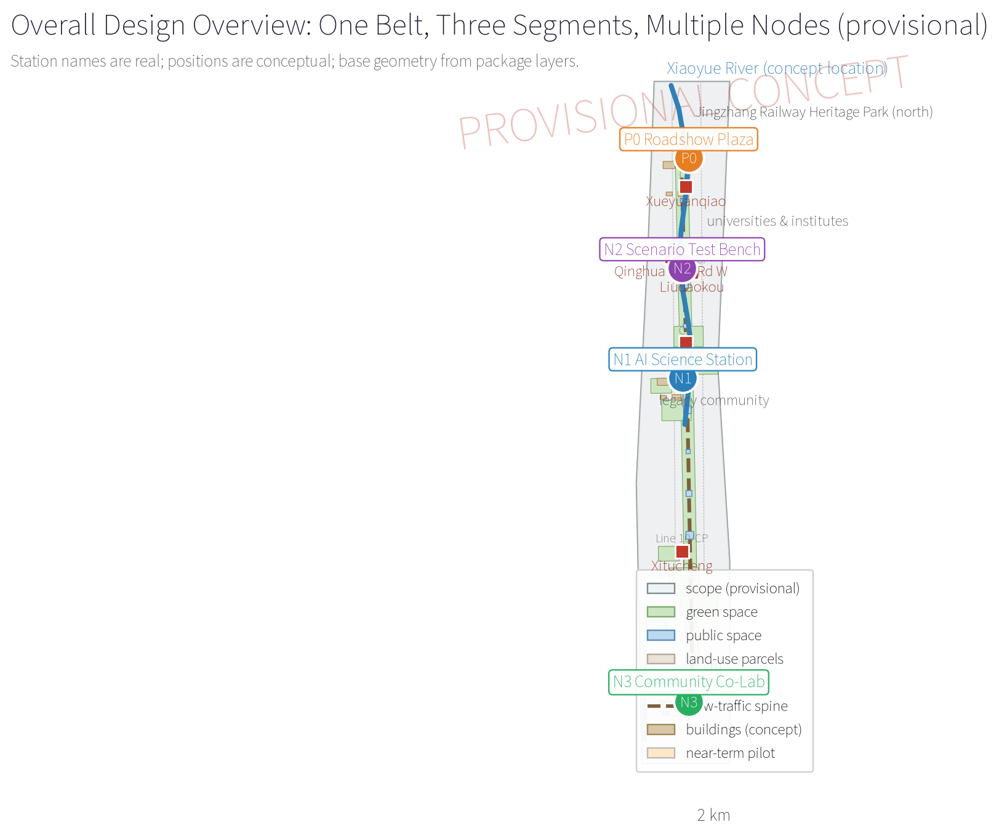
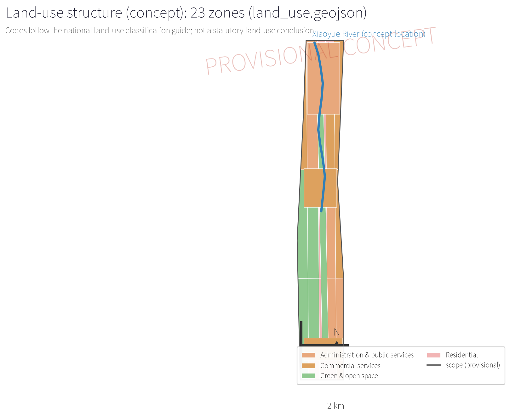
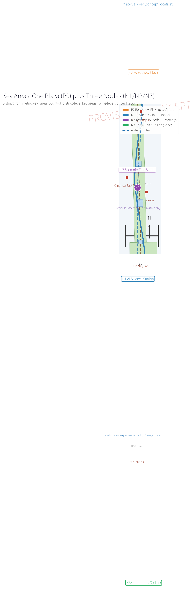
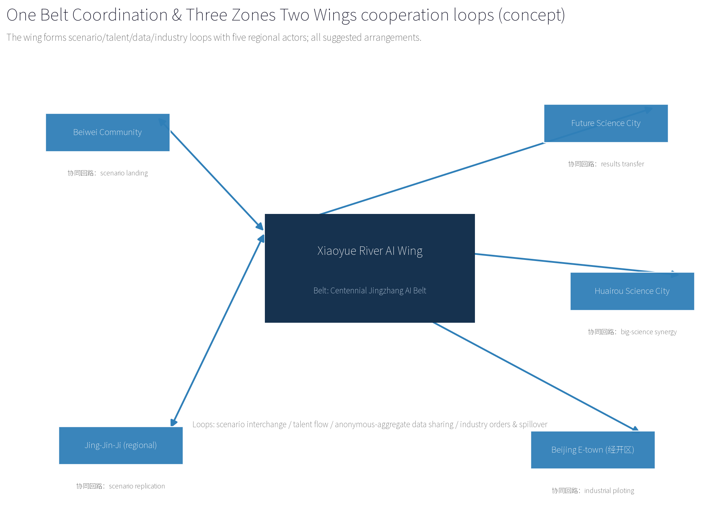
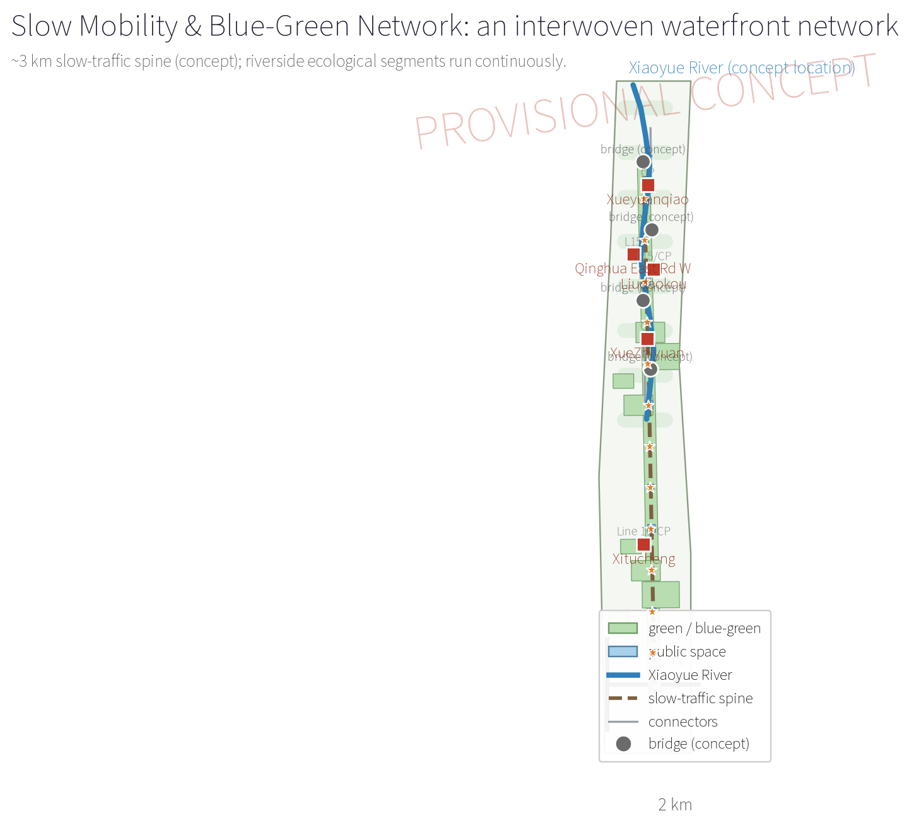
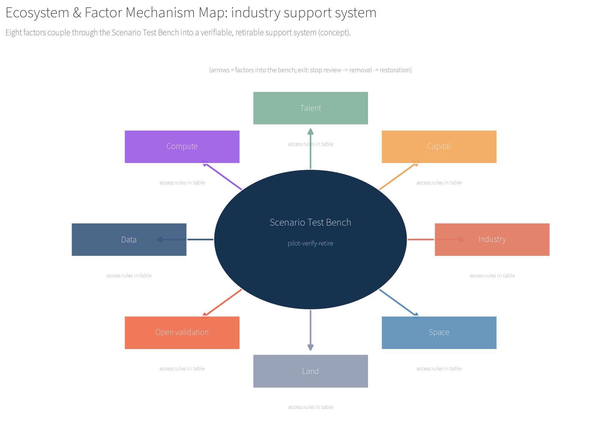
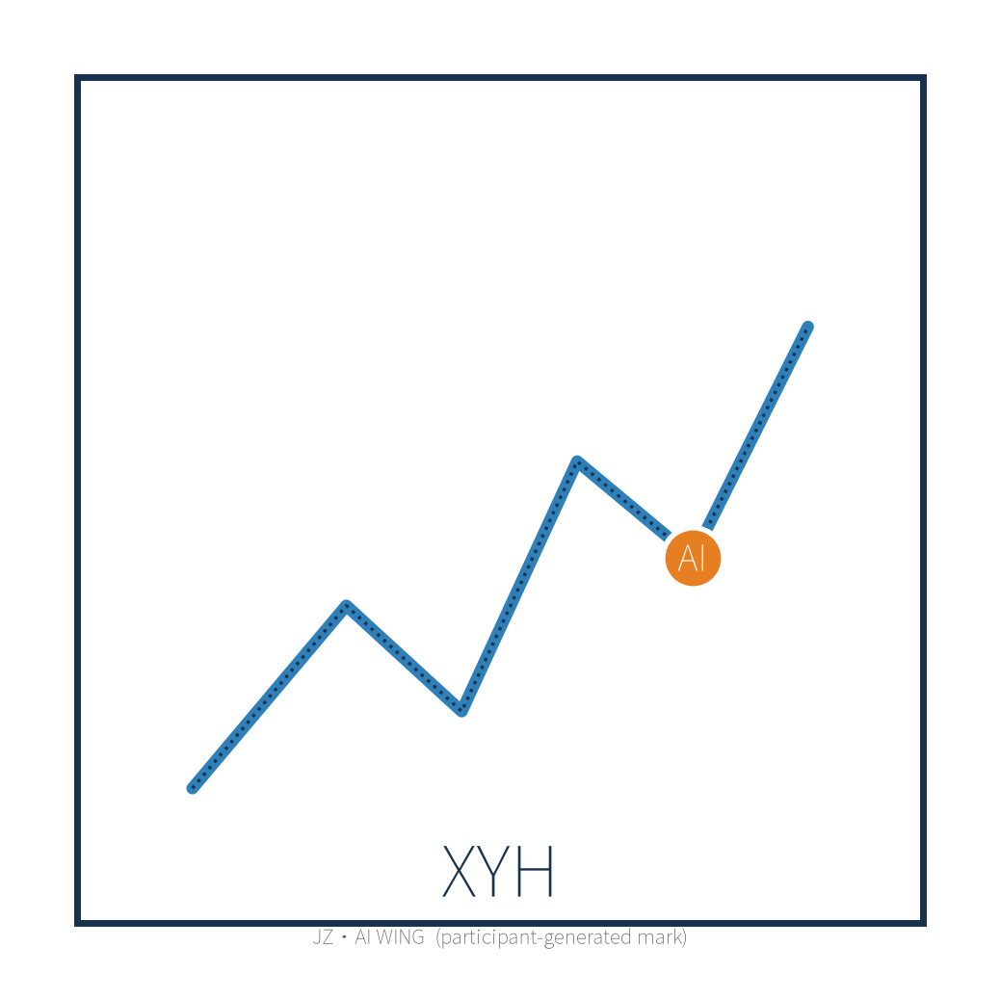
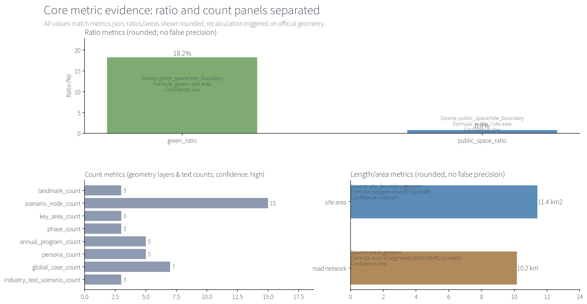

## Design Basis and Source List

This proposal is prepared under the three-level scope and the "provisional boundary, concept-scale metrics" rules of the open call. Five groups of materials were organised up front. First, statutory and higher-level plans: the Beijing Master Plan (2016-2035), the Haidian District Plan (territorial spatial plan), the Xueyuanlu District regulatory detailed plan, and special materials on Xiaoyue River water environment, blue line and flood control; acquisition versions and citation boundaries of each are registered in sources.json (REF-BEIJING-MASTER-PLAN, REF-HAIDIAN-DISTRICT-PLAN, REF-XUEYUANLU-CONTROL-PLAN, REF-XIAOYUEHE-SPECIAL-DATA), and anything without an official text is cited for direction only, never for values. Second, competition documents: the taskbook, clarification answers and the official announcement; geometry follows official recalculation. Third, survey materials: river cross-sections and bank types, land use and building-age distribution, university/institute lists, legacy community boundaries and demographics, transport and utility routes, and site records of walking gaps, water access and night vitality (REF-FIELD-SURVEY, REF-RESIDENT-INTERVIEWS; non-statistical, concept-level). Fourth, public statistics: street-level population, employment and AI-firm distribution (REF-JIEDAO-STATISTICS). Fifth, seven real global cases with transferable mechanisms (chapter "Global Case Benchmarks and Transferable Mechanisms"; each registered in sources.json). The list is updated as recalculation proceeds; gaps are filled by on-site re-survey and interviews and listed with versions in the appendix. Conceptually, the taskbook's three positionings — "Centennial Jingzhang Cultural Belt, Urban AI Life Experience Belt, AI-Integrated Innovation Belt" — are mapped to three roles of the Xiaoyue River waterfront: cultural narrative, urban experience, innovation agglomeration; the five functions (full-stack independent AI innovation system, world-class AI innovation ecosystem, AI+ scenario-empowerment paradigm, intelligent AI-vibrant city, global voice in AI governance) are each assigned to perceivable, experienceable, operable riverside carriers. This mapping is the participant's original conceptual organisation, not a restatement of an official engineering plan.

> **Evidence anchors**: [source:DATA-SRC-OFFICIAL-ANNOUNCEMENT-20260509], [source:DATA-SRC-AGENT-TASKBOOK-20260518].

## Three-Level Scope Framework

The framework follows the taskbook: "coordinated research — overall design — key areas". The coordinated research scope covers the Xiaoyue River catchment and the Xueyuanlu district as a whole, answering industry, talent and future-city questions and producing strategic judgement and spatial structure. The overall design scope covers the ~3 km waterfront corridor plus one street-block depth of hinterland, using regulatory-plan depth as a *conceptual reference* for organising urban design, producing land use, form, path and implementation guidance. The key areas select the "one plaza (P0) plus three nodes (N1/N2/N3)" banks and produce detailed design. All three levels share one basemap and coordinate system; boundaries are provisional and will be replaced after official geometric recalculation; metrics are concept-scale and updated after recalculation. It must be stated plainly: "organising design content at regulatory-plan depth" refers only to the organisation of deliverables, not to any statutory conclusion; regulatory-plan revision content must be produced by statutory bodies from formal materials, and this proposal creates no "rigid content ready to enter a regulatory plan revision". All three levels stay in rhythm with the Jingzhang sci-tech corridor and the Haidian innovation belt. The delivery system is "one master map, one guideline set, one project list, one metric sheet", cross-checked at every level, keeping continuity at corridor scale and precision at key areas, and leaving interfaces for regulatory-plan coordination.

> **Evidence anchors**: [source:DATA-SRC-AGENT-TASKBOOK-20260518], [source:DATA-SRC-PROVISIONAL-BOUNDARIES-20260605].

## Coordinated Research Area: Industry and Future City Research

The coordinated research area centres on the Xueyuanlu district, where universities, institutes and tech firms concentrate — among the highest densities of AI innovation factors. The research judgement: the Jingzhang sci-tech corridor and the Xiaoyue River form a "rail linearity + water linearity" dual axis, and the river can become an urban test field and showcase ribbon where AI scenarios move from R&D into daily life. Industry research focuses on AI+education, AI+health, AI+water, AI+culture-tech tracks coupled to waterfront public life, and on where roadshows, product releases and lab spillover scenarios locate. Future-city research examines how human-machine coexistence, digital-twin operation, unmanned services and data governance reshape public space. The sequence strategy is "scenarios first, ecology second, industry third": low-cost scenario devices animate the bank, stable operation attracts firms and talent, and finally a river-ring innovation ecosystem forms. A technology-churn hedge is set so that any outdated AI facility never damages the public value of the space; the corridor skeleton always belongs to everyday public life — "scenarios readable, decisions reviewable, facilities retirable".

> **Evidence anchors**: [source:DATA-SRC-PROVISIONAL-BOUNDARIES-20260605], [source:DATA-SRC-GENERATIVE-AI-INTERIM-MEASURES].

## Overall Design Area: Urban Renewal and Regulatory-Plan-Level Urban Design

The overall design area covers the ~3 km waterfront corridor and its hinterland, with regulatory-plan depth as the conceptual reference for organising design. The spatial structure is "one belt, three segments, multiple nodes": the belt is the continuous waterfront experience band; the three segments are ecological, living and roadshow segments by bank resources — the ecological segment uses natural banks and wetland purification, the living segment serves legacy communities with daily rest and community activity spaces, and the roadshow segment concentrates the plaza and experience nodes; the multiple nodes are one plaza, three nodes and several pocket spaces, consistently numbered P0 (plaza) and N1/N2/N3 (nodes) across text, figures and matrices. Design content includes conceptual checklists for blue-line control and waterfront setback, classified bank renovation, barrier-free continuous walking with under-bridge use, building height/volume/interface guidance along the route, and green-wall transparency and gateway optimisation for legacy estates. At the conceptual level, compatibility, FAR and density check items are listed, public-service land intentions placed, and utility conflicts avoided with interface reservations. The outcomes interface with the Xueyuanlu regulatory plan and the Jingzhang Railway Heritage Park as reference interfaces for later work; flood, hydrology, blue-line and regulatory checks are all listed as "pre-review professional items" to be completed by special designs from formal data. This proposal prejudges no engineering conclusion.

> **Evidence anchors**: [source:DATA-SRC-MOHURD-URBAN-DESIGN-MEASURES], [source:DATA-SRC-MOHURD-CONTROL-DETAILED-PLANNING], [source:DATA-SRC-PROVISIONAL-BOUNDARIES-20260605].

## Detailed Design of Key Areas

Key areas comprise one roadshow plaza (P0) and three public experience nodes (N1 AI Science Station, N2 Scenario Test Bench, N3 Community Co-Lab); numbering is consistent across the entire document, figures and matrices, resolving the old "three items vs four places" mismatch. P0 is sited on the most open, most water-accessible bank of the roadshow segment, with roadshow stage, lounge, prefabricated terraces and waterfront rest platforms: the stage faces the water and grass terraces, serving launches, performances and flash events; the lounge hosts negotiations, live streaming and operations in a modular reversible structure. N1 sits near university and school routes with interactive devices and education programmes, staffed by student volunteers with offline exhibits; N2 serves firms and research teams with fast-deploy, short-term trial sites and data-feed interfaces, and hosts the "Riverside Assembly" (deliberation is not a separate node, preventing count drift); N3 is embedded in legacy communities, focused on accessibility for elders and children, with AI health services and offline human-fallback posts. The nodes are linked by a continuous trail; each node has plans, sections, renderings, module lists and an event calendar, with night lighting and night-event plans; round-the-clock accessibility and usability is set as a concept-level goal.

> **Evidence anchors**: [data:PACKAGE-GEOMETRY] (node layout concept from geometry/public_space.geojson; the three district-level key areas are in key_areas.geojson, [metric:key_area_count]=3).

## AI Innovation Ecosystem, Personas, and AI+ Scenarios

Personas are defined in five groups, matching persona_count=5 in metrics.json; each persona has concrete journeys, traditional-channel fallback, co-creation feedback mechanisms and concept acceptance criteria (table below). The journeys of elders and children, audiovisual-impaired users, low-digital-skill users and non-smart-device users are the strengthened focus of this revision. The accessible human-service claim follows Article 39 of the Barrier-Free Environment Law as scoped: the human-service requirement applies only to venues handling the law's expressly listed public services (medical, social security, financial, living payments); the proposal therefore does not blanket-claim that all public spaces are compliant, stating only that "on-site guidance and human handling fallback are configured in venues handling the law's expressly listed services", with digital+human dual channels, accessible design and offline fallback as concept suggestions elsewhere.

| Persona | Concrete journey | Traditional-channel fallback | Co-creation feedback | Concept acceptance criteria |
| --- | --- | --- | --- | --- |
| University staff, students and researchers | Walk to N1/N2 after class for roadshows, trials and academic exchange | Offline notice boards and reception desk | Riverside Assembly proposals and joint research | At least one themed co-creation per semester; replies within 30 days |
| Tech firms and entrepreneurs | Book N2 test bench short-term trials; launch at P0 | Offline service window and phone booking | Developer Compact and annual arena | Registration to first trial within 14 days (concept target) |
| Elders and children | Walk 5-10 min from community gates to N3/N1; low-barrier interaction | Community liaisons and human-staffed posts | Family co-creation days and children's council | A full visit without a smartphone (concept test) |
| Audiovisual-impaired and low-digital-skill users | Barrier-free routes to each node; voice and braille guidance | Offline human guide and help buttons | "Accessibility Experience Officers" volunteer feedback | Monthly accessibility walkthrough; fixes within 15 days (concept target) |
| Visitors and commuters | From rail stations via slow paths; flash and night events | Paper maps and enquiry desks | Online feedback and check-in | Visitor satisfaction published annually (concept metric) |

The AI+ scenario list is tiered permanent/rotating/flash: permanent scenarios include AI water-quality visualisation, smart trail lighting and accessible voice guidance, each with offline human fallback so services continue during outages; rotating scenarios refresh quarterly covering AI+education, AI+health cabins, AI+culture-tech performance and virtual trips; flash scenarios deploy temporarily with roadshows. Scenarios are managed as scenario cards — ten cards in the first batch (see chapter "Scenario Card System and Industry Test-and-Validation Scenarios"), each specifying location, suggested operator, data boundary, human review, offline fallback, KPIs and exit conditions. Metrics (usage, satisfaction, maintenance cost) drive dynamic screening. New scenarios require filing, trial evaluation and Riverside Assembly publication; all data collection follows personal-information-protection requirements; scenario explanations use dual "machine + human" channels protecting digitally disadvantaged groups. Three governance bottom lines: anonymous aggregation only — raw individual data never leaves the collection point; all key decisions require human review, AI advises only and never alone decides rights-affecting matters; no excessive surveillance — no individual-identifying tracking, no mass behaviour profiling. The lines are written into the "Xiaoyue River Civil Compact" (riverside co-governance compact) and card management rules, under annual public reporting. The ultimate yardstick: riverbank AI can be understood, reviewed and switched off, with people present — this bottom line maps one-to-one onto the five personas, keeping the ecosystem centred on public life rather than devices, forming an "ecology-scenario-governance" whole covering transport, industry, space, public services, culture and governance.

> **Evidence anchors**: [source:DATA-SRC-GENERATIVE-AI-INTERIM-MEASURES], [source:DATA-SRC-BARRIER-FREE-ENVIRONMENT-LAW], [metric:persona_count].

## Scenario Card System and Industry Test-and-Validation Scenarios

Scenario cards are the management unit. The first batch contains ten cards covering river patrol, water quality, guidance, ecology education, event operation, night lighting, community co-validation, enterprise trials, volunteer credits and accessibility services; each card links to a concrete space, suggested operator, data boundary, human review, offline fallback, KPI and exit condition (table below) and is mapped to spatial carriers and operations in the scenario-space-operation matrix. Everything is concept-level; KPIs and exit conditions are suggested scopes confirmed in pilot implementation.

| Scenario card | Location | Suggested operator | Data boundary | Human review | Offline fallback | KPI (concept) | Exit condition |
| --- | --- | --- | --- | --- | --- | --- | --- |
| S1 AI river patrol | Roadshow-segment trail, under-bridge, key banks | "Berth volunteers" patrol + operator dispatch | Anonymous incident summaries; no individual imagery | Alerts confirmed by humans before action | Manual patrol roster | Monthly alert handling rate ≥95% (concept) | Retired after two quarters above false-alarm threshold |
| S2 AI water-quality visualisation | Wetland purification zone and existing monitoring points | Water authority + university team | Aggregated parameters; probe data shown as hourly means | Abnormal data re-sampled by humans | Manual sampling and notice board | 100% on-time monthly publication (concept) | Retired if equipment misses claimed accuracy for 2 years |
| S3 AI waterfront guide | Three nodes and full-line commentary points | Operator + volunteer guides | Call counts only; no voice content | Content reviewed before launch | Paper maps + human guides | Coverage ≥80% (concept) | Rotated after two quarters of lowest usage |
| S4 AI ecology education | N1 and nature interpretation trail | University volunteer lecturing, AI Q&A aid | Aggregate quiz/activity statistics only | Content reviewed periodically by university team | Exhibits, brochures, human talks | ≥20 education events/year (concept) | Retired if content lags over one year |
| S5 Water and bank event operation | P0 bank and activity platforms | Operator + event curators | Aggregated booking counts; no individual profiling | Safety and capacity confirmed by humans | On-site queueing and manual check-in | ≥40 events/year (concept) | Suspended on failed safety review |
| S6 AI night-run and trail lighting | Living-segment trail and under-bridge | Property and lighting operator | Aggregate brightness/energy data | Lighting changes confirmed by humans | Scheduled basic lighting mode | 100% night availability (concept) | Switched to basic mode on energy breach |
| S7 Community co-validation services | N3 Community Co-Lab | Community org + operator + volunteers | De-identified bookings; no raw health data | Health-advice outputs reviewed by humans | Community liaisons and staffed posts | Elderly monthly visits (concept baseline) | Adjusted after two consecutive failing resident reviews |
| S8 Enterprise trial and data feed | N2 Scenario Test Bench | Platform company + tenant firms | Project-agreed anonymous feeds; auditable deletion | Trial launch and data release approved by humans | Offline sample demos | ≥12 incubated trials/year (concept) | Removed when agreement lapses |
| S9 Water-credit and volunteer patrol | Full line and community gates | Community + volunteer alliance | Aggregate credit values only; no location profiling | Redemption verified by humans | Paper credit cards | Annual volunteer participation (concept baseline) | Mechanism reviewed biennially |
| S10 Accessible voice and offline guide | Barrier-free points and three nodes | Operator + accessibility volunteers | Anonymous help-event counts | Content reviewed before launch | Help buttons to human service desk | Help response time (concept target) | Retired if human link breaks |

**Scenario-space-operation mapping matrix**: cards are attached to spaces and operations in permanent/rotating/flash tiers, forming an auditable mapping so no scenario lacks an owner.

| Scenario card | Space carrier | Operation mechanism | Data feed | Filing and exit gates |
| --- | --- | --- | --- | --- |
| S1/S5/S6 | P0, roadshow trails, living-segment trails | Berth volunteers + operator | Anonymous event summaries | Filing → quarterly review → annual arena |
| S2/S3/S4/S10 | Ecological segment, N1, full-line stops | University alliance + operator | Aggregate statistics | Filing → monthly publication → annual review |
| S7/S9 | N3, community gates | Community org + volunteer alliance | De-identified summaries | Assembly review → annual evaluation |
| S8 | N2 Scenario Test Bench | Platform company + firms | Project-agreed anonymous feeds | Register → trial → review → renewal or removal |

**Industry test-and-validation scenarios (3)**: fulfilling the requirement of no fewer than three, and matching industry_test_scenario_count=3; each specifies test content, site and mounting, participants, data and compliance boundary, pass criteria and exit arrangements — all suggested design.

| Test-and-validation scenario | Test content | Site and mounting | Participants | Data and compliance boundary | Pass criteria and exit |
| --- | --- | --- | --- | --- | --- |
| T1 Unmanned riverside patrol and alert review | Recognition rate, false-alarm rate and human-review closure of patrol robots/drones | N2 and roadshow pilot banks | Patrol-tech firms, operator, university | No individual imagery; anonymous alert summaries; human termination at all times | Below false-alarm threshold for 3 months (concept); otherwise exit |
| T2 Multimodal guide and accessibility interaction | Usability of voice, haptics, large-type and hearing adaptations on the real bank | N1 and adjacent trail | Interaction hardware firms, accessibility bodies, volunteer experience officers | Anonymous session data; no behaviour profiling | Pass rate of accessibility walkthrough (concept); otherwise adjust |
| T3 AI-assisted event capacity assessment | Crowd-density estimation and capacity warning aiding P0 events | P0 plaza and platforms | Vision-algorithm firms, security operators | Aggregate flows only; no individual-identifying tracking | Human confirmation remains final; false-alarm threshold (concept) |

**Concept-level TRL assessment** (participant self-assessment, not an R&D commitment): water-quality visualisation TRL 6-7; voice guidance and multimodal interaction TRL 7-8; smart trail lighting TRL 5-6; unmanned patrol TRL 4-6; AI-assisted capacity assessment TRL 4-6. TRL is updated with pilot test data and its basis is published in the annual report.

> **Evidence anchors**: [metric:industry_test_scenario_count], [source:DATA-SRC-AGENT-TASKBOOK-20260518].

## Global Case Benchmarks and Transferable Mechanisms

Seven real global cases (matching global_case_count=7) support the "scenario-space-operation" and "scenarios first" mechanisms; each registers city, year, operator/implementer, transferable mechanism and source, and each source is registered at publisher level in sources.json (CASE-HIGHLINE to CASE-KALASATAMA). Cases serve as mechanism references only — no endorsement of third parties and no promise of local outcomes.

| Case | City | Year | Operator / implementer | Transferable mechanism | Source |
| --- | --- | --- | --- | --- | --- |
| The High Line | New York | 2009 onwards (phased to 2014) | Friends of the High Line; NYC Parks | Railway-heritage reuse, nonprofit sustained operation, community co-building | [source:CASE-HIGHLINE] |
| Cheonggyecheon restoration | Seoul | 2005 | Seoul Metropolitan Government | Elevated-highway removal, river daylighting, flood-safe public space | [source:CASE-CHEONGGYECHEON] |
| Islands Brygge Harbour Bath | Copenhagen | 2002 onwards | City of Copenhagen | Modular floating waterfront facilities, seasonal operation | [source:CASE-COPENHAGEN] |
| Bishan-Ang Mo Kio Park | Singapore | 2012 | PUB Singapore; National Parks Board | Channel naturalisation, blue-green infrastructure, community co-governance | [source:CASE-BISHAN] |
| Berges du Rhône | Lyon | 2007 onwards | Grand Lyon / Métropole de Lyon | Traffic reduction, continuous waterfront public space, event programming | [source:CASE-LYON] |
| Quayside smart-district pilot | Toronto | 2017-2020 | Waterfront Toronto; Sidewalk Labs | Public data-governance rules first; "retirable" pilot lesson | [source:CASE-TORONTO] |
| Smart Kalasatama | Helsinki | 2013 onwards | City of Helsinki; Forum Virium | Agile piloting, resident co-creation, open data | [source:CASE-KALASATAMA] |

**Mechanism summary**: four transferable mechanisms — heritage and linear-space reuse (High Line, Rhône) for the "railway narrative + waterfront path"; blue-green naturalisation and flood integration (Cheonggyecheon, Bishan) for the ecological segment; modular waterfront facilities with seasonal operation (Copenhagen) for retirable facilities; and public data-governance rules with termination plans (Toronto, Helsinki) for the data governance matrix and exit design. All require local verification; nothing is transplanted directly.

> **Evidence anchors**: [metric:global_case_count], [source:CASE-HIGHLINE].

## One Belt Functional Coordination and Three Zones Two Wings Cooperation

"Three Zones Two Wings" is the proposal's explicit response to the taskbook's regional structure: the three zones are the Zhongzhi Park AI Independent Innovation Accelerator, the Beijing AI Origin Community and the Dazhongsi AI Industry Cluster (district-level key areas, see key_areas.geojson); the two wings are the Jingzhang Heritage Vitality Belt (north wing, linking the Jingzhang Railway Heritage Park and the Jingzhang sci-tech corridor) and the Xiaoyue River AI Scenario Wing (this wing, south). This wing owns the "scenario testing and public experience" function, complementing the three zones (R&D, incubation, industrial agglomeration) via division of labour. Cooperation loops (all suggested): with Beiwei Community a scenario-landing and resident-experience loop; with the Future Science City a results-transformation and scenario-supply loop; with the Huairou Science City a big-science-facility education loop; with the Beijing Economic-Technological Development Area (经开区) an industrial piloting and supply-chain loop; and with the Jing-Jin-Ji region a scenario-replication and experience-export loop. Loop mechanisms include scenario interchange, talent flow, anonymous-aggregate data sharing and industry-order spillover, governed by rules in the "Developer Compact" and the annual event system. Regional cooperation does not change this wing's independent scope and prejudges no regional agreement.

> **Evidence anchors**: [source:DATA-SRC-OFFICIAL-ANNOUNCEMENT-20260509], [source:DATA-SRC-AGENT-TASKBOOK-20260518].

## Land Use, Building Scale, and Retain-Renovate-Demolish Strategy

Land use and building scale are concept-scale pending boundary recalculation; no false-precision values are published. P0 occupies c.1.0-1.5 ha with stage and lounge floor area c.2,500-3,500 m2 at no more than three storeys; the three nodes together occupy c.0.8-1.2 ha, each node c.600-1,200 m2, mainly light-steel and demountable units. Trails and plazas add no large structures; all facilities are modular, reversible and relocatable. The retain-renovate-demolish principle is "retain first, renovate first, demolish last": retain waterfront public space, heritage buildings, mature trees and places of memory; renovate legacy-community waterfront interfaces, walls and gateways; repair riverside facades; demolish only illegal structures, dangerous buildings and obstacles blocking the bank. Demolition/renovation scale and resettlement needs are stated as concept totals pending survey and boundary recalculation, executed only through due procedures; no specific demolition object or resettlement conclusion is prejudged.

> **Evidence anchors**: [source:DATA-SRC-MNR-LAND-USE-CLASSIFICATION-202311], [metric:land_use_zone_count], [metric:building_unit_count].

## Transport, Rail, Municipal Infrastructure, and Public Services

Transport puts slow mobility first: an ~3 km continuous waterfront walking and cycling trail (concept main path; see the metric-calibre table in "Metrics, Area Recalculation, and Compliance Matrix"), removing gaps and converting under-bridge spaces into passages and stops; 5-10 minute feeder links to rail stations, connecting the Changping Line south extension (Xueyuanqiao/XueZhiyuan/Liudaokou stations) and Line 15 (Liudaokou) — station names are real, connections are conceptual — with bus-stop optimisation, shared bikes and remote parking at corridor ends and around plazas, and motorised access restricted from the waterfront. Municipal works integrate with ecological restoration: river replenishment and purification, sponge stormwater, separated sewers; lighting, power and water all reserve modular interfaces for scenario facilities. No flood conclusion is prejudged here: flood, water-level and ecological checks of all waterfront facilities must be completed by special designs from formal hydrological data; this proposal records only the "to be checked" status. Public services are placed at 500 m service radii: rest stations, accessible toilets, baby-care rooms, drinking water and AED points; node buildings double as shelter, storage and operations rooms. A unified signage system and human service desks run digital and human services in parallel, forming a "see it, find it, use it" public experience path; in venues handling the law's expressly listed services, on-site guidance and human handling fallback are configured per the accessibility law.

> **Evidence anchors**: [source:DATA-SRC-MOHURD-URBAN-DESIGN-MEASURES], [metric:road_network_length_m].

## Blue-Green Network, Public Space, and Urban Character

The blue-green network builds on ecological restoration: classified naturalisation of banks; the ecological segment restores gentle slopes and aquatic plant belts with constructed wetlands purifying first-flush rainwater; native species retained, shade trees added, habitats for birds and insects created; hard-surface ratios controlled along the line while balancing flood safety and biodiversity (flood conclusions are given by special checks). Public space is layered "plaza — nodes — paths — pocket spaces": P0 for large events, N1/N2/N3 for themed experiences, paths for continuous strolling, pocket spaces woven at bridgeheads, lane gates and community gates. Urban character continues the Xueyuanlu science-education temperament — blue-green interweaving, light intervention, recognisability: unified corridor signage and paving language; night lighting highlights water and stage while securing night events; facade, wall and shopfront guidance along the route suggests banning large, high-saturation advertisements and abrupt structures, presenting the corridor as one scene while each node keeps its own identity — "one river, one line, one string of stories".

> **Evidence anchors**: [source:DATA-SRC-MOHURD-URBAN-DESIGN-MEASURES], [metric:green_ratio], [metric:public_space_ratio].

## Renewal Projects, Implementation Policy, and Phasing

The renewal project list has five categories: ecological restoration (bank naturalisation, wetland purification, water-quality improvement); waterfront space (P0, N1/N2/N3, trail completion, under-bridge works); building renovation (legacy-community interfaces, riverside facades, demolition of illegal structures); municipal and smart infrastructure (utilities, lighting, scenario facilities); operation support (signage, human service desks, event facilities) — each with scale, location and concept-level cost ranges (not budget commitments). Implementation policy: "government coordination + platform-company operation + university-enterprise-community co-building"; universities encouraged to open resources, firms to adopt-and-maintain; applicability of operational-revenue feedback and FAR-bonus policy tools explored; diversified financing and phased investment. Public participation runs through the whole process: a resident feedback channel; Riverside Assembly deliberation; regular opinion collection with public replies; an annual public report on implementation and operation; and five annual event brands (chapter "Annual Event Brand System"). Nine actor groups participate — government, enterprises, universities, residents, communities, operators, volunteers, merchants and professional teams: government coordinates and regulates; state-owned platforms hold primary development and public assets; enterprises build and operate; universities co-create research and supply talent; residents co-govern, supervise and volunteer; residents' patrol and green-adoption volunteering accrues "water-credit" points exchangeable for public-space services. Phasing (concept rhythm): near term (1-3 years) pilots the roadshow segment — closing walking gaps, building P0, deploying first permanent scenarios; mid term (3-5 years) builds N1/N2/N3, completes full-line ecological restoration and character works, and extends to pilot communities; long term (5-10 years) renews into the hinterland forming the river-ring innovation ecosystem. Measurable indicators include continuous-trail length, node completion, annual events, scenario rotation rate, AI filing count, resident satisfaction and ecological-bank ratio; values are set after official data. Each phase has evaluation gates to adjust subsequent work from operation data.

> **Evidence anchors**: [source:DATA-SRC-AGENT-TASKBOOK-20260518], [metric:phase_count].

## Annual Event Brand System

Five brand events form the annual calendar (matching annual_program_count=5), each with time/venue, IP elements and public participation: May roadshow season, June science week, August night market, September open-co-validation day, December arena and public report. Event points feed the "water-credit" system; participation is booked through "Water-Affinity Booking Vouchers" with online booking and on-site human channels in parallel so digitally disadvantaged residents participate equally.

| Annual event brand | Time and venue | IP elements | Public participation |
| --- | --- | --- | --- |
| A1 Xiaoyue AI Roadshow Season | May, P0 plaza and water platforms | Product launches, flash roadshows, investor matching, water performances | Open viewing, on-site voting, booked investor meetings |
| A2 Waterfront Science Week | June, N1 and nature trail | University-led science classes, family experiments, AI Q&A | Booked attendance, family co-creation, volunteer guide recruitment |
| A3 Community Co-Validation Open Day | September, N3 and nearby communities | Scenario experience, resident review, elder sessions | Assembly deliberation, opinion collection, experience-officer walkthroughs |
| A4 Riverside Night Market | August, living-segment trail and P0 | Night market, light installations, night runs | Merchant and resident stalls, night volunteer shifts |
| A5 Annual Report and Scenario Arena | December, online + offline | Annual report, best-scenario awards, rotation list | Public voting, open defence, public oversight |

> **Evidence anchors**: [metric:annual_program_count], [source:DATA-SRC-AGENT-TASKBOOK-20260518].

## Pilot Implementation Matrix (Concept)

To strengthen implementation evidence, a pilot matrix is compiled per pilot: current baseline, site admission conditions, pre-review professional checks, suggested responsible bodies, rights-responsibility split, construction and operation cost ranges, maintenance frequency, technology stop-service and removal costs, metric baselines and phased exit thresholds. All are concept suggestions; cost ranges are order-of-magnitude estimates (ranges, no false precision), confirmed at feasibility stage. Every pilot lists flood, hydrology, blue-line, structural safety, fire and accessibility checks as pre-review professional items; no pilot proceeds without passing them.

| Pilot | Current baseline | Site admission conditions | Pre-review professional checks | Suggested responsible bodies | Rights-responsibility split (govt-SOE-enterprise-operator-resident) | Cost ranges (concept) | Maintenance frequency | Stop-service & removal costs | Metric baseline | Phased exit threshold |
| --- | --- | --- | --- | --- | --- | --- | --- | --- | --- | --- |
| P0 Roadshow Plaza | Open bank, good waterfront, trail gaps | Clear land rights, no major utility conflicts | Flood/hydrology/blue-line/fire/structure | Government coordination + platform operator | Govt approves & regulates; SOE holds; enterprise builds; operator runs; residents supervise | Construction c.20-35M RMB; annual operation c.1.5-3M RMB | Stage equipment quarterly; structure yearly | Modular removal c.1.5-3M RMB; restored as open space | 500 m completed trail; 40 events/year (concept) | 2-year trial review; downsize if social benefit unmet |
| N1 Science Station | Near university and school routes | Use compatibility, good access | Land use/accessibility/fire | University alliance + operator | Govt secures land; SOE holds; university co-builds; operator runs; families give feedback | Construction c.8-15M RMB; annual operation c.0.8-1.5M RMB | Exhibits quarterly; content monthly | Removal c.0.8-1.5M RMB; restored as green space | 20 education events/year; coverage (concept) | Annual review; rotate if content lags one year |
| N2 Test Bench | Under-bridge and hinterland vacancy | Structural safety, utility access | Structure/utility/fire/data compliance | Platform company + tenant firms | Govt supplies land; SOE holds; firms join by agreement; platform operates; Assembly deliberates | Construction c.6-12M RMB; annual operation c.1-2M RMB | Equipment biweekly; agreements yearly | Removal in agreement, c.1-2M RMB | 12 trial projects/year (concept) | Removed and restored when agreement lapses |
| N3 Community Co-Lab | Legacy-community gateway, elder concentration | Community consent, accessible retrofit feasible | Accessibility/noise/fire | Community org + operator | Govt policy; SOE asset; enterprise services; community operates; residents review | Construction c.5-10M RMB; annual operation c.0.8-1.5M RMB | Service posts daily; equipment monthly | Removal c.0.6-1.2M RMB; restored as community green | Elderly monthly visits (concept baseline) | Adjusted after two consecutive failing resident reviews |

> **Evidence anchors**: [data:PACKAGE-GEOMETRY], [source:DATA-SRC-MOHURD-CONTROL-DETAILED-PLANNING].

## Data Governance Matrix (Concept)

Data governance rests on A-PRIVACY-001: anonymous aggregation only, human review throughout, no individual-identifying tracking. The matrix covers purpose, minimisation, retention, access control, deletion, complaint channels, human termination and security-incident handling per data scenario for operators and regulators; all suggested institutional design.

| Data scenario | Purpose | Minimisation | Retention | Access control | Deletion | Complaint channels | Human termination | Security incident handling |
| --- | --- | --- | --- | --- | --- | --- | --- | --- |
| Anonymous crowd-heat aggregation | Capacity and operation evaluation | Aggregate counts only; no individual trajectories | 1 year | Least-privilege operator access | Auto-delete with audit trail | Riverside Assembly and online desks | Venue control can halt collection anytime | Graded response; explained in annual report |
| Water-quality and alert records | Public disclosure and safety handling | Hourly means and event types only | 2 years | Water authority and operator co-managed | Auto-delete on expiry | Water hotline and notice boards | Human re-sampling can stop alert chains | Monthly false-alarm review, published |
| Trial data feeds | Industry scenario validation | Project-agreed minimum field set | 6 months after project end | Platform/firm per agreement | Auditable deletion on expiry | Developer Compact desk | Trials can be terminated immediately | Immediate notification and data removal on breach |
| Bookings and volunteer credits (de-identified) | Events and volunteer incentive | De-identified ledger, no profiling linkage | Account lifetime | Ticketing and volunteer systems separated | Delete on cancellation, on request | Human service desk | Manual credits remain valid after system shutdown | Freeze and human review on tampering |

> **Evidence anchors**: [source:DATA-SRC-GENERATIVE-AI-INTERIM-MEASURES], [data:PACKAGE-GEOMETRY].

## Ecosystem and Factor Mechanism Map (Industry Support System)

Industry support needs more than track direction: land, space, industry, capital, talent, compute, data and open validation must couple as a system. The "Scenario Test Bench" is the coupling hub; the ecosystem-and-factor mechanism map and the responsibility/access table below form an industry support system in which "factors enter, scenarios verify, data is governed, facilities retire". All concept-level; no factor-supply commitment.

| Factor | Suggested responsible body | Access mode | Open validation mechanism |
| --- | --- | --- | --- |
| Land | Government and SOE platform | Temporary-use permit and reserved parcels | Pilot-term land agreement, restoration on exit |
| Space | Planning and urban-management bodies | Under-bridge and setback-margin mounting | Modular mounting approval pilot |
| Industry | Tech parks and industry associations | Enterprise tenancy at N2 | Card filing and annual arena |
| Capital | Government guidance fund and private capital | Adopt-and-maintain, operation feedback | Phased investment and performance review |
| Talent | Universities and training institutes | Joint research, internship posts | Open topics and results publication |
| Compute | Cloud providers and computing centres | Public compute vouchers and cluster interfaces | Usage audit and anonymised aggregation |
| Data | Data authorities and operators | Anonymous-aggregate data interfaces | Matrix execution and audit |
| Open validation | Review experts and the public | Assembly, experience officers, public defence | Annual report and rotation |

> **Evidence anchors**: [source:DATA-SRC-AGENT-TASKBOOK-20260518], [metric:landmark_count].

## Brand and Visual Identity

The brand is how the wing is seen: English master name, naming system, logo direction, VI rules and international-communication copy are provided (all participant-original concepts).

**English master name**: "Xiaoyue River AI Scenario Wing" (short: "XYH AI Wing"); full form "Xiaoyue River AI Scenario Wing: AI Roadshow Corridor & Public Experience Trail (Centennial Jingzhang AI Innovation Belt · Haidian)". The Chinese master name remains 小月河场景赋能翼. **Naming system**: six levels — Belt (Centennial Jingzhang AI Innovation Belt) > Wing (Xiaoyue River AI Scenario Wing) > Zone (three zones and the Jingzhang Heritage Vitality Belt) > Node (P0/N1/N2/N3) > Scenario (S1-S10, T1-T3) > Event (A1-A5); the rules are uniform throughout, eliminating count drift of the old drafts. **Logo direction**: motif of "water wave + rail + node star" — the wave curve is the Xiaoyue River, the dashed rail the Jingzhang heritage line, the orange star the AI innovation node (figure; a participant-generated original mark, language-neutral, released under the package COMMUNITY-DISPLAY-ONLY licence and registered in the sources.json rights ledger). **VI rules**: primary colours water-blue #2F7FB8, rail-iron-grey #16324F and node-orange #E67E22; minimum sizes, clear space and forbidden styles (no outlining, stretching, or high-saturation backgrounds) are set out in the Visual Manual (concept edition, published with deepening design); the open OFL-1.1 Noto Sans SC family is recommended to avoid licence risk. **International-communication copy** (suggested copy, not commitments): main slogan "Once a railway, now an AI runway."; Chinese "一条铁道的百年回声，一条水岸的AI跑道"; supporting "Seen. Reviewed. Retired responsibly." ("看得懂、可复核、可退场"). Branding stays at the cultural and mechanism level; no official endorsement is fabricated.

> **Evidence anchors**: [source:DATA-SRC-AGENT-TASKBOOK-20260518], [source:DATA-SRC-OFFICIAL-ANNOUNCEMENT-20260509].

## Culture, Landmarks, Honours and the Developer Pathway

**Brand story (narrative, not slogans)**: the Jingzhang Railway (completed 1909 under Zhan Tianyou, China's first mainline railway built by Chinese engineers) leaves a century-long "independent innovation" narrative; the Xiaoyue River's shift from drainage channel to living bank is a side profile of Haidian moving from science-education district to innovation district; Zhongguancun compresses the "laboratory-to-market" distance to block scale. This wing organises the three narratives as a "time corridor": under-bridge spaces tell the railway era, the banks the daily-life era, the nodes the AI era — turning grand narrative into walkable, explainable, renewable spatial details. **Landmarks (3, matching landmark_count=3)**: the "Moon-River Eye" AI science star tower (N1; night projection and education); the "Stage Dome" (P0; viewing and launch landmark); the "Time-Rail Bridge" (under-bridge retrofit retaining railway vocabulary as passage and stay landmark). All three are concept suggestions with structure, lighting and fire checks in the pre-review list. **Jingzhang Heritage Park strategy (linkage)**: the north-wing Jingzhang Railway Heritage Park is open (built by Haidian District Government, opened in phases in 2023); this wing links it on the Liudaokou-Xueyuanqiao axis with slow-traffic connection and narrative continuity — recognising the park's rail vocabulary (sleeper motifs, signal symbols) and extending it to under-bridge spaces and lighting, avoiding redundant memorial structures. **Dazhongsi strategy (linkage)**: the Dazhongsi AI Industry Cluster (one of the three zones) owns industrial agglomeration; this wing runs a "results spillover—scenario validation" loop with it: cluster firms get priority access to N2; this wing's night economy and public events support the cluster's talent; the "time" image (bells) becomes an AI-era "timetable" installation concept (hourly AI-function announcements) — a suggested cultural idea. **Honours display and component library**: an "Honour Wall" open display in the P0 lounge and N1, publicly recognising annual co-creation results of firms, universities, volunteers and residents; the "Wing Component Library" catalogues reusable units (trail lighting, signage boards, roadshow stage, station modules — name, specification direction, reuse scenario) for developers and firms under an open-style list, updated with pilot data. **Developer/enterprise pathway**: registration and filing → N2 test-bench agreement trials (data feeds) → scenario-card selection (Assembly publication) → rotation or permanence → annual arena → exit or migration; rules in the "Developer Compact", with human desks and offline windows so non-digital channels can participate.

> **Evidence anchors**: [source:DATA-SRC-OFFICIAL-ANNOUNCEMENT-20260509], [source:DATA-SRC-AGENT-TASKBOOK-20260518], [metric:landmark_count].

## Metrics, Area Recalculation, and Compliance Matrix

All metrics are concept-scale on a provisional boundary, updated after official geometric recalculation; displayed values are rounded with no false precision, while metrics.json keeps raw computed values for machine verification. The table publishes denominator, formula, scope, confidence and recalculation triggers per metric, so everything is "readable and reviewable".

| Metric | Value (consistent with metrics.json) | Formula and denominator | Scope | Confidence | Recalculation trigger |
| --- | --- | --- | --- | --- | --- |
| Site area | c.11.41 km2 (11,412,825 m2) | polygon_area(site_boundary, EPSG:4548) | Site boundary layer | Medium | Overall recalculation on official boundary release |
| Green ratio | c.18.2% (0.1823) | green_space area / site area | Concept green within site | Low | Official land-use and green data |
| Public-space ratio | c.0.8% (0.0082) | public_space area / site area | Concept public space within site | Low | Official public-space data |
| Waterfront main path | c.3 km (concept design value) | length of continuous walking segments (excluding secondary links) | Both banks along the river | Low | On-site verification survey |
| Road network | c.10.15 km (10,154.4 m) | sum of segment lengths in roads.geojson (EPSG:4548) | Concept road layer | Low | Official road and rail data |
| Land-use structure | 23 zones (land_use_zone_count=23) | zone area / site area per category | Within site by category | Low | Official land-use classification |
| Count metrics | Landmarks 3, nodes 15, key areas 3, phases 3, personas 5, cases 7, annual events 5, tests 3 | Geometry layers and text counts | Package layers and text | High | Re-checked on content revision |

Recalculation process: re-measure corridor length, node extents and building scale against official basemaps and coordinates; replace concept values and annotate version and measurer in the deliverable. The compliance matrix checks blue-line control, waterfront setback, flood standards, regulatory land use and metrics, accessibility and fire codes, stating "directionally compliant / to be checked / to be adjusted" concept conclusions; conflicts with current plans are answered with regulatory-revision linkage or design-adjustment paths (advisory interfaces, not legal procedures), and "reviewable, implementable, traceable" is the organising goal of deliverables.

> **Evidence anchors**: [metric:green_ratio], [metric:public_space_ratio], [metric:road_network_length_m], [source:PACKAGE-GEOMETRY].

## Risk, Copyright, and Compliance

Risks: boundary and area data — flagged provisional pending official recalculation; AI technology churn — hedged by modular reversible facilities and scenario rotation so no facility retirement damages public value; investment and operation — controlled by phased investment, diversified financing and operation review; construction impacts on river and residents — mitigated by off-peak phasing, screened hoardings and public communication; flood and ecology — flood, water-level and ecological checks must be completed by special designs from formal data, no conclusion prejudged here; data and privacy — controlled by anonymous aggregation, human review and no-excessive-surveillance bottom lines per the data governance matrix. Copyright: this is the participant's original concept; every text, figure, geometry, metric and code asset registers source, licence, authorisation and restrictions in the sources.json rights ledger (font, logo, figures, basemap and maps, policy snapshots, statistics, survey/interview baselines, HTML/PDF, code and generation tools); basemaps, statistics and cited materials belong to their authors or providers; this package is released under COMMUNITY-DISPLAY-ONLY — community display and review only, no commercial development, no statutory-submission material; no co-copyright with the organiser is asserted (no such claim without agreement basis). Compliance: the proposal follows relevant laws and planning norms, does not replace statutory planning approval and constitutes no construction or investment commitment; surveillance and data collection strictly follow anonymous aggregation and personal-information protection; accessibility and human fallback design promote fair public-space rights as a concept goal.

> **Evidence anchors**: [source:DATA-SRC-OFFICIAL-ANNOUNCEMENT-20260509], [source:PACKAGE-GEOMETRY].

## References

Main references (each registered in sources.json): the taskbook, clarification documents and the official announcement (boundary provisional); the Beijing Master Plan (2016-2035) public text; Haidian District Plan (territorial spatial plan) and Xueyuanlu regulatory plan public outcomes; Xiaoyue River water-environment, blue-line and flood special materials (no official texts obtained; direction-only); public construction information and news releases about the Jingzhang Railway Heritage Park; street-level public statistics on population, employment, communities and public services; public research and industry materials of relevant universities and institutes; seven global waterfront, heritage and smart-district cases' official release information (CASE-HIGHLINE to CASE-KALASATAMA); and public literature on smart cities and waterfront AI scenarios. In addition, the team conducted on-site survey, resident interviews and night-vitality observation recorded as supplementary material (REF-FIELD-SURVEY, REF-RESIDENT-INTERVIEWS; non-statistical samples, concept-level need reference only). Citation follows academic norms with provenance and statistical year; all materials are updated with recalculation and deepening design, and the final version lists them fully in the appendix. Substantive Chinese-English equivalence has been manually verified by the participant (declarative).