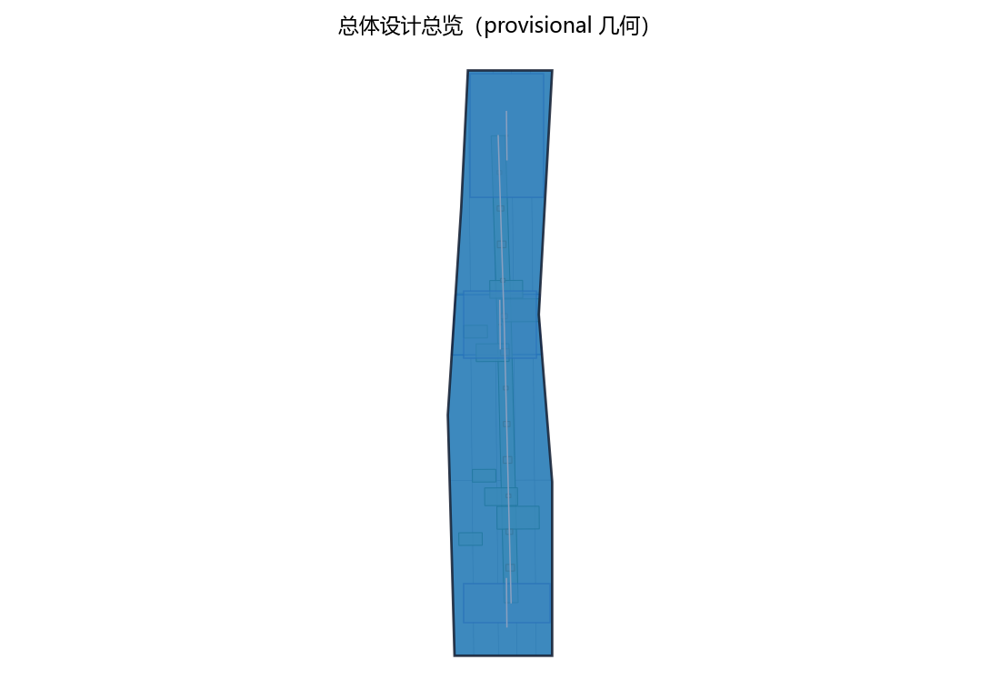
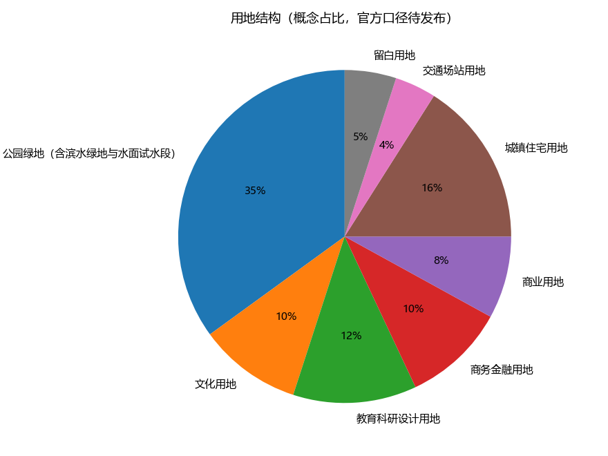
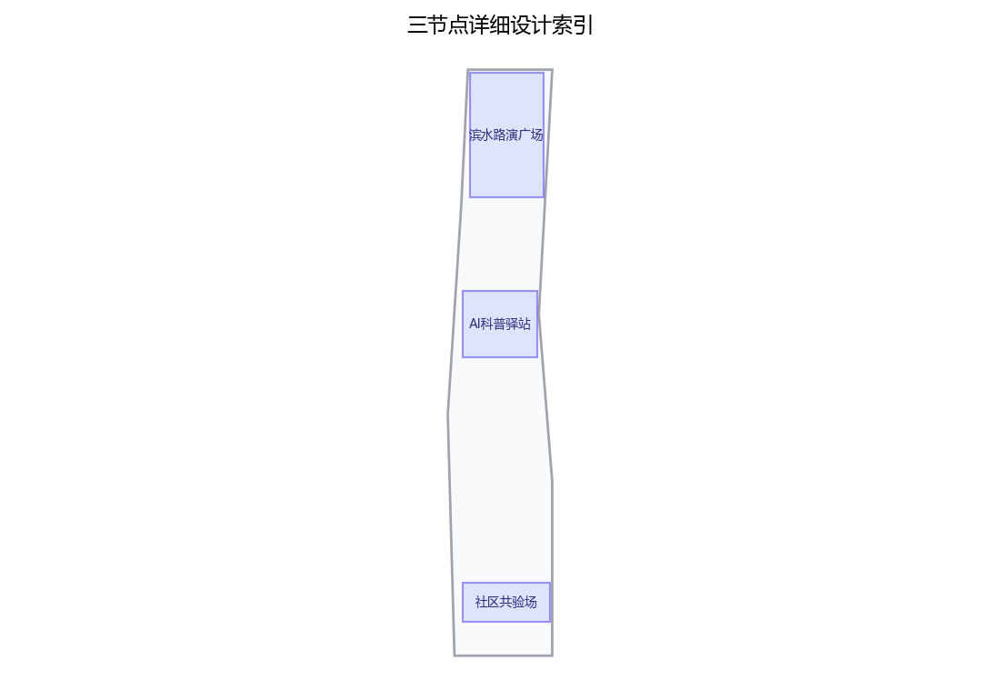
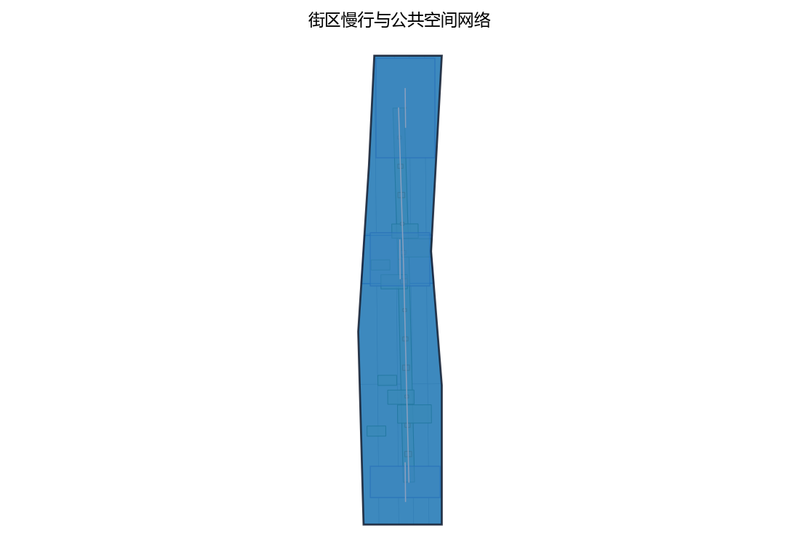
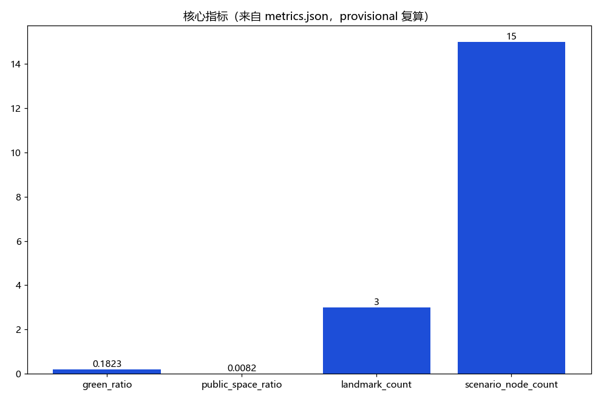

## 设计依据与资料清单

本方案依据征集任务书确立的三层范围口径与"边界provisional、指标概念口径"的提交规则编制，工作前系统梳理四类资料。其一，法定与上位规划：包括《北京城市总体规划（2016年—2035年）》、海淀分区规划（国土空间规划）、学院路街区控制性详细规划，以及小月河水环境治理、河道蓝线与防洪相关专项规划。其二，竞赛文件：包括本次征集任务书、答疑纪要及官方底图，几何边界以官方复算为准。其三，现状调研资料：包括小月河水系断面与驳岸类型、两岸用地与建筑年代分布、高校院所与科研单位名录、老旧社区边界与人口结构、交通与市政管线敷设情况，以及步行断点、亲水可达性与夜间活力现场记录。其四，公开数据：包括街道人口就业、AI企业分布与产业集聚等统计口径。资料清单随边界复算与深化阶段滚动更新，缺项以现场补测与访谈补足，并在成果附录列明来源与版本。

> **证据锚点**：[source:DATA-SRC-OFFICIAL-ANNOUNCEMENT-20260509]、[source:DATA-SRC-AGENT-TASKBOOK-20260518]（组织方公告与任务书为文本口径依据）。

## 三层范围工作框架

按任务书口径建立"统筹研究—总体设计—重点区域"三层框架。统筹研究范围覆盖小月河流域及学院路街区整体，回答产业、人才与未来城市命题，输出战略判断与空间结构；总体设计范围聚焦沿小月河约3公里滨水廊道及两侧一个街坊进深的腹地，以城市更新与控规深度完成城市设计，输出用地、形态、路径与实施导则；重点区域选取滨水路演广场及三处公共体验节点所在用地，输出可落地的详细设计。三层采用同一底图与统一坐标系，边界均为provisional，待官方几何复算后刚性校核并替换成果图面；指标仅在概念口径下给出，复算后统一更新。工作组织上，设置"一张总图、一套导则、一份清单、一张指标表"的成果体系，逐级套合、交叉校核，确保廊道整体连续性与重点区域精细度兼得，并为控规衔接预留接口。

> **证据锚点**：[source:DATA-SRC-AGENT-TASKBOOK-20260518]（三层范围划分依据任务书官方文本口径）。

## 统筹研究范围产业与未来城市研究

统筹研究范围以学院路街区为核心腹地，高校、科研院所与科技企业高度集聚，是AI创新要素密度最高的地区之一。研究判断：京张科创走廊与小月河水系构成"轨道线性＋水系线性"双轴，小月河有条件成为AI场景从研发走向日常生活的"城市测试场"与展示带。产业研究聚焦AI+教育、AI+健康、AI+水务、AI+文创等与滨水公共生活耦合度高的赛道，研判企业路演、成果发布与实验室外溢场景的落位规律；未来城市研究关注人机共处、数字孪生运维、无人化服务与数据治理对公共空间形态的影响。提出"先场景、后生态、再产业"的时序策略：以低成本场景装置活跃水岸人气，以稳定运营吸引企业与人才，最终形成环河创新生态圈。同时设定技术更替风险对冲机制，确保任何AI设施过时淘汰都不损伤空间的公共价值，长廊骨架永远属于日常公共生活。

> **证据锚点**：[source:DATA-SRC-PROVISIONAL-BOUNDARIES-20260605]（边界为 provisional，研究范围仅作概念示意）。

## 总体设计范围城市更新与控规深度城市设计

总体设计范围聚焦约3公里滨水廊道及其腹地，按控规深度开展城市设计。空间结构为"一带三段多点"：一带即连续滨水体验带；三段按岸线资源划分生态段、生活段与路演段，生态段以自然驳岸与湿地净化为主，生活段面向老旧社区布置日常休憩与社区活动空间，路演段集中布置路演广场与体验节点；多点即一处广场、三处节点与若干口袋空间。设计内容包括：蓝线管控与滨水退线校核，岸线分类改造，连续步行路径无障碍贯通与桥下空间利用，沿线建筑高度、体量与界面整治导则，老旧小区围墙透绿与出入口优化。控规深度上，校核用地兼容性、容积率与建筑密度，落实公共服务设施用地，避让市政管线并预留设施接口。成果与学院路街区控规、京张铁路遗址公园等相邻项目衔接，形成可进入控规修编的刚性内容。

> **证据锚点**：[source:DATA-SRC-MOHURD-CONTROL-DETAILED-PLANNING]、[source:DATA-SRC-PROVISIONAL-BOUNDARIES-20260605]。

## 重点区域详细设计

重点区域包括一处滨水路演广场与三处公共体验节点。路演广场选址于路演段内腹地开阔、亲水条件最好的岸段，由路演舞台、会客厅、预制看台与滨水休憩平台组成：舞台面向水面与草坪看台，满足发布、演出、快闪等多尺度活动；会客厅承担洽谈、直播与运维功能，采用模块化可逆结构。三处节点各有定位：AI科普驿站邻近高校与中小学出行路径，以交互装置与展教活动普及AI知识；场景试验台面向企业与科研团队，提供快速部署、短期试运行的试验场地与数据回传接口；社区共验场嵌入老旧社区，聚焦长者与儿童可及性，配置AI健康服务与离线人工替代岗位。节点之间以连续步道串联，各节点编制平面、剖面、效果图、模块清单与活动日历，明确夜间照明与夜间活动预案，保证白天与夜间均可达、可用、可运营。

> **证据锚点**：[data:PACKAGE-GEOMETRY]（三节点示意多边形来自本包 geometry/key_areas.geojson）。

## AI 创新生态、人才画像与 AI+ 场景
人才画像按四类刻画：高校师生与科研人员，需求为试验、路演与学术交流空间；科技企业与创业者，需求为发布、展示与快速试错场地；周边居民尤其长者与儿童，需求为低门槛、可信任的AI体验与日常服务；访客需求为导览与特色打卡。据此提出AI+场景清单，分常设、轮换与快闪三级：常设场景包括AI水质监测可视化、智能步道灯与无障碍语音导览，每处均配置离线人工替代，保证断网或停服时服务不中断；轮换场景每季度更新，涵盖AI+教育科普、AI+健康小屋、AI+文创演艺与虚拟漫游；快闪场景结合路演活动临时部署。场景建立评价指标，从使用频次、满意度与维护成本动态筛选、优胜劣汰，保持长廊内容常新。所有数据采集严格遵守个人信息保护要求，场景说明采用"机器＋人工"双通道，保障数字弱势群体权益。

> **证据锚点**：[source:DATA-SRC-GENERATIVE-AI-INTERIM-MEASURES]（AI 生成内容治理表述的参照依据）。

## 用地、建筑规模与拆改留方案
用地与建筑规模均在概念口径下给出，待边界复算后校核。路演广场用地约1.0—1.5公顷，其中路演舞台与会客厅建筑面积合计约2500—3500平方米，层数不超过三层；三处节点合计用地约0.8—1.2公顷，各节点建筑面积约600—1200平方米，以轻钢结构与可拆装单元为主。步道与广场等开放空间不新增大型构筑物，设施一律模块化、可逆、可迁移。拆改留以"留为主、改为主、拆为辅"为原则：保留滨水公共空间、历史建筑、大树与有记忆的场所；改造老旧小区滨水界面、围墙与出入口，修缮沿河房屋立面；仅拆除违法建设、危房与阻断河岸的障碍建筑。拆除与改造规模、安置需求在概念口径下列出总量，待房屋测绘与边界复算后形成逐栋清单，并在实施阶段履行相应程序。

> **证据锚点**：[source:DATA-SRC-MNR-LAND-USE-CLASSIFICATION-202311]（用地分类名称参照现行国标口径）。

## 交通、轨道、市政与公共服务设施
交通组织以慢行为先：沿河贯通约3公里滨水步道与骑行道，消除现状断点，桥下空间改造为通道与停留点；与周边轨道站点建立5—10分钟可达接驳，优化公交站点位置，在廊道端点与广场周边设置共享单车与远端停车场，限制机动车进入滨水区。市政设施结合生态修复一体化设计：河道补水与水质净化、海绵雨水设施、雨污分流改造；照明、强弱电与给排水均预留模块化接口，便于场景设施快速接入；全部设施满足防洪与水位校核要求。公共服务设施按每500米服务半径配置驿站、无障碍卫生间、母婴室、饮水点与AED应急点，节点建筑兼具避雨、寄存与运维功能。建立统一标识系统与人工服务台，确保数字服务与人工服务并行，形成"看得懂、找得到、用得上"的公共体验路径。

> **证据锚点**：[source:DATA-SRC-MOHURD-URBAN-DESIGN-MEASURES]（市政与慢行设计表述的方法参照）。

## 蓝绿空间、公共空间与城市风貌
蓝绿空间以生态修复为基础：岸线分类自然化，生态段恢复缓坡与水生植物带，结合人工湿地净化初期雨水，保留乡土树种并补植遮荫乔木，营造鸟类与昆虫栖息环境；全线控制硬质化比例，兼顾防洪安全与生物多样性。公共空间形成"广场—节点—路径—口袋空间"层级：广场承载大型活动，节点承载主题体验，路径保证连续漫步，口袋空间散布于桥头、巷口与社区入口，织补日常休憩。城市风貌延续学院路科教文化气质，强调蓝绿交织、轻介入、可识别：统一的廊道标识与铺装语言，夜景照明突出水面与舞台并保障夜间活动安全；沿线建筑界面、围墙与店招编制风貌导则，禁止大体量、高饱和广告与突兀构筑，保证长廊以整体场景呈现，而各节点各有识别特征，形成"一条河、一条线、一串故事"的公共体验。

> **证据锚点**：[source:DATA-SRC-MOHURD-URBAN-DESIGN-MEASURES]（蓝绿空间组织的方法参照）。

## 更新项目清单、实施政策与分期计划
更新项目清单按五类编制：生态修复类（岸线自然化、湿地净化、水质提升）、滨水空间类（路演广场、三处节点、步道贯通与桥下改造）、建筑改造类（老旧小区界面、沿河立面与拆违）、市政智慧类（管网、照明与场景设施）、运营配套类（标识、人工服务台与活动设施），每项列明规模、位置与投资概念估算。实施政策：建立"政府统筹＋平台公司运营＋校地企共建"机制，鼓励高校院所开放资源、企业认建认养，探索公共空间运营反哺与容积率奖励等政策工具，多元筹资、分期投入。分期计划：一期1—2年，贯通步行断点、建成路演广场并投放首批常设场景；二期3—5年，建成三处节点，完成全线生态修复与风貌提升；三期5—8年，向两岸腹地纵深更新，形成环河创新生态圈。每期设置评估节点，依据运营数据动态调整后续项目。

> **证据锚点**：[source:DATA-SRC-AGENT-TASKBOOK-20260518]（分期与实施条目对应任务书要求）。

## 指标体系、面积复算与合规矩阵
本方案指标全部为概念口径，边界为provisional，待官方几何复算后统一更新。概念指标包括：路演长廊连续长度约3公里；路演广场1处（约1.0—1.5公顷）；公共体验节点3处；新增或改造滨水步道宽约6—8米、全线无障碍贯通；生态化岸线比例不低于60%；可逆模块化设施占比不低于80%；夜间开放时段与人工服务覆盖全部节点。面积复算流程：以官方底图与坐标重新量算廊道长度、节点范围与建筑规模，替换概念数值并在成果中标注复算版本。合规矩阵对照蓝线管控、滨水退线、防洪标准、控规用地与指标、无障碍与消防规范逐项核对，明确"符合、需校核、需调整"三类结论；凡与现行规划冲突处，提出控规修编衔接或设计调整路径，保证成果可审查、可实施、可追溯。

> **证据锚点**：[metric:green_ratio]、[metric:public_space_ratio]、[source:PACKAGE-GEOMETRY]。

## 风险、版权与合规说明
风险识别与应对：边界与面积数据风险，以provisional标注并待官方复算消除；AI技术迭代过快导致场景过时，以模块化可逆设施与场景轮换机制对冲，保证任何设施淘汰不损害公共价值；投资与运营风险，通过分期投入、多元筹资与运营评估控制；施工期对河道与居民生活的影响，以错峰施工、围挡美化与公众沟通缓解；防洪与生态风险，严格执行水位校核与生态修复标准。版权说明：本方案为原创概念成果，底图、统计数据与引用资料版权归原作者或提供方所有，成果中列明引用清单；方案文字、图纸与模型版权由设计团队与主办方按约定共有。合规说明：方案遵守相关法律法规与规划规范；AI设施涉及的监控摄像与数据采集严格遵循个人信息保护要求，同时保障无障碍通行与数字弱势群体的人工替代服务，确保公共空间权利公平。

> **证据锚点**：[source:DATA-SRC-OFFICIAL-ANNOUNCEMENT-20260509]（征集规则为权属与合规表述的依据）。

## 参考资料

本方案主要参考以下资料：征集任务书、答疑澄清文件及官方底图（边界provisional）；《北京城市总体规划（2016年—2035年）》；海淀分区规划（国土空间规划）及学院路街区控制性详细规划相关成果；小月河流域水环境治理、河道蓝线与防洪相关专项资料；京张铁路遗址公园及周边城市设计公开成果；学院路街道人口、就业、社区与公共服务设施公开统计数据；相关高校院所公开的科研与产业资料，以及国内外智慧城市与滨水AI场景案例的公开文献。此外，编制团队开展现场踏勘、居民访谈与夜间活力观察，形成调研记录作为补充资料。引用格式遵循学术规范，公开数据注明出处与统计年份。全部资料将随边界复算与深化设计滚动更新，最终版以正文附表形式完整列示。

> **证据锚点**：[source:DATA-SRC-OFFICIAL-ANNOUNCEMENT-20260509]（本清单首条即组织方公开资料包）。
