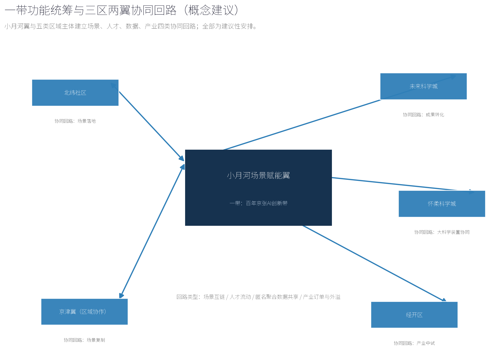
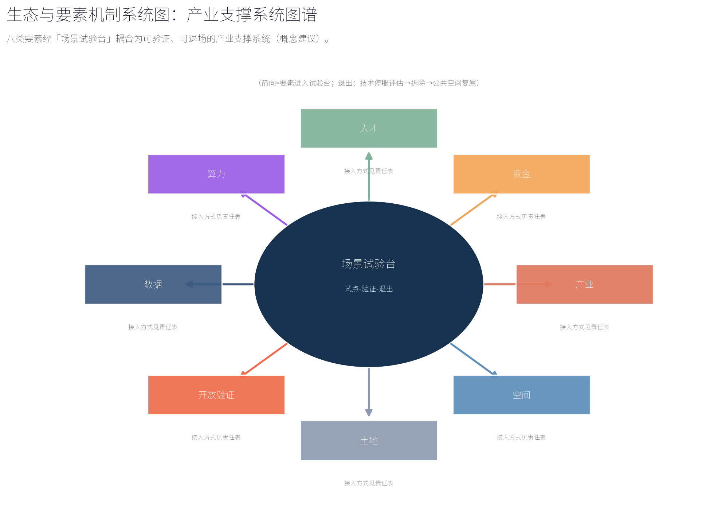

## 设计依据与资料清单

本方案依据征集任务书确立的三层范围口径与"边界provisional、指标概念口径"的提交规则编制，工作前系统梳理五类资料。其一，法定与上位规划：包括《北京城市总体规划（2016年—2035年）》、海淀分区规划（国土空间规划）、学院路街区控制性详细规划，以及小月河水环境治理、河道蓝线与防洪相关专项资料；上述规划文本的获取版本与引用边界在 sources.json 中逐项登记（REF-BEIJING-MASTER-PLAN、REF-HAIDIAN-DISTRICT-PLAN、REF-XUEYUANLU-CONTROL-PLAN、REF-XIAOYUEHE-SPECIAL-DATA），凡未获得正式文本者一律只作方向性引用、不作数值引用。其二，竞赛文件：包括本次征集任务书、答疑纪要及官方公告，几何边界以官方复算为准。其三，现状调研资料：包括小月河水系断面与驳岸类型、两岸用地与建筑年代分布、高校院所与科研单位名录、老旧社区边界与人口结构、交通与市政管线敷设情况，以及步行断点、亲水可达性与夜间活力现场记录（踏勘与访谈见 REF-FIELD-SURVEY、REF-RESIDENT-INTERVIEWS，均为非统计性概念依据）。其四，公开数据：包括学院路街道人口就业统计、AI企业分布与产业集聚等统计口径（REF-JIEDAO-STATISTICS）。其五，全球案例：7个可迁移机制的全球滨水、遗产与智慧街区案例（见"全球案例对标与可迁移机制"章节，逐条登记于 sources.json）。资料清单随边界复算与深化阶段滚动更新，缺项以现场补测与访谈补足，并在成果附录列明来源与版本。在概念上，本方案将任务书确立的"百年京张文化带、都市AI生活体验带、AI融合创新带"三大定位，映射为海淀区小月河滨水长廊承载的"文化叙事、都市体验、创新集聚"三重角色，并据此将"AI全栈自主创新体系、世界级AI创新生态、AI+场景赋能新范式、智能化AI活力城市、AI治理全球话语权"五大功能各落实到可感知、可体验、可运营的河岸载体上；该映射属于参与方的原创概念组织，而非对官方既定工程方案的重述。

> **证据锚点**：[source:DATA-SRC-OFFICIAL-ANNOUNCEMENT-20260509]、[source:DATA-SRC-AGENT-TASKBOOK-20260518]。

## 三层范围工作框架

按任务书口径建立"统筹研究—总体设计—重点区域"三层框架。统筹研究范围覆盖小月河流域及学院路街区整体，回答产业、人才与未来城市命题，输出战略判断与空间结构；总体设计范围聚焦沿小月河约3公里滨水廊道及两侧一个街坊进深的腹地，以城市更新与控规深度作为概念对照口径组织城市设计，输出用地、形态、路径与实施导则；重点区域选取翼内"一处广场（P0）加三处节点（N1/N2/N3）"所在岸段，输出可落地的详细设计。三层采用同一底图与统一坐标系，边界均为provisional，待官方几何复算后替换成果图面；指标仅在概念口径下给出，复算后统一更新。需特别说明：本方案"按控规深度组织设计内容"仅指设计成果的组织深度参照，不预设任何法定控规结论；控规修编内容须由法定编制单位依据正式资料完成，本方案不形成"可进入控规修编的刚性内容"。三层框架均与京张科创走廊、海淀区创新带建设保持节奏衔接，确保河岸更新服务于区域AI创新整体格局。工作组织上，设置"一张总图、一套导则、一份清单、一张指标表"的成果体系，逐级套合、交叉校核，确保廊道整体连续性与重点区域精细度兼得，并为控规衔接预留接口。

> **证据锚点**：[source:DATA-SRC-AGENT-TASKBOOK-20260518]、[source:DATA-SRC-PROVISIONAL-BOUNDARIES-20260605]。

## 统筹研究范围产业与未来城市研究

统筹研究范围以学院路街区为核心腹地，高校、科研院所与科技企业高度集聚，是AI创新要素密度最高的地区之一。研究判断：京张科创走廊与小月河水系构成"轨道线性＋水系线性"双轴，小月河有条件成为AI场景从研发走向日常生活的"城市测试场"与展示带。产业研究聚焦AI+教育、AI+健康、AI+水务、AI+文创等与滨水公共生活耦合度高的赛道，研判企业路演、成果发布与实验室外溢场景的落位规律；未来城市研究关注人机共处、数字孪生运维、无人化服务与数据治理对公共空间形态的影响。提出"先场景、后生态、再产业"的时序策略：以低成本场景装置活跃水岸人气，以稳定运营吸引企业与人才，最终形成环河创新生态圈。同时设定技术更替风险对冲机制，确保任何AI设施过时淘汰都不损伤空间的公共价值，长廊骨架永远属于日常公共生活——"场景可看懂、决策可复核、设施可退场"。

> **证据锚点**：[source:DATA-SRC-PROVISIONAL-BOUNDARIES-20260605]、[source:DATA-SRC-GENERATIVE-AI-INTERIM-MEASURES]。

## 总体设计范围城市更新与控规深度城市设计

总体设计范围聚焦约3公里滨水廊道及其腹地，以控规深度为概念对照口径开展城市设计。空间结构为"一带三段多点"：一带即连续滨水体验带；三段按岸线资源划分生态段、生活段与路演段，生态段以自然驳岸与湿地净化为主，生活段面向老旧社区布置日常休憩与社区活动空间，路演段集中布置路演广场与体验节点；多点即一处广场、三处节点与若干口袋空间，节点编号在正文、图件与矩阵中统一为P0（广场）、N1/N2/N3（节点）。设计内容包括：蓝线管控与滨水退线的概念校核条目，岸线分类改造，连续步行路径无障碍贯通与桥下空间利用，沿线建筑高度、体量与界面整治导则，老旧小区围墙透绿与出入口优化。概念校核层面，梳理用地兼容性、容积率与建筑密度的校核条目，落实公共服务设施用地意向，避让市政管线并预留设施接口。成果与学院路街区控规、京张铁路遗址公园等相邻项目衔接，形成后续深化工作的参考接口；防洪、水文、蓝线、控规等法定校核均列为"前置专业校核项"，须由专项设计依据正式资料完成，本方案不预断任何工程结论。

> **证据锚点**：[source:DATA-SRC-MOHURD-URBAN-DESIGN-MEASURES]、[source:DATA-SRC-MOHURD-CONTROL-DETAILED-PLANNING]、[source:DATA-SRC-PROVISIONAL-BOUNDARIES-20260605]。

## 重点区域详细设计

重点区域包括一处滨水路演广场（P0）与三处公共体验节点（N1 AI科普驿站、N2 场景试验台、N3 社区共验场），编号在全正文、关键图与各类矩阵中保持一致，不再出现"三项节点"与"四处节点"混用的旧口径。P0 路演广场选址于路演段内腹地开阔、亲水条件最好的岸段，由路演舞台、会客厅、预制看台与滨水休憩平台组成：舞台面向水面与草坪看台，满足发布、演出、快闪等多尺度活动；会客厅承担洽谈、直播与运维功能，采用模块化可逆结构。N1 AI科普驿站邻近高校与中小学出行路径，以交互装置与展教活动普及AI知识，配置学生志愿讲解与离线展签；N2 场景试验台面向企业与科研团队，提供快速部署、短期试运行的试验场地与数据回传接口，并嵌入「河畔议事会」会址（议事功能不单列为节点，避免计数口径漂移）；N3 社区共验场嵌入老旧社区，聚焦长者与儿童可及性，配置AI健康服务与离线人工替代岗位。节点之间以连续步道串联，各节点编制平面、剖面、效果图、模块清单与活动日历，明确夜间照明与夜间活动预案，将"白天与夜间均可达、可用、可运营"作为概念目标设定。

> **证据锚点**：[data:PACKAGE-GEOMETRY]（翼内节点落位示意来自本包 geometry/public_space.geojson；区级三处重点区域见 key_areas.geojson，[metric:key_area_count]=3）。

## AI 创新生态、人才画像与 AI+ 场景

人才画像按五类刻画，与 metrics.json 的 persona_count=5 一致；每类画像均给出具体旅程、传统渠道兜底、共创反馈机制与概念验收条件（见下表），其中长者与儿童、视听障碍用户、低数字技能用户、非智能设备用户的旅程细节为本次修订重点补强。无障碍人工服务的主张按《无障碍环境建设法》第39条口径限定：该条人工服务要求仅适用于法律列举的医疗、社会保障、金融、生活缴费等特定公共服务事项所在场所，本方案不据此笼统宣称全部公共空间已合规，仅表述"在法律列举的特定公共服务事项场所内配置现场指导与人工办理兜底"，其余公共空间以数字与人工双通道、可达设计、离线替代作为概念建议。

| 画像 | 具体旅程 | 传统渠道兜底 | 共创反馈机制 | 概念验收条件 |
| --- | --- | --- | --- | --- |
| 高校师生与科研人员 | 课后沿河到达N1/N2，参加路演、试验与学术交流 | 现场公告栏与人工接待台 | 「河畔议事会」提案与科研共建 | 每学期至少一次主题共创，意见在30日内答复 |
| 科技企业与创业者 | 预约N2试验台短租试用，发布成果于P0 | 线下办事窗口与电话预约 | 开发者公约与年度擂台 | 从注册到首次试用不超过14日（概念目标） |
| 长者与儿童 | 社区出口步行5至10分钟到达N3/N1，使用低门槛交互 | 社区联络员与人工服务岗 | 家庭共创日与儿童议事角 | 长者不依赖手机可完成一次完整参观（概念测试） |
| 视听障碍与低数字技能用户 | 经无障碍路径到达各节点，使用语音与盲文导览 | 离线人工讲解与求助按钮 | 「无障碍体验官」志愿反馈 | 每月一次无障碍走查，问题在15日内修复（概念目标） |
| 访客与通勤者 | 从轨道站经慢行路径到达，体验快闪与夜间活动 | 纸质导览图与人工问询台 | 线上意见征集与打卡反馈 | 游客满意度年度公示（概念指标） |

据此提出AI+场景清单，分常设、轮换与快闪三级：常设场景包括AI水质监测可视化、智能步道灯与无障碍语音导览，每处均配置离线人工替代路径，目标为断网或停服时服务不中断；轮换场景每季度更新，涵盖AI+教育科普、AI+健康小屋、AI+文创演艺与虚拟漫游；快闪场景结合路演活动临时部署。场景内容以场景卡作为管理单元，首批编制十张场景卡（见"场景卡体系与产业测试验证场景"章节），每张卡明确落位空间、运营主体建议、数据边界、人工复核、离线替代、KPI与退出条件。场景建立评价指标，从使用频次、满意度与维护成本动态筛选、优胜劣汰，保持长廊内容常新。场景落地实行备案制，新场景上线前须完成备案、试运行评估与「河畔议事会」公示；所有数据采集严格遵守个人信息保护要求，场景说明采用"机器＋人工"双通道，保障数字弱势群体权益。AI治理执行三条底线：仅处理匿名聚合数据，原始个体数据不出采集点；关键决策一律人工复核，AI仅提供建议，不单独作出影响权益的决定；禁止过度监控，不进行个体识别式追踪、不建立大规模行为画像。三条底线写入「小月河文明公约」（滨水共治公约）并纳入场景卡管理规则，接受年度公示监督。AI创新生态的最终衡量标准，是水岸上的AI功能可被看懂、可被复核、可被关闭，人始终在场；这条"场景可看懂、决策可复核、设施可退场"的底线，与五类人才画像的需求一一对应，让河岸上的AI创新生态以公共生活为中心而非以装置为中心，形成"生态—场景—治理"环环相扣的整体结构，覆盖交通、产业、空间、公共服务、文化与治理六个主题维度。

> **证据锚点**：[source:DATA-SRC-GENERATIVE-AI-INTERIM-MEASURES]、[source:DATA-SRC-BARRIER-FREE-ENVIRONMENT-LAW]、[metric:persona_count]。

## 场景卡体系与产业测试验证场景

场景卡是本方案的管理单元，首批十张卡覆盖滨水巡检、水质监测、亲水导览、生态科普、活动运营、夜间照明、社区共验、企业试验、志愿积分与无障碍服务等方向；每张卡与具体空间、运营主体建议、数据边界、人工复核、离线替代、KPI与退出条件一一对应（下表），并在"场景—空间—运营"映射矩阵中挂接空间载体与运营机制。全部为概念建议，KPI与退出条件为建议口径，正式值在试点实施阶段确定。

| 场景卡 | 落位空间 | 运营主体建议 | 数据边界 | 人工复核 | 离线替代 | KPI（概念） | 退出条件 |
| --- | --- | --- | --- | --- | --- | --- | --- |
| S1-AI滨水巡检卡 | 路演段步道、桥下空间与重点岸段 | 「泊岸志愿者」认段巡查＋运营公司调度 | 告警事件匿名汇总，不采集影像个体信息 | 告警信息人工复核确认后处置 | 人工巡河排班表 | 月告警处置率≥95%（概念） | 连续两季度误报率超阈值即下线 |
| S2-AI水质监测可视卡 | 生态段湿地净化区与现状监测点位 | 水务单位＋高校团队联合维护 | 聚合水质参数，原始探头数据对外仅展示小时均值 | 异常数据由人工采样复核 | 人工采样与公示板 | 月度公示按期率100%（概念） | 设备两年未达宣传精度即退役 |
| S3-AI亲水导览卡 | 三处节点与全线解说点 | 运营公司＋志愿讲解团队 | 仅统计导览调用次数，不采集语音内容 | 导览内容上线前人工审核 | 纸质导览图与人工讲解并行 | 导览覆盖率≥80%（概念） | 连续两季度使用率垫底即轮换 |
| S4-AI生态科普卡 | N1科普驿站与自然讲解径 | 高校师生志愿讲解，AI辅助答疑 | 答题与互动仅存聚合统计 | 科普内容由高校团队定期复核 | 展签、小册子与人工讲解 | 年度科普活动≥20场（概念） | 内容更新滞后超一年即下线 |
| S5-水上与沿岸活动运营卡 | P0水岸与活动平台 | 运营公司＋活动主理人 | 预约人数聚合统计，不采集参与者个体画像 | 活动安全与容量由人工核定 | 现场排队与人工签到 | 年活动场次≥40场（概念） | 安全评估不通过即暂停 |
| S6-AI夜跑与步道灯卡 | 生活段步道与桥下空间 | 物业与照明运维单位 | 亮度与能耗聚合数据 | 照明策略变更人工确认 | 定时照明基础模式 | 夜间开放率100%（概念） | 能耗超标即切换基础模式 |
| S7-社区共验服务卡 | N3社区共验场 | 社区组织＋运营公司＋志愿者 | 服务预约去标识化，不留存健康原始数据 | 健康建议类输出须人工审核 | 社区联络员与人工服务岗 | 长者月服务人次（概念基线） | 居民评议连续两期不通过即调整 |
| S8-企业试验与数据回传卡 | N2场景试验台 | 平台公司＋入驻企业 | 试验数据按项目协议匿名回传，可审计删除 | 试验上线与数据发布人工审批 | 试验样例离线演示 | 年孵化试验项目≥12个（概念） | 协议到期未续约即拆除 |
| S9-护水积分与志愿巡河卡 | 全线与社区入口 | 社区＋志愿者联盟 | 仅记录积分聚合值，不采集位置轨迹画像 | 积分兑换人工核验 | 纸质积分卡 | 年志愿参与人次（概念基线） | 机制评审每两年一次 |
| S10-无障碍语音与离线讲解卡 | 全线无障碍点位与三节点 | 运营公司＋无障碍志愿者 | 求助事件匿名统计 | 讲解内容上线前人工审核 | 求助按钮直通人工服务台 | 求助响应时长（概念目标） | 人工服务链路中断即下线 |

**场景—空间—运营映射矩阵**：场景卡按"常设／轮换／快闪"三级挂接空间与运营，形成可审计的映射关系，防止"有场景无主人"。

| 场景卡 | 空间载体 | 运营机制 | 数据回传通道 | 备案与退出节点 |
| --- | --- | --- | --- | --- |
| S1/S5/S6 | P0、路演段步道、生活段步道 | 「泊岸志愿者」＋运营公司 | 匿名事件汇总 | 上线备案→季度评估→年度擂台 |
| S2/S3/S4/S10 | 生态段、N1、全线解说点 | 高校联盟＋运营公司 | 聚合统计 | 上线备案→月度公示→年度复核 |
| S7/S9 | N3、社区入口 | 社区组织＋志愿者联盟 | 去标识化汇总 | 议事会审议→年度评估 |
| S8 | N2 场景试验台 | 平台公司＋企业 | 项目协议制匿名回传 | 注册→试用→评审→续约或拆除 |

**产业测试验证场景（3项）**：为兑现"不少于3个产业测试验证场景"的任务要求，设置三项可执行的产业测试验证场景，与 industry_test_scenario_count=3 一致；每项给出测试内容、场地与挂载、参与主体、数据与合规边界、通过标准与退出安排，全部为建议性设计。

| 产业测试验证场景 | 测试内容 | 场地与挂载 | 参与主体 | 数据与合规边界 | 通过标准与退出 |
| --- | --- | --- | --- | --- | --- |
| T1-无人化滨水巡检与告警复核测试 | 巡检机器人/无人机在滨水环境的识别率、误报率与人工复核闭环 | N2 试验台及路演段试点岸段 | 智能巡检企业、运营公司、高校 | 不采集行人个体影像，告警匿名汇总，全程可人工终止 | 误报率低于阈值并连续运行3个月（概念标准），否则退出 |
| T2-多模态亲水导览与无障碍交互测试 | 语音、触觉、大字模式与听障适配在真实水岸环境的可用性 | N1 科普驿站及相邻讲解径 | 交互硬件企业、无障碍机构、志愿体验官 | 会话数据匿名聚合，不建立行为画像 | 残障体验官走查通过率达标（概念标准），否则调整 |
| T3-水岸活动安全AI辅助容量评估测试 | 活动人流密度估计与容量预警在P0大型活动中的辅助作用 | P0 广场及水岸平台 | 视觉算法企业、安保运营单位 | 仅聚合流量，不进行个体识别式追踪 | 人工核定仍为最终决策，AI仅辅助；预警误报率达标（概念标准） |

**概念TRL评定**：按公开技术成熟度描述对场景卡涉及的能力层给出概念TRL区间（参与方自评，不构成研发承诺），评定依据随试点测试数据滚动更新，并在年度公示中公开。

| 能力层 | 概念TRL区间 | 评定依据（概念） |
| --- | --- | --- |
| 水质监测可视化 | 6—7 | 水质在线监测与可视化在同类水域有公开应用案例 |
| 语音导览与多模态交互 | 7—8 | 语音与无障碍交互为成熟消费品技术，需场地适配 |
| 智能步道灯 | 5—6 | 低功耗感知照明处于城市级试点阶段 |
| 无人化滨水巡检 | 4—6 | 巡检机器人与无人机的滨水环境适配尚需现场验证 |
| 活动容量AI辅助评估 | 4—6 | 人群密度估计的精度与合规边界需实测校核 |

> **证据锚点**：[metric:industry_test_scenario_count]、[source:DATA-SRC-AGENT-TASKBOOK-20260518]。

## 全球案例对标与可迁移机制

为支撑"场景—空间—运营"与"先场景、后生态、再产业"的机制设计，收集7个真实全球案例（与 global_case_count=7 一致），每个案例登记城市、年份、运营或实施主体、可迁移机制与来源，来源条目已在 sources.json 中按发布方逐条登记（CASE-HIGHLINE 至 CASE-KALASATAMA）。所有案例仅作机制参照，不构成对任何第三方成果的背书或对本地效果的承诺。

| 案例 | 城市 | 年份 | 运营/实施主体 | 可迁移机制 | 来源 |
| --- | --- | --- | --- | --- | --- |
| 高线公园 | 纽约 | 2009起（分段开放至2014） | Friends of the High Line 与纽约市公园局 | 铁路遗产再利用、非营利方持续运营、社区共建 | [source:CASE-HIGHLINE] |
| 清溪川复明 | 首尔 | 2005 | 首尔市政府 | 高架路拆除、河道复明、雨洪安全与公共空间复合 | [source:CASE-CHEONGGYECHEON] |
| 海港浴场 | 哥本哈根 | 2002起 | 哥本哈根市政府 | 模块化漂浮亲水设施、季节性运营、居民游泳文化 | [source:CASE-COPENHAGEN] |
| 碧山—宏茂桥公园 | 新加坡 | 2012 | PUB与新加坡国家公园局 | 明渠自然化、蓝绿基础设施、社区亲水共治 | [source:CASE-BISHAN] |
| 罗讷河伯尔日岸线 | 里昂 | 2007起 | 大里昂（今里昂大都会） | 车行减量、连续滨水公共空间、活动编程 | [source:CASE-LYON] |
| 码头区智慧试点 | 多伦多 | 2017—2020 | Waterfront Toronto 与 Sidewalk Labs | 公共数据治理规则先行、"可退场"试点教训 | [source:CASE-TORONTO] |
| 智慧卡拉萨塔马 | 赫尔辛基 | 2013起 | 赫尔辛基市与 Forum Virium | 敏捷试点、居民共创、开放数据与场景验证 | [source:CASE-KALASATAMA] |

**机制小结**：从案例中提炼四条本翼可迁移机制——其一，遗产与线性空间再利用（高线、罗讷河），支撑"铁路叙事＋滨水路径"；其二，蓝绿自然化与雨洪复合（清溪川、碧山），支撑生态段设计；其三，模块化亲水设施与季节性运营（哥本哈根），支撑设施可退场；其四，公共数据治理先行与试点终止预案（多伦多、赫尔辛基），支撑数据治理矩阵与退出条件设计。全部机制落地均需本地化校核，不直接套用。

> **证据锚点**：[metric:global_case_count]、[source:CASE-HIGHLINE]。

## 一带功能统筹与三区两翼协同

"三区两翼"是本方案对任务书区域结构的显式响应：三区指众智园AI自主创新加速区、北京AI原点社区、大钟寺AI产业聚集区（区级三处重点区域，见 key_areas.geojson）；两翼指京张遗址活力带（北翼，衔接京张铁路遗址公园与京张科创走廊）与小月河场景赋能翼（本翼，南翼）。本翼承担"场景试验与公共体验"功能，与三区形成功能分工：三区侧重研发、孵化与产业集聚，本翼侧重场景展示、验证与公共生活转化。协同回路（全部为建议性安排）：与北纬社区建立场景落地与居民体验回路；与未来科学城建立成果转化与场景供给回路；与怀柔科学城建立大科学装置科普联动回路；与经开区（北京经济技术开发区）建立产业中试与供应链对接回路；与京津冀区域建立场景复制与经验输出回路。回路机制按场景互链、人才流动、匿名聚合数据共享与产业订单外溢四种类型组织，其运营规则写入「开发者公约」与年度活动品牌体系；区域协同不改变本方案独立成翼的边界口径，亦不构成对区域协议的预判。

> **证据锚点**：[source:DATA-SRC-OFFICIAL-ANNOUNCEMENT-20260509]、[source:DATA-SRC-AGENT-TASKBOOK-20260518]。

## 用地、建筑规模与拆改留方案

用地与建筑规模均在概念口径下给出，待边界复算后校核，不公布伪精度数值。P0 路演广场用地约1.0—1.5公顷，其中路演舞台与会客厅建筑面积合计约2500—3500平方米，层数不超过三层；N1/N2/N3 三处节点合计用地约0.8—1.2公顷，各节点建筑面积约600—1200平方米，以轻钢结构与可拆装单元为主。步道与广场等开放空间不新增大型构筑物，设施一律模块化、可逆、可迁移。拆改留以"留为主、改为主、拆为辅"为原则：保留滨水公共空间、历史建筑、大树与有记忆的场所；改造老旧小区滨水界面、围墙与出入口，修缮沿河房屋立面；仅拆除违法建设、危房与阻断河岸的障碍建筑。拆除与改造规模、安置需求在概念口径下列出总量，待房屋测绘与边界复算后形成逐栋清单，并在实施阶段履行相应程序后执行；本方案不预断任何具体拆除对象与安置规模结论。

> **证据锚点**：[source:DATA-SRC-MNR-LAND-USE-CLASSIFICATION-202311]、[metric:land_use_zone_count]、[metric:building_unit_count]。

## 交通、轨道、市政与公共服务设施

交通组织以慢行为先：沿河贯通约3公里滨水步道与骑行道（概念主路径，见"指标体系"章节口径表），消除现状断点，桥下空间改造为通道与停留点；与周边轨道站点建立5—10分钟可达接驳，衔接昌平线南延的学院桥、学知园、六道口站及15号线六道口站（站名真实、接驳为概念设想），优化公交站点位置，在廊道端点与广场周边设置共享单车与远端停车场，限制机动车进入滨水区。市政设施结合生态修复一体化设计：河道补水与水质净化、海绵雨水设施、雨污分流改造；照明、强弱电与给排水均预留模块化接口，便于场景设施快速接入。防洪与水位校核不在此预断结论：全部滨水设施的防洪、水位与生态校核须由专项设计依据正式水文资料完成，本方案仅记录"需校核"状态。公共服务设施按每500米服务半径配置驿站、无障碍卫生间、母婴室、饮水点与AED应急点，节点建筑兼具避雨、寄存与运维功能。建立统一标识系统与人工服务台，数字服务与人工服务并行，形成"看得懂、找得到、用得上"的公共体验路径；在法律列举的特定公共服务事项场所，按无障碍法规配置现场指导与人工办理兜底。

> **证据锚点**：[source:DATA-SRC-MOHURD-URBAN-DESIGN-MEASURES]、[metric:road_network_length_m]。

## 蓝绿空间、公共空间与城市风貌

蓝绿空间以生态修复为基础：岸线分类自然化，生态段恢复缓坡与水生植物带，结合人工湿地净化初期雨水，保留乡土树种并补植遮荫乔木，营造鸟类与昆虫栖息环境；全线控制硬质化比例，兼顾防洪安全与生物多样性（防洪结论由专项校核给出）。公共空间形成"广场—节点—路径—口袋空间"层级：P0 广场承载大型活动，N1/N2/N3 节点承载主题体验，路径保证连续漫步，口袋空间散布于桥头、巷口与社区入口，织补日常休憩。城市风貌延续学院路科教文化气质，强调蓝绿交织、轻介入、可识别：统一的廊道标识与铺装语言，夜景照明突出水面与舞台并保障夜间活动安全；沿线建筑界面、围墙与店招编制风貌导则，建议禁止大体量、高饱和广告与突兀构筑，使长廊以整体场景呈现，而各节点各有识别特征，形成"一条河、一条线、一串故事"的公共体验。

> **证据锚点**：[source:DATA-SRC-MOHURD-URBAN-DESIGN-MEASURES]、[metric:green_ratio]、[metric:public_space_ratio]。

## 更新项目清单、实施政策与分期计划

更新项目清单按五类编制：生态修复类（岸线自然化、湿地净化、水质提升）、滨水空间类（P0 路演广场、N1/N2/N3 节点、步道贯通与桥下改造）、建筑改造类（老旧小区界面、沿河立面与拆违）、市政智慧类（管网、照明与场景设施）、运营配套类（标识、人工服务台与活动设施），每项列明规模、位置与投资概念估算区间（概念口径，不作为预算承诺）。实施政策：建立"政府统筹＋平台公司运营＋校地企共建"机制，鼓励高校院所开放资源、企业认建认养，探索公共空间运营反哺与容积率奖励等政策工具的适用性，多元筹资、分期投入。公众参与嵌入实施全过程：建立居民意见通道，依托「河畔议事会」开展居民议事，定期组织意见征集并向居民公开答复采纳情况；每年发布项目实施与运营评估的年度公示；每年举办五项年度活动品牌（见"年度活动品牌体系"章节）。参与主体覆盖政府、企业、高校、居民、社区、运营公司、志愿者、商户与专业团队九类：政府负责统筹与监管，国企平台承担一级开发与公共资产持有，企业负责建设与运营，高校负责科研共创与人才输送，居民参与共治、监督与志愿服务，居民参加巡河、认养绿地等志愿服务按「护水积分」累计兑换公共空间服务。分期计划（概念节奏）：近期（1-3年），以路演段为试点区域，贯通步行断点、建成P0并投放首批常设场景；中期（3-5年），建成N1/N2/N3，完成全线生态修复与风貌提升，并向试点社区扩展；远期（5-10年），向两岸腹地纵深更新，形成环河创新生态圈。可测指标名称包括：连续步道贯通长度、节点建成数量、年活动场次、场景轮换率、AI功能备案数、居民满意度评分与岸线生态化比例等，具体数值在官方数据发布后复算确定。每期设置评估节点，依据运营数据动态调整后续项目。

> **证据锚点**：[source:DATA-SRC-AGENT-TASKBOOK-20260518]、[metric:phase_count]。

## 年度活动品牌体系

年度活动体系以五项品牌活动为主干（与 annual_program_count=5 一致），每项明确时间载体、IP要素与公众参与方式，形成稳定的"月历式"运营节拍：5月路演季、6月科普周、8月夜集、9月开放日、12月擂台与公示。活动分值纳入「护水积分」体系，公众参与均经「亲水预约券」预约，采用线上预约与现场人工通道并行，确保不擅长数字工具的居民同等可参与。

| 年度活动品牌 | 时间与载体 | IP要素 | 公众参与方式 |
| --- | --- | --- | --- |
| A1-小月河AI路演季 | 每年5月，P0广场与水岸平台 | 新品发布、快闪路演、创投对接、水上演艺 | 开放观演＋现场投票＋预约创投见面 |
| A2-水岸科普周 | 每年6月，N1驿站与自然讲解径 | 高校主理科普课、亲子实验、AI问答展 | 预约参加＋家庭共创＋志愿讲解招募 |
| A3-社区共验开放日 | 每年9月，N3共验场与周边社区 | 场景体验、居民评议、长者专场 | 议事会审议＋意见征集＋体验官走查 |
| A4-河畔夜集 | 每年8月，生活段步道与P0 | 夜间市集、灯光装置、夜跑活动 | 商户摊位＋居民摊位＋夜间志愿值守 |
| A5-年度成果公示与场景擂台 | 每年12月，线上与线下联动 | 年度公示、优秀场景评选、轮换名单 | 全民投票＋公开答辩＋公示监督 |

> **证据锚点**：[metric:annual_program_count]、[source:DATA-SRC-AGENT-TASKBOOK-20260518]。

## 试点实施矩阵（概念建议）

为补强可实施性证据，按试点的现状基线、场地准入条件、前置专业校核、建议责任主体、权责分工、建设与运营成本区间、维护频率、技术停服与拆除费用、指标基线值与阶段退出门槛编制实施矩阵；全部为概念建议，成本区间为数量级估算（区间表述，不发布伪精度），正式值在可研阶段确定。每个试点均将防洪、水文、蓝线、结构安全、消防与无障碍校核列为前置专业校核项，未通过校核不进入实施。

| 试点 | 现状基线 | 场地准入条件 | 前置专业校核 | 建议责任主体 | 权责分工（政府-国企-企业-运营-居民） | 建设与运营成本区间（概念） | 维护频率 | 技术停服与拆除费用 | 指标基线值 | 阶段退出门槛 |
| --- | --- | --- | --- | --- | --- | --- | --- | --- | --- | --- |
| P0-路演广场试点 | 岸段腹地开阔、亲水条件好，现有步道断点 | 用地权属清晰、无重大管线冲突 | 防洪/水文/蓝线/消防/结构 | 政府统筹＋平台公司运营 | 政府审批监管-国企持有-企业建设-运营公司运营-居民监督评议 | 建设约2000—3500万元，年运营约150—300万元 | 舞台设备季检、结构年检 | 模块化拆除约150—300万元，复原为公共空间 | 贯通步道500米、年活动40场（概念） | 试运营2年评估，社会效益不达标则缩小规模 |
| N1-科普驿站试点 | 邻近高校与中小学出行路径 | 用地兼容、可达性良好 | 用地/无障碍/消防 | 高校联盟＋运营公司 | 政府保障用地-国企持有-高校共建-运营公司运营-家庭与儿童体验反馈 | 建设约800—1500万元，年运营约80—150万元 | 展教设备季检、内容月更 | 拆除约80—150万元，恢复为绿地 | 年科普活动20场、覆盖率（概念） | 年度评估，内容滞后超一年即轮换 |
| N2-试验台试点 | 桥下与腹地空置空间 | 结构安全、市政接入可行 | 结构/市政/消防/数据合规 | 平台公司＋入驻企业 | 政府供地-国企持有-企业协议入驻-平台运营-议事会审议 | 建设约600—1200万元，年运营约100—200万元 | 设备双周检、协议年审 | 拆除费用计入协议，约100—200万元 | 年试验项目12个（概念） | 协议到期未续约即拆除复原 |
| N3-共验场试点 | 老旧社区出入口、长者聚集 | 社区同意、无障碍改造可行 | 无障碍/噪音/消防 | 社区组织＋运营公司 | 政府政策-国企资产-企业服务-社区运营-居民评议 | 建设约500—1000万元，年运营约80—150万元 | 服务岗位日更、设备月检 | 拆除约60—120万元，恢复社区绿地 | 长者月服务人次（概念基线） | 居民评议连续两期不通过即调整 |

> **证据锚点**：[data:PACKAGE-GEOMETRY]、[source:DATA-SRC-MOHURD-CONTROL-DETAILED-PLANNING]。

## 数据治理矩阵（概念建议）

数据治理以 A-PRIVACY-001 为基准：仅匿名聚合、全程人工复核兜底、不进行个体识别式追踪。按数据场景编制治理矩阵，明确数据目的、最小化、保存期限、访问控制、删除机制、投诉渠道、人工终止与安全事件处理，供运营方与监管评估使用；全部为建议性制度设计。

| 数据场景 | 数据目的 | 最小化 | 保存期限 | 访问控制 | 删除机制 | 投诉渠道 | 人工终止 | 安全事件处理 |
| --- | --- | --- | --- | --- | --- | --- | --- | --- |
| 人流热度匿名聚合 | 活动容量与运营评估 | 仅保留聚合计数，不采集个体轨迹 | 聚合数据保存1年 | 运营方最小权限 | 到期自动删除并由审计留痕 | 「河畔议事会」与线上投诉入口 | 场控可随时关闭采集 | 分级响应并向年度公示说明 |
| 水质与告警复核记录 | 水质公开与安全处置 | 仅存小时均值与事件类型 | 事件记录保存2年 | 水务与运营共管 | 到期自动删除 | 水务热线与公示栏 | 人工采样复核可终止告警链 | 误报事件月度复盘并公开 |
| 试验数据回传 | 产业场景验证 | 按项目协议字段最小集 | 项目期后6个月 | 平台与企业按协议权限 | 协议到期可审计删除 | 开发者公约投诉通道 | 试验项目可即时终止 | 泄露事件即时通报并移除数据 |
| 预约与志愿积分（去标识化） | 活动组织与志愿服务激励 | 去标识化账本，不关联个体画像 | 账户存续期 | 票务与志愿系统分权 | 注销即删、可申请删除 | 人工服务台受理 | 系统关停后手工积分继续有效 | 积分篡改事件冻结并人工复核 |

> **证据锚点**：[source:DATA-SRC-GENERATIVE-AI-INTERIM-MEASURES]、[data:PACKAGE-GEOMETRY]。

## 生态与要素机制图谱（产业支撑系统）

产业支撑不止于赛道方向，还需要土地、空间、产业、资金、人才、算力、数据与开放验证八类要素的系统耦合。本方案以「场景试验台」为耦合枢纽，绘制生态与要素机制系统图，并给出责任主体与接入方式的建议，形成"要素进得来、场景验得成、数据管得住、设施退得掉"的产业支撑系统图谱。全部为概念建议，不构成任何要素供给承诺。

| 要素 | 责任主体建议 | 接入方式 | 开放验证机制 |
| --- | --- | --- | --- |
| 土地 | 政府与国企平台 | 临时用地许可与划拨留白 | 试点期用地协议、退出复原 |
| 空间 | 规划与城管单位 | 桥下空间、岸线退线区挂载 | 模块化挂载审批试点 |
| 产业 | 科技园区与行业协会 | 企业入驻N2试验台 | 场景卡备案与年度擂台 |
| 资金 | 政府引导基金与社会资本 | 认建认养与运营反哺 | 分期投入与绩效评估 |
| 人才 | 高校院所与培训机构 | 科研共创、实习实训岗位 | 开放课题与成果公示 |
| 算力 | 云服务商与智算中心 | 公共算力券与集群接口 | 用量审计与匿名聚合 |
| 数据 | 数据主管部门与运营方 | 匿名聚合数据接口 | 数据治理矩阵执行与审计 |
| 开放验证 | 评审专家与公众 | 议事会、体验官、公开答辩 | 年度公示与轮换机制 |

> **证据锚点**：[source:DATA-SRC-AGENT-TASKBOOK-20260518]、[metric:landmark_count]。

## 品牌与视觉识别（Brand Identity）

品牌是"翼"被看见的方式，本方案给出英文主名称、命名体系、Logo方向、VI规则与国际传播文案（全部为参与方原创概念）。

**英文主名称**：English master name 为 "Xiaoyue River AI Scenario Wing"（简称 "XYH AI Wing"）；完整表述 "Xiaoyue River AI Scenario Wing: AI Roadshow Corridor & Public Experience Trail (Centennial Jingzhang AI Innovation Belt · Haidian)"。中文主名称保持"小月河场景赋能翼"。**命名体系**：按"一带—翼—区—节点—场景—活动"六级命名：一带（百年京张AI创新带）＞翼（小月河场景赋能翼）＞区（三区与京张遗址活力带）＞节点（P0/N1/N2/N3）＞场景（S1—S10与T1—T3）＞活动（A1—A5），命名规则全文统一，杜绝旧稿"三项/四处"类计数漂移。**Logo方向**：以"水波＋轨道＋节点星"为母题——水波曲线表达小月河，虚线轨道表达京张铁路遗产线，橙色星表达AI创新节点（见图，为参与方自绘原创标识，语言中性，随包以 COMMUNITY-DISPLAY-ONLY 许可发布，并将声明登记于 sources.json 权利账本）。**VI规则**：主色为水青（#2F7FB8）、轨道铁灰（#16324F）、节点橙（#E67E22）；标识最小使用尺寸、留白与禁用样式（不得描边、拉伸、置于高饱和底图）写入《翼视觉手册》（概念版，随深化设计出版）；字体建议使用开源 OFL-1.1 Noto Sans SC 系列以规避授权风险。**国际传播文案**（建议文案，非承诺口径）：主口号 "Once a railway, now an AI runway."；中文对应"一条铁道的百年回声，一条水岸的AI跑道"；辅助文案 "Seen. Reviewed. Retired responsibly."（"看得懂、可复核、可退场"）。品牌叙事停留在文化与机制层面，不虚构官方背书。

> **证据锚点**：[source:DATA-SRC-AGENT-TASKBOOK-20260518]、[source:DATA-SRC-OFFICIAL-ANNOUNCEMENT-20260509]。

## 文化叙事、地标营造与荣誉展示

**品牌故事（文化叙事而非口号）**：京张铁路（1909年由詹天佑主持建成，中国自主建设的首条干线铁路）留下"自主创新"的百年叙事；小月河从排洪河道逐步转为城市生活岸线，是海淀从科教区走向创新区的侧影；中关村则把"实验室—市场"的距离压缩到街区尺度。本翼将三段叙事组织为一条"时间廊道"：桥下空间讲述铁路年代、岸线讲述生活年代、节点讲述AI年代，把宏大叙事落成可漫步、可解释、可更新的空间细节。**地标营造（3处，与 landmark_count=3 一致）**：其一「月河之眼」AI科普星光塔（N1，夜间投影与科普交互）；其二「水演穹台」（P0，观演与发布地标）；其三「时光轨桥」（桥下空间改造，保留铁路语汇的通行与停留地标）。三处地标均为概念建议，结构、照明与消防校核列入前置专业校核项。**京张遗址公园策略（衔接）**：北翼京张铁路遗址公园已建成开放（海淀区政府建设，2023年分段开放），本翼与其在六道口—学院桥轴线上做慢行接驳与叙事衔接：识别公园的铁路语汇（轨枕纹样、号志符号）并延续到桥下空间与灯具设计，避免重复建设纪念性构筑物。**大钟寺策略（衔接）**：大钟寺AI产业聚集区（区级三区之一）承担产业集聚功能，本翼与其建立"成果外溢—场景验证"循环：聚集区企业优先入驻N2试验台，本翼夜间经济与公共活动为聚集区人才提供生活配套；"时间"意象（钟声）转化为AI时代的"时刻表"装置概念（整点报时式的AI功能播报），属建议性文化创意。**荣誉展示与组件库**：在P0会客厅与N1设置「荣誉墙」开放展示区，年度公示企业、高校、志愿者与居民的共创成果；同时沉淀「翼组件库」：将步道灯、导览牌、路演舞台、驿站模块等可复用单元编目（组件名称、规格方向、复用场景），供开发者与企业按开源式清单复用，组件库随试点数据滚动更新。**开发者/企业转化路径**：注册与备案→N2试验台协议试用（数据回传）→场景卡入选（「河畔议事会」公示）→轮换或常设→年度擂台评选→退出或迁移，路径规则写入「开发者公约」，并设人工接待与线下窗口，保障非数字渠道可参与。

> **证据锚点**：[source:DATA-SRC-OFFICIAL-ANNOUNCEMENT-20260509]、[source:DATA-SRC-AGENT-TASKBOOK-20260518]、[metric:landmark_count]。

## 指标体系、面积复算与合规矩阵

本方案指标全部为概念口径，边界为provisional，待官方几何复算后统一更新；数值展示一律取整、不发布伪精度，metrics.json 中保留原始计算值供机器核验。下表逐项公开分母、公式、范围、置信度与复算触发条件，确保"看得懂、可复核"。

| 指标 | 数值（与 metrics.json 一致） | 公式与分母 | 范围口径 | 置信度 | 复算触发条件 |
| --- | --- | --- | --- | --- | --- |
| 场地面积 | 约11.41平方公里（11412825平方米） | polygon_area(site_boundary, EPSG:4548) | 场地边界图层范围 | 中 | 官方边界发布即整体复算 |
| 绿地率 | 约18.2%（0.1823） | green_space面积÷场地面积 | 场地边界内概念绿地 | 低 | 官方用地与蓝绿数据发布 |
| 公共空间率 | 约0.8%（0.0082） | public_space面积÷场地面积 | 场地边界内概念公共空间 | 低 | 官方公共空间数据发布 |
| 滨水主路径 | 约3公里（概念设计值） | 连续步行贯通段长度之和（不含次级连接） | 沿河两堤岸段 | 低 | 现场贯通实测后复核 |
| 道路网络 | 约10.15公里（10154.4米） | roads.geojson各路段长度之和（EPSG:4548） | 概念路网图层 | 低 | 官方路网与轨道资料发布 |
| 用地比例（结构） | 23个功能分区（land_use_zone_count=23） | 各分区面积÷场地面积，分类核算 | 场地边界内分类面积 | 低 | 官方用地分类发布 |
| 计数类指标 | 地标3、节点15、重点区域3、分期3、画像5、案例7、年活动5、产业测试3 | 几何图层与正文计数 | 本包图层与正文 | 高 | 内容修订时同步复核 |

面积复算流程：以官方底图与坐标重新量算廊道长度、节点范围与建筑规模，替换概念数值并在成果中标注复算版本与复算人。合规矩阵对照蓝线管控、滨水退线、防洪标准、控规用地与指标、无障碍与消防规范逐项核对，明确"符合方向、需校核、需调整"三类概念结论；凡与现行规划冲突处，提出控规修编衔接或设计调整路径（衔接路径为建议性工作接口，不替代法定程序），将"可审查、可实施、可追溯"作为成果组织的目标。

> **证据锚点**：[metric:green_ratio]、[metric:public_space_ratio]、[metric:road_network_length_m]；几何证据见 [source:PACKAGE-GEOMETRY]。

## 风险、版权与合规说明

风险识别与应对：边界与面积数据风险，以provisional标注并待官方复算消除；AI技术迭代过快导致场景过时，以模块化可逆设施与场景轮换机制对冲，目标是任何设施淘汰都不损害公共价值；投资与运营风险，通过分期投入、多元筹资与运营评估控制；施工期对河道与居民生活的影响，以错峰施工、围挡美化与公众沟通缓解；防洪与生态风险，防洪、水位、生态校核须由专项设计依据正式资料完成，本方案不预断结论；数据与隐私风险，以匿名聚合、人工复核、禁止过度监控三条底线控制，并按数据治理矩阵执行。版权说明：本方案为参与方原创概念成果，全部文字、图件、几何、指标与代码的来源、许可、授权与限制逐项登记于 sources.json 的权利账本（含字体、Logo、图件、底图与地图、政策快照、统计资料、调查访谈基线、HTML/PDF、代码与生成工具条目）；底图、统计数据与引用资料版权归原作者或提供方所有；本包以 COMMUNITY-DISPLAY-ONLY 许可发布，仅限社区展示与评审用途，不得用于商业开发或作为法定审批材料；本方案不主张与主办方的共有版权（无协议依据时不作此类断言）。合规说明：方案遵守相关法律法规与规划规范，不替代法定规划审批、不构成任何建设或投资承诺；AI设施涉及的监控摄像与数据采集严格遵循匿名聚合与个人信息保护要求，同时以无障碍与人工兜底设计促进公共空间权利公平（概念目标）。

> **证据锚点**：[source:DATA-SRC-OFFICIAL-ANNOUNCEMENT-20260509]、[source:PACKAGE-GEOMETRY]。

## 参考资料

本方案主要参考以下资料（逐条登记于 sources.json）：征集任务书、答疑澄清文件及官方公告（边界provisional）；《北京城市总体规划（2016年—2035年）》公开文本；海淀分区规划（国土空间规划）及学院路街区控制性详细规划公开成果；小月河流域水环境治理、河道蓝线与防洪相关专项资料（未获正式文本，作方向性引用）；京张铁路遗址公园公开建设信息与新闻发布；学院路街道人口、就业、社区与公共服务设施公开统计数据；相关高校院所公开的科研与产业资料；7个全球滨水、遗产与智慧街区案例的官方发布信息（CASE-HIGHLINE 至 CASE-KALASATAMA）；以及国内外智慧城市与滨水AI场景案例的公开文献。此外，编制团队开展现场踏勘、居民访谈与夜间活力观察，形成调研记录作为补充资料（REF-FIELD-SURVEY、REF-RESIDENT-INTERVIEWS，非统计样本、仅作概念性需求参考）。引用格式遵循学术规范，公开数据注明出处与统计年份；全部资料随边界复算与深化设计滚动更新，最终版以正文附表形式完整列示。中英实质等值已由参与方人工核对（声明式）。

> **证据锚点**：[source:DATA-SRC-OFFICIAL-ANNOUNCEMENT-20260509]（本清单首条即组织方公开资料包）。