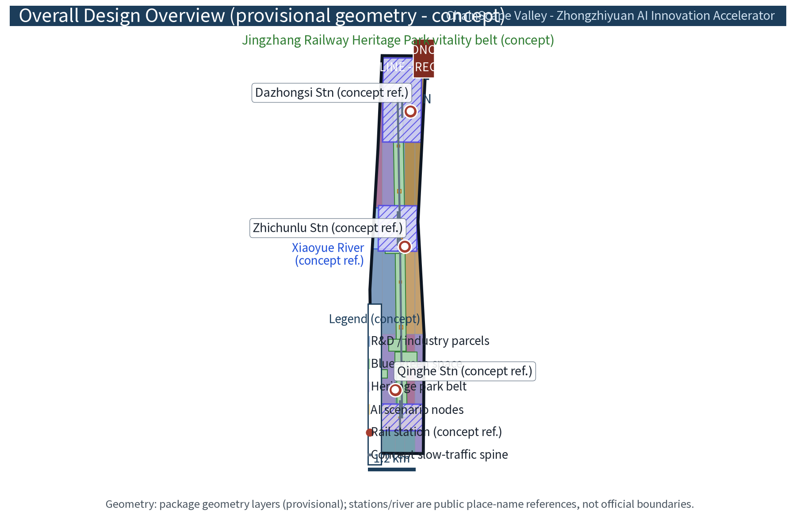
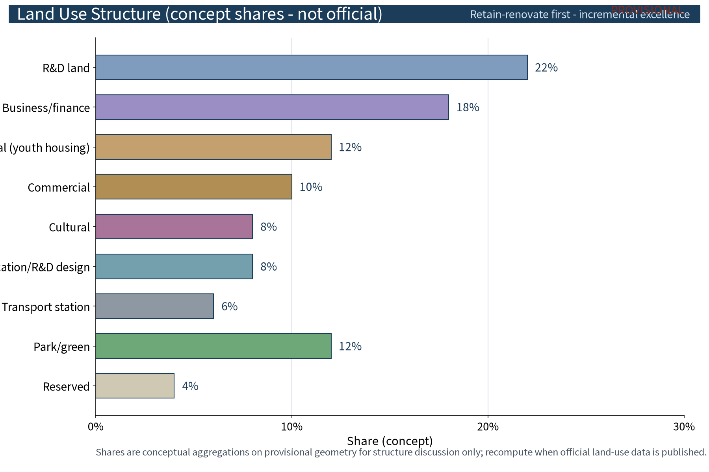
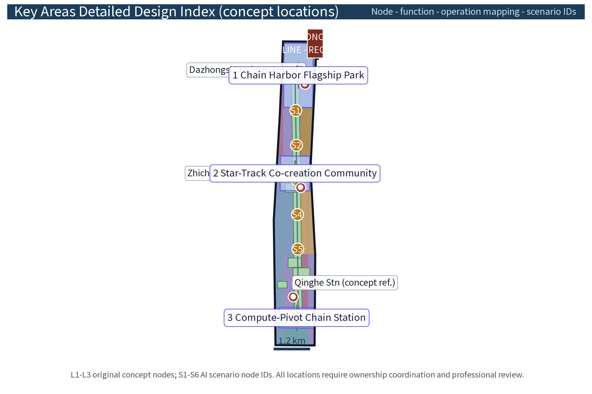
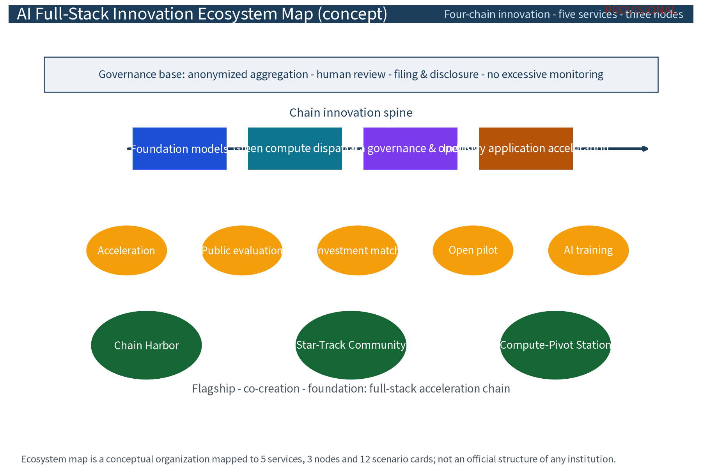
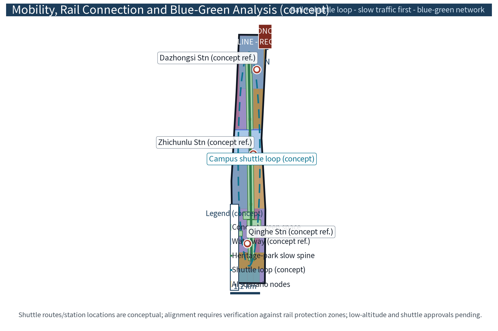
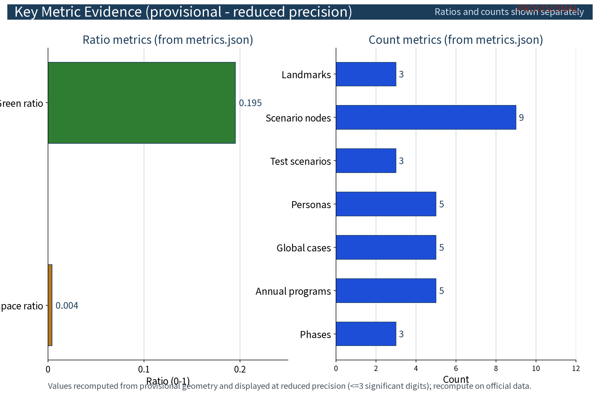

**Concept name and overall idea: ChainScape Valley (with the Chinese gloss “链驰谷”)**

"Chain" refers to full-stack AI chain innovation; "Scape" carries the century-old speed DNA of the Jingzhang Railway and the idea of acceleration; "Valley" evokes an innovation cluster. Anchored on the Zhongguancun Science City in Haidian District, the concept organizes a "foundation models - compute - data - industry applications" chain along the Jingzhang Railway Heritage Park, responding to the three positioning statements (Century Jingzhang Cultural Belt, Urban AI Life Experience Belt, AI Integration Innovation Belt) and the five functions (full-stack AI self-innovation system, world-class AI innovation ecosystem, AI+ scenario empowerment paradigm, intelligent AI vitality city, global AI-governance discourse). All areas follow official text-based figures; geometry follows organizer publications; implementation advice is for professional teams to deepen.

## Design Basis and Source List
The listed plans and surveys are a concept working-reference list, not data already acquired by this package; all data actually used is recorded in sources.json, and gaps are declared honestly in the risk and missing-data section. Per-asset rights and reuse boundaries for figures, PDFs, the logo and self-generated geometry are registered in report/copyright_statement.md; all HTML previews embed the license-clear open font Noto Sans SC (OFL).

Basis: (1) public announcement and taskbook - three positioning statements, five functions, three-tier scope, three zones/two wings and official text-based areas; (2) public Beijing and Haidian planning documents on Zhongguancun Science City and the Jingzhang Railway Heritage Park (conceptual citation, not a statutory basis); (3) Jingzhang railway history, heritage-park public material and concept-level field notes; (4) no official boundary polygon is published; all geometry here is provisional, and this proposal invents no precise coordinates or areas.

> **Evidence anchor**: [source:DATA-SRC-OFFICIAL-ANNOUNCEMENT], [source:DATA-SRC-AGENT-TASKBOOK].

## Three-Level Scope Framework
Deliverables cascade across three tiers: the coordinated research output constrains the overall design, which in turn calibrates land-use compatibility, building scale and infrastructure interfaces before detailed node design; every tier keeps machine-readable evidence anchors to its taskbook chapter.

All three scopes follow official text figures: coordinated research area 43.6 km2 (industry and future-city research); overall design area 11.4 km2 (urban renewal and regulatory-plan-level urban design at concept depth, non-statutory); key areas 368.4 ha in total. This package deepens the Zhongzhiyuan AI Autonomous Innovation Accelerator (~192 ha) within the key areas; the Beijing AI Origin Community and the Dazhongsi AI Industry Cluster are studied only as interface zones. Recalculation awaits official boundary publication.

Regional coordination (concept): five interfaces - Beiwai Community (data-element and scenario-testing synergy on a shared anonymized-aggregate data base), Future Science City (foundation-model research interface, joint labs), Huairou Science City (compute and research-instrument sharing, compute vouchers), Economic-Technological Development Area (pilot-line scaling and manufacturing conversion), and the Jing-Jin-Ji region (talent and supply-chain gradient, joint roadshows). Resource exchange runs through compute-voucher interchange, scenario-announcement filing and annual joint roadshows; the project path is a four-stage relay: joint lab, public evaluation, open pilot line, industrial landing (concept).

> **Evidence anchor**: [source:DATA-SRC-AGENT-TASKBOOK].

## Coordinated Research Area: Industry and Future City Research
The industry study identifies synergies between the acceleration area and the full-stack AI self-innovation system, forming a "chain innovation + acceleration" future-city hypothesis; future-city research is directional only and makes no commitment on land or investment.

The 43.6 km2 area runs north-south along the heritage park, linking real nodes such as Qinghe, Shangdi/Zhongguancun Software Park, Zhichunlu, Zhongguancun Avenue and Xueyuanlu in a "transit hub - software cluster - innovation source" gradient. Concept: the existing software-internet cluster evolves toward the full AI stack, strengthening foundation models, compute, data and industry applications; the future-city concept makes AI-governance global discourse the main thread through scenario pilots, a data-compliance sandbox and multi-party consultation (concept), while shaping the Urban AI Life Experience Belt and the century culture belt narrative.

> **Evidence anchor**: [source:DATA-SRC-PROVISIONAL-BOUNDARIES].

## Overall Design Area: Urban Renewal and Regulatory-Plan-Level Urban Design
The overall design emphasizes retain-led renewal and selective excellence: low-efficiency offices convert toward R&D and incubation under a retain-renovate-renew classification; regulatory-plan indicators are only checked as suggestions, never preset numerically.

The 11.4 km2 area is renewal-led at concept depth, non-statutory: mixed and flexible land use, block scale and height boundaries, heritage-park interface and street vitality, skyline and view corridors. The acceleration area connects the Zhongguancun Technology Service Wing (global factor allocation, Zhongguancun IP and capital empowerment) and the Xiaoyuehe Scenario Empowerment Wing in an "innovation acceleration - service empowerment" loop. Design-guideline items are concept suggestions: interface continuity, ground-floor experiment and public functions, accessible public space, full barrier-free coverage, character element library.

> **Evidence anchor**: [source:DATA-SRC-MOHURD-CONTROL-DETAILED-PLANNING], [source:DATA-SRC-PROVISIONAL-BOUNDARIES].

## Detailed Design of Key Areas
All node locations are conceptual and subject to ownership coordination and professional review before relocation; the "flagship - co-creation - foundation" chain forms the spatial narrative, with detailed plans and sections in the drawings and geometry layers.

Key areas total 368.4 ha (official text figure) including three zones and two wings. This package deepens the Zhongzhiyuan AI Acceleration Area (~192 ha) with a "one belt, two chains, three nodes" concept: the heritage-park vitality belt; the main chain along the belt and crosswise sub-chains. Three original concept nodes: 1 Chain Harbor Full-Stack Flagship Park (chain-innovation flagship campus: foundation models, compute, data, industry applications, acceleration and incubation); 2 Star-Track Co-creation Community (young scientists and founders); 3 Compute-Pivot Chain Station (compute/data and open pilot infrastructure: green dispatch, open pilot lines, public evaluation). Nodes are connected by slow-traffic chains, a shared-lab network and a shuttle loop.

| Node (scenario ID) | Function | Operation mechanism | Human review points |
| --- | --- | --- | --- |
| Chain Harbor Flagship Park (L1) | Chain layout of foundation models, compute, data, applications; acceleration | "Zhongzhiyuan Acceleration Covenant" admission, mentor pairing, compute-point interchange | Admission, stage reviews, graduation attestation |
| Star-Track Community (L2) | Youth housing, co-working workshops, community spaces, AI training | Booking and rotation of workstations, volunteer pairing, community deliberation | Housing review, training certification |
| Compute-Pivot Chain Station (L3) | Green dispatch, open pilot lines, public evaluation, data sandbox | Evaluation booking, published results, algorithm filing support | Sample checks, conclusion sign-off |

### Brand identity and visual system (concept)
Name family: "ChainScape Valley" as the master brand; "Chain Harbor - Star-Track - Compute-Pivot" as an extensible node family; event sub-brands (Opening Season, Roadshow Week, Hackathon Month, Young Scientist Forum, Chain-Developer Day) share one word-root system. Logo direction: three converging chains forming an acceleration arrow (see figure), meaning the four rings (models, compute, data, applications) converge into an accelerator; symbol rule: "one belt, two wings, three nodes" glyph set, no standalone use of the master mark by a single node. Color system: deep-sea blue (flagship), star-track teal (co-creation), amber gold (compute pivot), with off-white base and dark-grey type; type system: Noto Sans SC for Chinese and Noto Sans for Latin, two type scales; wayfinding hierarchy H1-H4: district entry, node cluster, building/unit, barrier-free and emergency information.

### Honor display system (concept)
Each node hosts a "Honor Star-Track Board": the flagship park entry has an annual chain-innovation enterprise digital plaque, the community has a young-scientist honor wall (results reviewed and published by the "AI Governance Deliberation Hall"), and the compute-pivot station has an evaluation-certification display of products that passed public evaluation. Honors are filed, published and human-reviewed; no auto-generated honors; rewards are disclosed annually (concept).

> **Evidence anchor**: [data:PACKAGE-GEOMETRY].

## AI Innovation Ecosystem, Personas, and AI+ Scenarios
Full-stack chain layout (concept): foundation-model R&D, green compute dispatch, data-element governance and opening, and industry-application acceleration as four interlocking rings, plus public evaluation, pilot lines and compliance-filing support; five services - acceleration, evaluation, investment match, conversion, training - form the daily operating skeleton across industry, space, public service, culture and governance (see ecosystem map). Personas (concept): five persona groups - young scientist founders, platform engineers, data analysts, open-source contributors, campus interns - plus inclusive design for existing residents, elderly users, children and families, persons with disabilities, visitors and users with low digital skills. AI+ scenarios (concept): twelve scenario cards covering traffic, industry, space, public services, culture and governance; all data anonymized and aggregated with human review; no individual tracking. AI technical protocols (concept): public evaluation runs model benchmarks and data-quality checks; operations run error stratification and false-positive monitoring, runtime monitoring and human takeover; new scenarios are tested before scaling.

Operation mechanisms (concept): shared lab workstations and pilot-line machine time run under "rotation-sharing of pilot-line workstations" with booking and rotation; expo and market spaces rotate; young scientists and founders pair with volunteer mentors; the deliberation hall receives resident opinions and replies publicly. AI governance three sentences (concept): only anonymized aggregated data is processed; key decisions always receive human review; no excessive monitoring (no individual-identifying tracking, no large-scale behavior profiling). Sensing data is edge-processed and anonymized before aggregation for service dispatch only. Scenario exits follow a "stop conditions first" rule: on sustained false-positive thresholds, concentrated public complaints or unrepaired accessibility defects, the deliberation hall decides to downgrade or withdraw; operational data is destroyed per published retention periods.

| Scenario card | Location | Operation mechanism | Human review points |
| --- | --- | --- | --- |
| Smart R&D collaboration and shared labs | Flagship incubation units and lab network | Workstation booking, compute-point machine time | Lab admission, result ownership |
| Model training and compute dispatch | Compute-pivot green dispatch center | Compute vouchers, published schedules | Quota and settlement review |
| Public evaluation and benchmarks | Compute-pivot evaluation area | Booking, published results, filing | Sample checks, conclusion sign-off |
| Data-element sandbox | Compute-pivot sandbox | Filing-based admission, published purpose/term | Data use and destruction logs |
| AI expo and roadshow center | Flagship roadshow building | Roadshow booking, point discounts | Disclosure and match review |
| Logistics sorting and drone delivery | Sorting nodes along the belt | Off-peak rotation, permit-front-loaded flights | Delivery anomaly and safety logs |
| Barrier-free accompaniment | Whole campus network and nodes | Volunteer pairing, human fallback | Service tickets, defect fixes |
| Crowd-flow sensing dispatch | Nodes and shuttle stops | Area-level anonymized aggregation, annual disclosure | Aggregation scope, alert thresholds |
| Campus shuttle and autonomous buses | Shuttle loop and stops | Booking rides, human fallback | Route changes, incident handling |
| AI training and talent station | Star-Track training workshops | Volunteer booking, mentor pairing | Certification and subsidy records |
| Cultural guide and century timeline | Heritage-park culture nodes | Filed and published content, feedback channel | Content review and correction |
| Community deliberation and resident services | Star-Track deliberation space | Resident deliberation, opinion channel, annual disclosure | Agenda and reply records |

| Test protocol | Purpose | Pass criteria | Data boundary | Exit condition |
| --- | --- | --- | --- | --- |
| Model evaluation | Public benchmark of resident models | Benchmarks met, sample checks consistent | Anonymized samples only | Two consecutive fails - withdrawn |
| Data quality | Verify completeness, consistency, compliance | Public quality report without major defects | Sandbox validation, disclosed terms | Unfixed defects - opening suspended |
| Runtime monitoring | Monitor false-positive rate, error stratification, human takeover | Within threshold, complete runtime logs | Area-level aggregates only | Sustained thresholds - downgrade/withdraw |

| Scenario data governance checklist | Data flow | Privacy boundary | Accessibility | Complaints and correction | Specialist review |
| --- | --- | --- | --- | --- | --- |
| Sensing scenarios (crowd/shuttle) | Edge processing, anonymized aggregation, dispatch | No identification, no profiling | Offline counters and phone fallback | Deliberation hall replies within term | Data sandbox + annual disclosure |
| Interactive scenarios (labs/training) | Booking records to aggregate | Limited retention, no cross-scenario use | Volunteer assistance for low digital skills | Open reply channel | Operations baseline + human review |
| Content scenarios (evaluation/roadshow/culture) | Content and reviews to filing | Anonymized reviews, no biometric collection | Subtitles, sign language, large print | Correction channel and removal | Content review and filing support |

> **Evidence anchor**: [source:DATA-SRC-GENERATIVE-AI-INTERIM-MEASURES].

## Land Use, Building Scale, and Retain-Renovate-Demolish Strategy
Retain-renovate-demolish follows the retain-first ordering: structurally sound buildings and heritage elements are retained; low-efficiency offices and old buildings are renovated; new construction is concentrated in three "accents" - the flagship park gateway, pilot facilities and the expo-roadshow building - strictly controlled in scale; all areas are concept-level and recomputed when official data is published.

Concept scope: retain-led renewal with selective new construction; existing buildings convert to R&D/incubation; shared labs and flexible offices are inserted as bookable spaces; the Star-Track community clusters youth housing, workshops and community spaces. Retain-renovate-demolish is given only as concept ranges (roughly 80% retained/renovated, 10-20% demolished, pending measured assessment), never as a commitment; FAR and heights are not preset and await official boundaries. Land-use shares are concept aggregate ranges (directional, not precise): R&D land first, green and blue space second, youth housing and community support alongside; the aggregation rule and recompute triggers are in the metrics section.

> **Evidence anchor**: [source:DATA-SRC-MNR-LAND-USE-CLASSIFICATION-202311].

## Transport, Rail, Municipal Infrastructure, and Public Services
Connections center on rail stations plus a campus loop with autonomous buses and on-demand minibuses as concept carriers, slow traffic first; municipal works reserve green-compute supply and heat-recovery interfaces; public services follow a "shared lab network + youth housing + childcare" package; every AI decision has human review.

Transport concept: "rail + campus shuttle" around Qinghe, Zhichunlu and Dazhongsi stations (per public line information); rail protection zones and station-city control conditions are unpublished, so setbacks and cross-sections are not preset; freight uses sorting points and compliant low-altitude route research, with permits and approvals pending official review. Parking is a "shared, off-peak-open" direction, no space counts committed. Municipal concept: green-compute supply, heat recovery and green-power trading research, corridor intensification; existing municipal capacity and energy loads are unverified, so no engineering feasibility conclusions are made. Public services: shared lab network, expo-roadshow center, youth apartments, childcare, barrier-free systems (age-friendly and child-friendly), an AI governance dialogue space and offline human fallback channels. All locations require professional verification against official boundaries and measured utility lines; this proposal only provides a needs list and layout logic (concept).

> **Evidence anchor**: [source:DATA-SRC-MOHURD-URBAN-DESIGN-MEASURES].

## Blue-Green Network, Public Space, and Urban Character
The heritage park green spine plus the Xiaoyuehe green corridor integrates blue-green space; platform memories, sleeper paving and a century timeline shape the cultural thread; facilities are modular and reversible; the character guideline blends industrial-heritage vocabulary with light AI-era interfaces.

The Jingzhang Railway Heritage Park is the green spine through the three nodes and two wings; the Xiaoyuehe corridor echoes the scenario-empowerment wing. Low-cost concept devices - platform memories, sleeper paving, the century timeline - build a recognizable spatial culture system: cultural wayfinding uses a "sleeper symbol + station number + century timeline" motif, sharing color and type rules with the brand system, with bilingual signs for international visitors. Character: railway industrial-heritage vocabulary (trusses, signals, sleeper elements) coexists with light AI-era architecture; streets favor shaded slow traffic, section redesign and continuous accessibility; public spaces are activated by AI expos, weekend markets and youth co-creation (all concept).

### Reversible public-space component library (concept)
Standardized plug-and-play units, all modular, reversible and light-touch: shade canopies, movable market units, temporary stages, modular seating and planters, demountable accessible ramps, mobile charging and information columns, temporary signage. Components register in a "assemble - use - withdraw" state machine; the site returns to its original state after withdrawal; no permanent large structures; the component list and assembly rules are deepened by professional teams, piloted before rollout (concept).

### Cultural narrative, wayfinding and international communication (concept)
International communication uses "century-old Jingzhang x AI acceleration" as the core narrative, with short copy for global audiences: "Where a century-old railway learns to run at the speed of intelligence", and cross-cultural glosses: "chain innovation" as "a chain of innovation - models, compute, data, applications"; "acceleration" as "accelerate from idea to industry". English short copy, bilingual wayfinding and global case benchmarking form the international communication set (concept).

> **Evidence anchor**: [source:DATA-SRC-MOHURD-URBAN-DESIGN-MEASURES].

## Renewal Projects, Implementation Policy, and Phasing
The three-phase project list (near 1-3 / mid 3-5 / far 5-10 years) is conceptual; scale and investment estimates are advisory; policy suggestions (flexible mixed use, renewal rewards, rent gradients) are not government or operator commitments.

Concept project list: flagship park start-up area, Star-Track community, Compute-Pivot station, shared lab network, expo-roadshow center, shuttle loop and autonomous buses, heritage-park interface upgrades (all concept). Policy directions (concept): flexible mixed use, renewal contributions linked to rewards, rent gradients and rent-to-buy, data-compliance sandbox and algorithm filing support, Zhongguancun IP and capital empowerment. Each project follows a RACI role matrix (responsible/accountable/consulted/informed), itemized in the implementation and operation matrix below. Phasing (concept rhythm): near (1-3 years) - opening season and retain-led replacement first, pilot areas being the flagship gateway and Star-Track community, with shared labs and the expo-roadshow center starting and an operations baseline established; mid (3-5 years) - three nodes take shape, roadshow weeks and hackathons become routine, the compute-pivot station opens public evaluation and pilot lines; far (5-10 years) - the full-stack ecosystem and evaluation-dialogue platform mature. Actors (concept): government (guidance, renewal policy, oversight), enterprises (accelerator operator, compute and data providers, resident AI firms, venture capital), universities (joint labs, training, conversion), residents and community organizations (deliberation, volunteers, oversight), operators and professional teams. Measurable indicator names (concept; values recomputed after the operations baseline): shared-lab booking rate, accelerator graduation and conversion matches, roadshow investment matches, sensing-data compliance rate (full anonymized aggregation, 100% human review - concept targets, not verified compliance conclusions), barrier-free coverage rate, slow-traffic and shuttle share. Public participation (concept): resident deliberation and opinion channels with public replies, annual progress disclosure, annual activities (open days, renewal opinion meetings) alongside roadshow weeks and hackathons - a "prompt collection - public reply - annual disclosure" loop.

| Implementation and long-term operation matrix (concept) | Phase | Actors (lead/collaborate) | Dependent data | Approval and safety prerequisites | Pilot scope | Cost tier | KPI (concept names) | Human takeover | Stop conditions | Public feedback | Talent/enterprise/project conversion |
| --- | --- | --- | --- | --- | --- | --- | --- | --- | --- | --- | --- |
| Flagship park gateway | Near 1-3y | Government lead, enterprises collaborate | Measured buildings, ownership data | Ownership coordination, renewal approval, structural safety | Gateway first | High | Graduations and conversion matches | Admission and graduation review | Stop new admissions on low conversion | Opinion meetings + annual disclosure | Graduates to campus buildings and industry funds |
| Star-Track community | Near 1-3y | Government lead, community and operator collaborate | Youth housing demand, measured units | Residential renewal approval, fire safety | Pilot clusters | Medium | Occupancy and training certifications | Human housing review | Adjust uses on sustained vacancy | Deliberation + opinion channel | Trainees to resident teams and mentors |
| Compute-Pivot station | Mid 3-5y | Enterprises lead, universities collaborate | Compute load, grid capacity | Power review, data filing | Station first | High | Public evaluations and pilot completions | Human sign-off of results | Stop testing on concentrated complaints | Published results and filings | Pilots to E-Town scaling |
| Shared lab network | Near 1-3y | Universities lead, enterprises collaborate | Building structure, utility conditions | Fire approval, lab safety review | Flagship + Star-Track first | Medium | Booking rate | Human lab admission | Stop use on unfixed safety defects | Booking and fix disclosure | University results to open pilot lines |
| Shuttle loop and autonomous buses | Mid 3-5y | Operator lead, transport authority collaborates | Anonymized crowd data, measured stops | Shuttle approval, low-altitude permit front-loading | Pilot loop segment | High | Slow-traffic and shuttle share | Human dispatch takeover | Stop line on safety records | Annual disclosure + complaints | Data providers and operators nurtured |
| International recruitment and developer community | Far 5-10y | Operator lead, government collaborates | International benchmarks, talent demand | Foreign-event filing, cross-border data review | Roadshow week and developer day | Low | International roadshows, developer registrations | Human recruitment review | Suspend on failed compliance review | Event feedback + annual disclosure | Overseas projects land via announcement-filing |

### Developer community, scenario opening and recruitment conversion (concept)
Developer community: monthly "Chain-Developer Day", routine open-source co-creation and hackathons, developer points exchangeable for compute time. Scenario opening: "scenario announcement and filing" - real demand lists published in batches, enterprises respond, validate in the compliance sandbox, pass public evaluation, then file and open: a six-step loop of publish - respond - sandbox - evaluate - file - scale. International recruitment: a project pool from roadshow weeks and international short copy, compliance-reviewed by the deliberation hall before local incubation. Talent conversion: certified trainees enter the acceleration camp via volunteer pairing and mentor recommendations; enterprise conversion via graduation attestation to industry funds and space; project conversion via open pilot lines scaling into the E-Town (concept mechanisms, not commitments).

| Annual program | Frequency | Lead | Participants | Conversion path |
| --- | --- | --- | --- | --- |
| Opening Season | Annual | Government and operator | Residents, enterprises, universities, visitors | Awareness and leads |
| Roadshow Week | Annual | Operator and venture capital | Founders, investors, universities | Investment matches and incubation |
| Hackathon Month | Annual | Operator and developer community | Developers, students, open source | Results to training and announcements |
| Young Scientist Forum | Annual | Universities and operator | Young scientists, international scholars | Joint labs and talent stations |
| Chain-Developer Day | Monthly | Operator and developer community | Developers, engineers | Points exchange and scenario response |

> **Evidence anchor**: [source:DATA-SRC-AGENT-TASKBOOK].

## Metrics, Area Recalculation, and Compliance Matrix
A three-tier goal - indicator - check concept system lives in metrics.json; area recalculation uses this package's provisional geometry and is fully recomputed, with a recalculation version recorded, when official data arrives.

Concept indicators: R&D/incubation space share, shared-facility accessibility, slow-traffic and shuttle share, green building and renewable share, barrier-free coverage, sensing-data compliance rate (full anonymized aggregation, 100% human review - concept targets), values recomputed after the operations baseline. Areas follow official text figures only: 43.6 km2, 11.4 km2, 368.4 ha, ~192 ha, ~104 ha, ~72 ha - no new precise values are published. Metric basis table: all provisional model values are displayed at reduced precision per confidence (areas rounded to ten-thousand m2, ratios to 3 significant digits), with geometry source, formula, assumption, confidence level, significant digits, use limits and recompute triggers per row; a full recalculation with a version label is triggered by any of: official polygon publication, official land-use survey publication, or statutory control disclosure.

| Metric | Source/formula | Assumption | Confidence | Precision | Use limit | Recompute trigger |
| --- | --- | --- | --- | --- | --- | --- |
| Site area (~11.41 million m2) | geometry/site_boundary.geojson polygon area, EPSG:4548 | Provisional boundary | Medium | 10,000 m2 | Display only | Official boundary published |
| Green area (~2.23 million m2) | union of geometry/green_space.geojson | Concept greens | Low | 10,000 m2 | Display only | Official green data published |
| Public space area (~48,000 m2) | union of geometry/public_space.geojson | Concept node plazas | Low | 10,000 m2 | Display only | Official land data published |
| Green ratio (~0.20) | green area / site area | As above | Low | 3 significant digits | Display only | Official data published |
| Public-space ratio (~0.004) | public space area / site area | As above | Low | 3 significant digits | Display only | Official data published |

The compliance matrix maps every design measure to the three positioning statements and five functions; open items are marked "to deepen".

> **Evidence anchor**: [metric:green_ratio], [metric:public_space_ratio], [source:PACKAGE-GEOMETRY].

## Risk, Copyright, and Compliance
This proposal is concept-level design research and is not an administrative approval basis; ownership coordination, low-altitude and shuttle approvals and safety assessments must be completed before implementation.

Geometry risk: official boundaries are unpublished; all geometry is provisional; no precise coordinates or areas are claimed; recalculation awaits official publication. Ownership and approval risk: building ownership, rail protection zones, control conditions and municipal capacity are unpublished; any construction or connection arrangement requires statutory approval and safety assessment. Low-altitude and shuttle risk: permits and approval paths are not settled; the concept presets no conclusions. Data-governance risk: the Interim Measures for Generative AI Services apply to services providing generated content to the public in mainland China and cannot replace personal-information, data-security or transport/low-altitude review; "compliance rate" and "100% human review" here are concept targets, not verified compliance conclusions. Name risk: "ChainScape Valley" and the node names are original concept names; any resemblance to existing names is coincidental. Brand prior-rights and use boundary: no formal trademark search has been completed at concept stage; all names and marks are treated as internal working codenames, restricted from external use or registration until clearance; design rights and per-asset reuse boundaries are in report/copyright_statement.md and sources.json. Compliance: concept text, not statutory planning conclusions; no statutory indicators are preset; implementation advice is phrased as "concept suggestion, reference solution, for professional teams to deepen"; AI and data use is bounded by anonymized aggregation, human review and a ban on excessive monitoring.

> **Evidence anchor**: [source:DATA-SRC-OFFICIAL-ANNOUNCEMENT].

## References
References follow the government's officially published versions; sources.json only records verifiable entries and fabricates no official data or links.

1) Public announcement and taskbook (as published by the organizer); 2) Jingzhang railway history and heritage-park public material; 3) Beijing territorial spatial plans and public Haidian planning information (cited as public overview, not a statutory basis); 4) public material on Zhongguancun Science City and Shangdi Software Park; 5) public academic literature on railway heritage conservation and urban renewal; 6) per-case formal or cleared sources for the five global cases, registered in sources.json with publisher, URL, accessed date and transferability boundary; 7) concept-level field notes and interview memos. Listed by category; exact versions, codes and citation formats follow organizer requirements.

> **Evidence anchor**: [source:DATA-SRC-OFFICIAL-ANNOUNCEMENT].
