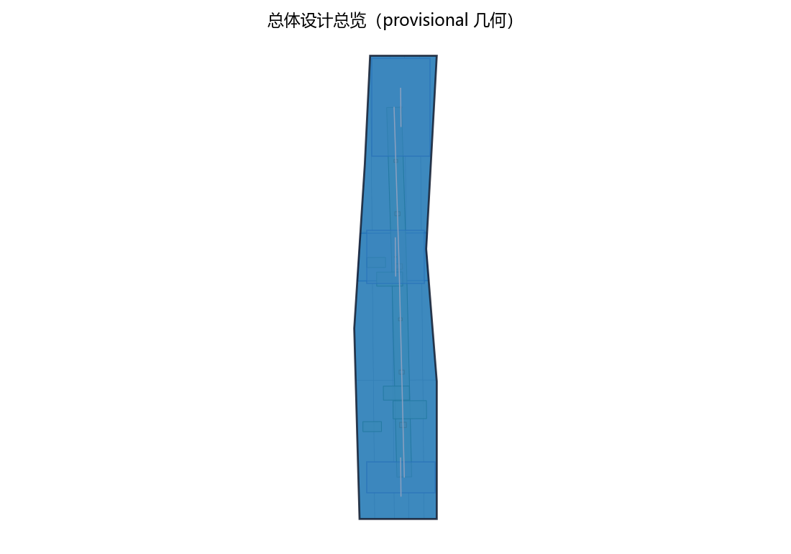
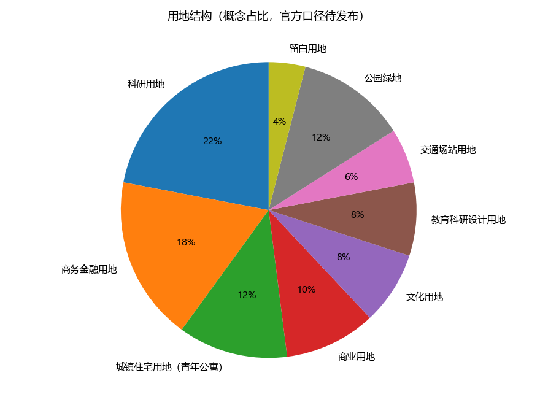
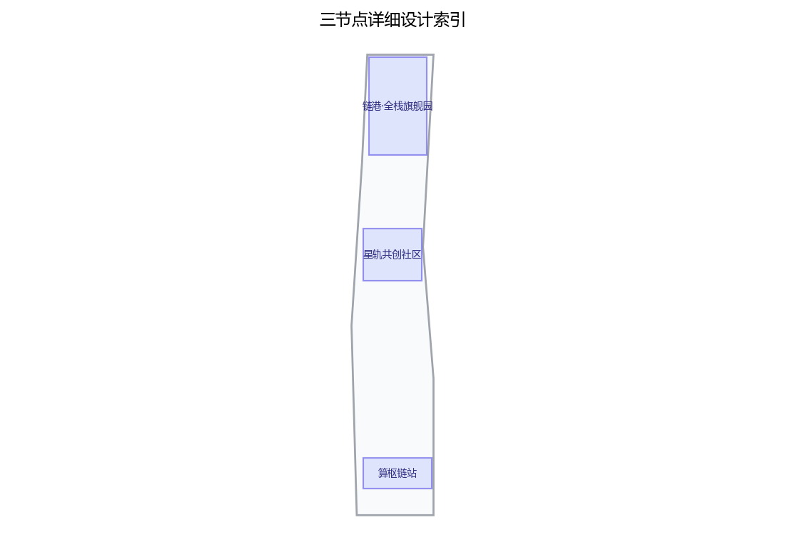
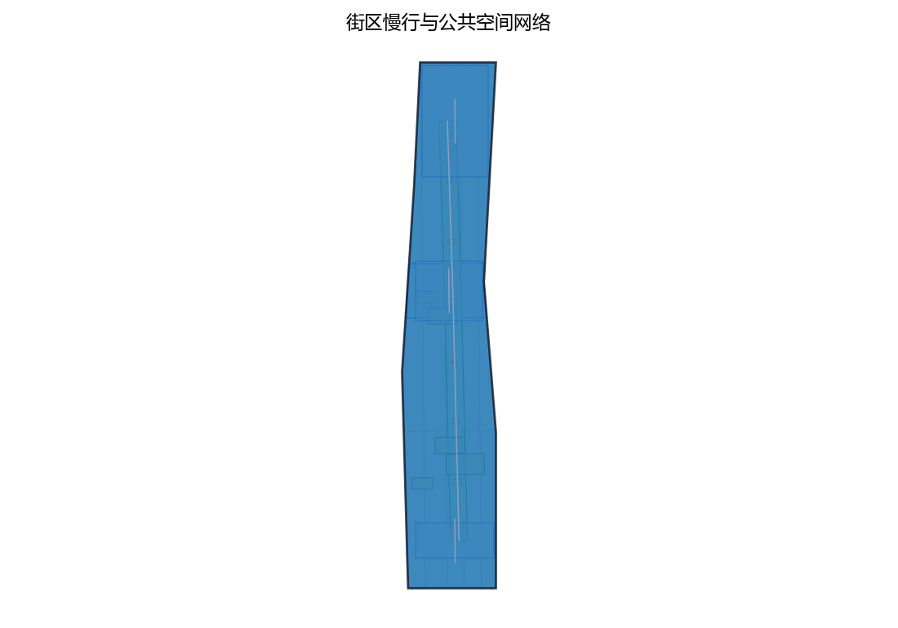
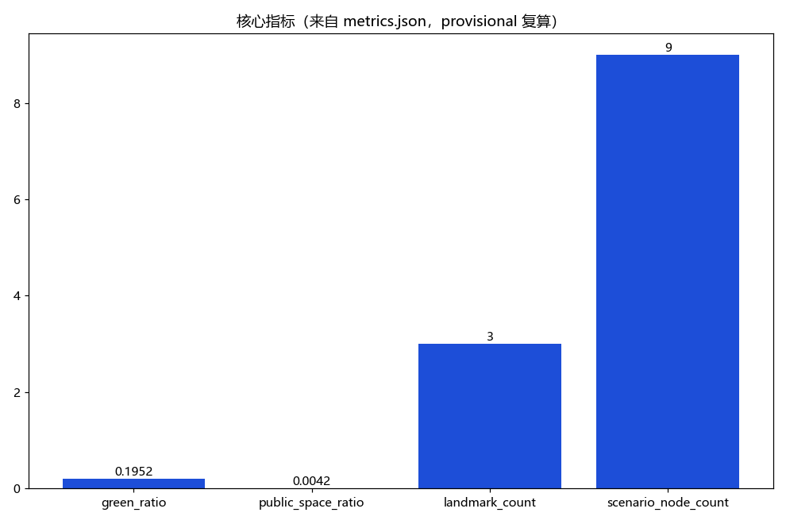

**方案名称与总体构想(概念):链驰谷 / ChainScape Valley**

"链"取AI全栈链式创新,"驰"承京张铁路百年速度基因与"加速孵化"之义,"谷"喻创新聚落。总体构想以"链式创新+加速孵化"为锚,沿京张铁路遗址公园组织"基础模型—算力—数据—行业应用"全栈链条,呼应百年京张文化带、都市AI生活体验带、AI融合创新带三大定位,服务AI全栈自主创新体系、世界级AI创新生态、AI+场景赋能新范式、智能化AI活力城市、AI治理全球话语权五大功能,并以链港·全栈旗舰园、星轨共创社区、算枢链站三处概念点位构筑众智园AI自主创新加速区骨架。本方案为应征概念文本:面积均为官方文本口径,几何以组织方发布为准,落地建议均供专业团队深化研究。

## 设计依据与资料清单
资料清单所列总体规划、分区规划与街区踏勘等均为概念工作依据清单，并非本包已获取的数据；本包实际使用的全部数据见 sources.json，未获取项已在风险与缺失数据说明中如实标注。

设计依据:(1)征集公告与任务书公开信息——三大定位、五大功能、三层范围与三区两翼及官方文本口径面积;(2)北京市及海淀区公开规划与工作报告中关于中关村科学城、京张铁路遗址公园的公开表述(概念引用,不作法定依据);(3)京张铁路历史文献、遗址公园公开资料与概念性现场踏勘记录;(4)组织方尚未发布官方边界多边形,现有几何均为provisional,本方案不采用任何自拟精确坐标与面积。资料清单:任务书、官方口径面积文本、公开地图、遗址公园影像图集、踏勘记录与访谈纪要(概念层面),具体版本以组织方要求为准。

> **证据锚点**：[source:DATA-SRC-OFFICIAL-ANNOUNCEMENT-20260509]、[source:DATA-SRC-AGENT-TASKBOOK-20260518]（组织方公告与任务书为文本口径依据）。

## 三层范围工作框架
三层成果逐级传导：统筹研究输出的全栈链式布局与加速职能判断约束总体设计，总体设计校核的用地兼容、建筑规模与基础设施接口再落实到节点详设；每层均保留与任务书对应章节的机器可读证据锚点，便于评审对照。

三层范围均为官方文本口径:统筹研究范围43.6平方公里,承担产业与未来城市研究;总体设计范围11.4平方公里,承担城市更新与控规深度城市设计(概念深度、非法定);重点区域合计368.4公顷,本次方案以其中众智园AI自主创新加速区(约192公顷)为深化对象,北京AI原点社区与大钟寺AI产业集聚区仅作协同界面研究。工作框架为"宏观研判—中观设计—微观深化"递进衔接,各层输出相互校验;因官方边界未发布,面积复算与几何校核留待边界发布后由专业团队实施(参考方案)。

> **证据锚点**：[source:DATA-SRC-AGENT-TASKBOOK-20260518]（三层范围划分依据任务书官方文本口径）。

## 统筹研究范围产业与未来城市研究
产业研究识别众智园加速区与AI全栈自主创新体系的协同机会，形成「链式创新+加速孵化」的未来城市形态判断；未来城市研究仅作方向性预判，不构成对用地与投资的承诺。

43.6平方公里范围沿京张遗址公园南北展开,串联清河、上地/中关村软件园、知春路、中关村大街、学院路等真实节点,形成"轨道枢纽—软件集群—创新源"的梯度叙事:上地与软件园提供工程化与商业化成熟度,学院路与中关村大街提供基础研究与人才源。产业研究概念:既有软件互联网集群向AI全栈演进,补强基础模型、算力、数据与行业应用短板。未来城市研究概念:以AI治理全球话语权为主线,依托沿带场景试验、数据合规沙盒与多方协商机制(概念建议),同时塑造都市AI生活体验带与百年文化带叙事。

> **证据锚点**：[source:DATA-SRC-PROVISIONAL-BOUNDARIES-20260605]（边界为 provisional，研究范围仅作概念示意）。

## 总体设计范围城市更新与控规深度城市设计
总体设计强调存量更新与增量做精：低效办公向研发孵化转型，建立保留—改造—更新分类指引；对控规指标只做校核建议，不预设数值结论。

11.4平方公里以存量更新为主基调,控规深度城市设计为概念参考而非法定成果,方向包括:用地混合与弹性用途、街坊尺度与高度边界、遗址公园界面与沿街活力、天际线与视廊。空间衔接上,众智园加速区联结中关村科技服务翼(要素全球化配置、中关村IP与资本赋能)与小月河场景赋能翼,形成"创新加速—服务赋能"回路。城市设计导则条目为概念建议:沿带界面连续度、底层实验与公共功能渗透、公共空间就近可达、无障碍全覆盖、风貌要素库等,供专业团队深化为可操作导则。

> **证据锚点**：[source:DATA-SRC-MOHURD-CONTROL-DETAILED-PLANNING]、[source:DATA-SRC-PROVISIONAL-BOUNDARIES-20260605]。

## 重点区域详细设计
三节点的设施选址均为概念点位，须经产权协调与专业审查后重新落位；节点间的「旗舰—共创—底座」链构成完整空间叙事，详细平面与剖面以图册与 geometry 层表达。

重点区域合计368.4公顷(官方文本口径),含三区两翼;本次深化众智园加速区(约192公顷),提出"一带两链三节点"概念结构:一带为遗址公园活力带,两链为沿带主链与横向支链。三处原创概念节点均标注为概念点位:①链港·全栈旗舰园——链式创新旗舰园区,承载基础模型、算力、数据、行业应用链式布局与加速孵化;②星轨共创社区——青年科学家与创业者共创社区;③算枢链站——算力数据与开放中试基础设施节点。节点间以慢行链、共享实验室网络与接驳环线连通,形成"旗舰—社区—底座"的完整加速链路。

> **证据锚点**：[data:PACKAGE-GEOMETRY]（三节点示意多边形来自本包 geometry/key_areas.geojson）。

## AI 创新生态、人才画像与 AI+ 场景

全栈链式布局(概念):基础模型研发、绿色算力调度、数据要素治理与开放、行业应用加速四环相扣,附设公共评测、中试与合规备案辅导。人才画像:25—40岁前沿青年科学家与高潜工程师,本土与海归并蓄,跨算法、芯片、交互、伦理等交叉学科,重开源、重转化,核心诉求为共享算力、敏捷实验与社群归属。AI+场景(概念):智能研发协作与共享实验室、AI会展路演中心、物流分拣与无人机配送点、无障碍伴随、客流感知调度、园区接驳与无人巴士。隐私底线:感知数据边缘处理、匿名聚合后仅用于服务调度,不做个体识别与画像,关键服务决策设人工复核,数据用途与期限公开可查;严禁以监控为目的布设感知。

> **证据锚点**：[source:DATA-SRC-GENERATIVE-AI-INTERIM-MEASURES]（AI 生成内容治理表述的参照依据）。

## 用地、建筑规模与拆改留方案
拆改留坚持留改拆排序：保留结构完好建筑与遗址文化要素，改造低效办公与旧楼宇，增量集中于旗舰园门户、中试设施与会展路演建筑三处「点睛」并严控规模；全部面积为概念口径，官方数据发布后复算。

概念口径遵循"留改为主、增量做精":存量楼宇产业置换,引导低效办公向研发孵化转型;共享实验与弹性办公改造,在楼内穿插可预订实验室与灵活工位;集群式社区营造,围绕星轨共创社区组织青年居住、共创工坊与社群空间。拆改留仅给概念区间(如留改约八成、拆约一成至两成,以实测评估为准),不构成承诺;增量集中于旗舰园门户、中试设施与会展路演建筑三处"点睛"。建筑规模与容积率不预设数值,待官方边界发布后由专业团队依规复算(参考方案)。

> **证据锚点**：[source:DATA-SRC-MNR-LAND-USE-CLASSIFICATION-202311]（用地分类名称参照现行国标口径）。

## 交通、轨道、市政与公共服务设施
接驳组织以轨道站点+园区环线为核心，无人巴士与按需小巴为概念载体，慢行优先；市政结合绿色算力供能与余热回收预留接口；公共服务按「共享实验室网络+青年公寓+托育配套」配置，AI决策均设人工复核。

交通概念:依托清河、知春路、大钟寺等轨道站点(以公开线路信息为准)组织"轨道+园区接驳"体系,接驳以无人巴士环线与按需小巴为主(概念),慢行优先;货运依托物流分拣点与合规低空航线前置研究。市政概念:绿色算力供能,余热回收与绿电交易方向研究,廊道集约化。公共服务概念:共享实验室网络、会展路演中心、青年公寓与托育配套、无障碍系统、AI治理对话空间。以上设施位址均需专业团队依据官方边界与现状管线实测校核,本方案仅提供需求清单与布局逻辑(概念建议)。

> **证据锚点**：[source:DATA-SRC-MOHURD-URBAN-DESIGN-MEASURES]（市政与慢行设计表述的方法参照）。

## 蓝绿空间、公共空间与城市风貌
遗址公园绿色脊梁+小月河绿廊整合蓝绿空间，站台记忆、轨枕铺装与百年时刻线塑造文脉；设施以模块化、可逆设计嵌入园区，风貌导则以工业遗产语汇与轻盈AI界面兼容并蓄。

以京张铁路遗址公园为绿色脊梁,贯穿三处概念节点与两翼;小月河绿廊呼应场景赋能翼。沿线以"站台记忆、轨枕铺装、百年时刻线"等低成本概念手法塑造可识别文脉:风貌上以铁路工业遗产语汇(桁架、信号灯、轨枕元素)与现代AI建筑的轻盈界面兼容并蓄,避免同质化;街道强调林荫慢行、断面重构与无障碍连续;公共空间运营以AI会展、周末市集与青年共创活动激活,使百年文化带兼具日常活力与产业仪式感(均为概念建议)。

> **证据锚点**：[source:DATA-SRC-MOHURD-URBAN-DESIGN-MEASURES]（蓝绿空间组织的方法参照）。

## 更新项目清单、实施政策与分期计划
三阶段项目清单（近期1-3年/中期3-5年/远期5-10年）为概念清单，规模与投资估算均为建议性表述；政策建议（混合用地弹性、更新奖励挂钩、租金梯度）不构成政府或运营方承诺。

概念项目清单:链港旗舰园启动区、星轨共创社区、算枢链站、共享实验室网络、AI会展路演中心、接驳环线与无人巴士、遗址公园界面提升等(均为概念建议)。实施政策方向(概念):混合用地弹性、更新贡献与奖励挂钩、租金梯度与先租后买、数据合规沙盒与算法备案辅导、中关村IP与资本赋能对接。分期概念:近期(约1—3年)开园季启动与存量置换;中期(约3—5年)三节点主体成型,路演周、黑客松常态化;远期(约5—10年)全栈生态与评测对话平台成熟。活动体系:开园季、路演周、黑客松、青年科学家论坛、揭榜挂帅等。

> **证据锚点**：[source:DATA-SRC-AGENT-TASKBOOK-20260518]（分期与实施条目对应任务书要求）。

## 指标体系、面积复算与合规矩阵
目标—指标—校验三层概念指标体系进入 metrics.json；面积复算以本包 provisional 几何为底，官方数据到位后整体复算并标注复算版本。

概念指标体系:研发孵化空间占比、共享设施可达率、慢行与接驳分担率、绿色建筑与可再生能源占比、无障碍覆盖、感知数据合规率(匿名聚合全覆盖、人工复核100%)。面积复算坚持官方文本口径:统筹研究范围43.6平方公里、总体设计范围11.4平方公里、重点区域合计368.4公顷、众智园约192公顷、北京AI原点社区约104公顷、大钟寺AI产业集聚区约72公顷,全部标注官方文本口径,不发布任何新增精确数值。合规矩阵将各项设计举措与三大定位、五大功能逐项对照,暂缺项标注"待深化"。

> **证据锚点**：[metric:green_ratio]、[metric:public_space_ratio]、[source:PACKAGE-GEOMETRY]。

## 风险、版权与合规说明
本方案为概念研究性设计，不构成行政审批依据；正式实施前须完成产权协调、低空航线与接驳审批校核及安全评估。

几何风险:官方边界未发布,现有几何均为provisional,本方案不声称精确坐标与面积,复算留待官方发布后由专业团队实施。名称风险:"链驰谷/ChainScape Valley"及三处节点名称为本次原创概念命名,如与既有名称雷同纯属巧合,不代表关联。合规说明:本方案为应征概念文本,不构成法定规划结论,不预设法定指标,落地建议均以"概念建议、参考方案、可供专业团队深化研究"表述;AI与数据应用遵守个人信息保护、数据安全等法律法规精神,以匿名聚合与人工复核为底线;正文与命名为原创,引用均出自公开渠道。

> **证据锚点**：[source:DATA-SRC-OFFICIAL-ANNOUNCEMENT-20260509]（征集规则为权属与合规表述的依据）。

## 参考资料
参考资料以政府正式发布版本为准；本包 sources.json 仅收录可查证条目，未虚构任何官方数据或链接。

1)征集公告与任务书公开信息(以组织方发布为准);2)京张铁路历史与京张铁路遗址公园公开资料(含规划建设公开报道);3)北京市国土空间规划及海淀区公开规划信息(公开渠道概述引用,不作法定依据);4)中关村科学城、上地软件园等公开材料;5)铁路遗产保护与城市更新领域公开学术文献;6)概念性踏勘记录与访谈纪要。以上按类别列示,具体文件版本、编码与引用格式以组织方要求为准。

> **证据锚点**：[source:DATA-SRC-OFFICIAL-ANNOUNCEMENT-20260509]（本清单首条即组织方公开资料包）。
