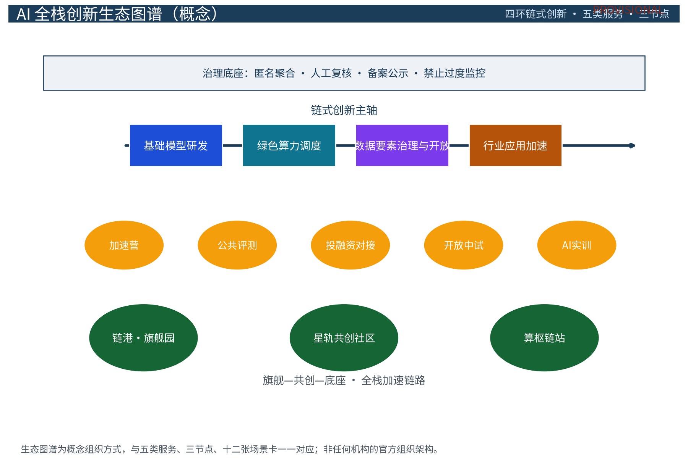

**方案名称与总体构想(概念):链驰谷 / ChainScape Valley**

"链"取AI全栈链式创新,"驰"承京张铁路百年速度基因与"加速孵化"之义,"谷"喻创新聚落。总体构想以"链式创新+加速孵化"为锚,立足海淀区中关村科学城,沿京张铁路遗址公园组织"基础模型—算力—数据—行业应用"全栈链条,呼应百年京张文化带、都市AI生活体验带、AI融合创新带三大定位,服务AI全栈自主创新体系、世界级AI创新生态、AI+场景赋能新范式、智能化AI活力城市、AI治理全球话语权五大功能,并以链港·全栈旗舰园、星轨共创社区、算枢链站三处原创概念点位构筑众智园AI自主创新加速区骨架。三大定位与五大功能的概念映射(概念):百年京张文化带对应遗址公园文脉主轴,都市AI生活体验带对应十二张场景卡嵌入园区日常,AI融合创新带对应沿带全栈链条布局;五大功能依次落实为全栈创新体系组织、加速生态运营、场景赋能范式、活力城市形态与治理规则框架,并在指标体系与合规矩阵中逐项对照。本方案为应征概念文本:面积均为官方文本口径,几何以组织方发布为准,落地建议均供专业团队深化研究。

## 设计依据与资料清单
资料清单所列总体规划、分区规划与街区踏勘等均为概念工作依据清单，并非本包已获取的数据；本包实际使用的全部数据见 sources.json，未获取项已在风险与缺失数据说明中如实标注。图件、PDF、Logo 与自产几何的逐项权属与复用边界登记于 report/copyright_statement.md，字体使用具备明确复用授权的开源字体（Noto Sans SC，OFL 许可）并内嵌于全部 HTML 预览。

设计依据:(1)征集公告与任务书公开信息——三大定位、五大功能、三层范围与三区两翼及官方文本口径面积;(2)北京市及海淀区公开规划与工作报告中关于中关村科学城、京张铁路遗址公园的公开表述(概念引用,不作法定依据);(3)京张铁路历史文献、遗址公园公开资料与概念性现场踏勘记录;(4)组织方尚未发布官方边界多边形,现有几何均为provisional,本方案不采用任何自拟精确坐标与面积。资料清单:任务书、官方口径面积文本、公开地图、遗址公园影像图集、踏勘记录与访谈纪要(概念层面),具体版本以组织方要求为准。

> **证据锚点**：[source:DATA-SRC-OFFICIAL-ANNOUNCEMENT]、[source:DATA-SRC-AGENT-TASKBOOK]（组织方公告与任务书为文本口径依据）。

## 三层范围工作框架
三层成果逐级传导：统筹研究输出的全栈链式布局与加速职能判断约束总体设计，总体设计校核的用地兼容、建筑规模与基础设施接口再落实到节点详设；每层均保留与任务书对应章节的机器可读证据锚点，便于评审对照。

三层范围均为官方文本口径:统筹研究范围43.6平方公里,承担产业与未来城市研究;总体设计范围11.4平方公里,承担城市更新与控规深度城市设计(概念深度、非法定);重点区域合计368.4公顷,本次方案以其中众智园AI自主创新加速区(约192公顷)为深化对象,北京AI原点社区与大钟寺AI产业集聚区仅作协同界面研究。工作框架为"宏观研判—中观设计—微观深化"递进衔接,各层输出相互校验;因官方边界未发布,面积复算与几何校核留待边界发布后由专业团队实施(参考方案)。

区域协同回路(概念):三层范围与海淀—京张沿线及京津冀创新网络建立五条协作接口——北纬社区(数据要素与场景试验协同,共享匿名聚合数据底座)、未来科学城(大科学装置与基础模型研发接口,联合实验室共建)、怀柔科学城(算力与科研仪器资源共享,算力券互认)、经开区(中试放大与制造转化接口,开放中试线联动)、京津冀(人才与产业链梯度转移与路演对接)。资源交换以「算力积分通兑」跨区兑付、场景揭榜备案与年度联合路演为路径,项目路径为「联合实验室—公共评测—开放中试—产业落地」四级接力(概念建议)。

> **证据锚点**：[source:DATA-SRC-AGENT-TASKBOOK]（三层范围划分依据任务书官方文本口径）。

## 统筹研究范围产业与未来城市研究
产业研究识别众智园加速区与AI全栈自主创新体系的协同机会，形成「链式创新+加速孵化」的未来城市形态判断；未来城市研究仅作方向性预判，不构成对用地与投资的承诺。

43.6平方公里范围沿京张遗址公园南北展开,串联清河、上地/中关村软件园、知春路、中关村大街、学院路等真实节点,形成"轨道枢纽—软件集群—创新源"的梯度叙事:上地与软件园提供工程化与商业化成熟度,学院路与中关村大街提供基础研究与人才源。产业研究概念:既有软件互联网集群向AI全栈演进,补强基础模型、算力、数据与行业应用短板;未来城市研究概念:以AI治理全球话语权为主线,依托沿带场景试验、数据合规沙盒与多方协商机制(概念建议),同时塑造都市AI生活体验带与百年文化带叙事。统筹层输出的「旗舰—社区—底座」职能配置写入总体设计用地兼容校核,形成"研究—转化—服务"闭环的链式创新样本。

> **证据锚点**：[source:DATA-SRC-PROVISIONAL-BOUNDARIES]（边界为 provisional，研究范围仅作概念示意）。

## 总体设计范围城市更新与控规深度城市设计
总体设计强调存量更新与增量做精：低效办公向研发孵化转型，建立保留—改造—更新分类指引；对控规指标只做校核建议，不预设数值结论。

11.4平方公里以存量更新为主基调,控规深度城市设计为概念参考而非法定成果,方向包括:用地混合与弹性用途、街坊尺度与高度边界、遗址公园界面与沿街活力、天际线与视廊。空间衔接上,众智园加速区联结中关村科技服务翼(要素全球化配置、中关村IP与资本赋能)与小月河场景赋能翼,形成"创新加速—服务赋能"回路。城市设计导则条目为概念建议:沿带界面连续度、底层实验与公共功能渗透、公共空间就近可达、无障碍全覆盖、风貌要素库等,供专业团队深化为可操作导则。

> **证据锚点**：[source:DATA-SRC-MOHURD-CONTROL-DETAILED-PLANNING]、[source:DATA-SRC-PROVISIONAL-BOUNDARIES]。

## 重点区域详细设计
三节点的设施选址均为概念点位，须经产权协调与专业审查后重新落位；节点间的「旗舰—共创—底座」链构成完整空间叙事，详细平面与剖面以图册与 geometry 层表达。

重点区域合计368.4公顷(官方文本口径),含三区两翼;本次深化众智园加速区(约192公顷),提出"一带两链三节点"概念结构:一带为遗址公园活力带,两链为沿带主链与横向支链。三处原创概念节点均标注为概念点位:①链港·全栈旗舰园——链式创新旗舰园区,承载基础模型、算力、数据、行业应用链式布局与加速孵化;②星轨共创社区——青年科学家与创业者共创社区;③算枢链站——算力数据与开放中试基础设施节点。节点间以慢行链、共享实验室网络与接驳环线连通,形成"旗舰—社区—底座"的完整加速链路。

| 节点（场景编号） | 功能 | 运营机制 | 人工复核点 |
| --- | --- | --- | --- |
| 链港·全栈旗舰园（L1） | 基础模型、算力、数据、行业应用链式布局与加速孵化 | 「中智源加速公约」入驻、导师结对辅导、算力积分通兑 | 入营筛选、阶段评审与毕业鉴证人工复核 |
| 星轨共创社区（L2） | 青年居住、共创工坊、社群空间与AI实训 | 工位与公寓预约轮换、志愿结对辅导、社区议事 | 入住审核与实训认证人工复核 |
| 算枢链站（L3） | 绿色算力调度、开放中试、公共评测与数据沙盒 | 评测预约排期、结果公示与算法备案辅导 | 评测样本抽验与结论签发人工复核 |

### 品牌识别与视觉系统（概念）
命名族:「链驰谷 ChainScape Valley」为总品牌,三节点构成「链港—星轨—算枢」可延展命名族,活动子品牌「开园季、路演周、黑客松月、青年科学家论坛、链创开发者日」共用同一词根体系。Logo方向:以三链汇聚加速箭头为母题(见下图),寓意基础模型—算力—数据—行业应用四环汇入加速器;符号规则为"一轴两翼三节点"图元,禁止单节点独立使用总品牌标识。色彩系统:深海蓝(旗舰)、星轨青(共创)、琥珀金(算枢)三色,配米白底与深灰字;字体系统:中文使用思源黑体/Noto Sans SC,西文使用Noto Sans,标题与正文两档字阶。导视层级:H1区域入口标识—H2节点组团导视—H3楼栋与功能单元—H4无障碍与应急信息四级,符号与色彩规则全园区统一。

### 荣誉展示体系（概念）
三处节点分别设置「荣誉星轨榜」——链港入口设「年度链式创新企业榜」数字铭牌,星轨社区设「青年科学家荣誉墙」(评审结果由「AI治理议事厅」复核后公示),算枢链站设「评测认证陈列区」展示通过公共评测的产品与方案;荣誉评选坚持公示、备案与人工复核,不设自动生成荣誉,奖励兑现按年度公示(概念机制)。

> **证据锚点**：[data:PACKAGE-GEOMETRY]（三节点示意多边形来自本包 geometry/key_areas.geojson）。

## AI 创新生态、人才画像与 AI+ 场景

全栈链式布局(概念):基础模型研发、绿色算力调度、数据要素治理与开放、行业应用加速四环相扣,附设公共评测、中试与合规备案辅导;生态组织上叠加"加速—评测—对接—转化—实训"五类服务,构成AI产业、空间、公共服务、文化与治理多域交织的日常骨架(见生态图谱)。人才画像(概念):五类人才画像——青年科学家与创业者、平台工程师、数据分析师、开源贡献者、在校实习生,核心诉求为共享算力、敏捷实验与社群归属;面向既有居民、长者与银龄、儿童与家庭、残障人士、游客与低数字能力用户提供全龄、无障碍、适老与儿童友好设计,包容弱势群体与园区服务人员。AI+场景(概念):十二张场景卡覆盖交通、产业、空间、公共服务、文化、治理六域,全部数据匿名聚合+人工复核,禁止个体追踪。AI技术协议(概念):公共评测执行模型基准测试与数据质量核验,运营侧建立误差分群与误报率监测、运行监测与人工接管流程,新场景先测试验证后规模化。

运营机制(概念):共享实验工位与中试机时按「中试工位轮换共享」预约排期、轮换使用,展演与市集空间轮换运营,青年科学家与创业团队志愿结对辅导,以「AI治理议事厅」承接居民意见并公开答复。AI治理三句式(概念):仅处理匿名聚合数据;关键决策一律人工复核;禁止过度监控(不进行个体识别式追踪、不建立大规模行为画像)。感知数据边缘处理、匿名聚合后仅用于服务调度,不做个体识别与画像,关键服务决策设人工复核,数据用途与期限公开可查;严禁以监控为目的布设感知。场景退出遵循「停用条件先行」原则:任一场景连续触发误报率阈值、公众投诉集中或无障碍缺陷未修复时,按「AI治理议事厅」决议降级或撤收,运营数据按公示期限销毁。

| 场景卡 | 落位空间 | 运营机制 | 人工复核点 |
| --- | --- | --- | --- |
| 智能研发协作与共享实验室 | 链港加速孵化单元与共享实验室网络 | 工位预约排期、积分通兑机时 | 实验准入与成果归属复核 |
| 模型训练与算力调度 | 算枢链站绿色算力调度中心 | 算力券预存、调度结果公示 | 调度配额与费用结算复核 |
| 公共评测与基准测试 | 算枢链站公共评测区 | 评测预约、结果公示与备案 | 样本抽验与结论签发复核 |
| 数据要素沙盒 | 算枢链站数据沙盒区 | 沙盒准入备案、用途期限公示 | 数据用途与销毁记录复核 |
| AI会展路演中心 | 链港会展路演建筑 | 路演排期预约、积分抵扣场地 | 信息披露与撮合对接复核 |
| 物流分拣与无人机配送点 | 沿带物流分拣节点 | 分拣错峰轮换、航线许可前置 | 配送异常与安全记录复核 |
| 无障碍伴随服务 | 全园区慢行网络与节点 | 志愿结对、人工服务兜底 | 服务工单与缺陷整改复核 |
| 客流感知调度 | 节点与接驳站点周边 | 区域级匿名聚合、年度公示 | 聚合口径与告警阈值复核 |
| 园区接驳与无人巴士 | 接驳环线与站点 | 预约制乘行、人工值守兜底 | 线路调整与事故处置复核 |
| AI实训与人才驿站 | 星轨共创社区实训工坊 | 课程志愿预约、导师结对 | 实训认证与补贴记录复核 |
| 文化导览与百年时刻线 | 遗址公园沿线文化节点 | 导览内容公示备案、反馈通道 | 内容审核与纠错复核 |
| 社区议事与居民服务 | 星轨共创社区议事空间 | 居民议事、意见通道、年度公示 | 议题记录与答复复核 |

| 测试协议 | 目的 | 通过标准 | 数据边界 | 退出条件 |
| --- | --- | --- | --- | --- |
| 模型评测协议 | 对入驻基础模型执行公共基准测试 | 基准测试达标、评测样本抽验一致 | 仅匿名聚合样本,不保存个体输入 | 连续两轮不达标即撤出公共评测 |
| 数据质量协议 | 核验开放数据集的完整性、一致性与合规性 | 数据质量核验报告公示无重大缺陷 | 沙盒内验证,用途期限公示 | 缺陷未修复即暂停开放 |
| 场景运行监测协议 | 监测误报率、误差分群与人工接管效率 | 误报率阈值内、运行监测日志完整 | 区域级聚合指标,不回溯个体 | 连续触发阈值即降级或撤收 |

| 场景数据治理清单 | 数据流 | 隐私边界 | 无障碍 | 投诉纠错 | 专项审查 |
| --- | --- | --- | --- | --- | --- |
| 感知类场景(客流/接驳) | 边缘处理→匿名聚合→调度 | 不个体识别、不建档画像 | 线下人工柜台与电话替代渠道 | 「AI治理议事厅」限时答复 | 数据合规沙盒+年度公示 |
| 交互类场景(共享实验室/实训) | 工位与课程记录→预约聚合 | 预约记录限期留存、不跨场景使用 | 低数字能力用户配志愿帮办 | 意见通道公开答复 | 运营基线+人工复核岗 |
| 内容类场景(评测/路演/文化导览) | 内容与评价→公示备案 | 评价匿名化、不采集个人生物信息 | 字幕、手语与大字版内容 | 纠错通道与撤稿流程 | 内容审核与备案辅导 |

> **证据锚点**：[source:DATA-SRC-GENERATIVE-AI-INTERIM-MEASURES]（AI 生成内容治理表述的参照依据）。

## 用地、建筑规模与拆改留方案
拆改留坚持留改拆排序：保留结构完好建筑与遗址文化要素，改造低效办公与旧楼宇，增量集中于旗舰园门户、中试设施与会展路演建筑三处「点睛」并严控规模；全部面积为概念口径，官方数据发布后复算。

概念口径遵循"留改为主、增量做精":存量楼宇产业置换,引导低效办公向研发孵化转型;共享实验与弹性办公改造,在楼内穿插可预订实验室与灵活工位;集群式社区营造,围绕星轨共创社区组织青年居住、共创工坊与社群空间。拆改留仅给概念区间(如留改约八成、拆约一成至两成,以实测评估为准),不构成承诺;增量集中于旗舰园门户、中试设施与会展路演建筑三处"点睛"。建筑规模与容积率不预设数值,待官方边界发布后由专业团队依规复算(参考方案)。用地占比为概念聚合口径(方向性区间,非精确值):科研与研发类用地为主、公共绿地与蓝绿空间次之、青年居住与社区配套若干,聚合规则与复算触发见"指标体系"章节,官方用地数据发布后整体复算。

> **证据锚点**：[source:DATA-SRC-MNR-LAND-USE-CLASSIFICATION-202311]（用地分类名称参照现行国标口径）。

## 交通、轨道、市政与公共服务设施
接驳组织以轨道站点+园区环线为核心，无人巴士与按需小巴为概念载体，慢行优先；市政结合绿色算力供能与余热回收预留接口；公共服务按「共享实验室网络+青年公寓+托育配套」配置，AI决策均设人工复核。

交通概念:依托清河、知春路、大钟寺等轨道站点(以公开线路信息为准)组织"轨道+园区接驳"体系,接驳以无人巴士环线与按需小巴为主(概念),慢行优先,轨道保护区与站城一体化控制条件未公开,退距与断面不预设数值;货运依托物流分拣点与合规低空航线前置研究,低空航线许可与接驳审批未定型,须经主管部门审定。停车按"集约共享、错峰开放"预留方向,不承诺泊位数量。市政概念:绿色算力供能,余热回收与绿电交易方向研究,廊道集约化,现状市政容量与能源负荷未核实,不给出工程可行性结论。公共服务概念:共享实验室网络、会展路演中心、青年公寓与托育配套、无障碍系统(含适老与儿童友好设施)、AI治理对话空间、线下人工替代渠道。以上设施位址均需专业团队依据官方边界与现状管线实测校核,本方案仅提供需求清单与布局逻辑(概念建议)。

> **证据锚点**：[source:DATA-SRC-MOHURD-URBAN-DESIGN-MEASURES]（市政与慢行设计表述的方法参照）。

## 蓝绿空间、公共空间与城市风貌
遗址公园绿色脊梁+小月河绿廊整合蓝绿空间，站台记忆、轨枕铺装与百年时刻线塑造文脉；设施以模块化、可逆设计嵌入园区，风貌导则以工业遗产语汇与轻盈AI界面兼容并蓄。

以京张铁路遗址公园为绿色脊梁,贯穿三处概念节点与两翼;小月河绿廊呼应场景赋能翼。沿线以"站台记忆、轨枕铺装、百年时刻线"等低成本概念手法塑造可识别文脉,形成完整的空间文化系统:文化导视以"轨枕符号+站点编号+百年时刻线"为母题,四级导视层级与品牌视觉系统共用色彩字体规则,中英双语标识覆盖国际访客。风貌上以铁路工业遗产语汇(桁架、信号灯、轨枕元素)与现代AI建筑的轻盈界面兼容并蓄,避免同质化;街道强调林荫慢行、断面重构与无障碍连续;公共空间运营以AI会展、周末市集与青年共创活动激活,使百年文化带兼具日常活力与产业仪式感(均为概念建议)。

### 可逆公共空间组件库（概念）
组件库按"标准化单元+即插即用"组织,全部设施模块化、可逆、轻介入:遮阳棚架、可移动市集单元、临时展演台、模块化座椅与种植池、可拆装无障碍坡道、移动充电与信息服务柱、临时导视牌。组件按「组装—使用—撤收」三态登记,撤收后场地恢复原状,不新增永久大体量构筑;组件清单与拼装规则由专业团队深化,先试点后推广(概念机制)。

### 文化叙事、导视系统与国际传播（概念）
国际传播以"百年京张×AI加速"为核心叙事,提供面向全球受众的短文案:"Where a century-old railway learns to run at the speed of intelligence"(百年铁路,以智能的速度再出发),并配套跨文化解释:将"链式创新"转译为"a chain of innovation—models, compute, data, applications",将"加速孵化"转译为"accelerate from idea to industry";英文短文案、双语导视与全球案例对标共同构成国际传播三件套(概念建议)。

> **证据锚点**：[source:DATA-SRC-MOHURD-URBAN-DESIGN-MEASURES]（蓝绿空间组织的方法参照）。

## 更新项目清单、实施政策与分期计划
三阶段项目清单（近期1-3年/中期3-5年/远期5-10年）为概念清单，规模与投资估算均为建议性表述；政策建议（混合用地弹性、更新奖励挂钩、租金梯度）不构成政府或运营方承诺。

概念项目清单:链港旗舰园启动区、星轨共创社区、算枢链站、共享实验室网络、AI会展路演中心、接驳环线与无人巴士、遗址公园界面提升等(均为概念建议)。实施政策方向(概念):混合用地弹性、更新贡献与奖励挂钩、租金梯度与先租后买、数据合规沙盒与算法备案辅导、中关村IP与资本赋能对接。各项目按 RACI 角色矩阵明确责任主体（牵头/协作/咨询/知情），逐项见下方实施运营矩阵。三期结构(概念节奏):「近期(1-3年)」开园季启动与存量置换优先,以链港旗舰园门户区与星轨共创社区为试点区域,先行投用共享实验室与AI会展路演中心并建立运营基线;「中期(3-5年)」三节点主体成型,路演周、黑客松常态化,算枢链站开放公共评测与中试;「远期(5-10年)」全栈生态与评测对话平台成熟,机制全面运营。参与主体(概念):政府(组织引导、更新政策衔接与监督复核)、企业(加速器运营方、算力与数据服务商、入驻AI企业与创投资本)、高校与科研院所(联合实验室、实训与成果转化)、居民与社区组织(居民议事、志愿与监督)、运营方与专业团队(概念运维与深化研究)。可测指标名称(概念,先列名称,数值待运营基线建立后复算):共享实验室预约率、加速营毕业与转化对接数、路演投融资对接撮合数、感知数据合规率(匿名聚合全覆盖、人工复核100%,均为概念目标而非已验证合规结论)、无障碍覆盖达标率、慢行与接驳分担率等。公众参与机制(概念):设立居民议事与意见征集通道并公开答复,实施进展按年度公示,年度活动(开放日、改造意见现场会)与路演周、黑客松并行,形成"及时征集—公开答复—年度公示"闭环。

| 实施项目与长期运营矩阵（概念） | 阶段 | 主体类型（牵头/协作） | 依赖数据 | 审批与安全前置 | 试点范围 | 成本等级 | KPI（概念名） | 人工接管 | 停止条件 | 公众反馈 | 人才/企业/项目转化路径 |
| --- | --- | --- | --- | --- | --- | --- | --- | --- | --- | --- | --- |
| 链港旗舰园门户区 | 近期1-3年 | 政府牵头、企业协作 | 存量楼宇实测与产权数据 | 产权协调、更新审批、结构安全评估 | 门户区先行 | 高 | 加速营毕业与转化对接数 | 入孵评审与毕业鉴证 | 转化率不达标即停新批 | 意见现场会+年度公示 | 毕业企业对接园区楼宇与产业基金 |
| 星轨共创社区 | 近期1-3年 | 政府牵头、社区与运营方协作 | 青年居住需求与户型实测 | 居住类更新审批、消防安全审查 | 试点组团 | 中 | 青年入住率与实训认证数 | 入住审核人工复核 | 空置率持续超标即调整业态 | 居民议事+意见通道 | 实训学员转为入驻团队与社区导师 |
| 算枢链站 | 中期3-5年 | 企业牵头、高校协作 | 算力负荷与电网容量数据 | 供电方案审查、数据合规备案 | 站内先行 | 高 | 公共评测数与中试完成数 | 评测结论人工签发 | 评测投诉集中即停测整改 | 评测结果与备案公示 | 中试项目对接经开区放大落地 |
| 共享实验室网络 | 近期1-3年 | 高校牵头、企业协作 | 楼宇结构与水暖电现状 | 改造消防审批、实验安全评估 | 链港与星轨先行 | 中 | 共享实验室预约率 | 实验准入人工复核 | 安全缺陷未修复即停用 | 预约与缺陷整改公示 | 高校成果进开放中试线转化 |
| 接驳环线与无人巴士 | 中期3-5年 | 运营方牵头、交通部门协作 | 客流匿名聚合与站点实测 | 接驳审批、低空航线许可前置 | 环线试点段 | 高 | 慢行与接驳分担率 | 调度异常人工接管 | 安全记录不达标即停线 | 年度公示+投诉通道 | 数据服务商与运营人才培育 |
| 国际招引与开发者社区 | 远期5-10年 | 运营方牵头、政府协作 | 国际案例对标与人才需求数据 | 涉外活动备案、数据出境合规审查 | 路演周与开发者日 | 低 | 国际路演场次与开发者注册数 | 招引评审人工复核 | 合规审查未过即暂停 | 活动反馈收集+年度公示 | 海外项目「揭榜备案」落地加速 |

### 开发者社区、场景开放与招引转化机制（概念）
开发者社区:「链创开发者日」月度机制,开源共创与黑客松常态化,配套开发者积分与成果展示墙,积分可兑算力机时;场景开放:「场景揭榜备案」机制——按批次发布真实场景需求清单,企业揭榜后进入合规沙盒验证,通过公共评测后备案开放,形成"需求发布—揭榜—沙盒—评测—备案—规模化"六步闭环;国际招引:依托路演周与国际传播短文案建立海外项目池,经「AI治理议事厅」合规审查后对接本地孵化;人才转化:实训认证学员经志愿结对与导师推荐进入加速营,企业转化经毕业鉴证对接产业基金与楼宇空间,项目转化经开放中试线放大并落地经开区(概念机制,不构成承诺)。

| 年度活动 | 频次 | 牵头主体 | 参与人群 | 转化路径 |
| --- | --- | --- | --- | --- |
| 开园季 | 年度 | 政府与运营方 | 居民、企业、高校、游客 | 园区认知与招商线索 |
| 路演周 | 年度 | 运营方与创投 | 创业者、投资机构、高校 | 投融资对接与项目入孵 |
| 黑客松月 | 年度 | 运营方与开发者社区 | 开发者、学生、开源社区 | 开源成果转实训与揭榜 |
| 青年科学家论坛 | 年度 | 高校与运营方 | 青年科学家、国际学者 | 联合实验室与人才驿站 |
| 链创开发者日 | 月度 | 运营方与开发者社区 | 开发者、企业工程师 | 开发者积分兑换与场景揭榜 |

> **证据锚点**：[source:DATA-SRC-AGENT-TASKBOOK]（分期与实施条目对应任务书要求）。

## 指标体系、面积复算与合规矩阵
目标—指标—校验三层概念指标体系进入 metrics.json；面积复算以本包 provisional 几何为底，官方数据到位后整体复算并标注复算版本。

概念指标体系:研发孵化空间占比、共享设施可达率、慢行与接驳分担率、绿色建筑与可再生能源占比、无障碍覆盖、感知数据合规率(匿名聚合全覆盖、人工复核100%,均为概念目标)等,数值待运营基线建立后复算。面积复算坚持官方文本口径:统筹研究范围43.6平方公里、总体设计范围11.4平方公里、重点区域合计368.4公顷、众智园约192公顷、北京AI原点社区约104公顷、大钟寺AI产业集聚区约72公顷,全部标注官方文本口径,不发布任何新增精确数值。指标口径如下表:全部 provisional 模型值按置信度降精度展示(面积取整到万平方米级、比率取3位有效数字),几何来源、公式、假设、置信等级、有效位数、用途限制与复算触发条件逐项列明;官方边界或官方用地数据发布后,整体复算并标注复算版本(复算触发条件:官方 polygon 发布、现状用地调查发布、控规指标公开任一事件发生即触发)。

| 指标 | 数据来源/公式 | 假设 | 置信等级 | 有效位数 | 用途限制 | 复算触发 |
| --- | --- | --- | --- | --- | --- | --- |
| 场地面积(约1141万平方米) | geometry/site_boundary.geojson 多边形面积, EPSG:4548 | provisional 边界 | 中 | 万平方米级 | 仅概念展示,不作审批依据 | 官方边界发布即复算 |
| 绿地面积(约223万平方米) | geometry/green_space.geojson 并集 | 概念绿地叠加 | 低 | 万平方米级 | 仅概念展示 | 官方绿地数据发布即复算 |
| 公共空间面积(约4.8万平方米) | geometry/public_space.geojson 并集 | 概念节点广场叠加 | 低 | 万平方米级 | 仅概念展示 | 官方用地数据发布即复算 |
| 绿地率(约0.20) | 绿地面积/场地面积 | 同上两行 | 低 | 3位有效数字 | 仅概念展示 | 官方数据发布即复算 |
| 公共空间率(约0.004) | 公共空间面积/场地面积 | 同上两行 | 低 | 3位有效数字 | 仅概念展示 | 官方数据发布即复算 |

合规矩阵将各项设计举措与三大定位、五大功能逐项对照,暂缺项标注"待深化"。

> **证据锚点**：[metric:green_ratio]、[metric:public_space_ratio]、[source:PACKAGE-GEOMETRY]。

## 风险、版权与合规说明
本方案为概念研究性设计，不构成行政审批依据；正式实施前须完成产权协调、低空航线与接驳审批校核及安全评估。

几何风险:官方边界未发布,现有几何均为provisional,本方案不声称精确坐标与面积,复算留待官方发布后由专业团队实施。产权与审批风险:存量楼宇产权、轨道保护区、控规条件与现状市政容量均未公开,任何建设与接驳安排须依法完成审批与安全评估。低空与接驳风险:低空航线与接驳线路的许可和审批路径未定型,概念方案不预设结论。数据治理风险:《生成式人工智能服务管理暂行办法》的适用范围为向境内公众提供生成式内容的AI服务,不能替代个人信息保护、数据安全或交通、低空领域的具体审查,本方案所述"合规率""人工复核100%"均为概念目标而非已验证合规结论;正式实施前须完成专项合规审查。名称风险:"链驰谷/ChainScape Valley"及三处节点名称为本次原创概念命名,如与既有名称雷同纯属巧合,不代表关联。品牌在先权利与使用边界:概念阶段未完成正式商标检索,本方案全部名称与标识按内部工作代号处理,未获得清权前不对外注册、不用于外部商业使用;设计成果权属与各图件、字体、几何的复用边界见 report/copyright_statement.md 与 sources.json。合规说明:本方案为应征概念文本,不构成法定规划结论,不预设法定指标,落地建议均以"概念建议、参考方案、可供专业团队深化研究"表述;AI与数据应用以匿名聚合与人工复核为底线,禁止过度监控,正文与命名为原创,引用均出自公开渠道。

> **证据锚点**：[source:DATA-SRC-OFFICIAL-ANNOUNCEMENT]（征集规则为权属与合规表述的依据）。

## 参考资料
参考资料以政府正式发布版本为准；本包 sources.json 仅收录可查证条目，未虚构任何官方数据或链接。

1)征集公告与任务书公开信息(以组织方发布为准);2)京张铁路历史与京张铁路遗址公园公开资料(含规划建设公开报道);3)北京市国土空间规划及海淀区公开规划信息(公开渠道概述引用,不作法定依据);4)中关村科学城、上地软件园等公开材料;5)铁路遗产保护与城市更新领域公开学术文献;6)五个全球案例的正式或清权来源逐案登记于 sources.json 的案例条目(含发布方、网址、访问日期与可迁移边界);7)概念性踏勘记录与访谈纪要。以上按类别列示,具体文件版本、编码与引用格式以组织方要求为准。

> **证据锚点**：[source:DATA-SRC-OFFICIAL-ANNOUNCEMENT]（本清单首条即组织方公开资料包）。
