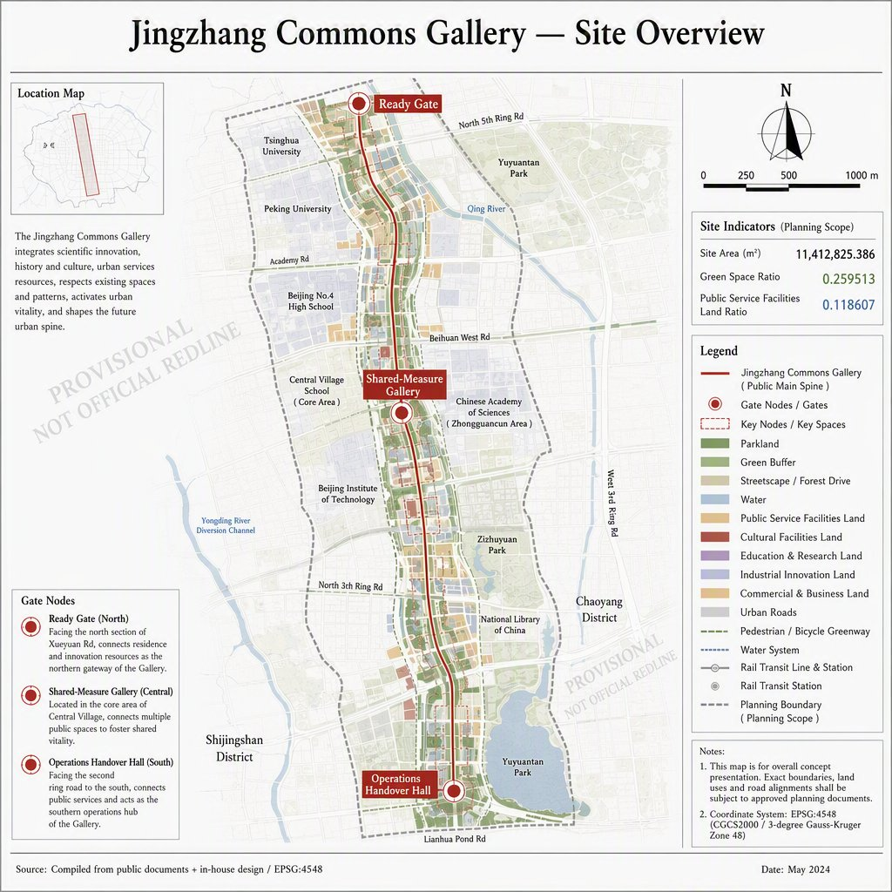
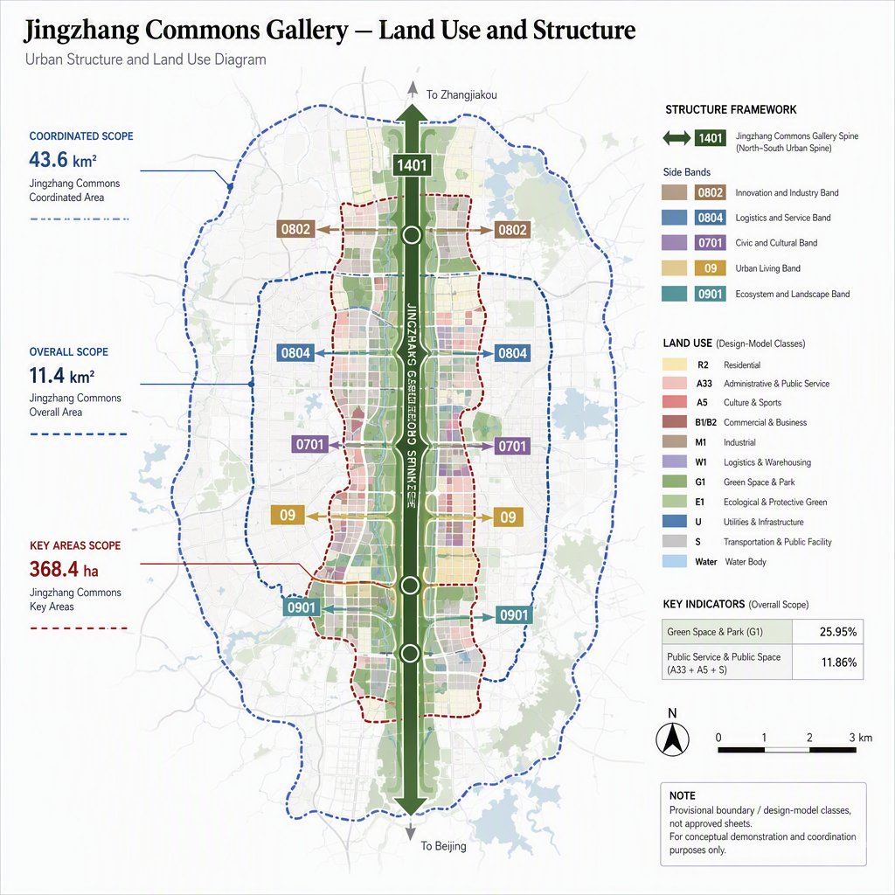
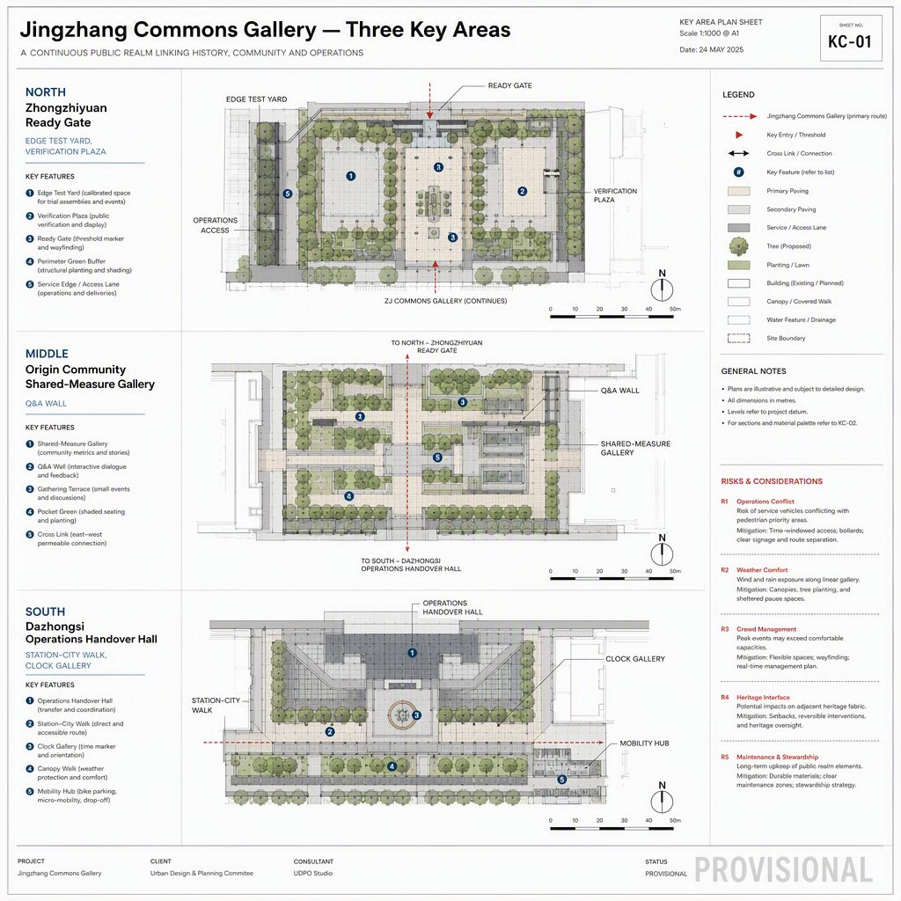
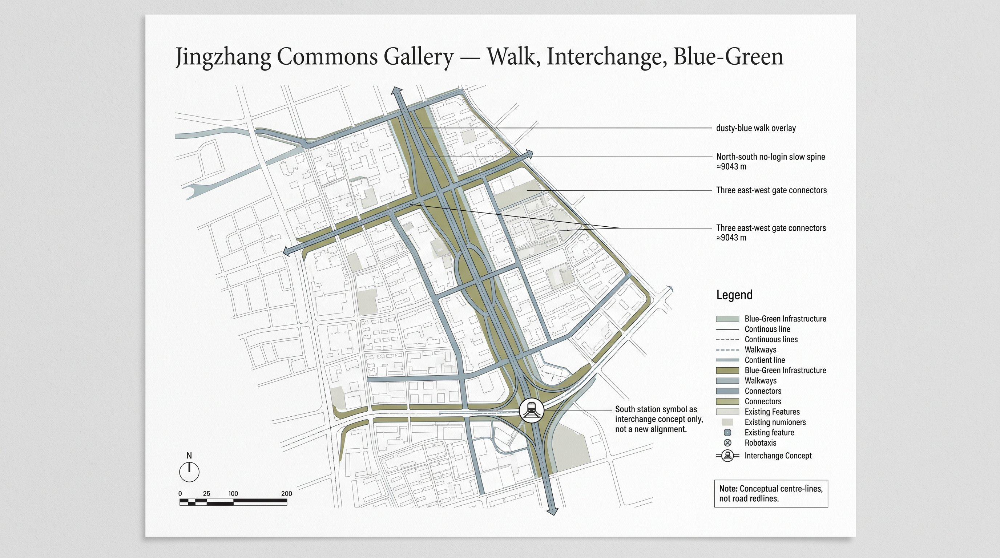
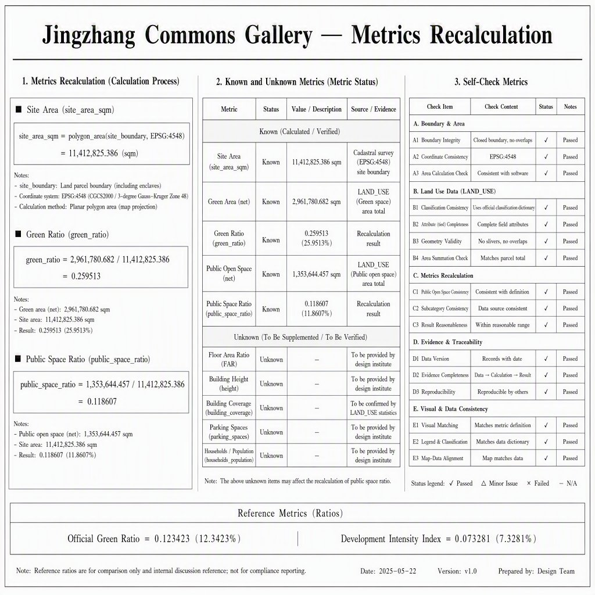

# Jingzhang Commons Gallery

> This package is an open co-creation concept and reference scheme for professional teams to deepen. It does not replace statutory planning and is not a government approval or delivery pledge. The site boundary and three key areas are maintainer provisional constraints; replace them and recalculate every derived layer when official polygons arrive.

## Abstract

Jingzhang Commons Gallery writes the Jing-Zhang heritage-park corridor as a public verification section that still works after an account is switched off, and splits the three key areas into a ready–measure–operate funnel instead of three cloned garden AI blocks. Zhongzhiyuan keeps test yards on the gallery edge; Origin Community places near-campus shared measurement under the gallery; Dazhongsi places operations handover in a station-city hall. Green ratio 0.259513 and public-space ratio 0.118607 are recomputed from this package, not the scaffold template pair.

## Design Basis and Source List

The first authority is the Haidian qualification announcement: three scope levels, three named key areas, and the task tree—not news graphics or OSM-inferred redlines [source:OFFICIAL-ANNOUNCEMENT] [standard:PROJECT-OFFICIAL-ANNOUNCEMENT]. The agent taskbook supplies co-creation principles, six agent tasks, and the shared boundary clause; facts still go back to registered primaries [source:AGENT-TASKBOOK].

Site and key-area polygons copy the maintainer provisional file and keep `provisional_constraint` with `official_boundary=false` [source:BOUNDARY-SOURCE]. The precise qualification appendix remains password-gated, so this package discloses provisional status and triggers a full recalculation when cleared CAD/GIS arrives [source:SITE-PACKAGE].

Usability follows the central registry: formal-ready sources may support task coverage; background sources stay narrative; provisional sources must not be upgraded into redlines [source:SOURCE-REGISTRY]. The processed fact pack is navigation only; gaps enter assumptions instead of invented FAR numbers [source:PROCESSED-FACT-PACK].

The package does not use planning attachments outside the public site package, uncleared tracks, or uncleared enterprise data. Global cases keep transferable mechanisms only. Generated figures are explanatory concepts, not site photographs or resident testimony.

## Three-Level Scope Framework

The announcement’s three levels map as follows: 43.6 km² coordinated research carries naming, ecology mechanisms, and wing interfaces; 11.4 km² overall design carries the Commons Gallery spine and the land-use partition; 368.4 ha key areas carry the three distinct gates. This package’s `site_boundary` is the provisional stand-in for the overall design area, with recomputed area 11,412,825.386 m² [metric:site_area_sqm].

That figure is close to the announced 11.4 km² because maintainers fitted text bounds; it is not official redline precision [data:geometry/site_boundary.geojson#PROV-SITE-001]. Key areas keep the official `area_id` values and remain provisional; their rectangles are not parcel or road edges [depth:three_level_scope_framework].

The coordinated layer does not draw a new 43.6 km² redline. It only writes conceptual interfaces to Beilin Community, Future Science City, Huairou, and the Economic-Technological Development Area. The overall layer’s clipping face is this package’s site boundary. The key-area layer must land on the three gates. After official polygons arrive, land use, green, public space, buildings, roads, phasing, and the three core metrics must all be recomputed.

## Coordinated Research Area: Industry and Future City Research

The belt is named 京张共证廊 / Jingzhang Commons Gallery. One structural sentence: a walkable, verifiable, switch-off public gallery stitches a ready–measure–operate funnel [standard:PROJECT-AGENT-OPEN-CALL-TASKBOOK]. The logo direction is a rail cross-section plus a door that can open or close: open in daily life, closed during verification. No corporate badge, no historical portrait.

Three positions become space: a global AI highland maps to Ready Gate’s edge-attached test yard; a pilgrimage place maps to three checkable landmarks rather than a light show; a high-quality district maps to the no-login walk section. Among the five functions, innovation and testing sit at Zhongzhiyuan, translation and talent services sit at Origin, consumption and international handover sit at Dazhongsi, cultural checking sits along the gallery, and governance review sits in the annual open day.

The two wings are interfaces only: the Zhongguancun wing offers enterprise-service booking; the Xiaoyuehe wing offers scenario-opening booking. No fake wing redline is drawn. Regional synergy is a functional-division suggestion: Haidian offers a walkable verification gallery; other parks may offer pilot plants, large instruments, or manufacturing interfaces—all marked conceptual.

Eight ecology cases keep mechanisms only: Barcelona superblocks (tactical public reclaim), Seoul Cheonggyecheon (everyday corridor), Singapore Park Connector (continuous walking), Helsinki MyData (switch-off data), Barcelona Decidim (public review), Copenhagen bicycle streets (ordinary path first), Vienna Seestadt (phased trials), and Taipei open government (evidence windows). In Haidian they become the no-login section, gallery continuity, switch-off rule, objection window, and phasing—not copied street widths or fixtures.

## Overall Design Area: Urban Renewal and Regulatory-Plan-Level Urban Design

The structure is one gallery, three gates, two wing interfaces. The gallery is a north–south park-green plus no-login walk; the gates sit in the three key areas; the wings stay outside this site polygon [depth:overall_spatial_structure]. Land use tiles the provisional site without gaps; a shrink-and-fill step removes projection-chord overlaps; the gallery itself is coded 1401 park green rather than an equal-weight colour band [data:geometry/land_use.geojson#LU-GALLERY-1401].

Renewal logic is public section first, edge stitching second, wing interfaces last. Near-term work is the gallery and three public gates; mid-term work stitches designable key-area edges; long-term work may discuss wings. Retain–renovate–demolish, height, and FAR stay unknown without official controls; this chapter only offers zoning logic [depth:development_intensity_controls].

Character is restrained: light ground, thin lines, low-chroma bands, checkable fields. Generated mood images are not a finished park. The heritage-park vitality belt is a public verification spine, not a memorial project. When a statutory plan arrives, land-use codes and intensity suggestions must be remounted on official parcels.

## Detailed Design of Key Areas

The three areas must not clone one “garden AI block.” The funnel is ready, shared-measure, operate, mapped to the official `area_id` values [data:geometry/key_areas.geojson#PROV-KEY-001].

### Zhongzhiyuan AI Autonomous Innovation Acceleration Area

Role: Ready Gate. Test yards attach to research land on the east edge and must not occupy the no-login section. Spatial moves: north garden, verification plaza, and a bounded test yard. The public face shows booking windows and stop rules only. Links to Qinghe and the 5th Ring remain interchange concepts, not approved interchanges. Risk: noise and fences eating the walk. Exit: stop testing if a fence lands on the slow spine [depth:three_key_area_detailed_design].

### Beijing AI Origin Community

Role: Shared-Measure Gallery. A near-campus service hall and living block pinch the gallery so students, shift workers, and young teams share auditable measure days. Spatial moves: gallery plaza, Q&A-wall landmark, and an east–west slow connector. Retain–renovate–demolish is conceptual: keep the public gallery face; housing updates wait for tenure. Risk: treating campus data as already open. This package does not collect personal tracks.

### Dazhongsi AI Industry Cluster

Role: Operations Handover Hall. Four-quadrant station walking meets the handover plaza; native-AI retail stays on commercial land; the hall is not a forced exhibition. Spatial moves: handover plaza, clock-gallery landmark, and a shift board. The link to the heritage park is the south green edge and an ordinary night path. Risk: retail swallowing the public face. Exit: restore no-login passage if a paid gate cuts the public surface.

## AI Innovation Ecosystem, Personas, and AI+ Scenarios

The ecology is not a tenant brochure. Eight case mechanisms, twelve scenario cards, six personas, and three landmarks place AI on the gallery, gates, and hall rather than “district-wide coverage” [standard:PROJECT-AGENT-OPEN-CALL-TASKBOOK]. Scenario and test counts are stored as metrics [metric:scenario_card_count].

| Persona | Daily need | Spatial reply | Stop rule |
| --- | --- | --- | --- |
| Near-campus graduate | Publish, measure, night study | Shared-Measure Gallery, Q&A wall | No personal tracks |
| Shift-care worker | Shift pause, safe night path | Handover Hall, south ordinary path | No forced night show |
| Startup test engineer | Bounded test, booking window | Ready Gate edge yard | Stop if test crosses the fence |
| Resident with children | Continuous walk, shade | No-login section, north garden | Children are not user data |
| Traveller with access needs | Restatable slope and rests | Three plazas and connectors | Mark unsurveyed grades |
| Short-stay visitor | Checkable guide, switch-off recs | Three landmarks, heritage windows | Guide can be switched off |

| Scene | Type | Place | Data / privacy | Review | Stop rule |
| --- | --- | --- | --- | --- | --- |
| S01 No-login walk guide | Daily | Gallery spine | Public wayfinding only | Human breakpoint check | Close recs if login is required |
| S02 Ready Gate bounded test | Test | Zhongzhiyuan edge | On-site aggregates | Safety officer | Fence on the slow spine |
| S03 Shared-measure day | Test | Origin gallery | Voluntary, withdrawable | Campus–district joint | Personal-track capture |
| S04 Handover shift board | Daily | Dazhongsi hall | Public timetable | Duty operator | Board blocking egress |
| S05 Youth third space | Daily | Gallery and south | Booking without biometrics | Community duty | Paid gate cuts public face |
| S06 Heritage evidence window | Daily | Three gallery windows | Public historical facts only | Heritage adviser | Written as approved memorial |
| S07 After-rain walk audit | Test | Gallery + gates | Pooled flood photos | Municipal observer | Written as approved sponge plan |
| S08 Access repair ticket | Daily | Three plazas | Ticket without portraits | Access officer | Treating grades as surveyed |
| S09 Ordinary night path | Daily | South green edge | Zoned lighting | Resident observer | Forced exhibition lighting |
| S10 Annual Commons Open Day | Operation | Full gallery | Separate event permit | Host review | Written as a fixed government date |
| S11 Enterprise-service interface | Daily | Zhongguancun wing | Booking tickets | Service desk | Fake wing redline |
| S12 Human objection window | Governance | Gate duty points | Objection text | Human final call | Automated over-blocking |

Test scenes are at least S02, S03, and S07. AI only organises public evidence and bookings; it does not replace human final calls. After AI is switched off, the spine, gates, hall, and ordinary path still stand.

## Land Use, Building Scale, and Retain-Renovate-Demolish Strategy

Land use tiles the provisional site without gaps or overlaps. The gallery is 1401; north research is 0802; near-campus education is 0804; living is 0701; mid mixed services are 09; south commerce is 0901 with community service 0702 [data:geometry/land_use.geojson#LU-READY-R&D]. These are design-model classes using the MNR code subset, not approved land-use sheets [standard:MNR-LAND-USE-CLASSIFICATION-GUIDE].

Buildings are six conceptual footprints only. Recomputed footprint area is 1,287,206.112 m² at low confidence and is not a surveyed outline [data:geometry/buildings.geojson#BLDG-READY-LAB]. FAR and height stay unknown pending official controls [depth:retain_renovate_demolish].

Retain–renovate–demolish is a concept: keep the gallery and three public gates; mark designable edges as “update after tenure”; name no building for demolition. The constraint layer locks a provisional heritage hint and a missing-regulatory hint before design layers enter [data:geometry/constraints.geojson#CON-HERITAGE-GALLERY].

## Transport, Rail, Municipal Infrastructure, and Public Services

The transport product is the no-login slow spine, recomputed at about 9,042.827 m, plus three east–west gate connectors [data:geometry/roads.geojson#ROAD-GALLERY-NS]. These are conceptual centre-lines, not road redlines or engineering alignments [depth:traffic_rail_slow_parking].

Rail interchange is written only as four-quadrant walking from Dazhongsi Station into the handover hall, Wudaokou / Qinghua East Road West into the shared-measure gallery, and 5th Ring / Qinghe toward Ready Gate. No new rail, bridge, tunnel, or approved station rebuild is asserted. Parking and low-speed access may sit in bounded edge yards only.

Municipal and new-infrastructure statements stay strategic: lighting zones, edge wayfinding, after-rain observation points. Pipe diameters, return periods, power capacity, and compute rooms stay unknown. Public services sit at gate duty points, access-repair desks, and objection windows. Surveillance is not written as district-wide coverage.

## Blue-Green Network, Public Space, and Urban Character

Blue-green continuity is the gallery green spine plus the Ready Gate north garden and the south everyday edge. Union green area is 2,961,780.682 m²; green ratio is 0.259513 = green union / site area in EPSG:4548 [metric:green_ratio]. The value is a design model, not a statutory green-space rate [data:geometry/green_space.geojson#GREEN-GALLERY].

Public space is the no-login walk plus three gate plazas. Union area is 1,353,644.457 m²; public-space ratio is 0.118607, meeting this package’s self-set visible-section target of about 10% or more [metric:public_space_ratio]. Public and green layers may overlap; authority remains each layer’s union [data:geometry/public_space.geojson#PUBLIC-WALK-SPINE].

Three pilgrimage landmarks hold only checkable public fields; experiments stay off the daily track [metric:landmark_count]:

1. Ready Gate Verification Pavilion: booking, fence range, stop rules.
2. Shared-Measure Q&A Wall: public near-campus Q&A and measure-day calendar.
3. Operations Handover Clock Gallery: shifts, egress, ordinary night path.

Character rules: light ground, thin lines, restrained bands, bilingual labels, north arrow and legend. No cyber neon, glassmorphism, or provisional rectangles as the composition hero. Youth-friendliness is third space and an ordinary night path, not café renderings.

## Renewal Projects, Implementation Policy, and Phasing

Phasing faces match the project list. Near, mid, and far polygons come from this package’s partition and are not a fixed government investment plan [data:geometry/phasing.geojson#PHASE-NEAR-GALLERY]. Policy is written as triggers: official redlines, heritage lines, road redlines, and event permits must arrive before any upgrade [depth:renewal_project_list].

| ID | Project | Place | Phase | Conceptual owner | Trigger |
| --- | --- | --- | --- | --- | --- |
| CG-01 | No-login gallery section | Full gallery | Near | Park / transport team | Official corridor extent |
| CG-02 | Ready Gate plaza and edge test yard | Zhongzhiyuan | Near | Park operator + safety officer | Test safety rules |
| CG-03 | Shared-Measure Gallery and Q&A wall | Origin | Near | Campus–community service | Site permit |
| CG-04 | Handover hall and clock gallery | Dazhongsi | Near | Station-city operator | Station-hall interface data |
| CG-05 | Three-gate slow connectors | Three areas | Mid | Transport team | Road redline |
| CG-06 | Edge living and campus stitch | Origin edge | Mid | Renewal implementer | Tenure |
| CG-07 | South ordinary night path | South Dazhongsi | Mid | Community + lighting | Night-event rules |
| CG-08 | Wing enterprise / scenario interfaces | Outside site | Far | Enterprise desk | Wing materials |
| CG-09 | Annual Commons Open Day | Full gallery | Recurring | Host + human review | Event permit |
| CG-10 | Full recalc after official geometry | Whole package | Conditional | Package maintainer | Official polygons |

Long-term operation: the ordinary path stays open; tests use intermittent windows; one annual Commons Open Day versions the review; the objection window keeps a human final call. The failure-review door is S12, not an automated scoreboard.

## Metrics, Area Recalculation, and Compliance Matrix

The three core visual metrics must be known, recalculable, and identical to `data-value` on `visual/index.html` [depth:metrics_recalculation].

| Metric | Value | Algorithm |
| --- | ---: | --- |
| site_area_sqm | 11412825.386 | Polygon area of submitted `site_boundary` in EPSG:4548 |
| green_space_area_sqm | 2961780.682 | Union area of `green_space` |
| public_space_area_sqm | 1353644.457 | Union area of `public_space` |
| green_ratio | 0.259513 | 2961780.682 / 11412825.386 |
| public_space_ratio | 0.118607 | 1353644.457 / 11412825.386 |

Site area reuses the maintainer provisional overall extent and is close to the announced 11.4 km², but it is not an official redline area. Green and public ratios come from this scheme’s gallery-and-gates partition and deliberately avoid the scaffold pair 0.123423 / 0.073281. FAR and height stay unknown [metric:public_space_ratio].

Task coverage lives in `compliance_matrix.json`: announcement 1.3 / 1.4 / 1.5 and agent.1–6 each have chapter, layer, metric, drawing, and visual evidence. Standards live in `standard_matrix.json`. Design depth lives in `design_depth_matrix.json`; core items are complete, with official-geometry and control-plan gaps disclosed via `completeness_limited_by`.

## Risk, Copyright, and Compliance

Main risks: reading provisional bounds as redlines; test yards eating the walk; over-reaching heritage language; treating generated images as photographs; writing events as settled government dates [depth:risk_missing_data]. Mitigations: provisional watermarks throughout; stop rules on test cards; landmarks limited to public facts; copyright and AI statements in `report/copyright_statement.md`; policy kept separate from permits.

Privacy: no personal tracks, biometrics, or raw mobile numbers. Copyright: prose and design geometry belong to the submitter; announcement and site-package materials are cited under their official terms; OSM is background only and not a formal redline. AI use: the model drafted prose, geometry scripts, and figure prompts; humans adjudicate site judgement and compliance. Licence intent: `COMMUNITY-DISPLAY-ONLY`.

Still missing: official SITE_BOUNDARY and KEY_AREA, regulatory sheets, road redlines, heritage purple lines, tenure, municipal capacity, and event permits. Any missing item keeps the related claim at concept depth; no fake numbers are filled in.

## References

- Haidian qualification announcement and three-level text bounds [source:OFFICIAL-ANNOUNCEMENT]
- Agent open-call taskbook extract [source:AGENT-TASKBOOK]
- Repository site package, enums, and allowed design space [source:SITE-PACKAGE]
- Central source registry [source:SOURCE-REGISTRY]
- Processed navigation layer and missing-data list [source:PROCESSED-FACT-PACK]
- Provisional boundary and key-area polygons [source:BOUNDARY-SOURCE] [source:KEY-AREA-SOURCE]
- MOHURD urban design measures (local snapshot) [standard:MOHURD-URBAN-DESIGN-MEASURES]
- Control detailed-planning measures (local snapshot) [standard:MOHURD-CONTROL-DETAILED-PLANNING]
