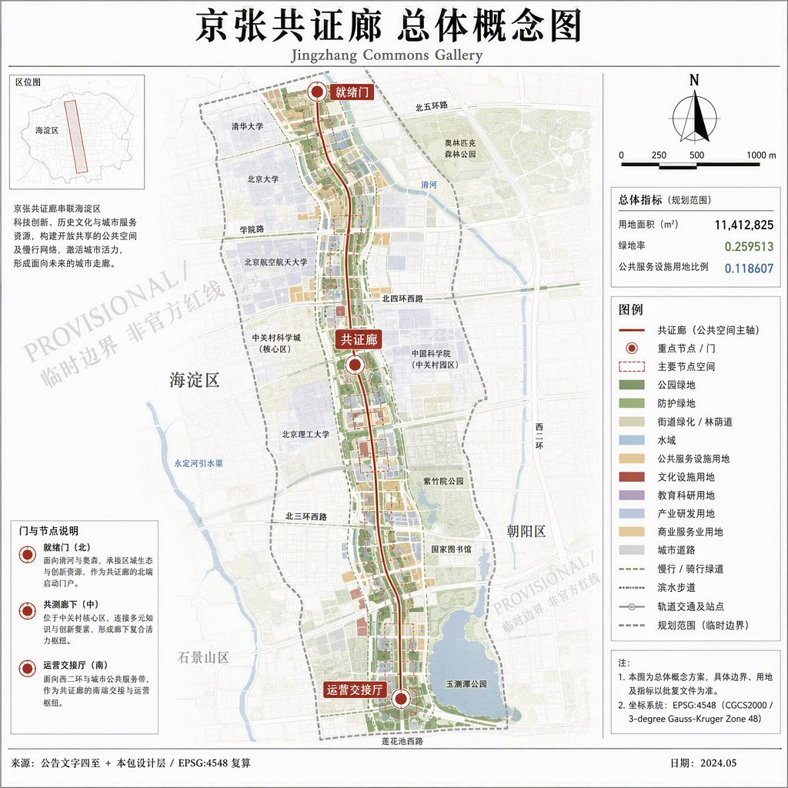
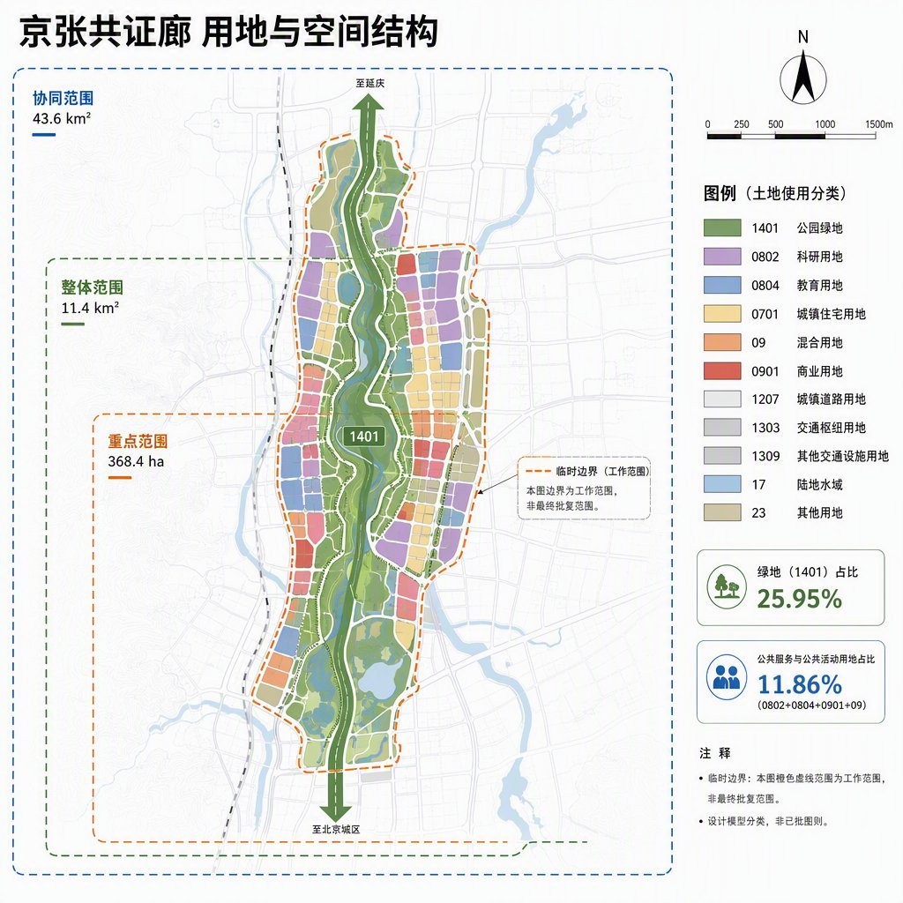
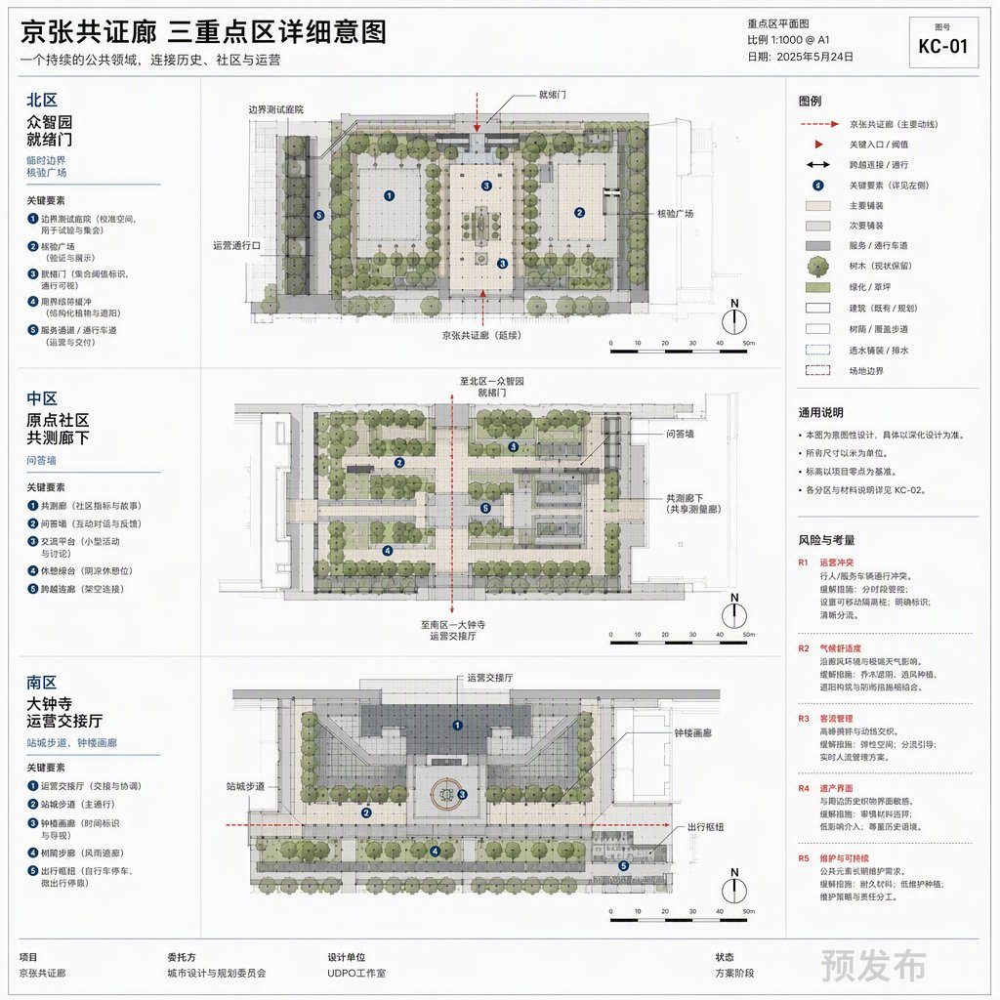
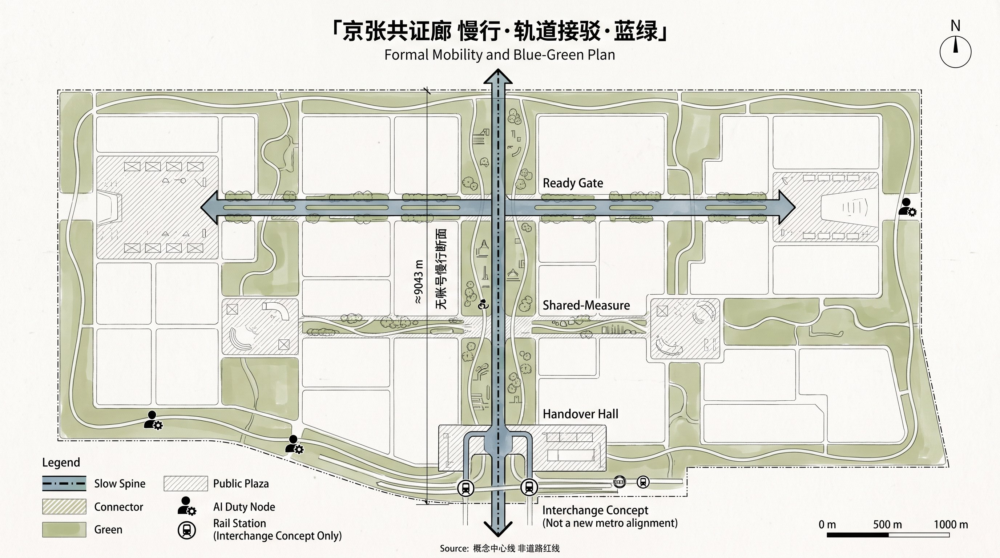
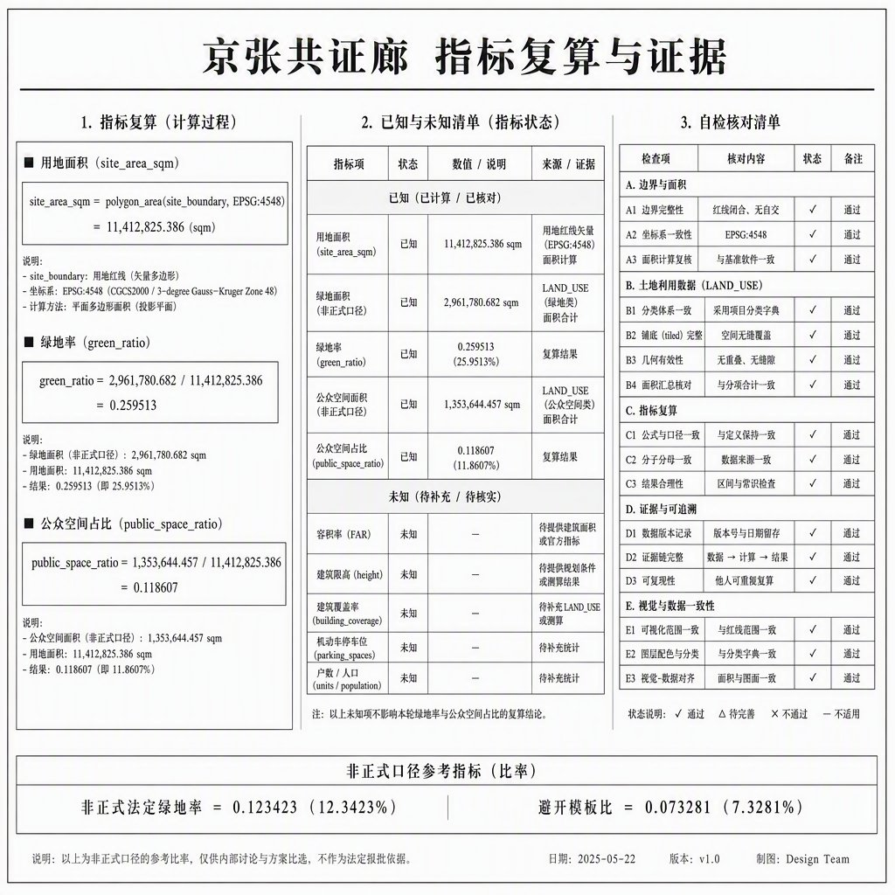

# 京张共证廊

> 本方案为开放共创的概念建议与参考方案，供专业团队深化研究，不替代法定规划，不构成政府审定或实施承诺。场地边界与三重点区均来自仓库临时约束范围，正式红线发布后须按同一公式全量重算。

## 摘要

京张共证廊把京张遗址公园走廊写成一条普通人关掉账号也能走完的公共核验断面，并把三处重点区差分成「就绪—共测—运营」漏斗，而不是三个花园型 AI 街区的换皮。众智园只把测试场贴在廊边，原点把近校共测放进廊下，大钟寺把运营交接放进站城厅。绿地率 0.259513、公共空间率 0.118607，均由本包几何复算，不是模板三项比。

## 设计依据与资料清单

本包第一依据是海淀分局资格预审公告中的三层范围、三重点区名称与任务结构，而不是新闻图或 OSM 推测红线 [source:OFFICIAL-ANNOUNCEMENT] [standard:PROJECT-OFFICIAL-ANNOUNCEMENT]。智能体任务书提供共创原则、六项任务和统一边界条款；事实判断仍回到原始登记，不把加工层当新权威 [source:AGENT-TASKBOOK]。

场地边界与三重点区复制维护者登记的临时 polygon，属性保持 `provisional_constraint`、`official_boundary=false` [source:BOUNDARY-SOURCE]。资格预审精确附件仍受密码保护，因此本包全程披露临时性，并在正式 CAD/GIS 到达后触发全层重算 [source:SITE-PACKAGE]。

可用与不可用边界以中央来源登记为准：`usable_for_formal=yes` 的材料支撑任务覆盖，背景材料只写协同叙事，provisional 材料不得升级为红线 [source:SOURCE-REGISTRY]。`agent_fact_pack.md` 只作导航，缺口清单进入假设，不在正文伪造控规数 [source:PROCESSED-FACT-PACK]。

本包未使用场地包以外的规划附件、未授权轨迹或企业未授权数据。全球案例只蒸馏可转化机制，不复制商标造型。生成图均为概念解释层，不是现场照片或居民意见。

## 三层范围工作框架

公告三层在本包中的传导是：43.6 km² 统筹层写命名、生态机制和两翼接口；11.4 km² 总体层写共证廊主脊与用地剖分；368.4 ha 三区层写三门差异。本包 `site_boundary` 对应总体设计范围的临时替代面，复算面积 11,412,825.386 m² [metric:site_area_sqm]。

该面积接近公告约 11.4 km²，偏差来自维护者按文字四至拟合，不是官方红线精度 [data:geometry/site_boundary.geojson#PROV-SITE-001]。三重点区沿用官方固定 `area_id`，仍标临时，不得解释为地块或道路边线 [depth:three_level_scope_framework]。

统筹层不强制画 43.6 km² 新红线，只把北纬社区、未来科学城、怀柔、经开区写成概念接口。总体层的权威裁剪面就是本包场地边界。重点层必须落到三门，而不是漂浮口号。正式 polygon 替换后，用地、绿地、公共空间、建筑、道路、分期和三项核心指标同步重算。

## 统筹研究范围产业与未来城市研究

一带中文名「京张共证廊」，英文名 Jingzhang Commons Gallery。一句结构：一条可走、可核、可关的公共核验廊，把三区串成就绪—共测—运营漏斗 [standard:PROJECT-AGENT-OPEN-CALL-TASKBOOK]。Logo 方向是轨道断面加一扇可开合的门：日常开、验证关；不用企业徽章，不用历史人物肖像。

三大定位落到空间：全球 AI 产业高地对应就绪门的受控测试贴边；朝圣地对应三处可核对地标而不是灯光秀；高品质城区对应无账号慢行断面。五大功能中，创新与测试进众智园廊边，转化与人才服务进原点廊下，消费与国际交接进大钟寺厅，文化核对沿廊布置，治理复盘进年度开放日。

三区两翼只写接口：中关村翼提供企业服务预约，小月河翼提供场景开放预约，不把翼区画成假红线。与北纬社区、未来科学城、怀柔科学城、经开区的协同是功能分工建议：海淀侧提供可步行核验廊，其他园区提供中试、大科学装置或制造接口，均标概念。

8 个生态案例只保留机制：巴塞罗那超级街区的临时公共回收、首尔清溪川的日常走廊、新加坡 Park Connector 的连续步行、赫尔辛基 MyData 的可关闭数据、巴塞罗那 Decidim 的公共评议、哥本哈根自行车街的普通路径优先、维也纳 Seestadt 的分期试验、台北开放政府的证据窗。转化到海淀时分别对应无账号断面、廊连续性、可关原则、异议窗和分期，不复制街道宽度或装置造型。

## 总体设计范围城市更新与控规深度城市设计

总体结构是「一廊三门、两翼接口」。一廊是南北向共证廊公园绿地与无账号慢行断面；三门落在三重点区；两翼不进本包场地 polygon [depth:overall_spatial_structure]。用地由临时场地边界剖分铺满，邻边经收缩—回填避免投影弦缝重叠，廊本身记为公园绿地 1401，而不是等权色带 [data:geometry/land_use.geojson#LU-GALLERY-1401]。

更新逻辑是「先公共断面、后廊边缝合、再翼区接口」。近期只实施廊与三门公共面；中期缝合三重点区可设计边；远期才谈廊边与两翼接口。拆改留、高度、容积率因缺少正式控规保持未知，正文只给分区逻辑，不编法定控制值 [depth:development_intensity_controls]。

风貌方向克制：白底细线、低饱和色带、可核对字段，不把生成氛围图当成已建成公园。京张遗址公园活力带在本包中是公共核验脊，不是纪念工程。正式控规到达后，本层用地代码与强度建议必须重挂官方地块。

## 重点区域详细设计

三区禁止复制同一段「花园型 AI 街区」。漏斗顺序是就绪、共测、运营，对应三处官方 `area_id` [data:geometry/key_areas.geojson#PROV-KEY-001]。

### 众智园 AI 自主创新加速区

定位：就绪门。测试场贴在廊东侧科研用地，不占无账号断面。空间动作是北园绿带 + 核验广场 + 受控测试场；公共界面只展示可预约时段和停止条件。与清河、五环的关系写成接驳概念，不是已批立交。风险：测试噪声、围栏侵占步行；退出条件是围栏压上慢行脊即停测 [depth:three_key_area_detailed_design]。

### 北京 AI 原点社区

定位：共测廊下。近校服务厅与生活楼夹住廊下，让师生、一轮班劳动者和青年团队共用可审计测量日。空间动作是廊下广场 + 问答墙地标 + 近校慢行横联。拆改留只标概念：廊下公共面优先保留，廊边住宅更新待权属。风险：把校园数据写成已开放；本包不采集个人轨迹。

### 大钟寺 AI 产业集聚区

定位：运营交接厅。站城四象限步行接到交接厅广场，智能原生消费留在商业用地，不把大厅做成强制观展。空间动作是交接厅广场 + 钟廊地标 + 班次看板。与遗址公园的衔接是南段绿边和普通夜间路径。风险：商业界面吞掉公共面；退出条件是公共面被收费闸机切断即改回无账号通行。

## AI 创新生态、人才画像与 AI+ 场景

生态不是园区招商册。本包用 8 个案例的机制、12 张场景卡、6 类画像和 3 处地标，把 AI 落在廊、门、厅，而不是「全区覆盖」 [standard:PROJECT-AGENT-OPEN-CALL-TASKBOOK]。场景卡计数与测试场景计数写入指标，便于复核 [metric:scenario_card_count]。

| 画像 | 日常需求 | 空间响应 | 停止条件 |
| --- | --- | --- | --- |
| 近校研究生 | 发布、共测、夜间学习 | 共测廊下、问答墙 | 不采集个人轨迹 |
| 一轮班护理员 | 换班停留、安全夜间路径 | 运营交接厅、南段普通路径 | 夜间不强制观展 |
| 初创测试工程师 | 受控测试、预约窗口 | 就绪门贴边测试场 | 测试越出围栏即停 |
| 带儿童居民 | 连续步行、遮荫停留 | 无账号慢行断面、北园 | 不把儿童写成用户数据 |
| 无障碍出行者 | 可复述坡度与休息点 | 三门广场与横联 | 高程未测段标待复测 |
| 短期访客 | 可核对导览、可关掉推荐 | 三处地标、遗产核对窗 | 导览可关，不强制账号 |

| 场景 | 类型 | 位置 | 数据/隐私 | 复核 | 停止条件 |
| --- | --- | --- | --- | --- | --- |
| S01 无账号慢行导览 | 日常 | 共证廊脊 | 仅公开导视 | 人工校对断点 | 导览要求登录则关闭推荐 |
| S02 就绪门受控测试 | 测试 | 众智园廊边 | 场内聚合 | 安全官 | 围栏压上慢行脊 |
| S03 共测廊下测量日 | 测试 | 原点廊下 | 自愿、可撤 | 校地联合 | 采集个人轨迹 |
| S04 运营交接班次看板 | 日常 | 大钟寺厅 | 班次公开表 | 运营值班 | 看板遮挡疏散 |
| S05 青年第三空间 | 日常 | 廊下与南段 | 预约不存生物特征 | 社区值班 | 收费闸机切断公共面 |
| S06 遗产物证核对窗 | 日常 | 廊上三窗 | 只放公开史实 | 文保顾问 | 写成已批纪念工程 |
| S07 雨后复盘走查 | 测试 | 廊+三门 | 积水照片聚合 | 市政观察 | 把雨水写成已批海绵专项 |
| S08 无障碍报修 | 日常 | 三门广场 | 报修不含肖像 | 无障碍专员 | 高程数当实测 |
| S09 夜间普通路径 | 日常 | 南段绿边 | 照明分区 | 居民观察 | 强制观展灯光 |
| S10 年度共证开放日 | 运营 | 全廊 | 活动许可另办 | 主办复核 | 写成政府已定日程 |
| S11 企业服务接口 | 日常 | 中关村翼接口 | 预约工单 | 企业服务台 | 翼区假红线 |
| S12 人工复核异议窗 | 治理 | 三门值班点 | 异议文本 | 人工终裁 | 自动封禁越权 |

测试场景至少 S02、S03、S07。AI 只整理公开证据和预约，不替代人工终裁。关掉 AI 后，脊、门、厅和普通路径仍然成立。

## 用地、建筑规模与拆改留方案

用地铺满临时场地边界，无缝无重叠。廊为 1401，北段科研 0802，近校教育 0804，生活 0701，中段混合 09，南段商业 0901 与社区服务 0702 [data:geometry/land_use.geojson#LU-READY-R&D]。这是设计模型分类，采用自然资源部用地代码子集，不是已批地类图则 [standard:MNR-LAND-USE-CLASSIFICATION-GUIDE]。

建筑只给六处概念基底，复算基底面积 1,287,206.112 m²，置信度低，明确不是实测轮廓 [data:geometry/buildings.geojson#BLDG-READY-LAB]。容积率与高度保持 unknown，待正式控规 [depth:retain_renovate_demolish]。

拆改留仅为概念建议：廊与三门公共面优先保留；廊边可设计地块标「待权属后更新」；没有任何一栋建筑被指定拆除。约束层先锁定临时文保提示和控规缺口提示，再允许设计层进入 [data:geometry/constraints.geojson#CON-HERITAGE-GALLERY]。

## 交通、轨道、市政与公共服务设施

交通主产品是无账号慢行主脊，复算长度约 9,042.827 m，加上三门东西向接驳横联 [data:geometry/roads.geojson#ROAD-GALLERY-NS]。它是概念中心线，不是道路红线或工程线位 [depth:traffic_rail_slow_parking]。

轨道接驳只写大钟寺站四象限步行接到运营交接厅，五道口/清华东路西口接到共测廊下，五环/清河方向接到就绪门。不断言新轨道、新桥隧或已批站改。停车与低速接驳只允许在廊边受控场，禁止占用慢行断面。

市政与新基建保持策略级：照明分区、端侧导视、雨后观察点。管径、重现期、电力容量、算力机房均 unknown。公共服务沿三门布置值班点、无障碍报修和异议窗，不把监控写成全区覆盖。

## 蓝绿空间、公共空间与城市风貌

蓝绿连续性沿共证廊绿脊 + 就绪门北园 + 南段日常绿边组织。绿地并集面积 2,961,780.682 m²，绿地率 0.259513，公式为绿地并集 / 场地面积，投影 EPSG:4548 [metric:green_ratio]。该值是设计模型，不是法定绿地率 [data:geometry/green_space.geojson#GREEN-GALLERY]。

公共空间由无账号慢行断面和三门广场组成，并集 1,353,644.457 m²，公共空间率 0.118607，达到本包自定的可见连续断面目标（不低于约 10%） [metric:public_space_ratio]。公共面与绿地可以重叠，权威仍是各自图层并集 [data:geometry/public_space.geojson#PUBLIC-WALK-SPINE]。

三处朝圣地标只放可核对的公开字段，实验与日常严格分开 [metric:landmark_count]：

1. 就绪门核验亭：展示测试预约、围栏范围、停止条件。
2. 共测廊下问答墙：展示近校公开问答与测量日日历。
3. 运营交接钟廊：展示班次、疏散口和普通夜间路径。

风貌导则：浅底、细线、克制色带、中英标注、指北与图例齐全。禁止赛博霓虹、玻璃拟态和把 provisional 矩形画成构图主体。青年友好体现在第三空间与夜间普通路径，而不是咖啡馆效果图。

## 更新项目清单、实施政策与分期计划

分期与项目一一对应，近中远三面来自本包剖分，不是政府已定投资计划 [data:geometry/phasing.geojson#PHASE-NEAR-GALLERY]。政策只写触发条件：正式红线、文保线、道路红线和活动许可到达后才能升格 [depth:renewal_project_list]。

| 编号 | 项目 | 区位 | 分期 | 主体（概念） | 触发 |
| --- | --- | --- | --- | --- | --- |
| CG-01 | 共证廊无账号断面 | 全廊 | 近 | 公园/交通深化团队 | 正式走廊范围 |
| CG-02 | 就绪门核验广场与贴边测试场 | 众智园 | 近 | 园区运营+安全官 | 测试安全规则 |
| CG-03 | 共测廊下与问答墙 | 原点 | 近 | 校地服务+社区 | 场地许可 |
| CG-04 | 运营交接厅与钟廊 | 大钟寺 | 近 | 站城运营 | 站厅接口资料 |
| CG-05 | 三门慢行横联 | 三区 | 中 | 交通深化团队 | 道路红线 |
| CG-06 | 廊边生活与近校缝合 | 原点周边 | 中 | 更新实施主体 | 权属 |
| CG-07 | 南段夜间普通路径 | 大钟寺南 | 中 | 社区+照明 | 夜间活动规则 |
| CG-08 | 两翼企业/场景接口 | 廊外接口 | 远 | 企业服务台 | 翼区资料 |
| CG-09 | 年度共证开放日 | 全廊 | 循环 | 主办+人工复核 | 活动许可 |
| CG-10 | 正式几何替换后全量重算 | 全包 | 条件 | 本包维护者 | 官方 polygon |

长期运营：日常普通路径始终开；测试进间歇窗；每年一次共证开放日做版本化复盘；异议窗保持人工终裁。失败复盘入口是 S12，而不是自动评分榜。

## 指标体系、面积复算与合规矩阵

三项核心视觉指标必须 known、可复算，并与 `visual/index.html` 的 `data-value` 一致 [depth:metrics_recalculation]。

| 指标 | 数值 | 算法 |
| --- | ---: | --- |
| site_area_sqm | 11412825.386 | 提交 `site_boundary` 在 EPSG:4548 的多边形面积 |
| green_space_area_sqm | 2961780.682 | `green_space` 并集面积 |
| public_space_area_sqm | 1353644.457 | `public_space` 并集面积 |
| green_ratio | 0.259513 | 2961780.682 / 11412825.386 |
| public_space_ratio | 0.118607 | 1353644.457 / 11412825.386 |

场地面积沿用维护者临时总体范围，与公告约 11.4 km² 接近，但不是官方红线面积。绿地率与公共空间率来自本方案自己的廊+三门剖分，刻意避开脚手架模板比 0.123423 / 0.073281。容积率、高度保持 unknown [metric:public_space_ratio]。

任务覆盖见 `compliance_matrix.json`：公告 1.3/1.4/1.5 与 agent.1–6 均有章节、图层、指标、图纸和 visual 区块。专业标准见 `standard_matrix.json`，设计深度见 `design_depth_matrix.json`，核心项均为 complete，并以 `completeness_limited_by` 披露官方几何与控规缺口。

## 风险、版权与合规说明

主要风险：临时边界被误读为红线；测试场侵占慢行；文保措辞越权；生成图被当成现场照片；活动被写成政府已定安排 [depth:risk_missing_data]。缓解：全程 provisional 水印；测试停止条件写入场景卡；地标只放公开史实；版权与 AI 声明见 `report/copyright_statement.md`；政策与许可分开写。

隐私：不采集个人轨迹、生物特征和未脱敏手机号。版权：正文与设计几何归投稿者；公告与场地包按官方许可引用；OSM 仅作背景核对，不进 formal 红线。AI 使用：模型起草正文、几何脚本与图件提示词，人类裁定场地判断与合规边界。许可意向：`COMMUNITY-DISPLAY-ONLY`。

待补资料：官方 SITE_BOUNDARY 与 KEY_AREA、控规图则、道路红线、文保紫线、权属、市政容量、活动许可。缺一项就把对应结论留在概念层，不补假数。

## 参考资料

- 海淀分局资格预审公告与三层范围文字 [source:OFFICIAL-ANNOUNCEMENT]
- 智能体开源征集任务书摘录 [source:AGENT-TASKBOOK]
- 仓库场地包、枚举与允许设计空间 [source:SITE-PACKAGE]
- 中央来源登记 [source:SOURCE-REGISTRY]
- 加工导航层与缺资料清单 [source:PROCESSED-FACT-PACK]
- 临时边界与三重点区 polygon [source:BOUNDARY-SOURCE] [source:KEY-AREA-SOURCE]
- 住建部城市设计管理办法（本地快照）[standard:MOHURD-URBAN-DESIGN-MEASURES]
- 控规编制审批办法（本地快照）[standard:MOHURD-CONTROL-DETAILED-PLANNING]
