# Jing-Zhang Civic AI Loop

## Design Basis and Source List

Jing-Zhang Civic AI Loop is this submission's concept for the Centennial Jing-Zhang AI Innovation Belt, not a new statutory planning title. It uses the official announcement, agent taskbook, public source registry and current site package to separate readable design judgments, spatial layers, recomputable metrics and explicit assumptions. Every proposed action is a conceptual recommendation and does not replace statutory planning, approval, engineering verification or an implementation decision [source:OFFICIAL-ANNOUNCEMENT] [source:AGENT-TASKBOOK] [depth:existing_conditions_diagnosis].

The package does not yet contain a trusted official overall boundary or precise polygons for the three key areas. It therefore uses the provisional rough geometry registered in the official repository to construct a design model. This geometry supports concept generation, spatial discussion, interim metric recomputation and submission validation only; it is neither an official planning boundary nor a precise area basis. When official geometry is released, land use, roads, green space, public space, buildings, phasing, figures and metrics must be recalculated together [source:BOUNDARY-SOURCE] [data:geometry/site_boundary.geojson#SITE-001] [metric:site_area_sqm].

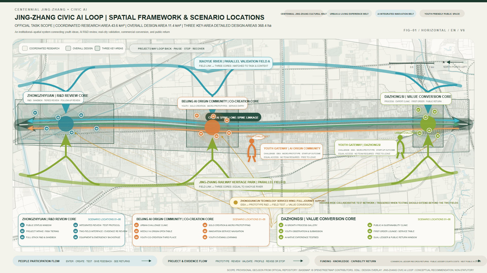

The proposal also uses participant-authored research already completed for the project: nine global cases, the eight-factor ecosystem matrix, the twelve-scenario catalogue, and the three-landmark and honor system. A case demonstrates that a mechanism exists in its original context; it does not prove that Haidian has the same institutions, funding, land or operating conditions [source:CASE-RESEARCH] [source:ECOSYSTEM-MATRIX].

## Three-Level Scope Framework

Each scope answers a different question. The approximately 43.6 km² Coordinated Research Area considers the AI ecosystem, regional collaboration and future-city hypothesis. The approximately 11.4 km² Overall Design Area translates that strategy into renewal structure, blue-green walking and cycling, public space and facility support. The three Key-Area Detailed Design Areas, totaling approximately 368.4 ha, test spatial prototypes for R&D review, youth co-creation and value conversion. Current area figures come from the announcement and the provisional design model and require review when official boundaries become available [standard:PROJECT-OFFICIAL-ANNOUNCEMENT] [depth:three_level_scope_framework] [data:geometry/key_areas.geojson#PROV-KEY-001].

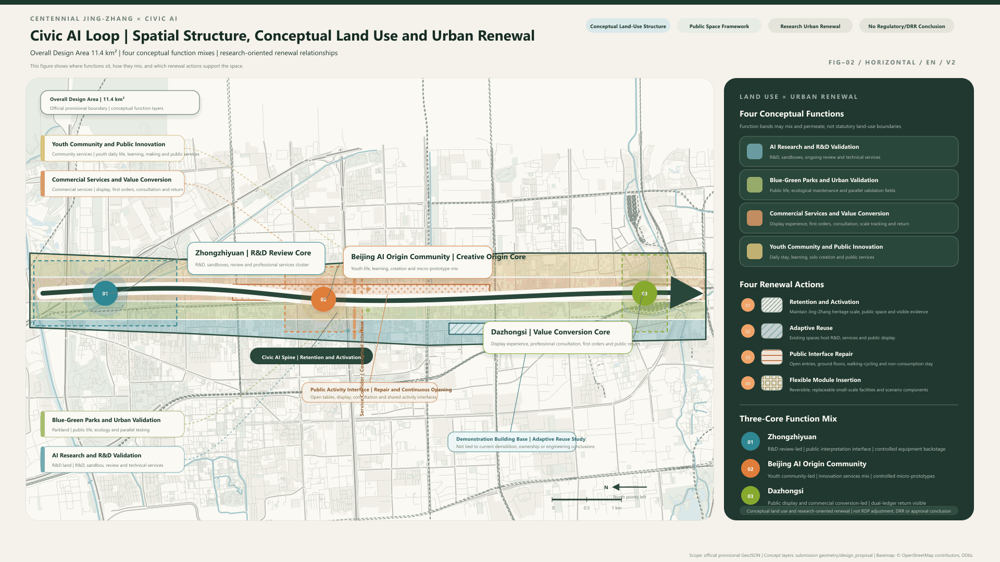

The three levels connect through one spine, three cores, two wings, two gateways, two validation fields, one conditional network and three flows. The spine combines Jing-Zhang public space and project evidence. The three cores are Beijing AI Origin Community, Zhongzhiyuan and Dazhongsi. The wings are Zhongguancun Technology Services Wing and Xiaoyue River Scenario Enablement Wing. The two equal gateways are AI Origin Community and Dazhongsi. Xiaoyue River and the Jing-Zhang Railway Heritage Park are parallel primary validation fields. The conditional network is a wider Haidian validation network activated only when needed. The three flows separately carry people, projects and evidence, and the return of funds, knowledge and capability [depth:overall_spatial_structure] [data:geometry/land_use.geojson#LU-001].

## Coordinated Research Area: Industry and Future City Research

The brand hierarchy is singular and extensible. The official umbrella is the Centennial Jing-Zhang AI Innovation Belt; this proposal is Jing-Zhang Civic AI Loop; its spatial grammar is one spine, three cores, two wings, two gateways, two fields, one network and three flows; Co-Intelligence Origin, Validation Lighthouse and Return Common are operating sub-brands for the three landmarks. The logo direction combines the Jing-Zhang rail line, project-status nodes and a return arrow, without using corporate marks, portraits or unlicensed fonts [source:MASTER-PLAN] [standard:PROJECT-AGENT-OPEN-CALL-TASKBOOK].

One operating loop responds to the three official positioning statements and five functions:

| Official proposition | Spatial and operating response |
| --- | --- |
| Centennial Jing-Zhang cultural belt | Continue railway history through the heritage park, co-created interpretation and verifiable content archives |
| Urban AI life-experience belt | Provide low-threshold daily experience through two gateways, third places, walking and cycling, and public-service scenarios |
| AI convergence innovation belt | Link R&D, validation, conversion and return through AI Origin Community, Zhongzhiyuan, two fields and Dazhongsi |
| Full-Stack Independent AI Innovation System | Provide staged R&D, compute, data, safety, ethics and continuing review at Zhongzhiyuan |
| World-Class AI Innovation Ecosystem | Treat land, space, industry, funding, talent, compute, data and scenarios as service contracts |
| New Paradigm of AI-Enabled Scenarios | Place twelve scenarios and three primary industry tests in real tasks with stop conditions |
| Intelligent and Vibrant AI City | Keep ordinary public access primary while accommodating reversible bounded tests in the two fields |
| Global Voice in AI Governance | Make project passports, human review, failure records, dual accounts and public correction auditable |

The global study uses eight primary cases and Hetao as a supplementary reference. It transfers mechanisms rather than visual forms [source:CASE-RESEARCH]:

| Case | Transferable mechanism | Jing-Zhang translation | Not copied directly |
| --- | --- | --- | --- |
| Dubai AI Campus / DIFC [source:CASE-DUBAI] | Regulation, capital, clients and events form a business gateway | Client, first-order, professional-service and public-return interfaces at Dazhongsi | Specific licenses, funds and financial system |
| Seoul AI Hub / Yangjae [source:CASE-SEOUL] | Talent, R&D, Physical AI and city testbeds work together | R&D review at Zhongzhiyuan and bounded validation in two fields | Construction schedule and public-investment scale |
| Punggol Digital District [source:CASE-PUNGGOL] | Digital platform, university-industry integration and Living Lab | Link project passport, operating data and spatial status | Unified development authority and new-town conditions |
| West Bund AI Valley [source:CASE-WESTBUND] | AI, culture, waterfront public space and city branding overlap | Translate heritage culture and make public exhibition at Dazhongsi | Headquarters policy and company-count claims |
| STATION F [source:CASE-STATIONF] | Start-up growth chain, community, mentors and capital | Voluntary team formation, prototype clinics and conversion days | Closed membership and a single mega-building |
| Masdar City [source:CASE-MASDAR] | Sustainable umbrella brand and urban technology testing | Low-carbon validation and long-term operating brand for the two fields | New-town land and energy-capital conditions |
| Cyber Valley [source:CASE-CYBERVALLEY] | Research transfer, incubation and public engagement | Technology transfer and public discussion of failure and ethics | German funding and institutional structure |
| Vector Institute [source:CASE-VECTOR] | A knowledge institution connects talent, enterprise adoption and commercialization | Trusted intermediary and adoption support in the services wing | Canadian education, funding and enterprise network |
| Hetao Shenzhen–Hong Kong Zone, supplemental [source:CASE-HETAO] | Cross-region R&D, pilot transfer and professional-service coordination | Methods for rule interfaces and research transfer in the services wing | Special cross-border institutions and confirmed policy |

The eight factors are responsibilities on one project passport rather than a resource checklist. Land and space define access and restoration; industry and funding define real clients, costs and dual accounts; talent and compute define capability and usage; data and scenarios define minimization, authorization, human responsibility and stopping. AI Origin Community receives people and problems; Zhongzhiyuan handles R&D, compute, data and review; the two fields support real tasks; Dazhongsi handles transactions and return; the services wing supplies IP, legal, capital, talent and international support [source:ECOSYSTEM-MATRIX].

## Overall Design Area: Urban Renewal and Regulatory-Plan-Level Urban Design

The overall design does not create an enclosed AI park. The provisional design model coordinates four mixed functional families: R&D and validation, blue-green urban testing, commercial services and value conversion, and youth community and public innovation. Land-use polygons are conceptual design partitions rather than statutory classifications; adjacent polygons share coordinates and cover the submitted boundary [standard:MOHURD-CONTROL-DETAILED-PLANNING] [data:geometry/land_use.geojson#LU-001] [depth:land_use_layout].

Four research-oriented renewal actions are used: retain and activate spaces with public or historic value; adaptively reuse existing buildings where conditions allow; repair the public interface between streets, parks and ground floors; and insert reversible modules only after a real need is validated. Every action starts with building-level review of existing conditions, ownership, fire safety, heritage, structure and operations. No parcel-level demolition, statutory intensity or engineering-feasibility conclusion is made [data:geometry/buildings.geojson#BLDG-001] [depth:retain_renovate_demolish].

Ordinary urban rights come before testing. Fixed wayfinding, human services, continuous walking and accessible routes remain available; AI navigation, robots, events and temporary equipment are enhancement layers. Project flows, public flows, equipment logistics and emergency routes are separated by space or time. Road sections, rail access, municipal capacity and fire conditions require professional development.

## Detailed Design of Key Areas

The three key areas have different but reversible roles. Design is located only within provisional constraints and expresses functions, flows, access levels and operating interfaces without claiming actual ownership, approved building scale or approval status [depth:three_key_area_detailed_design].

| Key area | Positioning and spatial structure | AI scenarios and operations | Professional prerequisites and risks |
| --- | --- | --- | --- |
| Zhongzhiyuan AI Independent Innovation Acceleration Area [data:geometry/key_areas.geojson#PROV-KEY-001] | Validation Lighthouse: public observation interface, method exhibit, controlled R&D, equipment logistics and separate emergency back-of-house | Staged R&D, model and interaction sandboxes, test protocols, safety/ethics/data review and return of failure evidence | Qinghe River, flood, mobility, fire, equipment, compute and sensitive-data conditions |
| Beijing AI Origin Community [data:geometry/key_areas.geojson#PROV-KEY-002] | Co-Intelligence Origin: public table, individual creation, optional co-creation, service handoff and confidential back-of-house | City Problem Clinic, youth third place, cultural co-creation, service navigation and prototype clinic | Campus and park edges, ground-floor ownership, night opening, accessibility and privacy |
| Dazhongsi AI Industry Cluster [data:geometry/key_areas.geojson#PROV-KEY-003] | Return Common: growth exhibition, public feedback and transaction front, capability-value clinic and contract/finance back-of-house | International presentation, real trial, first order, public-AI clinic, dual accounts and return display | Station access, four-quadrant walking, utilities, trade secrets, conflicts of interest and public-space encroachment |

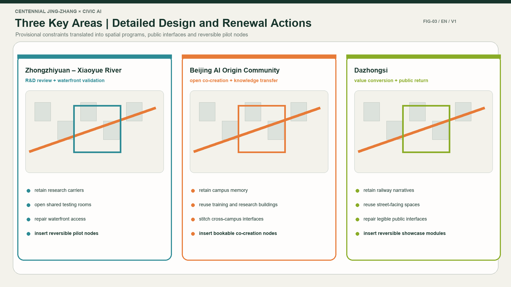

The landmarks form no hierarchy. Young people may enter from AI Origin Community or Dazhongsi; a project may return for revision after review at Zhongzhiyuan; after validation it may convert, pause, exit or return to the problem library.

## AI Innovation Ecosystem, Personas, and AI+ Scenarios

Six personas cover young residents and workers; students, commuters and visitors; developers, researchers and founders; cultural researchers and creators; enterprises and investors; and site and public-service operators. Every group retains the right to know, refuse, use a human alternative, seek correction and withdraw data when applicable [source:MASTER-PLAN] [standard:PROJECT-AGENT-OPEN-CALL-TASKBOOK].

| Persona | Real task | Spatial response | Key boundary |
| --- | --- | --- | --- |
| Young residents and workers | Commute, learn, socialize and access trusted services | Non-commercial seating, night learning and problem clinic at both gateways | Profiles are not used for commercial recommendation |
| Students, commuters and visitors | Transfer, navigate, pause and choose whether to participate | Continuous walking, fixed wayfinding and lightweight experience | Basic services work without registration |
| Developers, researchers and founders | Find problems, partners, tests and conversion paths | AI Origin Community–Zhongzhiyuan–two fields–Dazhongsi | Core IP is protected by level; validation boundaries are public |
| Cultural researchers and creators | Interpret Jing-Zhang and innovation culture accurately | Co-creation route in the heritage park with human fact review | Sources, copyright, portraits and voices are rights-cleared |
| Enterprises and investors | Test demand, clients, cost and long-term responsibility | Trial, first order, clinic and service wing at Dazhongsi | Exposure does not replace adoption; trade secrets stay protected |
| Site and public-service operators | Run safely, maintain systems and take over manually | Back-of-house, duty and stop interfaces at every node | Operators may report unmaintainable conditions and stop a test |

The twelve scenarios follow four stages, with at least three explicitly designated as industry tests. Every scenario links users, space, minimum data, human responsibility, operating role and stop conditions [source:SCENARIO-CATALOG]:

| ID / scenario | Main users and space | Data and human responsibility | Operator / stop condition |
| --- | --- | --- | --- |
| SCN-001 City Problem Clinic | Youth and residents; both gateways | Voluntary submission and human reconfirmation | Gateway operator; no entry if the problem is not real or has no owner |
| SCN-002 Youth Co-Creation Third Place | Youth; AI Origin Community/Dazhongsi | Minimum registration; individuals may work alone | Gateway operator; stop harassment, exclusion or uncleared content |
| SCN-003 Accessible Walking and Transfer Assistant | People with varied abilities; two fields and transfer points | Voluntary input, human correction and fixed-wayfinding fallback | Site/mobility role; pause when route data is unreliable |
| SCN-004 Jing-Zhang Co-Created Interpretation | Youth, public and researchers; heritage park | Public historical sources with human fact and rights review | Cultural operator; remove hallucinated history or infringement |
| SCN-005 AI Innovation Service Navigation and Human Handoff | Individuals/teams; gateways and services wing | Minimum service ticket; professionals own professional conclusions | Services wing; degrade service when human handoff fails |
| SCN-006 Low-Speed Robot Shared-Path Test | Pedestrians and operators; two fields | No identity recognition; on-site human takeover | Site/equipment owner; stop on safety or takeover failure |
| SCN-007 Event-Day Walking and Shuttle Coordination | Event public; activity nodes in two fields | Anonymous counts and human reports | Event operator; human takeover on crowding or instruction conflict |
| SCN-008 Park Ecology Maintenance Assistant | Maintenance staff and public; two fields | Low-sensitivity environment/facility data interpreted by professionals | Park operator; stop when false alerts affect safety |
| SCN-009 Youth Night Learning and Public Events | Youth; third place at AI Origin Community | No tracking of individual learning behavior | Gateway operator; adjust unresolved noise, safety or exclusion |
| SCN-010 Open Test Week | Developers, problem owners and public; full loop | Project passport, staged review and on-site duty | Joint operator; no opening with excess data collection or no exit plan |
| SCN-011 Public AI Sustainability Clinic | Public-project teams and operators; Dazhongsi | Human review of cost, responsibility and effect | Independent clinic; pause without a maintenance owner or funding path |
| SCN-012 AI-Native Business and Public Return | Enterprises, clients and public; Dazhongsi | Separate transaction, cost and return accounts with independent review | Conversion operator; stop false disclosure, return breach or uncontrolled public cost |

The three primary industry tests are: TEST-01 Youth AI Creative Prototype Public Test (SCN-002＋010), testing problem–prototype–public feedback; TEST-02 Jing-Zhang AI Cultural Co-Creation Test (SCN-004), testing factual accuracy, copyright and multilingual understanding; and TEST-03 AI-Native Product and Public-Return Test (SCN-011＋012), testing real use, first order, maintenance cost, commercial account and public account. Each uses a bounded period of 3–8 weeks or another confirmed duration. Before launch it requires a data, site, human-duty, cost, stop and restoration protocol.

## Land Use, Building Scale, and Retain-Renovate-Demolish Strategy

Current land-use and building layers express conceptual functional relationships, not statutory categories, actual property rights or building-level engineering conclusions. Four functions may overlap operationally but remain topologically closed in the structured geometry. Building-footprint area is recomputable from the design model; FAR, building height, building coverage, setbacks and control lines remain pending because official planning and existing-condition data are unavailable [standard:MNR-LAND-USE-CLASSIFICATION-GUIDE] [data:geometry/buildings.geojson#BLDG-001] [metric:building_footprint_area_sqm].

The retain-renovate-demolish method begins with survey and then classification. Spaces with continuing use or historic value are retained and activated first. Existing buildings may be studied for adaptive reuse after structural, fire, heritage and operating review. Broken public interfaces are repaired before new volume is considered. New volume is studied only when existing space cannot meet a validated need. Non-scaled functional plans and area bubbles discuss capacity and adjacency only and are neither building footprints nor planning indicators [depth:height_massing_character] [depth:development_intensity_controls].

## Transport, Rail, Municipal Infrastructure, and Public Services

The mobility framework first repairs walking, cycling and accessible connections among rail stations, existing streets, the Jing-Zhang Railway Heritage Park, Xiaoyue River and the three cores. North Fifth Ring crossings, Wudaokou, Qinghuadongluxikou, Dazhongsi Station and areas around major enterprises are professional review nodes. The current road layer expresses conceptual connections and does not replace road redlines, sections or traffic approval [data:geometry/roads.geojson#ROAD-001] [depth:traffic_rail_slow_parking].

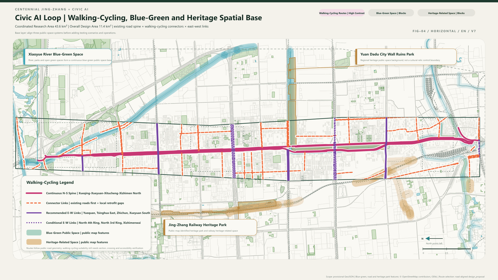

Municipal and public services use a layered strategy of conventional facilities plus new-infrastructure interfaces. Fixed wayfinding, human service, fire protection, drainage, power and routine maintenance must work independently. Edge compute, sensing devices, robot charging and distributed-energy interfaces are connected only after capacity, permits, cybersecurity, low-carbon performance and operating responsibility are confirmed. Pipelines, flood control, fire, energy and compute loads remain professional prerequisites [data:geometry/constraints.geojson#CONSTRAINTS] [depth:municipal_new_infrastructure].

## Blue-Green Network, Public Space, and Urban Character

Xiaoyue River and the Jing-Zhang Railway Heritage Park are equal, task-matched primary validation fields. Ordinary movement, recreation, cultural experience and accessible use always come first. Every pilot discloses its boundary, duration, data, equipment, human handoff, non-AI alternative and stop condition. Heritage and public green space cannot become enclosed product showrooms [data:geometry/green_space.geojson#GREEN-001] [data:geometry/public_space.geojson#PUBLIC-001] [depth:blue_green_public_space].

Urban character organizes railway history, Zhongguancun innovation culture and emerging AI culture through a sequence of historical trace, open collaboration, responsible validation and public return. The visual language uses warm white, graphite, desaturated green and restrained copper accents. Rail scale, node numbers and time marks provide identity without superficial historicism or high-brightness technology spectacle.

The three AI pilgrimage landmarks are operating public spaces rather than three exaggerated buildings [source:LANDMARK-SYSTEM]:

| Landmark | Public task | Minimum spatial prototype | Honor content |
| --- | --- | --- | --- |
| Co-Intelligence Origin / AI Origin Community | Receive problems and early ideas equally | Open table, individual/co-creation places, service handoff and confidential back-of-house | Problem contributions, first prototypes, collaboration and fact correction |
| Validation Lighthouse / Zhongzhiyuan | Make rules, evidence, responsibility and stopping understandable | Status interface, method exhibit, controlled R&D and emergency back-of-house | Test protocols, human takeover, responsible stopping and credible failure |
| Return Common / Dazhongsi | Make growth, transaction, public cost and return visible together | Growth exhibition, feedback/transaction front, clinic table and finance back-of-house | Real adoption, long-term maintenance, public return and reuse of open assets |

## Renewal Projects, Implementation Policy, and Phasing

Six project families bind space, operations and conditions. Every item is a conceptual recommendation with triggers [data:geometry/phasing.geojson#PHASE-001] [depth:renewal_project_list]:

| Project | Near-term pilot | Medium/long-term development | Responsibility and trigger |
| --- | --- | --- | --- |
| JZ-01 Jing-Zhang walking-gap repair | Wayfinding, temporary transitions and accessibility audit | Professional design of crossings, interfaces and continuity | Mobility/site owner; road redline and safety review |
| JZ-02 Zhongzhiyuan–Qinghe innovation interface | Validation-status interface and low-disturbance events | Blue-green, R&D, equipment and public-interface renewal | Park/river roles; flood, ecology and fire conditions |
| JZ-03 AI Origin university-adjacent co-creation street | Open table, third place and service handoff | Adaptive reuse and continuous ground floor | Gateway operator; ownership, campus edge and night management |
| JZ-04 Dazhongsi Return Common | Growth exhibition, clinic table and conversion day | Station integration, four-quadrant walking and commercial/public interface | Station/commercial/public roles; mobility, utilities and confidentiality |
| JZ-05 Two-field public validation components | Booking, bounded test, human duty and restoration pack | Proven long-term service interfaces | Site operator; permits, insurance, data and stop protocol |
| JZ-06 Global events and developer community | Weekly table, monthly clinic and quarterly test week | Annual flagship and conversion of international partnerships | Joint operator; budget, safety, rights and real collaboration result |

Operations follow daily, weekly, monthly, quarterly and annual layers. Daily access supports individuals and project lookup. The AI Origin Open Table runs weekly. Prototype clinics, cultural co-creation and public-AI clinics run monthly. Open Test Week and Dazhongsi Conversion Day run quarterly. The annual cycle publishes problems, outcomes, failures, contributions and public-return summaries. International communication is evaluated by actual talent, projects, clients or research partnerships rather than exposure alone [depth:phasing_implementation].

## Metrics, Area Recalculation, and Compliance Matrix

The three core visual metrics are recomputed from provisional design geometry: model area is 11,412,825.386 m², green ratio is 12.3423%, and public-space ratio is 7.3281%. They are low-confidence design-model values, not official area or statutory indicators. Their design purpose is to test whether the current partition preserves visible space for daily interaction, blue-green continuity and public validation. All must be recalculated when official geometry replaces the provisional model [metric:site_area_sqm] [metric:green_ratio] [metric:public_space_ratio].

The model building-footprint area is 310,807.184 m² and supports conceptual massing review only; FAR and height remain pending official data. Three key areas are required by the taskbook, while their exact boundaries remain provisional constraints [metric:building_footprint_area_sqm] [metric:key_area_count] [depth:metrics_recalculation].

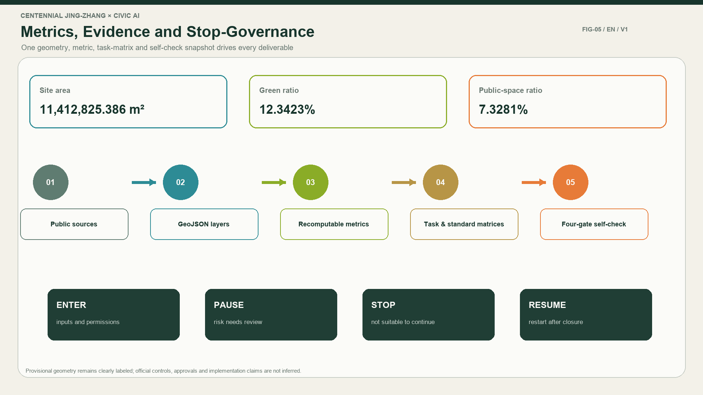

The compliance matrix separately maps agent.1 to brand and overall structure; agent.2 to nine cases and eight factors; agent.3 to six personas, twelve scenarios and three tests; agent.4 to two fields, three landmarks and the component library; agent.5 to the Jing-Zhang–Zhongguancun–AI cultural narrative; and agent.6 to five operating layers and public return. Structured files retain complete indexes, while prose keeps only claim-adjacent evidence markers.

## Risk, Copyright, and Compliance

The principal data gaps are official boundaries, planning controls, road redlines, ownership, existing buildings, municipal systems, fire, heritage, mobility and operating costs. Every dependent conclusion is downgraded to a conceptual recommendation and linked to assumptions and recalculation triggers. High-impact, privacy-sensitive, safety-related and financially consequential actions require final human and professional judgment [source:SITE-PACKAGE] [data:geometry/constraints.geojson#CONSTRAINTS] [depth:risk_missing_data].

The project uses only lawfully public or rights-cleared material and excludes classified content, personal data and assets with unclear permissions. Generated figures and renderings are marked conceptual/synthetic and do not evidence existing conditions, public consent or approval. People, fonts, logos, paper images, maps and external case assets require rights clearance. The case study cites public facts and mechanisms without copying external images or trademarks.

Chinese and English proposals, figures, A3/A0 drawings and websites must keep sections, claims, metrics, evidence and figure positions equivalent. After this text revision, boards and websites still require regeneration from the new narrative. The package must not claim readiness until derived files, the manifest and self-check have all been refreshed.

## References

1. Haidian Branch of the Beijing Municipal Commission of Planning and Natural Resources, Centennial Jing-Zhang AI Innovation Belt International Urban Design Open-Call Announcement, 2026 [source:OFFICIAL-ANNOUNCEMENT].
2. Centennial Jing-Zhang AI Innovation Belt Open Call, Agent-Facing Urban Design Taskbook Extract, 2026 [source:AGENT-TASKBOOK].
3. open-city-ai/haidian, site package, provisional boundaries, professional standards and public source registry, continuously updated [source:SITE-PACKAGE].
4. Participant research, Nine Global AI Innovation Ecosystem Cases, 2026-08-25 [source:CASE-RESEARCH].
5. Participant research, Eight-Factor AI Innovation Ecosystem and Case Evidence Matrix, 2026-08 [source:ECOSYSTEM-MATRIX].
6. Participant strategy, Centennial Jing-Zhang AI Innovation Belt: Strategy and Scenario Operations, 2026-08 [source:MASTER-PLAN].
7. Participant strategy, Twelve-Scenario Catalogue and Industry-Test Candidates, 2026-08 [source:SCENARIO-CATALOG].
8. Participant strategy, Three AI Pilgrimage Landmarks and Distributed Honor System, 2026-08 [source:LANDMARK-SYSTEM].
9. Ministry of Housing and Urban-Rural Development, local reference snapshots of Measures for Urban Design Management and Regulatory Detailed Planning, [standard:MOHURD-URBAN-DESIGN-MEASURES].
10. Ministry of Natural Resources, local reference snapshot of the Land and Sea Use Classification Guide for Territorial Spatial Survey, Planning and Use Control, [standard:MNR-LAND-USE-CLASSIFICATION-GUIDE].

## Supplemental Spatial Prototypes and Operating Drawings

The following Chinese-English figure pairs are conceptual, non-scaled or pending professional development. They do not establish statutory planning, actual building area, retain-renovate-demolish decisions, engineering location or approval.

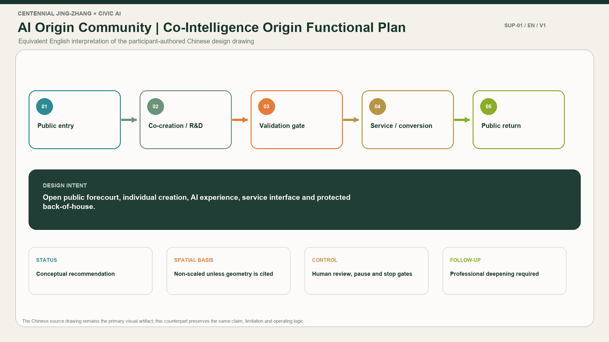
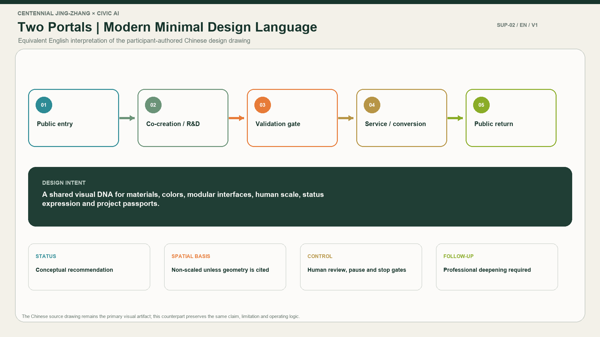
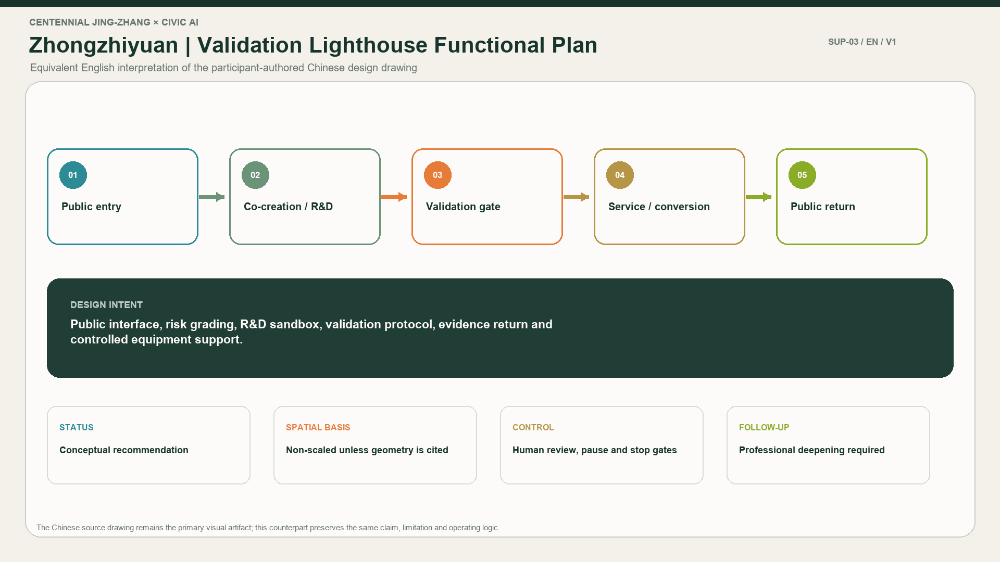
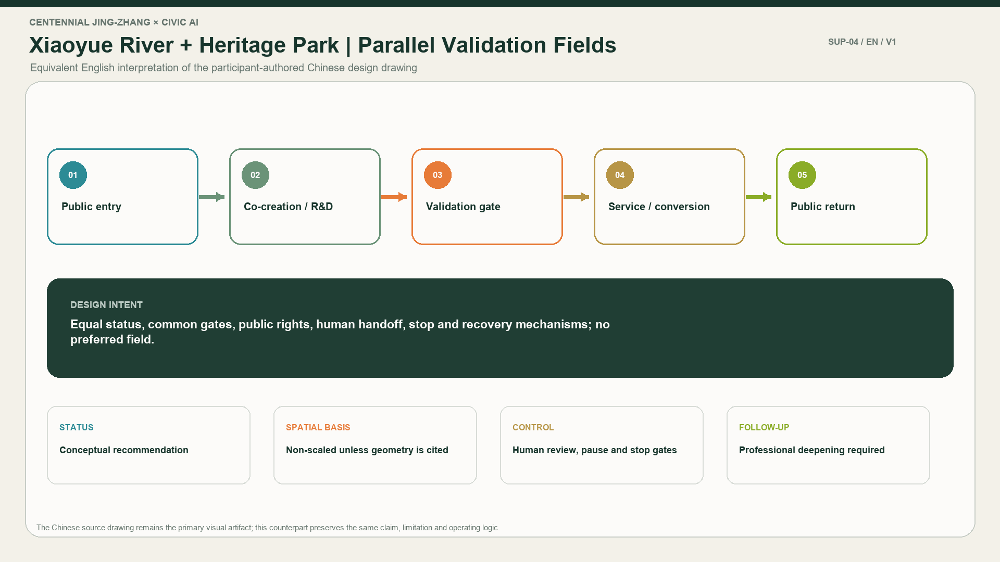
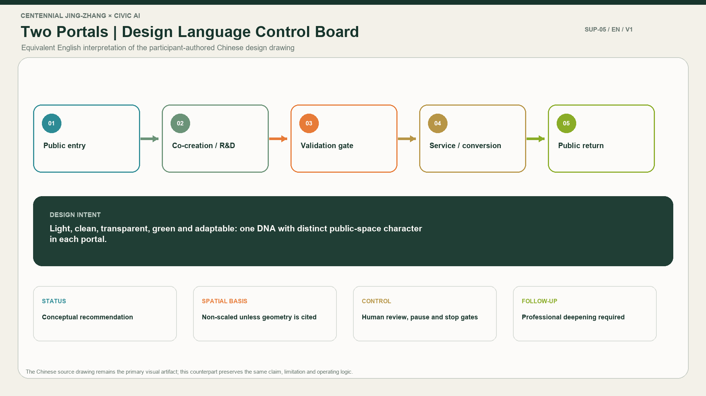

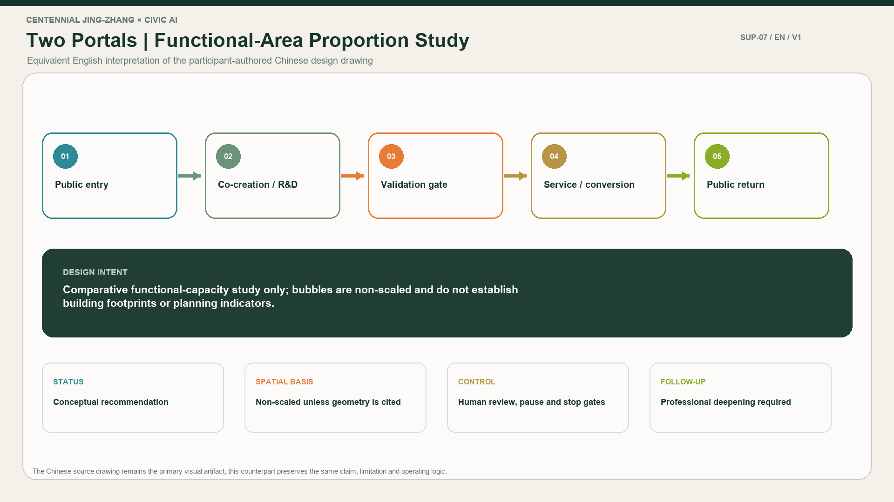
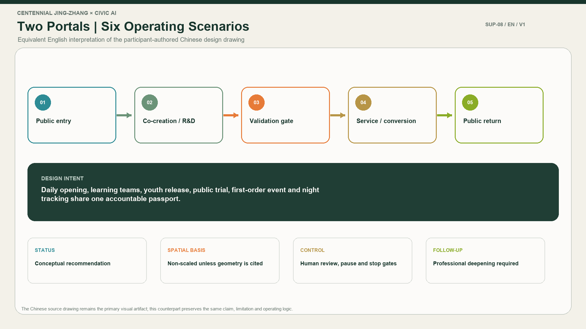
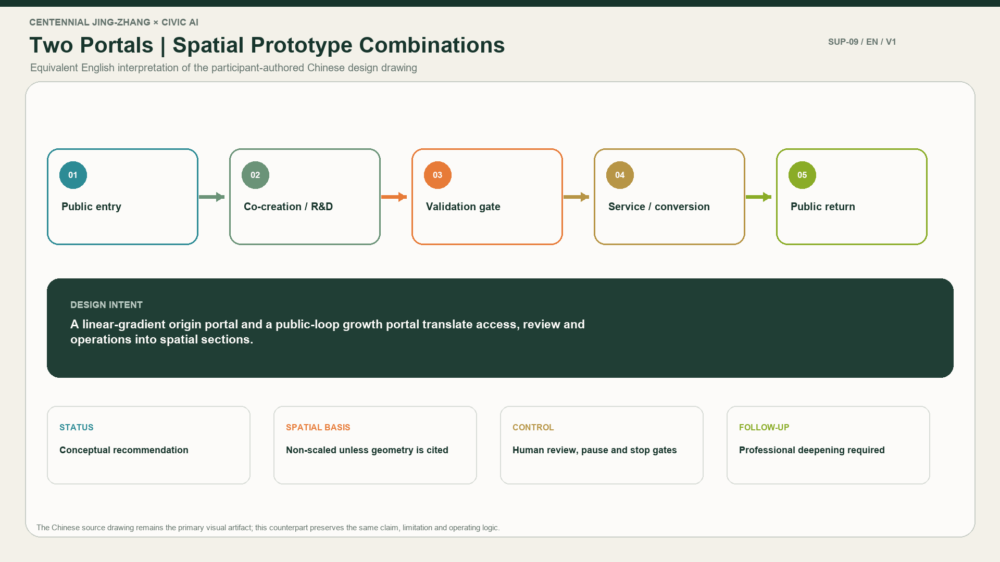
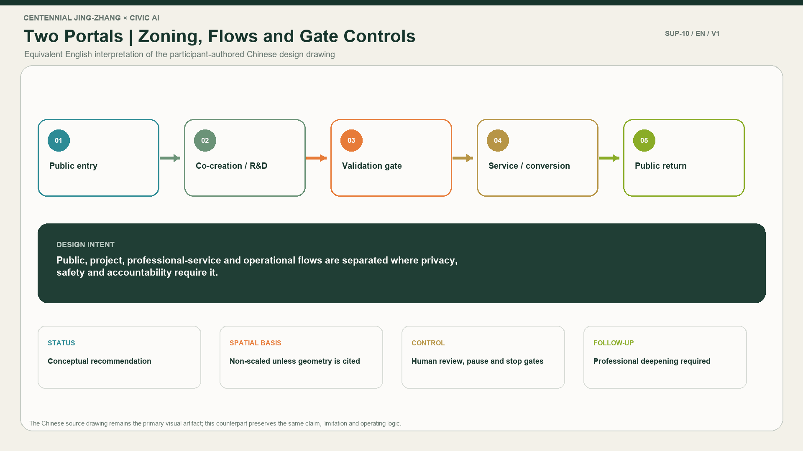
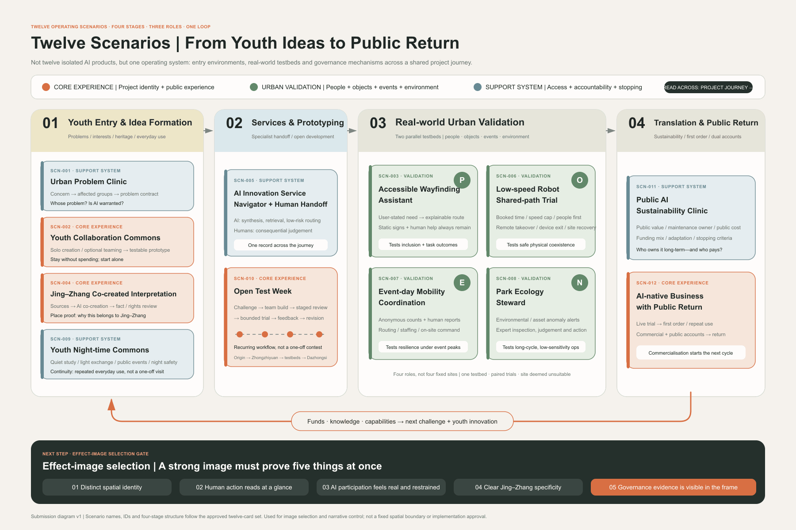
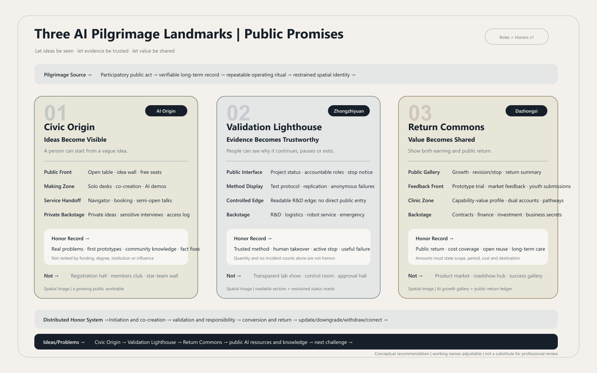
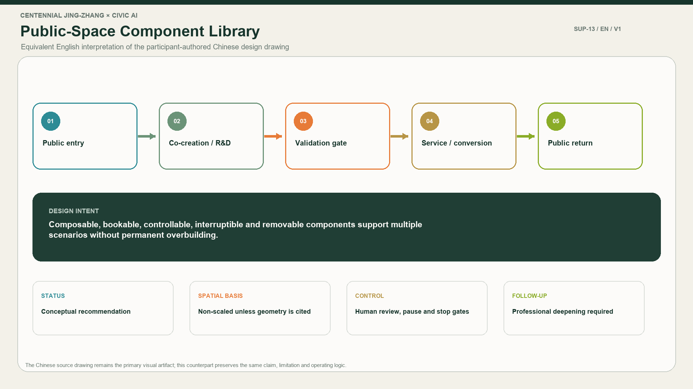
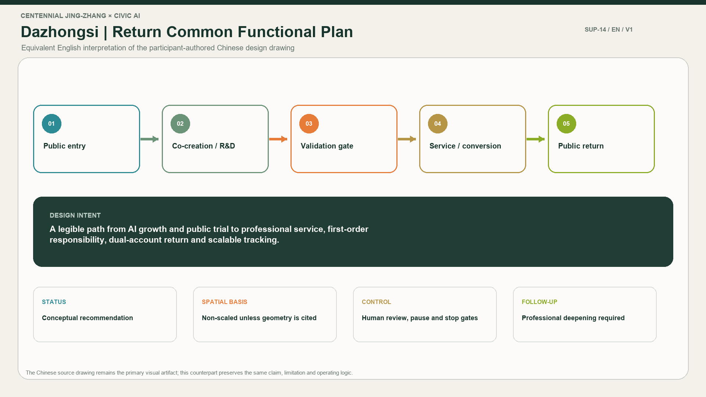
