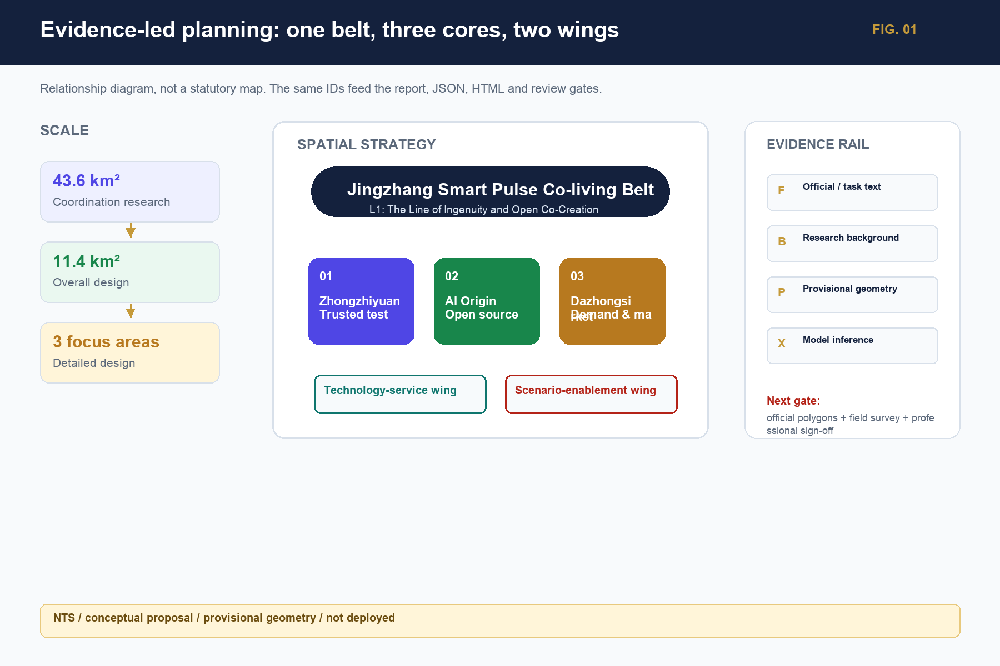
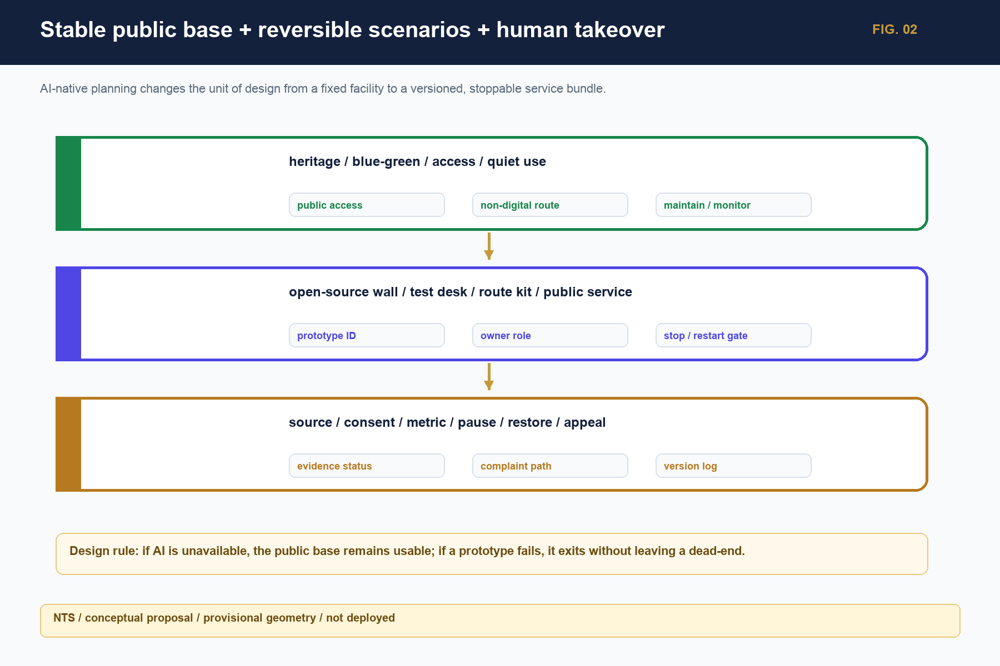
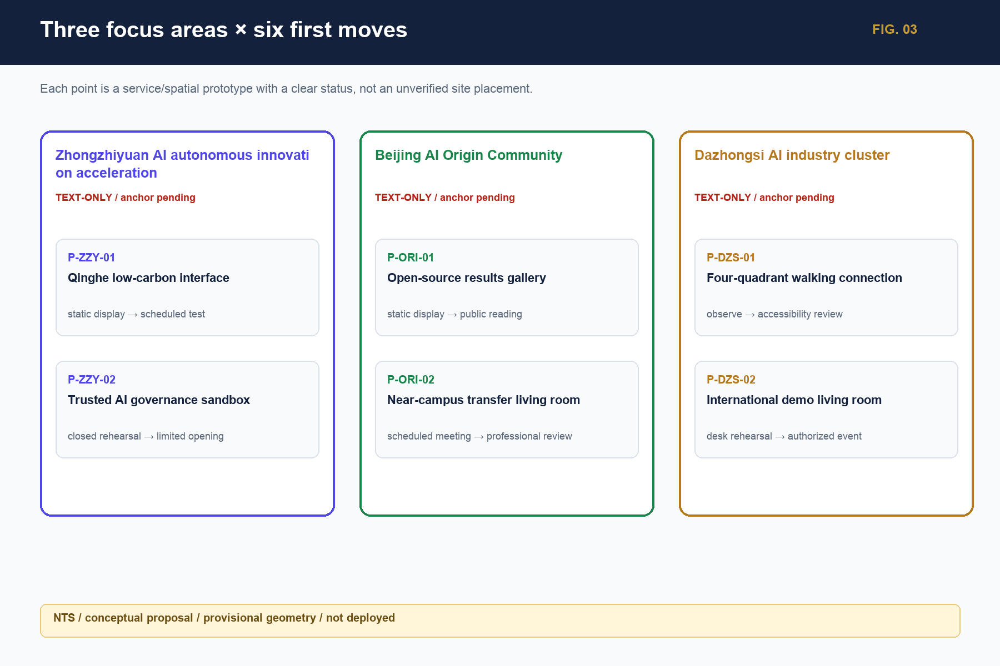
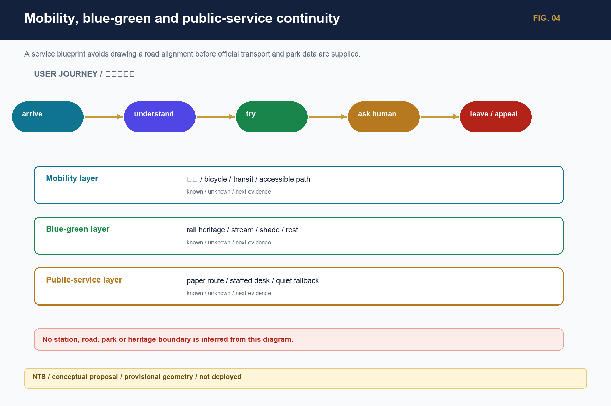
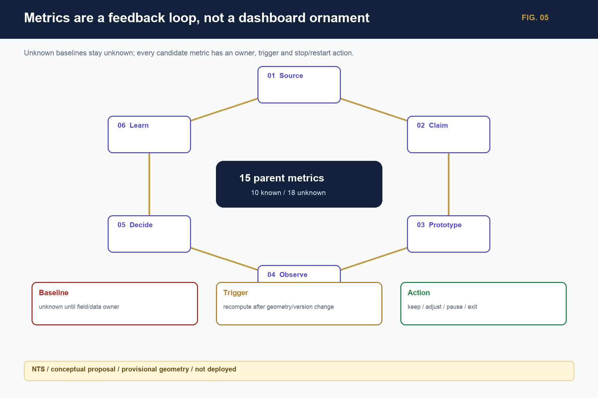

## Project reflection: from making a plan to building a city system that can learn

The Jingzhang Railway Innovation Belt is not an existing urban design with a few AI devices added. It is a planning-paradigm test for an area where railway heritage, the Zhongguancun innovation network, urban renewal, and fast-changing agents meet. The proposal must therefore state where evidence comes from, which conclusions are valid, who can change them, where a reversible trial can start, when a person must take over, and how a failure is stopped, cleared, reviewed, and learned from.

The three unified recognitions in Project Research Outline V2.0 become five planning moves: establish seven evidence layers, data graphs, and confidence states; use multiple agents to identify issues, needs, goals, counter-evidence, and responses; translate new forms of work, living, learning, contact, and governance into a stable public base plus reversible scenarios; operate a daily/weekly/quarterly/annual activity rhythm and a six-step conversion chain; and derive one source of truth into a professional report, public interface, bilingual figures, and machine-readable files. Evidence status and limits stay next to each claim. [source:OFFICIAL-ANNOUNCEMENT] [source:AGENT-TASKBOOK] [depth:existing_conditions_diagnosis]

The central proposition is: **how can a historically public, innovation-dense, spatially complex belt become a city laboratory where real problems are heard, evidence is checked, prototypes are tested safely, people can refuse or appeal, and failure can exit into shared knowledge?** “Jingzhang Smart Pulse Co-living Belt” is therefore a spatial–scenario–operations learning system, not a final atmosphere image.

The proposal distinguishes `verified` facts, `background` cases, `design_proposal` recommendations, `provisional` spatial relations, and `unknown` values. Visual precision never upgrades evidence status.

# A New AI-Native Planning Paradigm for the Jingzhang Railway Innovation Belt

## Design basis and source list

The design basis combines the official call, the open agent taskbook, the site package, and the public/cleared source registry. The call sets the three working scales and required depth; the taskbook sets six agent tasks, five functions, and the Three Areas–Two Wings collaboration boundary; the registry, gap checklist, and GeoJSON connect each claim to a file, date, spatial scale, rights condition, and recalculation trigger. [source:SOURCE-REGISTRY] [source:PROCESSED-FACT-PACK] [source:PROJECT-SCOPE-SUMMARY]

Task fields and six deliverables are cross-checked through [source:AGENT-TASK-REQUIREMENTS].

The public package does not include official polygons for the study area, overall design area, or three key areas. The package therefore keeps the maintainer-issued provisional geometry. Boundaries, adjacency, routes, and derived areas are discussion-grade and consistency-check inputs only; once official boundary, regulatory, ownership, road, municipal, heritage, fire, and engineering evidence arrives, all nine spatial layers and derived metrics must be recalculated together. [source:SITE-PACKAGE] [data:geometry/site_boundary.geojson#SITE-001] [data:geometry/key_areas.geojson#PROV-KEY-001]

Data collection does not fill unknown fields with invented numbers. Every field keeps a source, state, owner, use, prohibited inference, and evidence-recovery action. Unknown is not zero; provisional is not official; a proposal is not an approval or an operating service.

## Three-level scope framework

The proposal works through three levels: the approximately 43.6 km² coordinating research area addresses Haidian AI ecosystem, cultural narrative, and future-city form; the approximately 11.4 km² overall design area addresses renewal, industry, mobility, municipal support, and character around the Jingzhang heritage park; the three key areas, approximately 368.4 ha in total, address uses, building renewal, public space, walking continuity, and implementation conditions. [standard:PROJECT-OFFICIAL-ANNOUNCEMENT] [depth:three_level_scope_framework] [depth:overall_spatial_structure]

The overall concept is “Jingzhang Smart Pulse Co-living Belt”: the Jingzhang heritage park is the historical and public-space spine; Zhongzhiyuan, the AI Origin Community, and Dazhongsi are differentiated innovation anchors; the Zhongguancun Technology-Service Wing and Xiaoyuehe Scenario-Enablement Wing provide professional services, public scenarios, and knowledge return. “One Belt–Three Cores” is a planning relationship, not a statutory redline or engineering alignment.

| Level | Core question | Planning response | Reader-facing evidence |
|---|---|---|---|
| Coordinating research | How do research, open source, capital, markets, and public life connect? | Issue–research–open-source–test–application–knowledge loop | Case mechanisms, ecosystem graph, cultural narrative |
| Overall design | How do renewal, industry, public space, mobility, and municipal systems support one another? | One Belt–Three Cores, Two Wings, and a blue-green walking loop | Land-use, building, road, blue-green, and phasing figures |
| Detailed key areas | How do areas become tangible, testable, and reversible? | Two accountable work points per area, tied to users, operators, metrics, and human gates | Six prototype cards, 13 scenario cards, project ledger |

The overall spatial reading is derived from land-use, building, road, blue-green, public-space, and phasing layers. Boundary and metric states are shown consistently in figures, tables, and HTML. [data:geometry/land_use.geojson#LU-001] [data:geometry/buildings.geojson#BLDG-001]

Roads, blue-green, and phasing are cross-checked through [data:geometry/roads.geojson#ROAD-001] and [depth:land_use_layout].

## Coordinated research area: industry and future-city research

### Innovation ecosystem: seven global mechanisms translated into an eight-step chain

Global cases are mechanisms, not Haidian statistics. one-north/AI Singapore demonstrates neighboring carriers, time-bounded PoC, and governance testing; Mila and the Vector Institute connect research, talent, engineering, and venture conversion; Seoul AI Hub/Yangjae combines city support, compute, and business validation; Hub71+ AI releases resources by stage; STATION F/F/ai combines a semi-open front stage, controlled work, and public life; MassRobotics combines shared experiments, prototyping, and safe human takeover. Together they support a local conclusion: the belt needs a transferable middle layer, not a copied campus name. [source:SOURCE-USE-MATRIX] [standard:PROJECT-AGENT-OPEN-CALL-TASKBOOK]

The local chain has eight nodes: a real issue card; research and open source; accountable compute/data; trusted testing; professional and ethics review; incubation and capital services; market/public application; and failure/knowledge settlement. Zhongzhiyuan is the trusted-test and full-stack anchor, the AI Origin Community is the open-source and research-to-market anchor, and Dazhongsi is the demand, product, content, and international-contact anchor. Institutions, funds, compute, and operators remain to be authorized; place names do not create commitments.

### Concept and identity system

The project title remains “A New AI-Native Planning Paradigm for the Jingzhang Railway Innovation Belt”; the spatial strategy name is fixed as “Jingzhang Smart Pulse Co-living Belt.” “The Line of Ingenuity and Open Co-Creation” is only the L1 public narrative and wayfinding motif, not a parallel spatial name. A six-level naming tree runs from L0 project title through L1 narrative motif, L2 areas/wings, L3 scenarios, L4 activities, and L5 points. A logo candidate uses a neutral grammar of railway connection, open-source nodes, public entry, and a version opening; no unlicensed railway, institution, person, trademark, or historic image is used. [standard:MOHURD-URBAN-DESIGN-MEASURES] [depth:overall_spatial_structure]

### Non-causal cultural narrative

Railway culture contributes the memory of self-built infrastructure and public connection; Zhongguancun culture contributes research, entrepreneurship, open source, and collaboration; AI culture contributes models, agents, contribution, correction, and responsibility. Five route types connect them: railway and urban memory, open-source contribution, future living, public governance, and international exchange. Each story unit keeps fact source, date, spatial scale, rights, bilingual text, version, and correction entry; no unverified causal history is created.

### Personas and future-city change

Eight groups share public entry but differ in controlled work, data permissions, and professional service: researchers, developers, start-up teams, enterprise visitors, nearby residents, students/teachers, service providers, and operators. AI-era spatial demand is not “more screens”; it is short-cycle collaboration, bookable testing, human explanation, non-digital access, data clearing, quiet use, and reversible equipment.

## Overall design area: urban renewal and regulatory-plan-level urban design

The overall design layer creates One Belt–Three Cores, multiple scenarios, and a blue-green walking loop. Land use differentiates innovation research, enterprise services, public services, everyday life, blue-green open space, and pending renewal objects, using checkable land-use classes under [standard:MNR-LAND-USE-CLASSIFICATION-GUIDE]. Buildings use retain, renovate, renew, candidate new, and pending-confirmation states. Roads express directional relationships and pending walking gaps, never an inferred road redline.

FAR, height, density, setbacks, demolition, investment, and municipal capacity are not invented. Submitted geometry can reproduce working areas and layer relationships, but control conditions, ownership, and professional boundaries remain `unknown`; planning, architecture, mobility, municipal, landscape, heritage, fire, and accessibility professionals review them after official data arrives. [standard:MOHURD-CONTROL-DETAILED-PLANNING] [depth:development_intensity_controls]

Architectural depth is checked through [standard:MOHURD-ARCH-DESIGN-DEPTH-2016], [depth:height_massing_character], and [depth:retain_renovate_demolish].

The renewal rule is “public first, carrier second; reversible first, construction second; trial first, expansion second.” Public access, walking continuity, first-floor services, open-source interpretation, and human entry are prioritized. Permanent landmarks and large works require fact, space, rights, professional, operating, and release gates.

## Detailed design of key areas

The three areas have differentiated roles: Zhongzhiyuan is the trusted-test and full-stack autonomous-innovation anchor; the AI Origin Community is the near-campus open-source and research-to-market anchor; Dazhongsi is the demand, product, content, and international-contact anchor. Each area uses state 0–4: desktop study, static display, booked trial, limited opening, and replicable operation. State advances by evidence maturity, not image polish. [data:geometry/key_areas.geojson#PROV-KEY-002] [data:geometry/key_areas.geojson#PROV-KEY-003] [depth:three_key_area_detailed_design]

| Area | Point | Tangible action | Key metric / exit |
|---|---|---|---|
| Zhongzhiyuan | `P-ZZY-01` Trusted AI test station | Open validation desk, authorized samples, controlled-test candidate, observer seat, physical stop | completeness, human review, clearing; missing safety or operator downgrades to tabletop |
| Zhongzhiyuan | `P-ZZY-02` Full-stack interface desk | Issue, resource, owner, pause/restart/exit ledger with equal offline entry | state publication, clearing, offline task completion; no automatic approval |
| AI Origin Community | `P-ORI-01` Open-source co-creation room | Free human front desk, weekly open-source table, paper directory, contribution/correction board | license completeness, accessibility, maintenance; unclear rights are withdrawn |
| AI Origin Community | `P-ORI-02` Research-to-market clinic | Issue card, evidence-maturity triage, IP/legal/test referrals, human receipt | transfer time, accountable owner, return reasons; no financing or tenancy promise |
| Dazhongsi | `P-DZS-01` Intelligent-service trial lane | Voluntary single-service test, ordinary-service fallback, paper rights statement, human support, clearing | informed refusal, complaints, clearing; unclear fairness stops the trial |
| Dazhongsi | `P-DZS-02` Demand-side review room | Paper four-quadrant walking audit, accessibility walkthrough, issue dispatch and return visit | waiting/detour, continuity, closure; no engineering conclusion before anchors |

All six points are research prototypes. No building, coordinate, tenant, station entrance, area, or construction approval is asserted; every point retains human support, paper access, appeal, and clearing.

## AI innovation ecosystem, personas, and AI+ scenarios

### Substantive outputs of the six agent tasks

1. **Concept and identity agent:** the working concept, L0–L5 naming tree, neutral logo grammar, bilingual terminology, and brand-rights gate.
2. **Ecosystem agent:** seven case mechanisms, the eight-node chain, Three Areas–Two Wings roles, 19 daily/weekly/quarterly/annual activities, and resource-release gates.
3. **Scenario-space agent:** 13 scenario cards, eight user journeys, 12 public-space components, and four industry tests; each states AI action, human action, non-digital fallback, and stop rule.
4. **Public-space agent:** three landmark candidates—developer walk, open-source results gallery, and agent-contribution wall—plus story stations, contribution boards, retractable wayfinding, human interpretation, and accessible alternatives.
5. **Culture agent:** a non-causal railway–Zhongguancun–AI graph, five route types, bilingual working text, international-communication gate, and correction/withdrawal mechanism.
6. **Operations agent:** daily/weekly/quarterly/annual activity system, six-step conversion chain, six pilot contracts, 15 indicators, and four-layer pause/restart events.

### How 13 scenarios enter the belt

The 13 scenarios first remain text, service blueprints, or low-fidelity components; a concept image is not a deployed system. They are: open-source release hall; trusted test station; walking-gap diagnosis; youth AI third place; talent life services; AI safety-governance gallery; research-to-market clinic; low-carbon edge-compute station; intelligent-service trial lane; four-quadrant mobility audit; railway-memory guide; global AI activity route; and open-belt scenario test desk. Each card binds user, spatial state, data, privacy, human gate, operator type, metric, non-digital fallback, and exit rule. [depth:blue_green_public_space] [depth:traffic_rail_slow_parking] [depth:municipal_new_infrastructure]

### AI+ medical, education, and commerce in the street

AI+ medical means public-information explanation, appointment routing, and human transfer—not diagnosis, prescription, or health eligibility. AI+ education means course explanation, co-learning, and human consultation—not admission, examination, or student ranking. AI+ commerce means voluntary single-service trials and rights statements—not automated pricing, credit scoring, or final consumer-dispute decisions. Paper information, a human window, telephone/on-site appeal, and ordinary-service fallback remain available.

A city agent may retrieve sources, explain information, flag gaps, summarize anonymous feedback, and draft text for review. Planning approval, engineering/traffic/fire safety, medical, education, investment/procurement, public honors, and personal-profile ranking return `refuse_and_redirect` to a responsible person.

## Land use, building scale, and retain-renovate-demolish strategy

Land-use, building, public-space, and phasing layers jointly express the spatial structure. Buildings use retain, renovate, renew, candidate new, and pending-confirmation states. Working values reproduce submitted geometry only; FAR, height, density, setbacks, demolition, investment, and municipal capacity remain `unknown/null` with an owner and recalculation trigger. [depth:blue_green_public_space] [depth:renewal_project_list]

The first phase favors actions that do not change ownership or structure: human front desks, movable exhibits, paper guidance, controlled tests, quiet night use, accessible rest, and service ledgers. Permanent buildings, river works, road works, and final landmarks wait for official drawings, professional review, and rights clearance.

## Transport, rail, municipal infrastructure, and public services

Mobility follows “audit first, micro-renewal second, engineering third.” The first tasks are a Dazhongsi four-quadrant audit, heritage-park gap walk, campus–park connection, and accessibility walkthrough; mobility, landscape, accessibility, and municipal professionals then review shade, lighting, bicycle parking, wayfinding, crossings, and interchange. Current layers show directional relationships, not unverified station entrances, redlines, bridges, tunnels, or lift conditions. [depth:traffic_rail_slow_parking] [data:geometry/roads.geojson#ROAD-001]

Municipal and new-infrastructure proposals follow minimum resources, disconnectability, and human maintenance. Edge compute, energy, drainage, fire, and data interfaces remain capacity-unknown; ordinary light, water, rest, accessibility, and paper information cannot be weakened. Official capacity and engineering evidence trigger professional recalculation. [depth:municipal_new_infrastructure] [data:geometry/constraints.geojson#CONSTRAINTS]

## Blue-green network, public space, and urban character

The Jingzhang heritage park is the public spine. The blue-green system serves movement, rest, cultural understanding, ecological care, and low-risk innovation. Three AI landmark candidates use retractable and correctable components rather than permanent mass: a developer walk with paper routes; an open-source results gallery showing version/license/correction fields; and an agent-contribution wall showing authorized contributions without automatic awards.

Five cultural routes connect railway and urban memory, open-source contribution, future living, public governance, and international exchange. Every story unit displays source, date, spatial scale, rights, bilingual text, version, and correction entry. Historical dispute, portrait/font/trademark conflict, or a daily-use conflict triggers withdrawal and a paper/human fallback. [data:geometry/green_space.geojson#GREEN-001] [data:geometry/public_space.geojson#PUBLIC-001] [depth:blue_green_public_space]

## Renewal projects, implementation policy, and phasing

| Project | Type | Near-term action | Main dependency |
|---|---|---|---|
| JZ-01 | Heritage-park walking-gap stitching | Paper audit, accessibility walk, retractable wayfinding | park/road/heritage/accessibility review |
| JZ-02 | Zhongzhiyuan trusted-test interface | Open validation desk, issue card, exit list | carrier, data, safety, operator |
| JZ-03 | Origin Community open-source front stage | Weekly open-source table, clinic, human receipt | rights, maintainer, carrier, hours |
| JZ-04 | Dazhongsi four-quadrant audit | Time-sliced observation, issue and return visit | station, right-of-way, mobility, municipal data |
| JZ-05 | AI public-service and edge-compute node | Paper/offline service blueprint | energy, network, privacy, human takeover |
| JZ-06 | Global AI activity-week public route | Small indoor/public tabletop rehearsal | permission, capacity, safety, bilingual rights |

Phasing follows evidence maturity. Near term (0–1 year) is evidence recovery, tabletop work, human services, paper/offline prototypes, and retractable components. Medium term (1–3 years) allows a closed small trial only after site, operator, professional, safety, and rights conditions are closed. Longer-term limited public scenarios and replication remain conditional. Every phase retains pause, downgrade, clearing, notice, review, and re-entry. [depth:renewal_project_list] [depth:phasing_implementation] [data:geometry/phasing.geojson#PHASE-001]

Participant roles include planning coordination, GIS/survey, mobility/accessibility, landscape/heritage, data/safety, carrier operations, open-source maintenance, public services, and public representatives. Each phase is continued by spatial, service, public-value, innovation-performance, operational-resilience, and AI-risk metrics—not by publicity or device counts.

## Metrics, area recalculation, and compliance matrix

Metrics are separated into: working spatial values reproducible from the same GeoJSON; control values waiting for official regulatory, road, ownership, and professional evidence; and performance values requiring operating baselines. Current working values include submitted-geometry area, key-area count, building footprint, green ratio, and public-space ratio, all explicitly provisional rather than statutory controls. [metric:site_area_sqm] [metric:key_area_count] [metric:building_footprint_area_sqm]

Green and public space are checked through [metric:green_ratio] [metric:public_space_ratio] and finally recalculated under [depth:metrics_recalculation].

Six parent metric categories cover spatial experience, service access, public value, innovation performance, operational resilience, and AI risk. Fifteen parent and 39 child metrics retain `unknown/null` baselines; empty opportunity IDs, test IDs, and event arrays do not mean zero events or success. Each metric has an owner, frequency, stop threshold, recalculation trigger, and non-digital collection alternative.

The compliance matrix maps the official 13 headings, 15 chapters, six agent tasks, five mandatory standards, and 15 professional-depth contracts to report, source, assumption, layer, metric, drawing, HTML, and self-check evidence. It closes the research evidence route; it does not self-award a score or professional signature.

## Risk, copyright, and compliance

Five human gates govern the chain: Fact checks source, date, and scale; Space checks boundaries, topology, ownership, rights-of-way, and professional conditions; Rights checks copyright, trademark, type, portrait, data, and withdrawal; Identity checks bilingual terms, brand, and accessibility; Release checks bilingual files, captions, offline behavior, manifest, hashes, and human sign-off. Privacy protection, copyright, implementation risk, and human review records stay next to every high-risk scenario. A failed gate downgrades the output to a research contract, text-only, or offline prototype; it does not enter formal site release. [depth:risk_missing_data] [source:MISSING-DATA-CHECKLIST]

AI may retrieve, summarize, compare, flag gaps, draft text for review, and aggregate anonymous feedback. It may not approve planning, allocate public rights, replace engineering safety or medical/education/investment judgment, hide conflicts, or continue service while paused. All formal spatial claims and high-risk decisions retain accountable humans, refusal, appeal, stop, clearing, and recovery.

The package uses a community-display license. Figures, fonts, maps, historic materials, marks, portraits, models/tools, and generation records remain traceable in the source and copyright files. Official boundary, field survey, interviews, professional signatures, named operators, and runtime baselines remain external dependencies; they are not filled by the model. [source:SOURCE-USE-MATRIX]

## References

- `brief/public-brief.md`, `brief/site-package/design_brief.json`, `brief/site-package/agent_taskbook.json`
- `data/processed/project_scope_summary.csv`, `agent_task_requirements.csv`, `source_use_matrix.csv`, `missing_data_checklist.csv`
- `brief/site-package/` for the design brief, taskbook, enums, ranges, and provisional geometry
- `data/source_registry.json`, `data/processed/project_scope_summary.csv`, `data/processed/agent_task_requirements.csv`, `data/processed/source_use_matrix.csv`, `data/processed/missing_data_checklist.csv`
- The public call and registered sources; global cases are mechanisms, not Jingzhang current-state statistics. [source:SITE-PACKAGE]
