## 项目思考：从“做一套规划”转向“构建一个可持续学习的城市系统”

京张铁路创新带不是在既有城市设计上增加几项 AI 设备，而是一次面向 AI 时代的规划范式转换。百年铁路遗产、中关村创新网络、城市更新和智能体快速迭代同时存在，方案必须同时回答：资料从哪里来，哪些判断可以成立，谁能改变结论，哪些空间可以先试，何时必须由人接管，以及失败如何停止、清理和复盘。

本方案把《项目研究总纲 V2.0》的三个统一认识转成五个规划动作：先建立七类底数、数据图谱和证据等级；再以多 Agent 并行识别问题、需求、目标、对策和反证；把 AI 时代新的工作、生活、学习、交往与治理方式转成“稳定公共底盘 + 可逆场景”；用日、周、季、年活动和六段转化链组织长期运营；最后把同一套判断派生为专业报告、公众界面、双语图件和机器可读文件。来源、空间状态和证据限制始终与判断相邻。[source:OFFICIAL-ANNOUNCEMENT] [source:AGENT-TASKBOOK] [depth:existing_conditions_diagnosis]

京张的核心命题是：**如何把一条有历史公共性、创新资源密度和复杂边界的城市带，变成真实问题可以被听见、证据可以被核对、原型可以被安全验证、公众可以拒绝和申诉、失败可以退出并沉淀为下一轮知识的城市实验场。** 因此，“京张智脉共生带”不是一张终局效果图，而是一套空间—场景—运营学习系统。

本方案严格区分 `verified`（来源直接支持的事实）、`background`（全球案例和政策背景）、`design_proposal`（规划建议）、`provisional`（暂定空间或暂定关系）和 `unknown`（尚待补证的量或条件）。任何图件精度都不得升级证据等级。

# 以构建城市规划新范式命题下的京张铁路创新带AI原生规划新思考

## 设计依据与资料清单

设计依据由官方征集公告、面向智能体任务书、场地资料包和公开/清权来源登记共同构成。公告给出三层研究任务和成果深度，任务书给出六类 Agent 任务、五大功能和三区两翼的共创边界；来源登记、缺口清单和 GeoJSON 则把每项判断落到文件、时点、空间尺度、许可和复算触发器。[source:SOURCE-REGISTRY] [source:PROCESSED-FACT-PACK] [source:PROJECT-SCOPE-SUMMARY]

任务字段和六类交付由 [source:AGENT-TASK-REQUIREMENTS] 进一步核对。

当前公开包没有法定研究范围、总体设计范围和三处重点区的官方多边形。提交包使用维护者发布的 provisional geometry，所有边界、邻接、路线和由其计算的面积均只用于研究讨论与一致性检查；正式边界、控规、权属、道路、市政、文保、消防和工程资料到位后，九层空间数据和全部派生指标必须整体复算。[source:SITE-PACKAGE] [data:geometry/site_boundary.geojson#SITE-001] [data:geometry/key_areas.geojson#PROV-KEY-001]

资料采集不追求把未知字段填成数字，而是为每个字段保留来源、状态、责任人、用途、禁止推断和补证动作。当前未知不等于零，暂定不等于官方，候选方案不等于已批准或已运行。

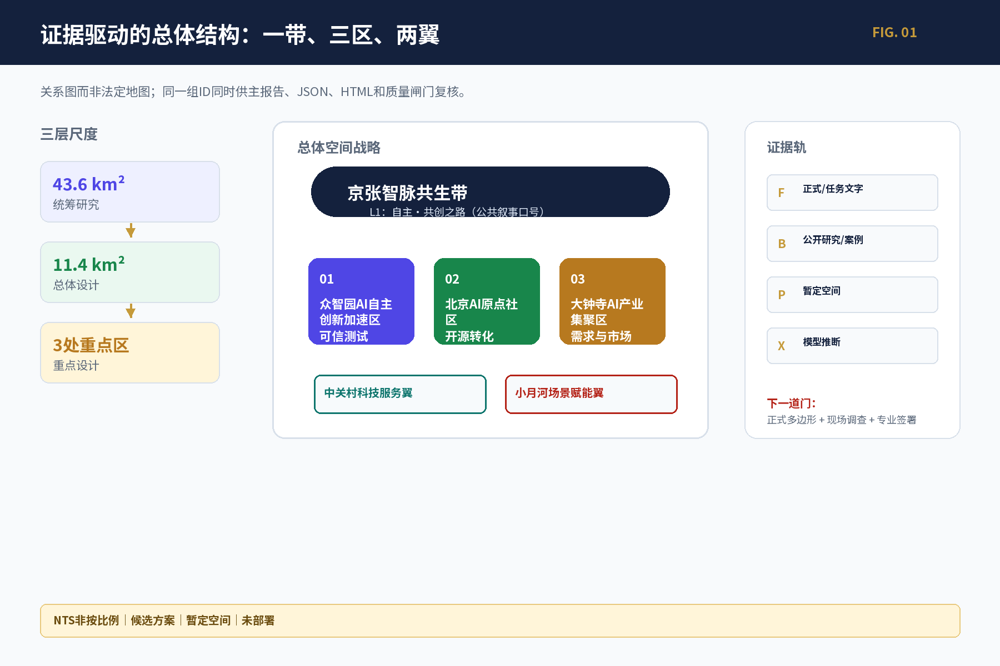

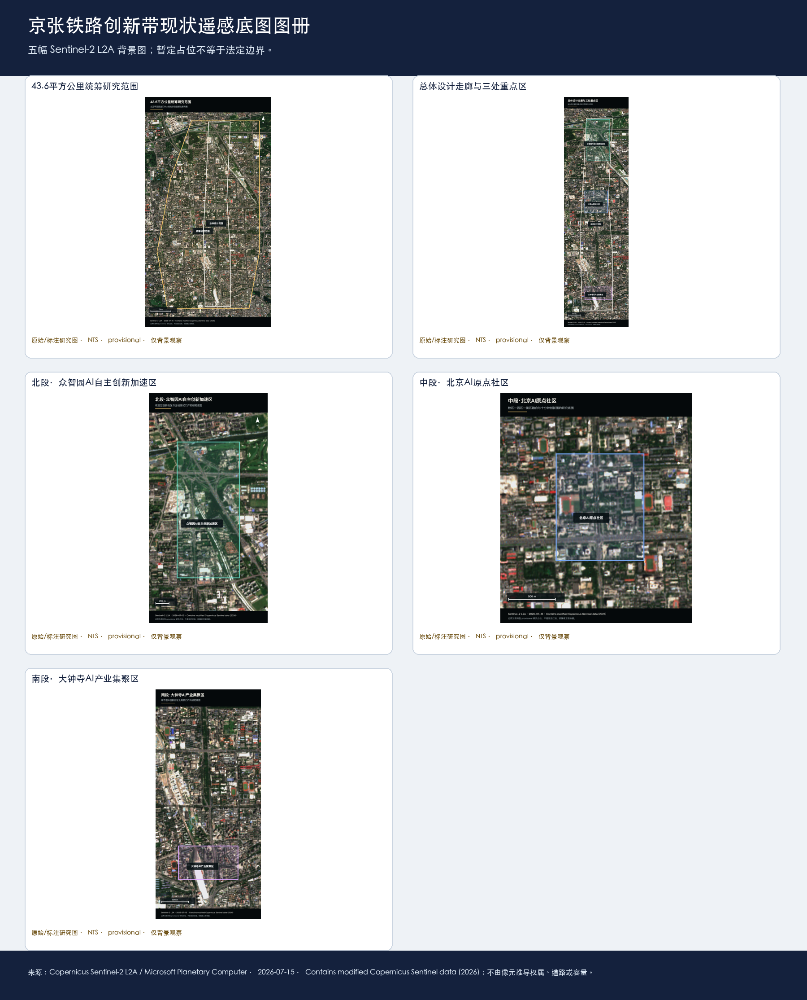

五幅 Sentinel-2 L2A 影像仅作为背景观察和问题发现依据；图册中的标注边界为资料包的 provisional research placeholder，不是法定红线、权属、道路、站口或工程容量依据。正式多边形到位后，必须重裁、叠合九层空间数据并重算全部派生指标。[source:SENTINEL-2-BASEMAP-REGISTER] [data:visual/assets/base-map-manifest.json]

## 三层范围工作框架

方案按三层推进：统筹研究范围约 43.6 平方公里，回答海淀 AI 创新生态、文化叙事和未来城市形态；总体设计范围约 11.4 平方公里，回答京张遗址公园周边城市更新、产业空间、交通市政和风貌控制；三处重点区合计约 368.4 公顷，回答功能业态、建筑更新、公共空间、慢行连通和实施条件。[standard:PROJECT-OFFICIAL-ANNOUNCEMENT] [depth:three_level_scope_framework] [depth:overall_spatial_structure]

总体概念为“京张智脉共生带”：以京张铁路遗址公园作为历史与公共空间主轴，以众智园、北京 AI 原点社区和大钟寺 AI 产业聚集区作为三类创新锚点，以中关村科技服务翼和小月河场景赋能翼承担专业服务、公共场景与知识回流。这里的“一带三核”是规划关系表达，不替代法定红线或工程线位。

| 层级 | 核心问题 | 规划回答 | 可读成果 |
|---|---|---|---|
| 统筹研究层 | 研究、开源、资本、市场和公共生活如何形成创新生态 | 建立“问题—研究—开源—测试—应用—沉淀”接力 | 全球案例机制表、创新链图谱、文化叙事 |
| 总体设计层 | 城市更新、产业空间、公共空间和交通市政如何共同支撑 | 形成一带三核、两翼协同、蓝绿慢行复合环 | 用地/建筑/道路/蓝绿/分期图件 |
| 重点设计层 | 三处片区如何转成可感知、可试用、可退出的场景 | 每区两个工作点，绑定用户、空间、运营、指标和人工门 | 六个点位卡、13场景卡、项目台账 |

总体空间判断由用地、建筑、道路、蓝绿、公共空间和分期九层数据共同表达；边界状态和指标状态在图例、表格和 HTML 中同步显示。[data:geometry/land_use.geojson#LU-001] [data:geometry/buildings.geojson#BLDG-001]

道路、蓝绿与分期由 [data:geometry/roads.geojson#ROAD-001] 和 [depth:land_use_layout] 继续核对。

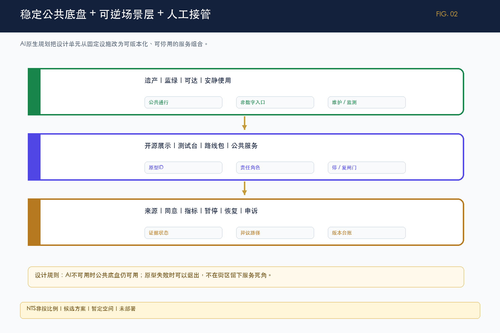

## 统筹研究范围产业与未来城市研究

### 创新生态：七个全球案例转译为八段接力

全球案例不作为海淀现状统计，而用于比较机制：新加坡 one-north/AI Singapore 提供“近邻载体—限定周期 PoC—治理测试”；加拿大 Mila、Vector Institute 提供“研究—人才—工程—创业转化”；Seoul AI Hub/Yangjae 提供“城市支持—高性能计算—业务验证”；Hub71+ AI 提供分阶段资源释放；STATION F/F/ai 提供半开放前台、受控工作与公众生活；MassRobotics 提供共享实验、原型和安全接管。七个案例共同支持一个本地判断：创新带需要的是可交接的中层机制，而不是简单复制某个园区名称。[source:SOURCE-USE-MATRIX] [standard:PROJECT-AGENT-OPEN-CALL-TASKBOOK]

案例来源入口：Singapore `D2SRC-B2-001—005`；Mila `D2SRC-B2-006—008`；Vector `D2SRC-B2-009—010`；Seoul `D2SRC-B2-011—013`；Hub71 `D2SRC-B2-014—015`；STATION F `D2SRC-B2-016—019`；MassRobotics `D2SRC-B2-020—024`。这些 ID 指向随包 `sources.json` 的逐条定位，不把案例事实外推为海淀统计。

本地生态链设置八个节点：真实问题卡、研究与开源、算力/数据责任、可信测试、专业与伦理复核、孵化与资本服务、市场/公共应用、失败与知识沉淀。众智园承担可信测试与接口台，北京 AI 原点社区承担开源和成果转化，大钟寺承担需求方和产品化验证；具体机构、资金、算力和运营主体均待授权，不从地名推导承诺。

### 概念与视觉系统

总名保持“以构建城市规划新范式命题下的京张铁路创新带AI原生规划新思考”，总体空间战略名锁定为“京张智脉共生带”；“自主·共创之路”仅作为 L1 公共叙事口号与导览母题，不与空间总名并列。命名采用 L0 项目总名、L1 叙事口号、L2 三区两翼、L3 场景、L4 活动、L5 点位的六级体系；Logo 候选采用“铁路连接线 + 开源节点 + 公共入口 + 版本开口”的中性构图语法，不使用未经授权的铁路、机构、人物、商标或历史照片。[standard:MOHURD-URBAN-DESIGN-MEASURES] [depth:overall_spatial_structure]

### 三种文化的非因果叙事

百年铁路文化提供“自主建造与公共连接”的历史记忆；中关村文化提供“研究、创业、开源和协作”的当代网络；AI 新文化提供“模型、智能体、贡献、纠错和责任”的未来语汇。三者通过五类导览组织：铁路与城市记忆线、开源贡献线、未来生活线、公共治理线、国际交流线。每个节点均保留事实来源、年代、权利、双语和纠错入口，不把三种文化写成未经证实的线性因果史。

### 人才画像与未来城市判断

八类用户包括研究者、开发者、创业团队、企业访客、附近居民、学生教师、服务提供者和运营者。不同用户共享公共入口，但在受控工作、数据权限和专业服务上分级。AI 时代新增空间需求不是“更多屏幕”，而是短周期协作、可预约测试、人工解释、非数字替代、数据清理、安静使用和可逆设备。

## 总体设计范围城市更新与控规深度城市设计

总体设计层形成“一带三核、多点场景、蓝绿慢行复合环”的空间框架。用地层区分创新研发、产业服务、公共服务、生活配套、蓝绿开放空间和待核更新对象，并按 [standard:MNR-LAND-USE-CLASSIFICATION-GUIDE] 采用可校验的用地分类；建筑层采用保留、改造、更新、新建候选和待确认五类状态；道路层只表达方向性联系和待核慢行断点，不把暂定线条写成道路红线。

建筑与强度不编造 FAR、建筑高度、拆改量、投资额或市政容量。已提交几何可以复算工作面积和图层关系，但控规指标、权属和专业边界仍为 `unknown`；取得正式控制资料后，规划、建筑、交通、市政、园林、文保、消防和无障碍专业共同复核。[standard:MOHURD-CONTROL-DETAILED-PLANNING] [depth:development_intensity_controls]

建筑专业深度由 [standard:MOHURD-ARCH-DESIGN-DEPTH-2016]、[depth:height_massing_character] 和 [depth:retain_renovate_demolish] 共同核对。

总体更新策略为“先公共、后载体；先可逆、后建设；先试用、后扩面”：优先补齐遗址公园公共性、慢行连续、首层服务、开源展示和人工入口；对高风险测试、永久地标和大规模改造设置证据、权利、专业、运营和发布五门。

## 重点区域详细设计

三处重点区承担不同角色：众智园是可信测试和全栈自主创新锚点；北京 AI 原点社区是近校开源与成果转化锚点；大钟寺是需求方、产品化、内容消费和国际交往锚点。每区两个点共用“状态 0—4”分期：桌面推演、静态展示、预约试运行、有限开放、可复制运营。状态上升由证据成熟度而非效果图完成度决定。[data:geometry/key_areas.geojson#PROV-KEY-002] [data:geometry/key_areas.geojson#PROV-KEY-003] [depth:three_key_area_detailed_design]

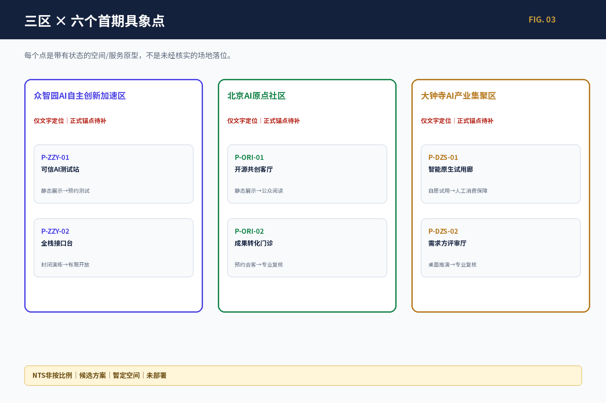

| 区段 | 点位 | 可落地动作 | 关键指标/退出 |
|---|---|---|---|
| 众智园 | `P-ZZY-01` 可信 AI 测试站 | 开放验证桌、授权样本、受控测试舱候选、人工观察位和实体停机 | 材料完整率、人工复核率、事件清理率；安全装置或责任人缺失即降级为离线桌面推演 |
| 众智园 | `P-ZZY-02` 全栈接口台 | 项目卡、资源卡、责任人、暂停/恢复/退出账本，线上线下等价 | 状态公开率、停止清理率、线下任务完成率；不得自动批准或改变规划 |
| AI 原点社区 | `P-ORI-01` 开源共创客厅 | 免费人工前台、每周开源桌、纸质目录、贡献与纠错板、可移动展示 | 许可完整率、无障碍可达性、维护响应；权利不清即撤下或只显示来源索引 |
| AI 原点社区 | `P-ORI-02` 成果转化门诊 | 问题卡、证据成熟度分诊、IP/法务/测试转介和人工回执 | 首次转接时间、责任人确认率、退回原因；不承诺融资、入驻或采购 |
| 大钟寺 | `P-DZS-01` 智能原生试用廊 | 自愿商户单项服务实验、普通服务保底、纸质权益说明、人工客服和退出清理 | 知情拒绝率、投诉响应、清理闭环；消费者权益或公平性不明即停止 |
| 大钟寺 | `P-DZS-02` 需求方评审厅 | 纸质四象限步行核查、无障碍任务走查、问题派单和回访 | 等候/绕行记录、无障碍连续性、修复闭环；站口、道路和路权未核验不做工程结论 |

六个点都是候选研究原型，未指定楼宇、坐标、商户、站口、面积或建设审批；每个点均保留人工服务、纸质入口、申诉和退出清理。

## AI 创新生态、人才画像与 AI+ 场景

### 六类 Agent 任务的实质成果

本次协作的角色、输入输出、质量门、验收字段、交接协议和统筹Agent八步工作流，见本包允许发布的 [`report/narrative.md`](report/narrative.md) 附录 A—D；25条数据资产的机器可读登记见 [`visual/assets/data_asset_register.json`](visual/assets/data_asset_register.json)。这两份入口共同说明方法论和资料边界，不把Agent角色写成已签约机构或把资料缺口写成事实。

1. **概念与品牌 Agent：** 形成“京张智脉共生带”概念、L0—L5 命名树、Logo 构图语法、双语术语和品牌权利门。
2. **生态 Agent：** 形成七案例机制表、八段创新接力、三区两翼职责、19 项日/周/季/年活动和资源释放闸门。
3. **场景空间 Agent：** 形成 13 张场景卡、8 类用户/旅程、12 类公共空间组件和四类产业测试；所有场景写明 AI 做什么、人工做什么、非数字替代和停止条件。
4. **公共空间 Agent：** 形成开发者散步道、开源成果展示廊、智能体贡献荣誉墙三个 AI 地标候选；形成故事站、贡献板、可撤导览、人工讲解和无障碍替代组件。
5. **文化 Agent：** 形成铁路—中关村—AI 三文化非因果图谱、五类导览路线、双语工作译文、国际传播门和可纠错/撤回机制。
6. **运营 Agent：** 形成日/周/季/年活动体系、六段转化链、六项试点合同、15 项指标和四层停复事件协议。

为便于最终读者直接核对六类任务，正式包另附六张双语研究图解：

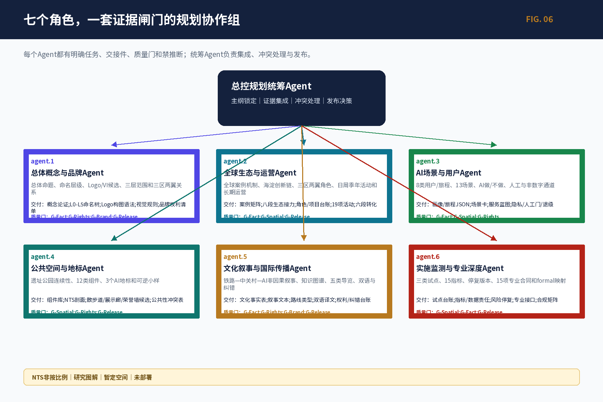  
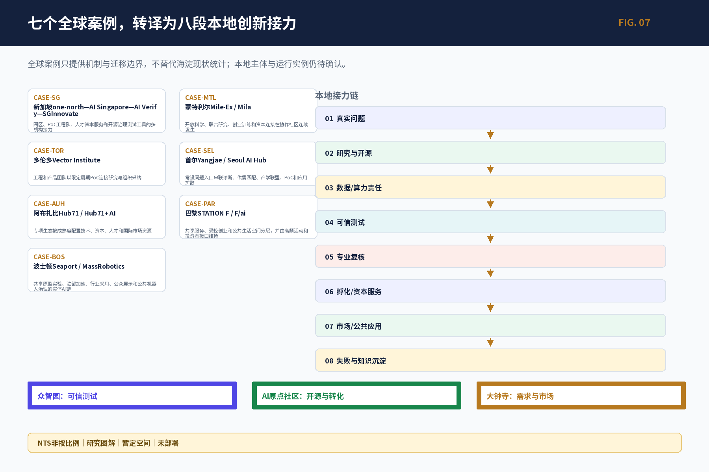  
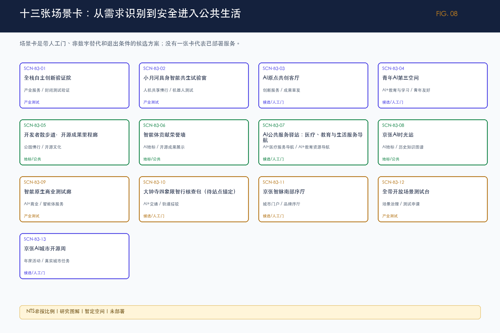  
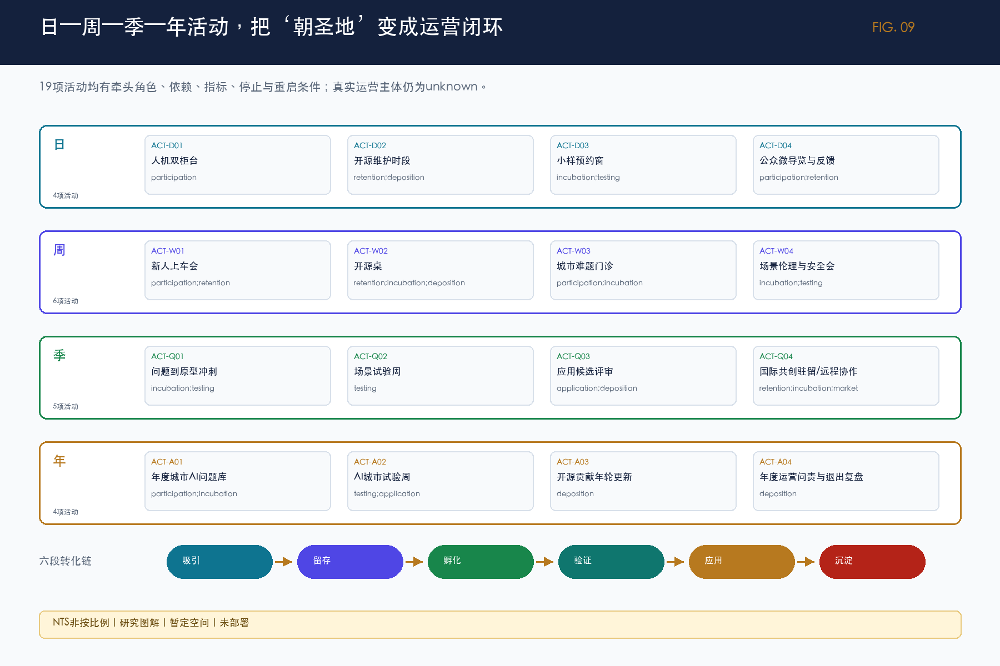  
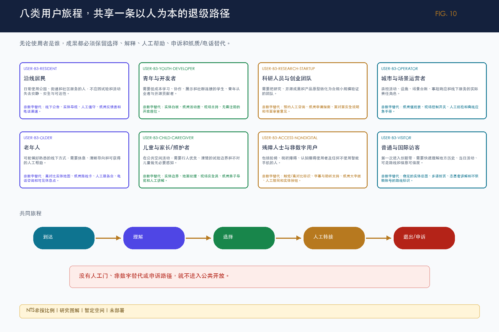  
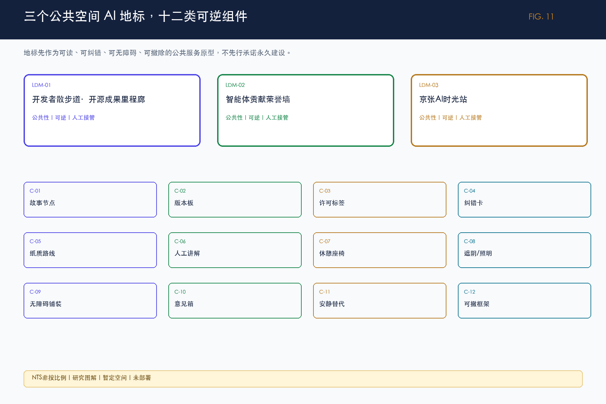

为避免六类任务只停留在文字概述，再补充四张可直接评审的研究图解：命名与Logo候选、四张完整场景卡、三文化五导览纠错回路、十五项专业深度证据合同。

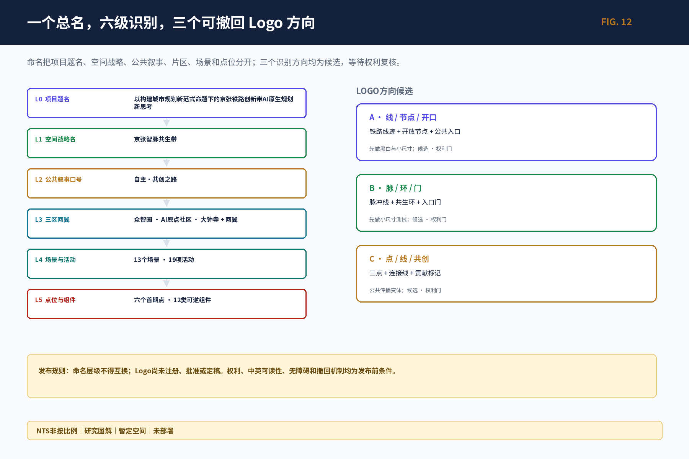
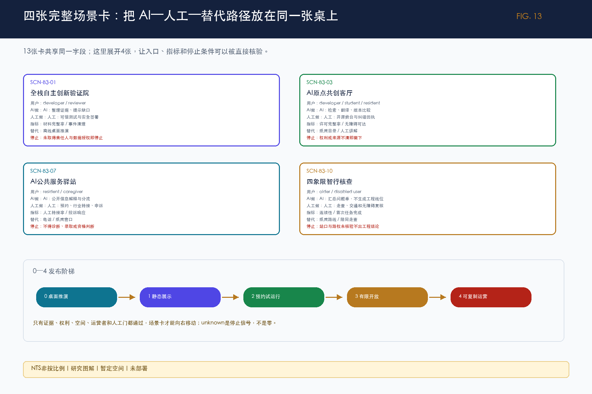
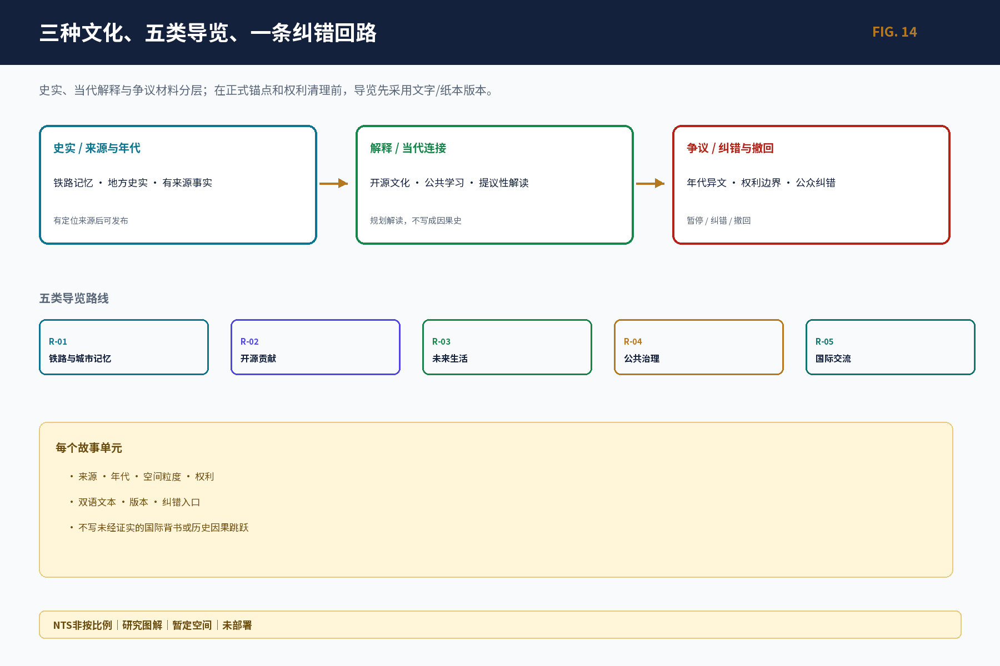
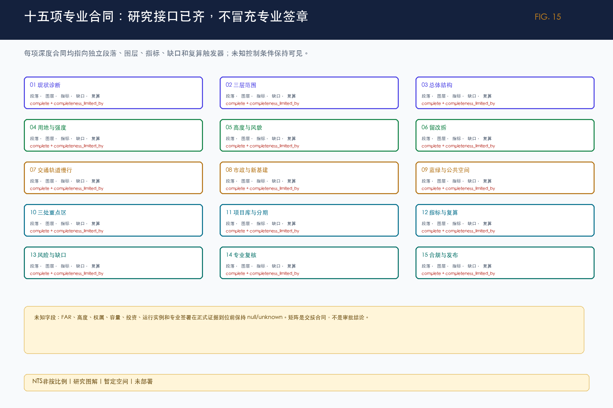

这些图解由统一注册表、B2活动台账和B3场景/用户数据生成，全部标注为研究图解、暂定空间和未部署；中英对应图件保留同一ID、状态和信息架构。[data:visual/assets/canonical_registry.json] [data:visual/assets/data_asset_register.json]

为便于逐卡复核，13张场景卡的完整字段、8类用户和阶段门随包保存在 [`visual/assets/scenario_cards.json`](visual/assets/scenario_cards.json)；铁路—中关村—AI文化节点与权威来源分别保存在 [`visual/assets/culture_nodes.json`](visual/assets/culture_nodes.json) 和 [`visual/assets/culture_sources.json`](visual/assets/culture_sources.json)。七个评分维度只提供不自评分的证据导航 [`visual/assets/review_evidence_matrix.json`](visual/assets/review_evidence_matrix.json)，最终分数由人工评审产生。

### 13 个场景的进入方式

13 个场景均先以文字、服务蓝图或低保真组件表达，不把概念图当作已部署系统：开源发布厅、可信测试站、慢行断点诊断、青年 AI 第三空间、人才生活服务、AI 安全治理廊、成果转化门诊、低碳算力驿站、智能原生商业试用廊、四象限智行核查、铁路记忆导览、全球 AI 活动路线和全带开放测试台。每张场景卡均绑定用户、空间状态、数据、隐私、人工门、运营角色、指标、非数字替代和退出条件。[depth:blue_green_public_space] [depth:traffic_rail_slow_parking] [depth:municipal_new_infrastructure]

### AI+医疗、教育、商业进入街区的边界

AI+医疗只做公开信息解释、预约分流和人工转接，不做诊断、处方或健康资格判断；AI+教育只做课程信息解释、共学协作和人工咨询，不做录取、考试或学生画像排序；AI+商业只做自愿单项服务试用和权益说明，不做自动定价、信用评估或消费争议终审。三类场景均提供纸质说明、人工窗口、电话/现场申诉和普通服务保底。

城市智能体允许检索来源、解释政策、提示缺口、汇总匿名反馈和生成待审草案；规划审批、工程/交通/消防安全、医疗、教育、投资/采购、公共荣誉和个人画像排序全部进入 `refuse_and_redirect`，由责任主体人工决定。

## 用地、建筑规模与拆改留方案

用地、建筑、公共空间和分期图层共同表达空间结构；建筑采用保留、改造、更新、新建候选、待确认五类状态。当前工作指标只反映提交几何的可复算结果，不能替代控规或权属条件。涉及 FAR、高度、密度、退线、拆迁、投资和市政容量的字段保持 `unknown/null`，并写入责任人和复算触发器。[depth:blue_green_public_space] [depth:renewal_project_list]

三处重点区的实施先选择不改变权属和结构的可逆动作：人工前台、可移动展示、纸质导览、受控测试、夜间安静使用、无障碍停留和服务账本；永久建筑、河道工程、道路改造和正式地标等待正式图件、专业审查和权利确认。

## 交通、轨道、市政与公共服务设施

交通策略以“先核查、再微更新、后工程化”为顺序：先完成大钟寺四象限、遗址公园断点、校区—园区慢行联系和无障碍任务走查；再由交通、园林、无障碍和市政专业确认遮雨、照明、骑行停放、导向、过街和接驳；最后才讨论工程或永久设施。当前图层表达方向性联系，不表达未经核验的站口、道路红线、桥隧或电梯状态。[depth:traffic_rail_slow_parking] [data:geometry/roads.geojson#ROAD-001]

市政与新基建采用“最小资源、可断开、可人工维护”原则：端侧算力、能源、排水、消防和数据接口均按容量未知处理；智能服务不能削弱普通照明、饮水、休憩、无障碍和纸质信息。正式市政容量、工程线位和安全条件到位后，再进行专业复算。[depth:municipal_new_infrastructure] [data:geometry/constraints.geojson#CONSTRAINTS]

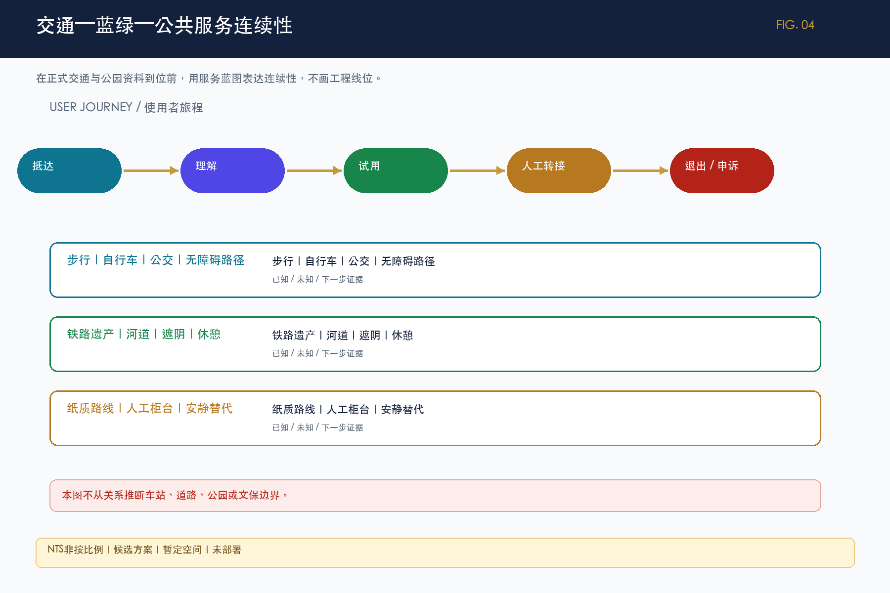

## 蓝绿空间、公共空间与城市风貌

京张铁路遗址公园是公共主轴，蓝绿系统同时服务通行、休息、文化理解、生态维护和低风险创新体验。三个 AI 地标候选不采用永久大体量先行，而采用可撤、可更正、可无障碍使用的公共组件：开发者散步道（主题步行与纸质路线）、开源成果展示廊（版本/许可/纠错七字段展示）、智能体贡献荣誉墙（经授权的贡献记录，不自动评奖）。

城市文化导览采用五类路线：铁路与城市记忆、开源贡献、未来生活、公共治理、国际交流。每个故事单元均显示来源、时间、空间粒度、权利、双语、版本和纠错入口；史实争议、肖像/字体/商标权利或日常通行冲突出现时，立即撤下争议内容并保留纸质/人工替代。[data:geometry/green_space.geojson#GREEN-001] [data:geometry/public_space.geojson#PUBLIC-001] [depth:blue_green_public_space]

## 更新项目清单、实施政策与分期计划

| 项目 | 类型 | 近期动作 | 主要依赖 |
|---|---|---|---|
| JZ-01 | 遗址公园慢行断点缝合 | 纸质核查、无障碍走查、可撤导视小样 | 公园/道路/文保/无障碍专业 |
| JZ-02 | 众智园可信测试接口 | 开放验证桌、项目卡和退出清单 | 载体、数据、安全、运营责任 |
| JZ-03 | AI 原点开源与转化前台 | 每周开源桌、成果门诊、人工回执 | 权利、维护人、载体和开放时段 |
| JZ-04 | 大钟寺四象限步行核查 | 分时观察、问题单和回访 | 站口、路权、交通、市政资料 |
| JZ-05 | AI 公共服务与边缘算力节点 | 纸面/离线服务蓝图 | 能源、网络、隐私、人工接管 |
| JZ-06 | 全球 AI 活动周公共路线 | 小规模室内/公共空间桌面演练 | 活动许可、容量、安全、双语权利 |

分期按证据成熟度推进：近期 0—1 年只做资料补证、桌面推演、人工服务、纸面/离线原型和可撤组件；中期 1—3 年在正式空间、主体、专业、安全和权利条件齐全后做封闭小样；远期才讨论有限公共场景和可复制运营。任何阶段均保留暂停、降级、清理、通知、复盘和重新准入。[depth:renewal_project_list] [depth:phasing_implementation] [data:geometry/phasing.geojson#PHASE-001]

参与主体按类型分为规划统筹、GIS/测绘、交通与无障碍、园林与文保、数据与安全、载体运营、开源维护、公共服务和公众代表；每一阶段都以可复核的空间、服务、公共价值、创新绩效、运营韧性和 AI 风险指标决定是否继续，而不是以宣传量或设备数量决定。

## 指标体系、面积复算与合规矩阵

空间指标分为三类：一是由同版 GeoJSON 可复算的工作指标；二是必须等待官方控规、道路、权属和专业资料的控制指标；三是需要实际运营后建立基线的绩效指标。当前可复算工作值包括提交几何面积、重点区数量、建筑基底、绿地和公共空间比例，但它们均带 provisional 限定，不是法定控制值。[metric:site_area_sqm] [metric:key_area_count] [metric:building_footprint_area_sqm]

绿地和公共空间由 [metric:green_ratio] [metric:public_space_ratio] 复核，最终按 [depth:metrics_recalculation] 触发重算。

指标治理采用六类父指标：空间体验、服务可达、公共价值、创新绩效、运营韧性、AI 风险。15 项父指标和 39 项子指标均保留 `unknown/null` 基线；运行实例、真实机会编号、测试编号和风险事件为空时，不能解释为“零事件”或“已经达标”。每项指标均有 owner、频率、停止阈值、复算触发器和非数字采集替代。

合规矩阵把官方 13 个标题、15 章、六类 Agent 任务、五项强制标准和 15 项专业深度合同分别映射到正文、来源、假设、图层、指标、图件、HTML 和自检。它证明研究响应和证据接口闭合，不自证官方分数或专业签章。

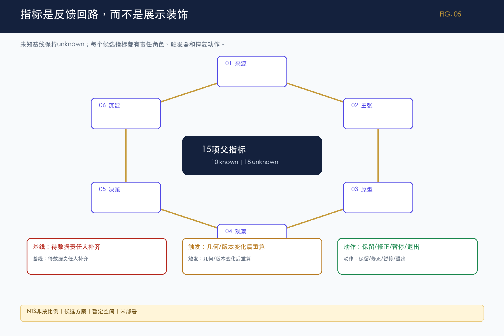

## 风险、版权与合规说明

五道人类门贯穿全过程：事实门核对来源、时点和尺度；空间门核对边界、拓扑、权属、路权和专业条件；权利门核对版权、商标、字体、肖像、数据和撤回；识别门核对中英术语、品牌和无障碍；发布门核对双语、图注、离线、manifest、哈希和人工签署。隐私保护、版权、实施风险和人工复核记录必须与每个高风险场景相邻。任一门未通过，成果降级为研究合同、text-only 或离线原型，不进入正式场址发布。[depth:risk_missing_data] [source:MISSING-DATA-CHECKLIST]

AI 只做检索、归纳、比较、提示缺口、生成待审草案和匿名反馈聚合；不自动审批规划、分配公共权利、替代工程安全、医疗教育投资判断、隐藏冲突或在暂停状态继续服务。所有正式图件、空间结论和高风险决定都保留人工责任、可拒绝、可申诉、可停止、可清理和可恢复机制。

本包采用社区展示许可；图件、字体、底图、历史资料、商标、肖像、模型/工具和生成记录均需在来源与版权文件中保持可追溯。官方边界、现场测绘、访谈、专业签章、真实运营主体和运行基线仍是外部依赖，不能由模型补写。[source:SOURCE-USE-MATRIX]

## 参考资料

- `brief/public-brief.md`、`brief/site-package/design_brief.json`、`brief/site-package/agent_taskbook.json`
- `data/processed/project_scope_summary.csv`、`agent_task_requirements.csv`、`source_use_matrix.csv`、`missing_data_checklist.csv`
- `brief/site-package/` 中的设计简报、任务书、枚举、范围和临时几何
- `data/source_registry.json`、`data/processed/project_scope_summary.csv`、`data/processed/agent_task_requirements.csv`、`data/processed/source_use_matrix.csv`、`data/processed/missing_data_checklist.csv`
- 公开征集公告及其登记来源；全球案例只用于机制比较，不替代京张现状。[source:SITE-PACKAGE]
